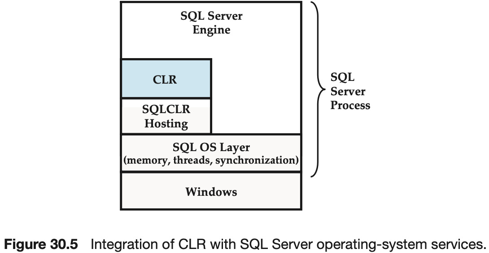
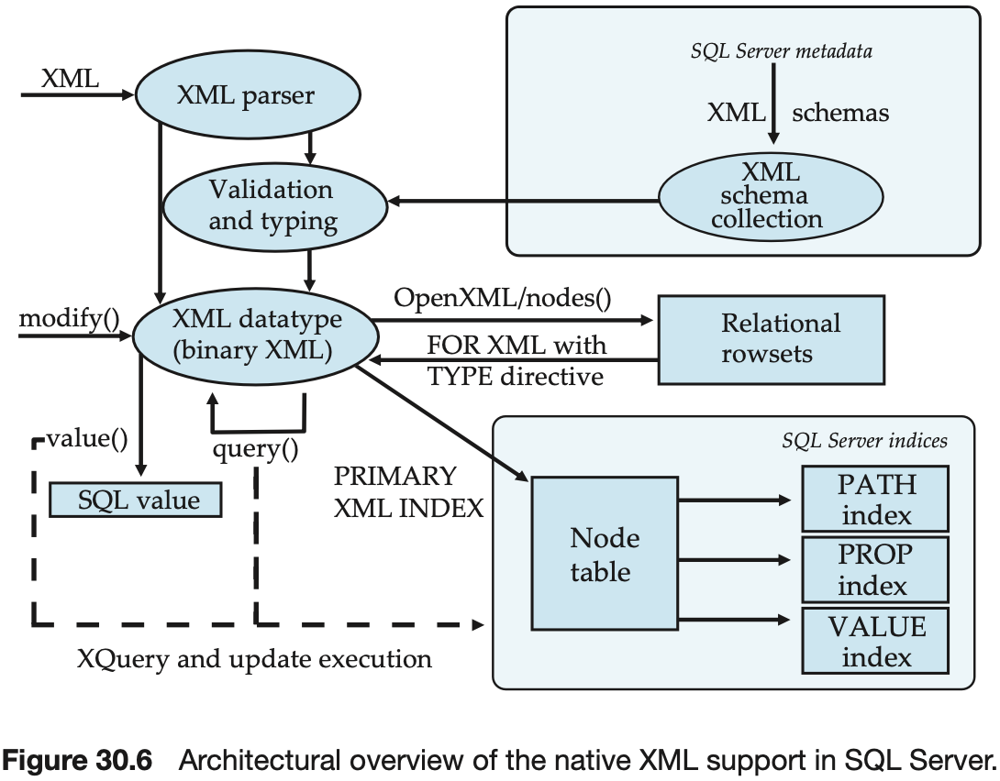

# CHAPTER 30 Microsoft SQL Server

A database administrator or developer can use Query Editor to:

- Analyze queries.
- Format SQL queries.
- Use templates for stored procedures, functions, and basic SQL statements.

Filtered indices can provide the following advantages over full-table indices:

- Improved query performance and plan quality.
- Reduced index maintenance costs.
- Reduced index storage costs.

The allocation manager usually allocates and deallocates all the pages in units of eight contiguous pages called `extents`.

Query optimization is part of the query compilation process, which consists of four steps:

- Parsing/binding.
- Simplification/normalization.
- Cost-based optimization.
- Plan preparation.

Optimum results on subtrees are preserved, so that later stages can take advantage of results generated earlier. Each stage needs to balance opposing plan generation techniques:

- Exhaustive generation of alternatives.
- Heuristic generation of candidates.

SQL Server supports the SQL isolation levels of read uncommitted, read committed, repeatable read, and serializable. Read committed is the default level:

- Snapshot.
- Read committed snapshot.

In addition to user requests, the thread pool is used to assign threads for internal background tasks such as:

- Lazywriter.
- Checkpoint.
- Deadlock monitor.

There are many different uses of memory within the SQL Server process:

- Buffer pool.
- Dynamic memory allocation.
- Plan and execution cache.
- Large memory grants.

SQL Server supports the following application programming interfaces (APIs) for building data-intensive applications:

- ODBC.
- OLE-DB.
- ADO.NET.
- LINQ.
- DB-Lib.
- HTTP/SOAP.

SQL Server introduced the `Publish-Subscribe` metaphor to database replication and extends this publishing-industry metaphor throughout its replication administration and monitoring tools.

The `publisher` is a server that makes data available for replication to other servers.

`Subscriber`s are servers that receive replicated data from a publisher.

The `distributor` is a server that plays different roles, depending on the replication options chosen.

`Snapshot replication` copies and distributes data and database objects exactly as they appear at a moment in time.

With `transactional replication`, the publisher propagates an initial snapshot of data to subscribers, then forwards incremental data modifications to subscribers as discrete transactions and commands.

`Merge replication` allows each replica in the enterprise to work with total autonomy whether online or offline.

Routines, implemented as static class methods, can specify the following properties through custom attributes:

- IsPrecise.
- UserDataAccess.
- SystemDataAccess.
- IsDeterministic.
- IsSystemVerified.
- HasExternalAccess.

Classes implementing user-defined types are annotated with an `SqlUserDefinedType()` attribute that specifies the following properties:

- Format.
- MaxByteSize.
- IsFixedLength.
- IsByteOrdered.
- Nullability.
- Type conversions.

Aggregates can declare additional properties, via custom attributes, in their class definition; these properties are used by the query optimizer to derive alternative plans for the aggregate computation:

- IsInvariantToDuplicates.
- IsInvariantToNulls.
- IsInvariantToOrder.

SQL Server in addition provides three secondary XML indices so that the query execution can take further advantage of index structures:

- The `path` index provides support for simple types of path expressions.
- The `properties` index provides support for the common scenario of property value comparisons.
- The `value` index is well-suited if the query uses wild cards in comparisons.

The business intelligence component of SQL Server contains three subcomponents:

- SQL Server Integration Services (SSIS).
- SQL Server Analysis Services (SSAS).
- SQL Server Reporting Services (SSRS).

Here are a few common scenarios that will leverage a combination of components:

- Build an SSIS package that cleanses data, using patterns generated by SSAS data mining.
- Use SSIS to load data to an SSAS cube, process it, and execute reports against the SSAS cube.
- Build an SSRS report to publish the findings of a mining model or the data contained in an SSAS OLAP component.

Microsoft SQL Server Integration Services (SSIS) is an enterprise data transformation and data integration solution that you can use to extract, transform, aggregate, and consolidate data from disparate sources and move it to single or multiple destinations. You can use SSIS to perform the following tasks:

- merge data from heterogeneous data stores.
- Refresh data in data warehouses and data marts.
- Cleanse data before loading it into destinations.
- Bulk-load data into online transaction processing (OLTP) and online analytical processing (OLAP) databases.
- Send notifications.
- Build business intelligence into a data transformation process.
- Automate administrative functions.

SQL Server provides a variety of mining techniques, with a rich graphical interface to view mining results. Mining algorithms supported include:

- Association rules (useful for cross-sales applications).
- Classification and prediction techniques such as decision trees, regression trees, neural networks, and naive Bayes.
- Time series forecasting techniques including ARIMA and ARTXP.
- Clustering techniques such as expectation maximization and K-means(coupled with techniques for sequence clustering).

