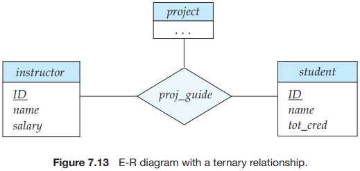

# Chapter7 Database Design and the E-R Model

The database designer must interact with users of the application to understand the needs of the application, represent them in a high-level fashion that can be understood by the users, and then translate the requirements into lower levels of the design. A high-level data model serves the database designer by providing a conceptual framework in which to specify, in a systemic fashion, the data requirements of the database users, and a database structure that fulfills these requirements.

- The initial phase of database design is to characterize fully the data needs of the prospective database users.
- Next, the designer chooses a data model and, by applying the concepts of the chosen data model, translates these requirements into a conceptual schema of the database. 
- A fully developed conceptual schema also indicates the functional requirements of the enterprise.
- The process of moving from an abstract data model to the implementation of the database proceeds in two final design phases:
  1. In the logical-design phase, the designer maps the high-level conceptual schema onto the implementation data model of the database system that will be used. The implementation data model is typically the relational data model, and this step typically consists of mapping the conceptual schema defined using the entity-relationship model into a relation schema.
  2. Finally, the designer uses the resulting system-specific database schema in the subsequent physical-design phase, in which the physical features of the database are specified.

In designing a database schema, we must ensure that we avoid two major pitfalls:

1. Redundancy: A bad design may repeat information.
2. Incompleteness: A bad design may make certain aspects of the enterprise difficult or impossible to model.

The entity-relationship (E-R) data model was developed to facilitate database design by allowing specification of an `enterprise schema` that represents the overall logical structure of a database.

The E-R data model employs three basic concepts: entity sets, relationship sets, and attributes.

Entity Sets:

- An `entity` is a "thing" or "object" in the real world that is distinguishable from all other objects.
- An `entity set` is a set of entities of the same type that share the same properties, or attributes.
- In the process of modeling, we often use the term `entity` set in the abstract, without referring to a particular set of individual entities. We use the term extension of the entity set to refer to the actual collection of entities belonging to the entity set.
- Entity sets do not need to be disjoint.
- An entity is represented by a set of attributes. Attributes are descriptive properties possessed by each member of an entity set. The designation of an attribute for an entity set expresses that the database stores similar information concerning each entity in the entity set; however, each entity may have its own value for each attribute.
- Each entity has a value for each of its attributes.
- A database thus includes a collection of entity sets, each of which contains any number of entities of the same type.

Relationship Sets:

- A `relationship` is an association among several entities.

- A `relationship set` is a set of relationships of the same type. Formally, it is a mathematical relation on $n \geq 2$ (possibly nondistinct) entity sets. If $E_1, E_2, ..., E_n$ are entity sets, then a relationship set $R$ is a subset of 
  $$
  \lbrace (e_1, e_2, ..., e_n) | e_1 \in E_1, e_2 \in E_2, ..., e_n \in E_n \rbrace
  $$
  where $(e_1, e_2, ..., e_n)$ is a relationship.

- The association between entity sets is referred to as participation; that is, the entity sets $E_1, E_2, ..., E_n$ participate in relationship set $R$. A `relationship instance` in an E-R schema represents an association between the named entities in the real-world enterprise that is being modeled.

- The function that an entity plays in a relationship is called that entity's role. Since entity sets participating in a relationship set are generally distinct, roles are implicit and are implicit and are not usually specified. However, they are useful when the meaning of a relationship needs clarification. Such is the case when the entity sets of a relationship set are not distinct; that is, the same entity set participates in a relationship set more than once, in different roles. In this type of relationship set, sometimes called a recursive relationship set, explicit role names are necessary to specify how an entity participates in a relationship instance.

- A relationship may also have attributes called `descriptive attributes`.

Attributes

- For each attribute, there is a set of permitted values, called the `domain`, or `value set`, of that attribute.
- Formally, an attribute of an entity set is a function that maps from the entity set into a domain. Since an entity set may have several attributes, each entity can be described by a set of (attribute, data value) pairs, one pair for each attribute of the entity set.
- An attribute, as used in the E-R model, can be characterized by the following attribute types:
  - Simple and composite attributes.
  - Single-valued and multivalued attributes.
  - Derived attribute.

`Mapping cardinalities`, or cardinality ratios, express the number of entities to which another entity can be associated via a relationship set.

For a binary relationship set $R$ between entity sets $A$ and $B$, the mapping cardinality must be one of the following:

- One-to-one. An entity in $A$ is associated with `at most` one entity in $B$, and an entity in $B$, and an entity in $B$ is associated with `at most` one entity in $A$. (See Figure 7.5a).
- One-to-many. An entity in $A$ is associated with any number (zero or more) of entities in $B$. An entity in $B$, however, can be associated with `at most` one entity in $A$. (See Figure 7.5b).
- Many-to-one. An entity in $A$ is associated with `at most` one entity in $B$. An entity in $B$, however, can be associated with any number (zero or more) of entities in $A$. (See Figure 7.6a).
- Many-to-many. An entity in $A$ is associated with any number (zero or more) of entities in $B$, and an entity in $B$ is associated with any number (zero or more) of entities in $A$. (See Figure 7.6b).

The participation of an entity set $E$ in a relationship set $R$ is said to be `total` if every entity in $E$ participates in at least one relationship in $R$. If only some entities in $E$ participate in relationships in $R$, the participation of entity set $E$ in relationship $R$ is said to be `partial`.

Let $R$ be a relationship set involving entity sets $E_1, E_2, \cdots, E_n$. Let $primary-key(E_i)$ denote the set of attributes that forms the primary key for entity set $E_i$. Assume for now that the attribute names of all primary keys are unique. The composition of the primary key for a relationship set depends on the set of attributes associated with the relationship set $R$.

If the relationship set $R$ has no attributes associated with it, then the set of attributes
$$
primary-key(E_1) \cup primary-key(E_2) \cup \cdots \cup primary-key(E_n)
$$
describes an individual relationship in set $R$.

If the relationship set $R$ has attributes $a_1, a_2, \cdots, a_m$ associated with it, then the set of attributes
$$
primary-key(E_1) \cup primary-key(E_2) \cup \cdots \cup primary-key(E_n) \cup \lbrace a_1, a_2, \cdots, a_m \rbrace
$$
describes an individual relationship in set $R$.

In both of the above cases, the set of attributes
$$
primary-key(E_1) \cup primary-key(E_2) \cup \cdots \cup primary-key(E_n)
$$
forms a superkey for the relationship set.

When we design a database using the E-R model, we usually start by identifying those entity sets that should be included. 

Once the entities and their corresponding attributes are chosen, the relationship sets among the various entities are formed. These relationship sets may result in a situation where attributes in the various entity sets are redundant and need to be removed from the original entity sets.

An E-R diagram consists of the following major components:

- `Rectangles divided into two parts` represent entity sets. The first part, which in this textbook is shaded blue, contains the name of the entity set. The second part contains the names of all the attributes of the entity set.
- `Diamonds` represent relationship sets.
- `Undivided rectangles` represent the attributes of a relationship set. Attributes that are part of the primary key are underlined.
- `Lines` link entity sets to relationship sets.
- `Dashed lines` link attributes of a relationship set to the relationship set.
- `Double lines` indicate total participation of an entity in a relationship set.
- `Double diamonds` represent identifying relationship sets linked to weak entity sets.

The relationship set `advisor`, between the `instructor` and `student` entity sets may be one-to-one, one-to-many, many-to-one, or many-to-many. To distinguish among these types, we draw either a directed line ($\rightarrow$) or an undirected line ($-$) between the relationship set and the entity set in question, as follows:

- One-to-one: We draw a directed line from the relationship set `advisor ` to both entity sets `instructor` and `student`. This indicates that an instructor may advise at most one student, and a student may have at most one advisor.
- One-to-many: We draw a directed line from the relationship set `advisor` to the entity set `instructor` and an undirected line to the entity set `student`. This indicates that an instructor may advise many students, but a student may have at most one advisor.
- Many-to-one: We draw an undirected line from the relationship set `advisor` to the entity set `instructor` and a directed line to the entity set `student`. This indicates that an instructor may advise at most one student, but a student may have many advisors.
- Many-to-many: We draw an undirected line from the relationship set advisor to both entity sets `instructor` and `student`. This indicates that an instructor may advise many students, and a student may have many advisors.

E-R diagrams also provide a way to indicate more complex constraints on the number of times each entity participates in relationships in a relationship set. A line may have an associated minimum and maximum cardinality, shown in the form $l..h$, where $l$ is the minimum and $h$ the maximum cardinality. A minimum value of 1 indicates total participation of the entity set in the relationship set; that is, each entity in the entity set occurs in at least one relationship in that relationship set. A maximum value of 1 indicates that the entity participates in at most one relationship, while a maximum value $*$ indicates no limit.

We indicate roles in E-R diagrams by labeling the lines that connect diamonds to rectangles.

Nonbinary relationship sets can be specified easily in an E-R diagram.

We permit at most one arrow out of a relationship set, since an E-R diagram with two or more arrows out of a nonbinary relationship set can be interpreted in two ways. Suppose there is a relationship set $R$ between entity sets $A_1, A_2, \cdots, A_n$, and the only arrows are on the edges to entity sets $A_{i+1}, A_{i+2}, \cdots, A_n$. Then, the two possible interpretations are:

1. A particular combination of entities from $A_1, A_2, \cdots, A_i$ can be associated with at most one combination of entities from $A_{i+1}, A_{i+2}, \cdots, A_n$. Thus, the primary key for the relationship $R$ can be constructed by the union of the primary keys of $A_1, A_2, \cdots, A_i$.
2. For each entity set $A_k, i < k \leq n$, each combination of the entities from the other entity sets can be associated with at most one entity from $A_k$. Each set $\lbrace A_1, A_2, \cdots, A_{k-1}, A_{k+1}, \cdots, A_n \rbrace$, for $i < k \leq n$, then forms a candidate key.

An entity set that does not have sufficient attributes to form a primary key is termed a `weak entity set`. An entity set that has a primary key is termed a `strong entity set`.

For a weak entity set to be meaningful, it must be associated with another entity set, called the `identifying` or `owner entity set`. Every weak entity must be associated with an identifying entity; that is, the weak entity set is said to be `existence dependent` on the identifying entity set. The identifying entity set is said to `own` the weak entity set that it identifies. The relationship associating the weak entity set with the identifying entity set is called the `identifying relationship`.

The identifying relationship is many-to-one from the weak entity set to the identifying entity set, and the participation of the weak entity set in the relationship is total. The identifying relationship set should not have any descriptive attributes, since any such attributes can instead be associated with the weak entity set.

Although a weak entity set does not have a primary key, we nevertheless need a means of distinguishing among all those entities in the weak entity set that depend on one particular strong entity. The `discriminator` of a weak entity set is a set of attributes that allows this distinction to be made. 

The primary key of a weak entity set is formed by the primary key of the identifying entity set, plus the weak entity set's discriminator.

In E-R diagrams, a weak entity set is depicted via a rectangle, like a strong entity set, but there are two main differences:

- The discriminator of a weak entity is underlined with a dashed, rather than a solid, line.
- The relationship set connecting the weak entity set to the identifying strong entity set is depicted by a double diamond.

A weak entity set can participate in relationships other than the identifying relationship.

We can represent a database that conforms to an E-R database schema by a collection of relation schemas. For each entity set and for each relationship set in the database design, there is a unique relation schema to which we assign the name of the corresponding entity set or relationship set.

Both the E-R model and the relational database model are abstract, logical representations of real-world enterprises. Because the two models employ similar design principles, we can convert an E-R design into a relational design.

Let $E$ be a strong entity set with only simple descriptive attributes $a_1, a_2, \cdots, a_n$. We represent this entity by a schema called $E$ with $n$ distinct attributes. Each tuple in a relation on this schema corresponds to one entity of the entity set $E$.

For schemas derived from strong entity sets, the primary key of the entity set serves as the primary key of the resulting schema. This follows directly from the fact that each tuple corresponds to a specific entity in the entity set.

For a multivalued attribute $M$, we create a relation schema $R$ with an attribute $A$ that corresponds to $M$ and attributes corresponding to the primary key of the entity set or relationship set of which $M$ is an attribute.

We create a primary key of the relation schema consisting of all attributes of the schema.

In the case that an entity set consists of only two attributes -- a single primary key attribute $B$ and a single multivalued attribute $M$ -- the relation schema for the entity set would contain only one attribute, namely the primary-key attribute $B$. We can drop this relation, while retaining the relation schema with the attribute $B$ and attribute $A$ that corresponds to $M$.

Let $A$ be a weak entity set with attributes $a_1, a_2, \cdots, a_m$. Let $B$ be the strong entity set on which $A$ depends. Let the primary key of $B$ consist of attributes $b_1, b_2, \cdots, b_n$. We represent the entity set $A$ by a relation schema called $A$ with one attribute for each member of the set:
$$
\lbrace a_1, a_2, \cdots, a_m \rbrace \cup \lbrace b_1, b_2, \cdots, b_n \rbrace
$$
For schemas derived from a weak entity set, the combination of the primary key of the strong entity set and the discriminator of the weak entity set serves as the primary key of the schema. In addition to creating a primary key, we also create a foreign-key constraint on the relation $A$, specifying that the attributes $b_1, b_2, \cdots, b_n$ reference the primary key of the relation $B$. The foreign key constraint ensures that for each tuple representing a weak entity, there is a corresponding tuple representing the corresponding strong entity.

Let $R$ be a relationship set, let $a_1, a_2, \cdots, a_m$ be the set of attributes formed by the union of the primary keys of the entity sets participating in $R$, and let the descriptive attributes (if any) of $R$ be $b_1, b_2, \cdots, b_n$. We represent this relationship set by a relation schema called $R$ with one attribute for each member of the set:
$$
\lbrace a_1, a_2, \cdots, a_m \rbrace \cup \lbrace b_1, b_2, \cdots, b_n \rbrace
$$
We described earlier, in Section 7.3.3, how to choose a primary key for a binary relationship set. As we saw in that section, taking all the primary-key attributes from all the related entity sets serves to identify a particular tuple, but for one-to-one, many-to-one, and one-to-many relationship sets, this turns out to be a larger set of attributes than we need in the primary key. The primary key is instead chosen as follows:

- For a binary many-to-many relationship, the union of the primary-key attributes from the participating entity sets becomes the primary key.
- For a binary one-to-one relationship set, the primary key of either entity set can be chosen as the primary key. The choice can be made arbitrarily.
- For a binary many-to-one or one-to-many relationship set, the primary key of the entity set on the "many" side of the relationship set serves as the primary key.
- For an $n$-ary relationship set without any arrows on its edges, the union of the primary key-attributes from the participating entity sets becomes the primary key.
- For an $n$-ary relationship set with an arrow on one of its edges, the primary keys of the entity sets not on the "arrow" side of the relationship set serve as the primary key for the schema. Recall that we allowed only one arrow out of a relationship set.

One possible guideline in determining whether to use an entity set or a relationship set is to designate a relationship set to describe an action that occurs between entities. This approach can also be useful in deciding whether certain attributes may be more appropriately expressed as relationships.

In fact, it is always possible to replace a nonbinary ($n$-ary, for $n > 2$) relationship set by a number of distinct binary relationship sets. For simplicity, consider the abstract ternary ($n = 3$) relationship set $R$, relating entity sets $A$, $B$ and $C$. We replace the relationship set $R$ by an entity set $E$, and create three relationship sets as shown in Figure 7.19:

- $R_A$, relating $E$ and $A$.
- $R_B$, relating $E$ and $B$.
- $R_C$, relating $E$ and $C$.

If the relationship set $R$ had any attributes, these are assigned to entity set $E$; further, a special identifying attribute is created for $E$ (since it must be possible to distinguish different entities in an entity set on the basis of their attribute values). For each relationship ($a_i$, $b_i$, $c_i$) in the relationship set $R$, we create a new entity $e_i$ in the entity set $E$. Then, in each of the three new relationship sets, we insert a relationship as follows:

- $(e_i, a_i)$ in $R_A$.
- $(e_i, b_i)$ in $R_B$.
- $(e_i, c_i)$ in $R_C$.

We can generalize this process in a straightforward manner to $n$-ary relationship sets. Thus, conceptually, we can restrict the E-R model to include only binary relationship sets. However, this restriction is not always desirable.

- An identifying attribute may have to be created for the entity set created to represent the relationship set. This attribute, along with the extra relationship sets required, increases the complexity of the design and overall storage requirements.
- An $n$-ary relationship set shows more clearly that several entities participate in a single relationship.
- There may not be a way to translate constraints on the ternary relationship into constraints on the binary relationships.

The cardinality ratio of a relationship can affect the placement of relationship attributes. Thus, attributes of one-to-one or one-to-many relationship sets can be associated with one of the participating entity sets, rather than with the relationship set.

An entity set may include subgroupings of entities that are distinct in some way from other entities in the set.

The process of designating subgroupings within an entity set is called `specialization`.

The way we depict specialization in an E-R diagram depends on whether an entity may belong to multiple specialized entity sets or if it must belong to at most one specialized entity set. The former case (multiple sets permitted) is called `overlapping specialization`, while the latter case (at most one permitted) is called `disjoint specialization`. For an overlapping specialization, two separate arrows are used. For a disjoint specialization, a single arrow is used. The specialization relationship may also be referred to as a `superclass-subclass` relationship. Higher- and lower- level entity sets are depicted as regular entity sets -- that is, as rectangles containing the name of the entity set.

The refinement from an initial entity set into successive levels of entity subgroupings represents a `top-down` design process in which distinctions are made explicit. The design process may also proceed in a `bottom-up` manner, in which multiple entity sets are synthesized into a higher-level entity set on the basis of common features.

This commonality can be expressed by `generalization`, which is a containment relationship that exists between a `higher-level` entity set and one or more `lower-level` entity sets.

Higher- and lower-level entity sets also may be designated by the terms `superclass` and `subclass`, respectively.

Whether a given protion of an E-R model was arrived at by specialization or generalization, the outcome is basically the same:

- A higher-level entity set with attributes and relationships that apply to all of its lower-level entity sets.
- Lower-level entity sets with distinctive features that apply only within a particular lower-level entity set.

The lower-level entity sets may be one of the following:

- Disjoint. A `disjointness constraint` requires that an entity belong to no more than one lower-level entity set.
- Overlapping. In `overlapping generalizations`, the same entity may belong to more than one lower-level entity set within a single generalization.

A final constraint, the `completeness constraint` on a generalization or specialization, specifies whether or not an entity in the higher-level entity set must belong to at least one of the lower-level entity sets within the generalization/specialization. This constraitn may be one of the following:

- `Total generalization` or `specialization`. Each higher-level entity msut belong to a lower-level entity set.
- `Partial generalization` or `specialization`. Some higher-level entities may not belong to any lower-level entity set.

The `Unified Modeling Language` (UML) is a standard developed under the auspices of the Object Management Group (OMG) for creating specifications of various components of a software system. Some of the parts of UML are:

- `Class diagram`. A class diagram is similar to an E-R diagram. Later in this section we illustrate a few features of class diagrams and how they relate to E-R diagrams.
- `Use case diagram`. Use case diagrams show the interaction between users and the system, in particular the steps of tasks that users perform (such as withdrawing money or registering for a course).
- `Activity diagram`. Activity diagrams depict the flow of tasks between various components of a system.
- `Implementation diagram`. Implementation diagrams show the system components and their interconnections, both at the software component level and the hardware component level.

There are two main metrics for performance:

- Throughput--the number of queries or updates (often referred to as `transactions`) that can be processed on average per unit of time.
- Response time--the amount of time a `single` transaction takes from start to finish in either the average case or the worst case.

## Summary

- Database design mainly involves the design of the database schema. The `entity-relationship (E-R)` data model is a widely used data model for database design. It provides a convenient graphical representation to view data, relationships, and constraints.
- The E-R model is intended primarily for the database-design process. It was developed to facilitate database design by allowing the specification of an `enterprise schema`. Such a schema represents the overall logical structure of the database. This overall structure can be expressed graphically by an `E-R diagram`.
- An `entity` is an object that exists in the real world and is distinguishable from other objects. We express the distinction by associating with each entity a set of attributes that describe the object.
- A `relationship` is an association among several entities. A `relationship set` is a collection of relationships of the same type, and an `entity set` is a collection of entities of the same type.
- The terms `superkey`, `candidate key`, and `primary key` apply to entity and relationship sets as they do for relation schemas. Identifying the primary key of a relationship set requires some care, since it is composed of attributes from one or more of the related entity sets.
- `Mapping cardinalities` express the number of entities to which another entity can be associated via a relationship set.
- An entity set that does not have sufficient attributes to form a primary key is termed a `weak entity set`. An entity set that has a primary key is termed a `strong entity set`.
- The various features of the E-R model offer the database designer numerous choices in how to best represent the enterprise being modeled. Concepts and objects may, in certain cases, be represented by entities, relationships, or attributes. Aspects of the overall structure of the enterprise may be best described by using weak entity sets, generalization, specialization, or aggregation. Often, the designer must weigh the merits of a simple, compact model versus those of a more precise, but more complex, one.
- A database design specified by an E-R diagram can be represented by a collection of relation schemas. For each entity set and for each relationship set in the database, there is a unique relation schema that is assigned the name of the corresponding entity set or relationship set. This forms the basis for deriving a relational database design from an E-R diagram.
- `Specialization` and `generalization` define a containment relationship between a higher-level entity set and one or more lower-level entity sets. Specialization is the result of taking a subset of a higher-level entity set to form a lower-level entity set. Generalization is the result of taking the union of two or more disjoint (lower-level) entity sets to produce a higher-level entity set. The attributes of higher-level entity sets are inherited by lower-level entity sets.
- `Aggregation` is an abstraction in which relationship sets (along with their associated entity sets) are treated as higher-level entity sets, and can participate in relationships.
- UML is a popular modeling language. UML class diagrams are widely used for modeling classes, as well as for general purpose data modeling.

## Glossary

schema `/'skiːmə/` 图解，计划，模式，纲要

constraint `/kən'streɪnt/` 约束，限制，强制

brief `/briːf/` 摘要，简述，短暂的，简短的

enterprise `/'entəpraɪz/` 企业，事业，进取心

influence `/'ɪnfluəns/` 影响，感染，权势，势力

represent `/ˌreprɪˈzent/` 代表，等于，表现，描述，意味着

fashion `/ˈfaʃn/` 形式，时尚，潮流，使...成型

fulfill `/fʊl'fɪl/` 完成，履行，执行，满足

prospective `/prə'spektɪv/` 预期的，未来的

domain `/də'meɪn/` 域，领地，领域，范围

expert `/'ekspɜːt/` 专家，熟练的，内行的

diagrammatical `/daɪəɡrə'mætɪkl/` 概略，图解的，用图表示的

redundant `/rɪˈdʌndənt/` 冗余的，多余的，不需要的

transaction `/træn'zækʃn/` （计算机）事务，交易，办理，处理

scatter `/ˈskætə(r)/` 散开，驱散，分散，散播

instructor `/ɪn'strʌktə(r)/` 教员，讲师，指导书

pitfall `/ˈpɪtfɔːl/` 陷阱，困难，危险，隐患

inconsistent `/ˌɪnkənˈsɪst(ə)nt/` 反常的，不一致的，前后矛盾的，反复无常的

precaution `/prɪˈkɔːʃn/` 预防，避孕

concrete `/ˈkɒŋkriːt/` 具体的，实体的，混凝土，水泥，实质性的，凝结，结合

disjoint `/dɪs'dʒɔɪnt/` 不相交，脱节，解体

possess `/pə'zes/` 拥有，持有，支配

concern `/kənˈsəːn/` 关注，担心

omit `/ə(ʊ)ˈmɪt/` 删掉，漏掉，省略，遗漏

assign `/əˈsʌɪn/` 分配，指派

participate `/pɑːˈtɪsɪpeɪt/` 参加，参与，分享

depict `/dɪˈpɪkt/` 描绘，描写，刻画

prerequisite `/ˌpriːˈrekwəzɪt/` 前提，必要条件

audit `/ˈɔːdɪt/` 审计，审查，旁听

ternary `/'tɜːnərɪ/` 三元，三个，三重

department `/dɪ'pɑːtmənt/` 部门，系，科，处，局

integration `/ˌɪntɪ'ɡreɪʃn/` 集成，综合，同化

composite `/ˈkɒmpəzɪt/` 合成的，合成物，混合物

advise `/əd'vaɪz/` 劝告，通知，忠告，提建议

designate `/ˈdezɪɡneɪt/` 委任，指定，指派

cardinality `/kɑːdɪ'nælɪtɪ/` 基数

participation `/pɑːˌtɪsɪ'peɪʃn/` 参加，参与

merit `/ˈmerɪt/` 优点，价值，功绩，值得

concept `/ˈkɒnsept/` 概念，观念，理解，想法，怀孕

candidate `/ˈkændɪdət/` 候选人，申请人，考生

nonbinary `/'nɒn'baɪnərɪ/` 非二进制的

intuitive `/ɪn'tjuːɪtɪv/` 直觉的

premature `/ˈpremətʃə(r)/` 早产的，早熟的，仓促的

shade `/ʃeɪd/` 灯罩，阴凉处，遮蔽，阴影，渐变

dash `/dæʃ/` 破折号，冲，猛冲，猛掷，泼溅，匆忙完成

attach `/əˈtatʃ/` 系上，贴上，固定，归属

semester `/sɪˈmestər/` 学期

treat `/triːt/` 对待

intuition `/ˌɪntju'ɪʃn/` 直觉

term `/tɜːm/` 把...称作，学期，术语，条件，条款

nevertheless `/ˌnevəðəˈles/` 仍然，然而，不过，尽管

discriminator `/dɪ'skrɪmɪneɪtə/` （计算机）分辨符，鉴别器，鉴别者

depict `/dɪˈpɪkt/` 描绘，描写，刻画

astute `/əˈstjuːt/` 精明的，狡猾的，机敏的

wonder `/'wʌndə(r)/` 惊奇，惊愕，奇迹，奇观，想知道，怀疑

extra `/'ekstrə/` 额外的，特别地，临时演员

designate `/ˈdezɪɡneɪt/` 委任，指定，指派

ternary `/'tɜːnərɪ/` 三元，三个，三重

apt `/æpt/` 恰当的，聪明的，公寓

elaborate `/ɪˈlæbərət/` 精巧的，苦心经营的，详细描述的，详尽的，复杂的

residential `/ˌrezɪ'denʃl/` 住宅的，居住的

coexistent `/'kəʊɪg'zɪstənt/` 共存的，同时代的

permanent `/'pɜːmənənt/` 永久的，持久的，烫发

hollow `/ˈhɒləʊ/` 中空的，空洞的

containment `/kən'teɪnmənt/` 控制，遏制政策，容积

inversion `/ɪn'vɜːʃn/` （数学）倒置，倒转，反向

stems `/stems/` 柄，茎，船首，起源于，阻止，遏制

recognition `/ˌrekəɡˈnɪʃn/` 认识，识别，承认，赞赏

aggregation `/ˌæɡrɪ'ɡeɪʃn/` 集合，聚合，集合体
