# 第十章 算法设计技巧

[TOC]


## 10.1 贪心算法

### 10.1.1 一个简单的调度问题


*作业和时间*

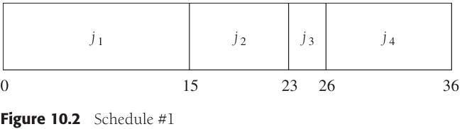

*1号调度*


*2号调度（最优）*

上图中2号调度是按照最短的作业最先进行来安排的，可以证明这将总会产生一个最优的调度：令调度表中的作业是$j_{i_1}, j_{i_2}, ..., j_{i_N}$，第一个作业以时间$t_{i_1}$完成，第二个作业在$t_{i_1} + t_{i_2}$后完成，而第三个作业在$t_{i_1} + t_{i_2} + t_{i_3}$后完成。由此可以看到，该调度的总值$C$为：

$C = \sum_{k=1}^{N}(N - k + 1)t_{i_k} \qquad \qquad \qquad \qquad (10-1)$

$C = (N+1)\sum_{k=1}^{N}t_{i_k} - \sum_{k=1}^{N}k \times t_{i_k} \qquad \quad (10-2)$

**多处理器的情形：**

设有作业$j_1, j_2, ..., j_N$，对应的运行时间分别为$t_1, t_2, ..., t_N$，另有处理器的个数$P$。不失一般性，假设作业是有序的，最短的最先运行。

作为一个例子，设$P=3$，作业如图所示：


*作业和时间*


*多处理器情形的一个最优解*


*多处理器情形的第二个最优解*

**将最后完成时间最小化：**


*将最后完成时间最小化*

### 10.1.2 赫夫曼编码


*使用一个标准编码方案*


*树中原始编码的表示*


*稍微好一些的树*


*最优前缀码的树*


*最优前缀码*

**赫夫曼算法**

`赫夫曼算法（Huffman algorithm）`：维护一个由树组成的森林。一棵树的权等于它的叶子的频率的和。任意选取最小权的两棵树T1和T2，并任意形成以T1和T2为子树的新树，将这样的过程进行C-1次。在算法的开始，存在C棵单结点树 -- 每个字符一棵。在算法结束时得到一棵树，这棵树就是最优赫夫曼编码树。


*赫夫曼算法的初始状态*

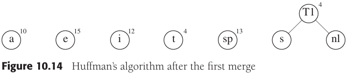

*第一次合并后的赫夫曼算法*

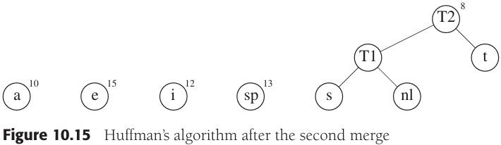

*第二次合并后的赫夫曼算法*


*第三次合并后的赫夫曼算法*

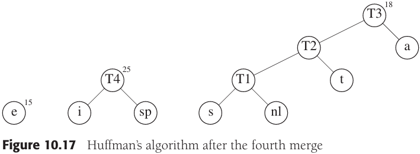

*第四次合并后的赫夫曼算法*


*第五次合并后的赫夫曼算法*

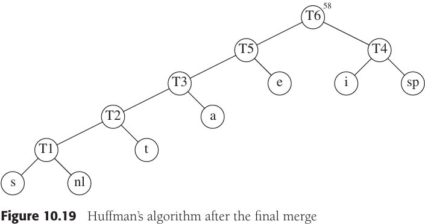

*最后一次合并后的赫夫曼算法*

### 10.1.3近似装箱问题

设给定$N$项物品，大小为$s_1, s_2, ..., s_N$，所有的大小都满足$o < s_i \leqslant 1$。问题是要把这些物品装到最少数量的箱子中去，已知每个箱子的容量是1个单位。


*对0.2, 0.5, 0.4, 0.7, 0.1, 0.3, 0.8的最优装箱*

**联机算法**

**定理10.1** 存在一些输入使得任意联机装箱算法至少使用最优箱子数的$\frac{4}{3}$。

**证明**        假设情况相反，为简单起见设$M$是偶数。考虑任一运行在上面的输入序列$I_1$上的联机算法A。注意，该序列由$M$个小项后接$M$个大项组成。设$A$已经用了$b$个箱子。此时，箱子的最优个数是$M/2$，因为可以在每个箱子里放入两件物品。根据好于$\frac{4}{3}$的性能保证的假设，得知$2b/M < \frac{4}{3}$。

​                在$b$个箱子之后开辟的所有箱子中每箱恰好包含一项物品，因为所有小物品都被放在了前$b$个箱子中，而两个大项物品又装不进一个箱子中。由于前$b$个箱子每箱最多有两项物品，而其余的箱子每箱都有一项物品，因此我们看到，将$2M$项物品装箱将至少需要$2M-b$个箱子。但$2M$项物品可以用$M$个箱子最优装箱，因此性能保证可以确保得到$(2M-b)/M < \frac{4}{3}$。

​                第一个不等式意味着$b/M < \frac{2}{3}$，而第二个不等式意味着$b/M > \frac{2}{3}$，这是矛盾的。因此，没有能够保证使用小于$\frac{4}{3}$的最优装箱数完成装箱的联机算法。

**下项适配**

`下项适配算法`当处理任何一项物品时，我们都要检查看它是否还能装进刚刚装进物品的那个箱子中去。如果能够装进去，那么就把它放入该箱中；否则，开辟一个新的箱子。


*对0.2, 0.5, 0.4, 0.7, 0.1, 0.3, 0.8的下项适配算法*

**定理10.2** 令$M$是将一批物品$I$装箱所需的最优装箱数，则下项适配算法所用的箱子数决不超过$2M$个。存在一些序列使得下项适配算法用箱$2M-2$个。

**证明**         考虑任何相邻的两个箱子$B_j$和$B_{j+1}$。$B_j$和$B_{j+1}$中所有物品的大小之和必然大于1，否则这些物品就会全部放入$B_j$中。如果将该结果用于所有相邻的两个箱子，那么可以看到，最多有一半的空间闲置。因此，下项适配算法最多使用两倍的最优箱子数。


*对0.5, 2/N, 0.5, 2/N, 0.5, 2/N, ...的最优装箱方法*

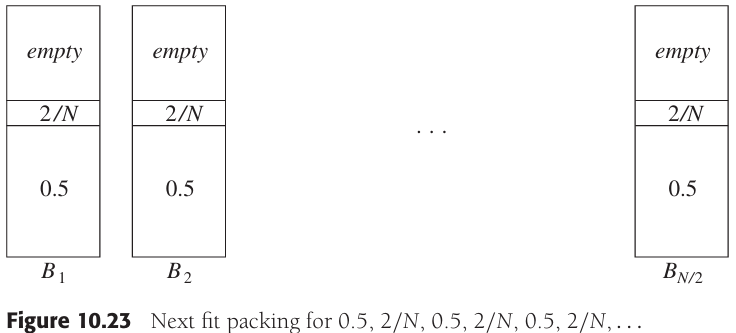

*对0.5, 2/N, 0.5, 2/N, 0.5, 2/N, ...的下项适配装箱法*

**首次适配**

`首次适配（first fit）`依序扫描这些箱子并把一项新的物品放入足够能盛下它的第一个箱子中。因此，只有前面放置物品的箱子已经容不下当前物品的时候，才开辟一个新箱子。


*对0.2, 0.5, 0.4, 0.7, 0.1, 0.3, 0.8的首次适配装箱*

**定理10.3** 令$M$是将一批$I$个物品装箱所需要的最优箱子数，则首次适配算法使用的箱子数决不多于$\lceil \frac{17}{10}M \rceil$。存在使得首次适配算法使用$\lceil \frac{17}{10}(M-1) \rceil$个箱子的序列。

**证明**        略。


*首次适配算法使用$10M$个而不是$6M$个箱子的情形*

**最佳适配**

`最佳适配（best fit）算法`把一项新物品放到所有能够容纳它的箱子里最满的一个中。


*对0.2, 0.5, 0.4, 0.7, 0.1, 0.3, 0.8的最佳适配算法*

**脱机算法**

`首次适配递减（first fit decreasing）`又叫做首次适配非增（first fit nonincreasing）算法，对联机算法的改进，把最大的物品放在最先。


*对0.8, 0.7, 0.5, 0.4, 0.3, 0.2, 0.1的首次适配算法*

**引理10.1** 令$N$项物品的输入大小（以递减顺序排序）分别为$s_1, s_2, ..., s_N$，并设最优装箱法使用$M$个箱子。那么，首次适配递减算法放到$M$个箱子之外的其余箱子中的所有物品的大小最多为$\frac{1}{3}$。

**证明**        设第$i$项物品是放入第$M+1$个箱子中的第一项，需要证明$s_i \leqslant \frac{1}{3}$。使用反证法证明如下：

​               设$s_i > \frac{1}{3}$，由于这些物品的大小是以递减顺序排列的，因此$s_1, s_2, ..., S_{i-1} > \frac{1}{3}$；由此得知，所有的箱子$B_1, B_2, ..., B_M$每个最多有两项物品。只需要证明$s_i$没有办法放入这$M$个箱子之一中去，即可完成证明。

​               显然$S_i$不能放入这$j$个箱子中，因为加入能放入，那么首次适配算法也能够这么做。把它放入剩下的$M-j$个箱子之一中需要把$2(M-j)+1$项物品分发到这$M-j$个箱子中。因此，某个箱子就不得不装入三项物品，而其中的每一项都大于$\frac{1}{3}$，很明星，这是不可能的。这与所有大小的物品都能装入$M$个箱子的事实矛盾，因此开始的假设肯定是不正确的，从而$S_i \leqslant \frac{1}{3}$。

**引理10.2** 放入其余箱子中的物品的个数最多是$M-1$。

**证明**        假设放入其余（即附加的）箱子中的物品至少有$M$个。我们知道$\sum_{i=1}^{N} \leqslant M$，因为所有的物品都可装入$M$个箱子。设对于$1 \leqslant j \leqslant$，箱子$B_j$装入后总权为$W_j$。设前$M$个其余箱子中物品大小为$x_1, x_2, ..., x_M$。此时，由于前$M$个箱子中的项加上前$M$个其余箱子中的项是所有物品的一个子集，于是：

$\sum_{i=1}^{N}S_i \geqslant \sum_{j=1}^{M}W_j + \sum_{j=1}^{M}X_j \geqslant \sum_{j=1}^{M}(W_j + X_j)$

现在$W_j + X_j > 1$，否则对应于$x_j$的项就已经放入$B_j$中。因此：

$\sum_{i=1}^{N}S_i > \sum_{j=1}^{M}1 > M$

但如果$N$项物品可以被装入$M$个箱子中，这是不可能的。因此，最多只能有$M-1$项其余的物品。

**定理10.4** 令$M$是将物品集$I$装箱所需的最优箱子数，则首次适配递减算法所用的箱子数绝不超过$(4M+1)/3$。

**证明**        存在$M-1$项其余箱子中的物品，其大小至多为$\frac{1}{3}$。因此，最多存在$\lceil (M-1)/3 \rceil$个其余的箱子。从而，首次适配递减算法使用的箱子总数最多为$\lceil (4M-1)/3 \rceil \leqslant (4M+1)/3$。

**定理10.5** 令$M$是将物品集$I$装箱所需的最优箱子数，则首次适配递减算法所用的箱子数绝不超过$\frac{11}{9}M + 4$。此外，存在使得首次适配递减算法用到$\frac{11}{9}$个箱子的序列。

**证明**        上界需要非常复杂的分析，下界可以通过下述序列展示：先是大小为$\frac{1}{2} + \epsilon$的$6M$项物品，其后是大小为$\frac{1}{4} + 2\epsilon$的$6M$项物品，接着是大小为$\frac{1}{4} + \epsilon$的$6M$项物品，最后是大小为$\frac{1}{4} - 2\epsilon$的$12M$项物品。


*首次适配递减算法使用$11M$个箱子但只有$9M$个箱子就足够完成装箱的例子*


## 10.2 分治算法

`分治（divide adn conquer）算法`由两部分组成：

- `分（divide）`递归解决较小的问题。
- `治（conquer）`从子问题的解构建原问题的解。

### 10.2.1 分治算法的运行时间

**定理10.6** 方程$T(N) = aT(N/b) + \theta(N^k)$的解为：
$$
T(N)
\begin{cases}
O(N^{log_{h}a}) &若 a > b^k \\
O(N^klogN) &若 a = b^k \\
O(N^k) &若 a < b^k \\
\end{cases}
$$
其中$a \geqslant 1, b > 1$。

**证明**         根据并归排序的分析，假设$N$是$b$的幂；于是，令$N = b^m$。此时$N/b = b^{m-1}$及$N^k = (b^m)^k = b^{mk} = b ^ {km} = (b^k)^m$。假设$T(1) = 1$，并忽略$\theta(N^k)$中的常数因子，则有：

$T(b^m) = aT(b^{m-1}) + (b^k)^m$

如果用$a^m$除两边，则得到方程：

$\frac{T(b^m)}{a^m} = \frac{T(b^{m-1})}{a^{m-1}} + \{\frac{b^k}{a}\}^m \qquad (10-3)$

我们可以将该方程用于$m$的其他值，得到：

$\frac{T(b^{m-1})}{a^{m-1}} = \frac{T(b^{m-2})}{a^{m-2}} + \{\frac{b^k}{a}\}^{m-1} \qquad (10-4)$

$\frac{T(b^{m-2})}{a^{m-2}} = \frac{T(b^{m-3})}{a^{m-3}} + \{\frac{b^k}{a}\}^{m-2} \qquad (10-5)$

$\vdots$

$\frac{T(b^1)}{a^1} = \frac{T(b^0)}{a^0} + \{\frac{b^k}{a}\}^1 \qquad (10-6)$

使用将公式（10-3）到（10-6）叠缩方程两边分别加起来的标准技巧，等号左边的所有项实际上与等号右边的前一项相消，由此得到：

$\frac{T(b^m)}{a^m} = 1 + \sum_{i=1}^{m}\{\frac{b^k}{a}\}^i \qquad (10-9)$

如果$a>b^k$，那么和就是一个公比小于1的几何级数。由于无穷级数的和收敛于一个常数，因此该有限的和也以一个常数为界，从而公式（10-10）成立：

$T(N) = O(a^m) = O(a^{log_b N} = O(N^{log_b a})) \qquad (10-10)$

如果$a = b^k$，那么和中的每一项均为1。由于和含有$1 + log_b N$项而$a = b^k$意味着$log_b a = k$，于是：

$T(N) = O(a^m log_b N) = O(N^{log_h a} log_b N) = O(N^k log_b N) = O(N^k log N) \qquad (10-11)$

最后，如果$a < b^k$，那么该几何级数中的项都大于1，且1.2.3节中的第二个公式成立。有：

$T(N) = a^m \frac{(b^k/a)^{m+1} - 1}{(b^k/a) - 1} = O(a^m(b^k / a)^m) = O((b^k)^m) = O(N^k) \qquad (10-12)$

定理的最后一种情形得证。

**定理10.7** 方程$T(N) = aT(N/b) + \theta (N^k log^p N)$的解为
$$
f(n)
\begin{cases}
O(N^{log_b a}) &若 a > b^k \\
O(N^k log^{p+1} N) &若 a = b^k \\
O(N^k log^p N) &若 a < b^k
\end{cases}
$$
其中$a \geqslant 1, b > 1 且 p \geqslant 0$。

**定理10.8** 如果$\sum_{i=1}^{k} \alpha_i < 1$则方程$T(N) = \sum_{i=1}^{k} T(\alpha_i N) + O(N)$的解为$T(N) = O(N)$。

### 10.2.2 最近点问题

`最近点问题` 对于平面上的点列$P$。如果$P_1 = (x_1, y_y)$和$p_2 = (x_2, y_2)$，那么$p_1$和$p_2$间的欧几里得距离为$[(x_1 - x_2)^2 + (y_1 - y_2)^2]^{1/2}$，找出最近的点（如果两个点位于同一位置，那么他们就是最近的点）。


*一个小规模的点集*


*被分成$P_L$和$P_R$的点集$P$：显示了最短的距离*

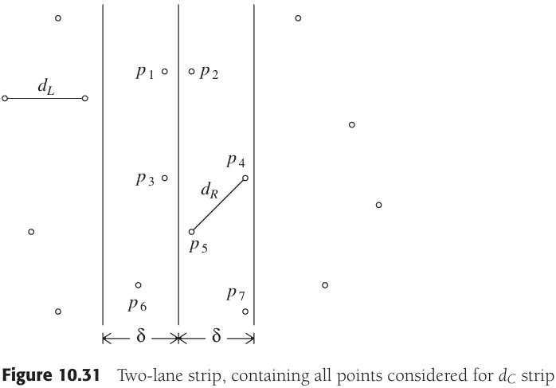

*双道带区域，包含对于d_C带所考虑的全部点*


*$min(\delta, d_C)$的蛮力计算*


*$min(\delta, d_C)$的精化计算*


*在第2个for循环中只考虑$p_4$和$p_5$*

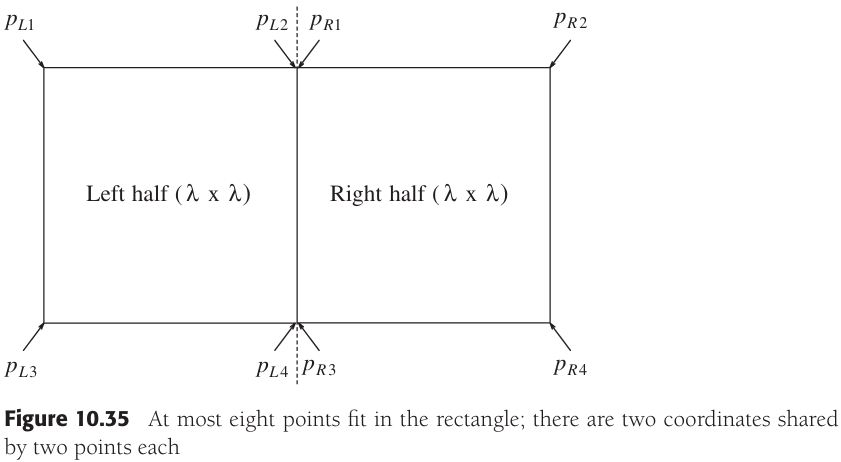

*最多有8个点在该矩形中，其中有两个坐标由两个点共享*

### 10.2.3 选择问题

`选择问题（selection problem）` 找出含$N$个元素的集合$S$中的第$k$个最小的元素。

枢纽元选择算法：

1. 把$N$个元素分成$\lfloor N/5 \rfloor$组（5个元素一组，忽略多余的($N\ mod\ 5$)个元素）。
2. 找出每组的中项，得到$\lfloor N/5 \rfloor$个中项，并组成表$M$。
3. 求出$M$的中项，将其作为枢纽元$v$返回。

上述枢纽元选择法则又叫做`五分化中项的中项（median-of-median-offive partitioning）`。

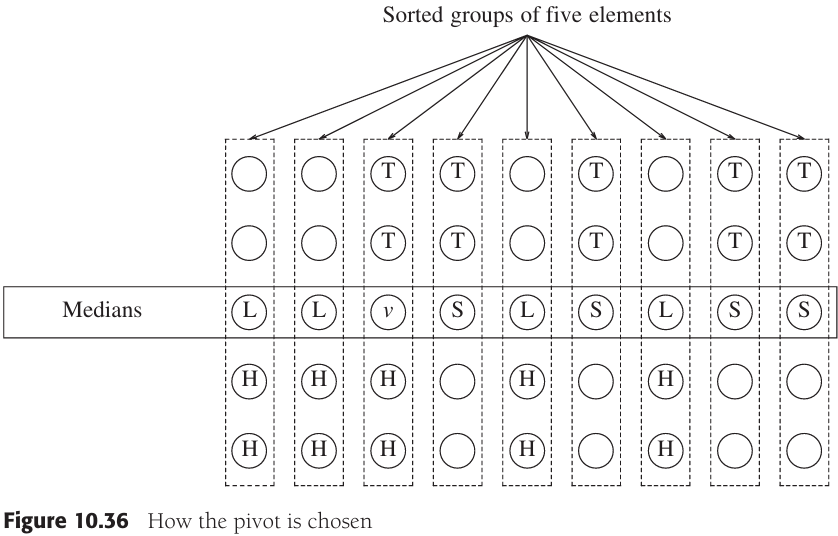

*枢纽元的选择，$v$为算法选出作为枢纽元的元素*

**定理10.9** 使用“五分化中项的中项”的快速选择算法的运行时间为$O(N)$。

**证明**        该算法由大小分别为$0.7N$和$0.2N$的两个递归调用以及线性附加工作组成。根据定理10.8，其运行时间是线性的。

### 10.2.4 一些算术问题的理论改进

1. 整数相乘

   想要将两个$N$位数$X$和$Y$相乘。如果$X$和$Y$恰好有一个是负的，那么结果就是负的；否则结果为正数。因此，可以进行这种检查，然后假设$X, Y \geqslant 0$。几乎每个人在手算乘法时使用的算法都需要$\theta(N^2)$次操作，这是因为$X$的每一位数字都要被$Y$的每一位数字去乘。

   例：令$X = 61438521, Y = 94736407$，分别将$X和Y$按照规则$X=X_L 10^4 + X_R, Y=Y_L 10^4 + Y_R$拆开得到$X_L = 6143, X_R = 8521, Y_L = 9473, Y_R = 6407$。从而得到

   $XY = X_L Y_L 10^8 + (X_L Y_R + X_R Y_L)10^4 + X_R Y_R$

   

   *分治算法的执行情况*

2. 矩阵乘法

   Strassen算法的基本思想是把每个矩阵都分成4块，如图所示：

   

   *把$AB=C$分解成4块乘法*

   ```c++
   // 简单的O(N^3)矩阵乘法
   matrix<int> operator*(const matrix<int> &a, const matrix<int> &b)
   {
       int n = a.numrows();
       matrix<int> c(n, n);
       int i;
       for (i = 0; i < n; i++)
           for (int j = 0; j < n; j++)
               c[i][j] = 0;
       
       for (i = 0; i < n; i++)
           for (int j = 0; j < n; j++)
               for (int k = 0; k < n; j++)
                   c[i][j] += a[i][k] * b[k][j];
       
       return c;
   }
   ```

   例：

   $$ AB = \begin{bmatrix}
   3 & 4 & 1 & 6 \\
   1 & 2 & 5 & 7 \\
   5 & 1 & 2 & 9 \\
   4 & 3 & 5 & 6
   \end{bmatrix} 
   \begin{bmatrix}
   5 & 6 & 9 & 3 \\
   4 & 5 & 3 & 1 \\
   1 & 1 & 8 & 4 \\
   3 & 1 & 4 & 1
   \end{bmatrix}$$
   
   定义下列8个$N/2 \times N/2$阶矩阵：
   
   $$ A_{1,1} = \begin{bmatrix}
   3 & 4 \\
   1 & 2 
   \end{bmatrix} \quad
   A_{1,2} = \begin{bmatrix}
   1 & 6 \\
   5 & 7
   \end{bmatrix} \quad
   B_{1,1} = \begin{bmatrix}
   3 & 4 \\
   1 & 2 
   \end{bmatrix} \quad
   B_{1,2} = \begin{bmatrix}
   9 & 3 \\
   3 & 1
   \end{bmatrix} \quad\\
   A_{2,1} = \begin{bmatrix}
   5 & 1 \\
   4 & 3
   \end{bmatrix} \quad
   A_{2,2} = \begin{bmatrix}
   2 & 9 \\
   5 & 6
   \end{bmatrix} \quad
   B_{2,1} = \begin{bmatrix}
   1 & 1 \\
   3 & 1
   \end{bmatrix} \quad
   B_{2,2} = \begin{bmatrix}
   8 & 4 \\
   4 & 1
   \end{bmatrix} \quad$$
   
   此时，可以进行8个$N/2 \times N/2$阶矩阵的乘法和4个$N/2 \times N/2$阶矩阵的加法。这些加法花费$O(N^2)$时间。如果递归地进行矩阵乘法，那么运行时间满足：$T(N) = 8T(N/2) + O(N^2)$。Strassen使用了类似于整数乘法分治算法的策略，指出可以只使用以下7次递归调用：
   
   $$
   \begin{equation}\begin{split} 
   M_1 &= (A_{1,2} - A_{2,2})(B_{2,1} + B_{2,2})\\
   M_2 &= (A_{1,1} - A_{2,2})(B_{1,1} + B_{1,2})\\
   M_3 &= (A_{1,1} - A_{2,1})(B_{1,1} + B_{1,2})\\
   M_4 &= (A_{1,1} + A_{1,2})B_{2,2}\\
   M_5 &= A_{1,1}(B_{1,2} + B_{2,2})\\
   M_6 &= A_{2,2}(B_{2,1} + B_{1,1})\\
   M_7 &= (A_{2,1} - A_{2,2})B_{1,1}
   \end{split}\end{equation}
   $$
   
   一旦执行这些乘法，则最后答案可以通过下列8次加法得到：
   $$
   \begin{equation}\begin{split} 
   M_{1,1} &= M_1 + M_2 - M_4 + M_6\\
   M_{1,2} &= M_4 + M_5\\
   M_{2,1} &= M_6 + M_7\\
   M_{2,2} &= M_2 - M_3 + M_5 - M_7
   \end{split}\end{equation}
   $$
   
   可以直接验证，这种机敏的安排产生了期望的效果。现在运行时间满足递推关系：
   
   $T(N) = 7T(N/2) + O(N^2)$
   
   这个递推关系的解为：
   
   $T(N) = O(N^{log_2 7}) = O(N^{2.81})$


## 10.3 动态规划

### 10.3.1 用表代替递归

```c++
// 计算斐波那契数的低效算法
int fib(int n)
{
    if (n <= 1)
        return 1;
    else
        return fib(n - 1) + fib(n - 2);
}
```

```c++
// 计算斐波那契数的线性算法
int fibonacci(int n)
{
    if (n <= 1)
        return 1;
    
    int last = 1;
    int nextToLast = 1;
    int answer = 1;
    for (int i = 2; i <= n; i++)
    {
        answer = last + nextToLast;
        nextToLast = last;
        last = answer;
    }
    return answer;
}
```


*跟踪斐波那契数的递归计算*

```c++
double eval(int n)
{
    if (n == 0)
        return 1.0;
    else
    {
        double sum = 0.0;
        for (int i = 0; i < n; i++)
            sum += eval(i);
        return 2.0 * sum / n + n;
    }
}
```

*上述代码为计算$C(N) = 2/N \sum_{i=0}^{N-1} C(i) + N$的值的递归函数*

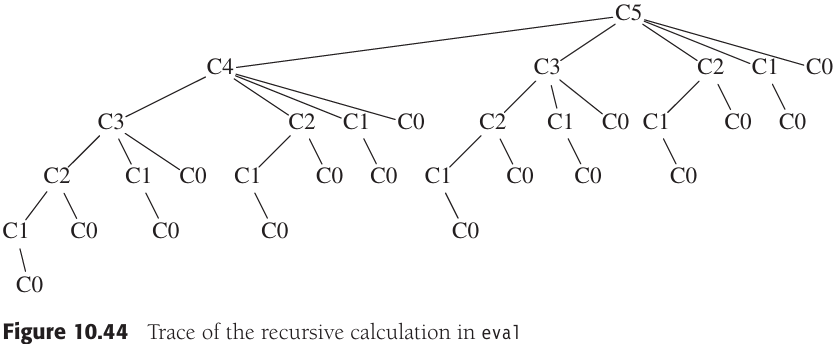

*跟踪方法eval中的递归计算*

```c++
double eval(int n)
{
    vector<double> c(n + 1);
    c[0] = 1.0;
    for (int i = 1; i <= n; i++)
    {
        double sum = 0.0;
        for(int j = 0; j < i; j++)
            sum += c[j];
        c[i] = 2.0 * sum / i + i;
    }
    return c[n];
}
```

*上述代码使用表来计算$C(N) = 2/N \sum_{i=0}^{N-1} C(i) + N$的值*

### 10.3.2 矩阵乘法的顺序安排

设给定4个矩阵$A, B, C和D$，$A$的大小$=50 \times 10$，$B$的大小$=10 \times 40$，$C$的大小$=40 \times 30$，$D$的大小$=30 \times 5$。在4个矩阵的情况下，通过穷举搜索求解这个问题，我们对每种情况计算如下：

- $(A((BC)D))：$需要$16000$次乘法。
- $(A(B(CD)))：$需要$10500$次乘法。
- $((AB)(CD))：$需要$36000$次乘法。
- $(((AB)C)D)：$需要$87500$次乘法。
- $((A(BC))D)：$需要$34500$次乘法。

假设定义$T(N)$是顺序的个数，此时，$T(1) = T(2) = 1, T(3) = 2, T(4) = 5$。一般地：$T(N) = \sum_{i=1}^{N-1} T(i)T(N-i)$。

如果定义$M_{Left, Right}$为最优排列顺序下所需要的乘法次数，若$Left < Right$，则：$M_{Left, Right} = \underset{Left \leqslant i < Right}{min} \{M_{Left, i} + M_{i+1, Right} + C_{Left - 1} C_i C_{Right} \}$

这个方程意味着，如果有乘法$A_{Left} ... A_{Right}$的最优的乘法排列顺序，那么子问题$A_{Left} ... A_i$和$A_{i+1} ... A_{Right}$就不能次最优地执行。

```c++
// 找出矩阵乘法最优顺序的程序
void optMatrix(const vector<int> &c, matrix<long> &m, matrix<int> &lastChange)
{
    int n = c.size() - 1;
    for (int left = 1; left <= n; left++)
        m[left][left] = 0;
    for (int k = 1; k < n; k++) // k is right - left
        for (int left = 1; left <= n - k; left++)
        {
            // For each position
            int right = left + k;
            m[left][right] = INFINITY;
            for (int i = left; i < right; i++)
            {
                long thisCost = m[lseft][i] + m[i + 1][right] + 
                                    c[left - 1] * c[i] * c[right];
                if (thisCost < m[left][right]) // Update min
                {
                    m[left][right] = thisCost;
                    lastChange[left][right] = i;
                }
            }
        }
}
```

### 10.3.3 最优二叉查找树


*最优二叉查找树问题的样本输入*


*对于上表中数据的3棵可能的二叉查找树*

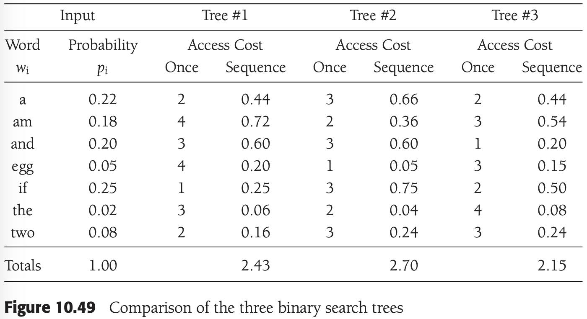

*3棵二叉查找树的比较*


*最优二叉查找树的构造*

两棵子树的每个结点从$w_i$开始都比从它们对应的根开始深一层，于是得到公式：
$$
\begin{equation}\begin{split} 
C_{Left, Right} &= \underset{Left \leqslant i \leqslant Right}{min}\{P_i + C_{Left, i-1} + C_{i+1, Right} + \sum_{j=Left}^{i-1} P_j + \sum_{j=i+1}^{Right} P_j\} \\ 
& = \underset{Left \leqslant i \leqslant Right}{min} \{C_{Left, i-1} + C_{i+1, Right} + \sum_{j=Left}^{Right} P_j\}
\end{split}\end{equation}
$$

从这个公式可以直接编写一个程序来计算最优二叉查找树的开销。


*对于样本输入的最优二叉查找树的计算*


*对$am..if$的表项$(1.21, and)$的计算*

### 10.3.4 所有点对最短路径

Dijkstra算法提供了动态规划算法的想法：依序选择这些顶点。将$D_{k, i, j}$定义为从$v_i$到$v_j$只使用$v_, v_2, ..., v_k$作为中间顶点的最短路径的权。根据这个定义，$D_{0, i, j} = c_{i, j}$，其中若$(v_i, v_j)$不是该图的边则$c_{i, j}$是$\infty$。再有，根据定义，$D_{|V|, i, j}$是图中从$v_i$到$v_j$的最短路径。

```c++
// 所有点对最短路径
void allPairs(const matrix<int> &a, matrix<int> &d, matrix<int> &path)
{
    int n = a.numrows();
    
    // Initialize d and path
    for (int i = 0; i < n; i++)
        for (int j = 0; j < n; j++)
        {
            d[i][j] = a[i][j];
            path[i][j] = NOT_A_VERTEX;
        }
    
    for (int k = 0; k < n; k++)
        // Consider each vertex as an intermediate
        for (int i = 0; i < n; i++)
            for (int j = 0; j < n; j++)
                if (d[i][k] + d[k][j] < d[i][j])
                {
                    // Update shortest path
                    d[i][j] = d[i][k] + d[k][j];
                    path[i][j] = k;
                }
}
```

当$k > 0$时可以给$D_{k, i, j}$写一个简单公式。从$v_i$到$v_j$只使用$v_1, v_2, ..., v_k$作为中间顶点的最短路径或者是根本不使用$v_k$作为中间顶点的最短路径，或者是由两条路径$v_i \rightarrow v_k$和$v_k \rightarrow v_j$合并而成的最短路径，其中每条路径只使用前$k-1$个顶点作为中间顶点。于是有公式：$D_{k, i, j} = min\{D_{k-1, i, j}, D_{k-1, i, k} + D_{k-1, k, j}\}$。时间需求还是$O(|V|^3)$。

```c++
// 所有点对最短路径
void allPairs(const matrix<int> &a, matrix<int> &d, matrix<int> &path)
{
    int n = a.numrows();
    
    // Initialize d and path
    for (int i = 0; i < n; i++)
        for (int j = 0; j < n; j++)
        {
            d[i][j] = a[i][j];
            path[i][j] = NOT_A_VERTEX;
        }
    
    for (int k = 0; k < n; k++)
        // Consider each vertex as an intermediate
        for (int i = 0; i < n; i++)
            for (int j = 0; j < n; j++)
                if (d[i][k] + d[k][j] < d[i][j])
                {
                    // Update shortest path
                    d[i][j] = d[i][k] + d[k][j];
                    path[i][j] = k;
                }
}
```


## 10.4 随机化算法

### 10.4.1 随机数生成器

`线性同余生成器`数$x_1, x_2, ...$的生成满足$x_{i+1} = Ax_i\ mod\ M$。

```c++
// 不能正常工作的随机数生成器
static const int A = 48271;
static const int M = 2147483647;

class Random
{
public:
    explicit Random(int initialValue = 1);
    int randomInt();
    double random0_1();
    int randomInt(int low, int high);
    
private:
    int state;
};

Random::Random(int initialValue)
{
    if (initialValue < 0)
        initialValue += M;
    
    state = initialValue;
    if (state == 0)
        state = 1;
}

int Random::randomInt()
{
    return state = (A * state) % M;
}

double Random::random)_1()
{
    return (double)randomInt() / M;
}
```

定义$Q$和$R$分别为$M/A$的商和余数，有：
$$
\begin{equation}\begin{split}
x_{i+1} &= Ax_i mod\ M = Ax_i - M \lfloor \frac{Ax_i}{M} \rfloor\\
&= Ax_i - M\lfloor \frac{x_i}{Q} \rfloor + M \lfloor \frac{x_i}{Q} \rfloor - M\lfloor \frac{Ax_i}{M} \rfloor\\
&= Ax_i - M\lfloor \frac{x_i}{Q} \rfloor + M(\lfloor \frac{x_i}{Q} \rfloor - \lfloor \frac{Ax_i}{M} \rfloor)
\end{split}\end{equation}
$$

由于$x_i = Q\lfloor \frac{x_i}{Q} \rfloor + x_i\ mod\ Q$，因此可以代入到右边的第一项$Ax_i$并得到：
$$
\begin{equation}\begin{split}
x_{i+1} &= A(Q\lfloor \frac{x_i}{Q} \rfloor + x_i\ mod\ Q) - M\lfloor \frac{x_i}{Q} \rfloor + M(\lfloor \frac{x_i}{Q} \rfloor - \lfloor \frac{Ax_i}{M} \rfloor)\\
&= (AQ-M)\lfloor \frac{x_i}{Q} \rfloor + A(x_i\ mod\ Q) + M(\lfloor \frac{x_i}{Q} \rfloor - \lfloor \frac{Ax_i}{M} \rfloor)
\end{split}\end{equation}
$$

由于$M = AQ + R$，因此$AQ - M = -R$。于是得到：

$x_{i+1} = A(x_i\ mod\ Q) - R\lfloor \frac{x_i}{Q} \rfloor + M(\lfloor \frac{x_i}{Q} \rfloor - \lfloor \frac{Ax_i}{M} \rfloor)$

项$\delta(x_i) = \lfloor \frac{x_i}{Q} \rfloor - \lfloor \frac{Ax_i}{M} \rfloor$或者是0，或者是1，因为两项都是整数而它们的差在0和1之间。因此：$x_{i+1} = A(x_i\ mod\ Q) - R\lfloor \frac{x_i}{Q} \rfloor + M\delta(x_i)$。

```c++
// 不溢出的随机数生成器
static const int A = 48271;
static const int M = 2147483647;
static const int Q = M / A;
static const int R = M % A;

int Random::randomInt()
{
    int tmpState = A * (state % Q) - R * (state / Q);
    if (tmpState >= 0)
        state = tmpState;
    else
        state = tmpState + M;
    
    return state;
}
```

### 10.4.2 跳跃表


*简单链表*


*带有到前面两个表元素的链的链表*


*带有到前面四个表元素的链的链表*


*带有到前面$2^i$个表元素的链的链表*


*一个跳跃表*

