# CHAPTER 10 Algorithm Design Techniques

[TOC]


## Greedy Algorithms

### A Simple Scheduling Problem


*

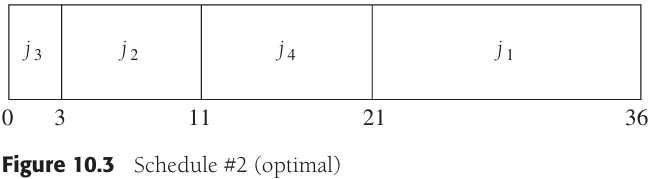

The schedule given in Figure 10.3 is arranged by shortest job first. We can show that this will always yield an optimal schedule. Let the jobs in the schedule be $j_{i_1}$, $j_{i_2}$, ..., $j_{i_N}$.The first job finishes in time $t_{i_1}$. The second job finishes after $t_{i_1} + t_{i_2}$, and the third job finishes after $t_{i_1} + t_{i_2} + t_{i_3}$. From this, we see that the total cost, $C$, of the schedule is:
$$
C = \sum_{k=1}^{N}(N - k + 1)t_{i_k} \qquad \qquad \qquad \qquad (10-1) \\
C = (N+1)\sum_{k=1}^{N}t_{i_k} - \sum_{k=1}^{N}k \times t_{i_k} \qquad \quad (10-2)
$$
**Multiprocessor Case**

We have jobs $j_1, j_2, ..., j_N$, with associated running times $t_1, t_2, ..., t_N$, and a number $P$ of processors. We will assume without loss of generality that the jobs are ordered, shortest running time first.

Example:

作为一个例子，设$P=3$，作业如图所示：

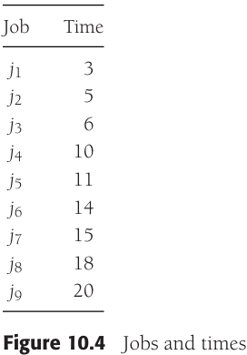


### Huffman Codes


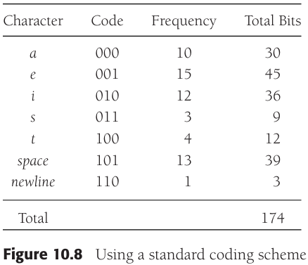


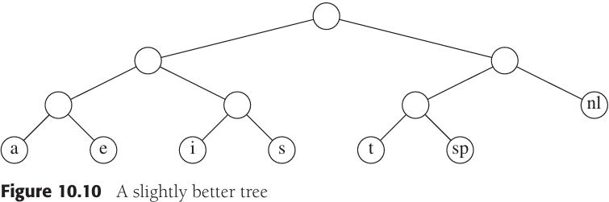

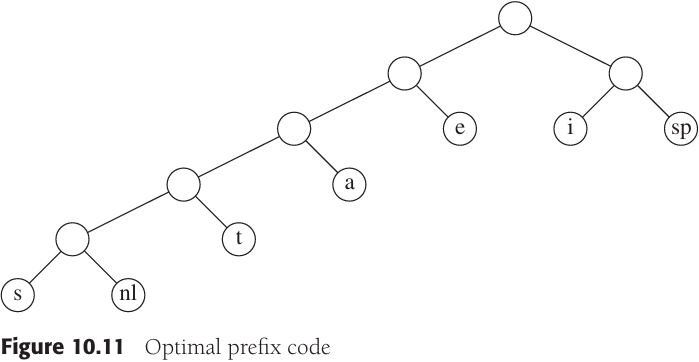

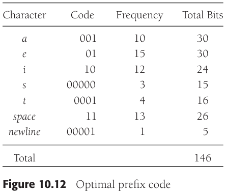

**Huffman's Algorithm**

Huffman's algorithm can be described as follows: We maintain a forest of trees. The `weight` of a tree is equal to the sum of the frequencies of its leaves. $C - 1$ times, select the two trees, $T_1$ and $T_2$, of smallest weight, breaking ties arbitrarily, and form a new tree with subtrees $T_1$ and $T_2$. At the beginning of the algorithm, there are $C$ single-node trees--one for each character. At the end of the algorithm there is one tree, and this is the optimal Huffman coding tree.

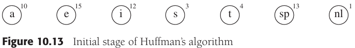


### Approximate Bin Packing

We are given $N$ items of sizes $s_1, s_2, ..., s_N$. All sizes satisfy $0 < s_i \leq 1$. The problem is to pack these items in the fewest number of bins, given that each bin has unit capacity.


**Online Algorithms**

**Theorem 10.1** There are inputs that force any online bin packing algorithm to use at least $\frac{4}{3}$ the optimal number of bins.

**Next Fit**

**Theorem 10.2** Let $M$ be the optimal number of bins required to pack a list $I$ of items. Then next fit never uses more than $2M$ bins. There exist sequences such that next fit uses $2M - 2$​ bins.

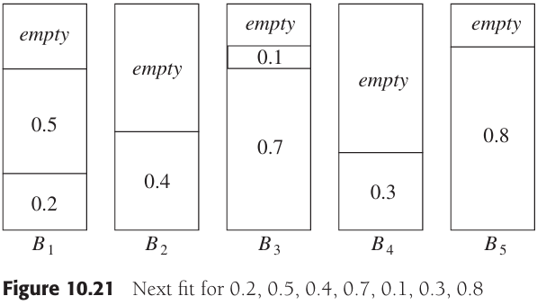

**First Fit**

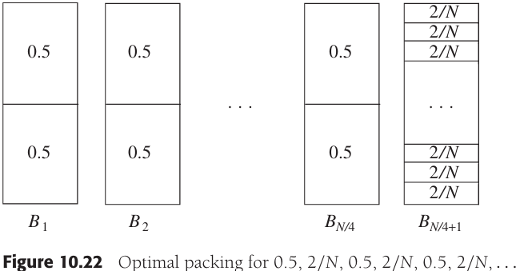


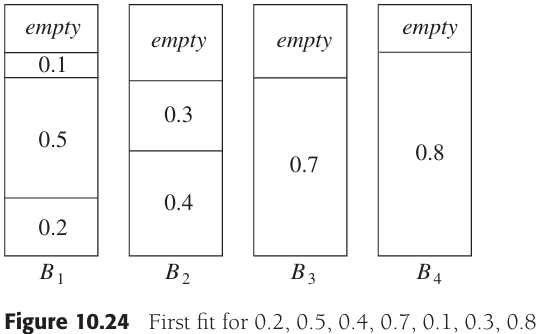

**Theorem 10.3** Let $M$ be the optimal number of bins required to pack a list $I$ of items. Then first fit never uses more than $\frac{17}{10}M + \frac{7}{10}bins$. There exist sequences such that first fit uses $\frac{17}{10}(M - 1)bins$.

**Best Fit**

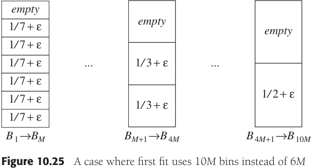


**Offline Algorithms**

The natural way around this is to sort the items, placing the alrgest items first. We can then apply first fit or best fit, yielding the algorithms **first fit decreasing** and **best fit decreasing**.

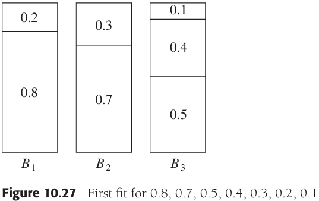

**Lemma 10.1** Let the $N$ items have (sorted in decreasing order) input sizes $s_1, s_2, ..., s_N$, respectively, and suppose that the optimal packing is $M$ bins. Then all items taht `first fit` decreasing places in extra bins have size at most $\frac{1}{3}$.

**Lemma 10.2** The number of objects placed in extra bins is at most $M - 1$.

**Theorem 10.4** Let $M$ be the optimal number of bins required to pack a list $I$ of items. Then first fit decreasing never uses more than $(4M + 1) / 3$ bins.

**Theorem 10.5** Let $M$ be the optimal number of bins required to pack a list $I$ of items. Then first fit decreasing never uses more than $\frac{11}{9}M + \frac{6}{9}$ bins. There exist sequences such that first fit decreasing uses $\frac{11}{9}M + \frac{6}{9}$ bins.


## Divide and Conquer

Divide-and-conquer algorithms consist of two parts:

- Divide: Smaller problems are solved recursively (except, of course, base cases).
- Conquer: The solution to the original problem is then formed from the solutions to the subproblems.

### Running Time of Divide-and-Conquer Algorithms

**Theorem 10.6** The solution to be equation $T(N) = aT(N / b) + \theta(N^k)$, where $a \geq 1$ and $b > 1$, is
$$
T(N)
\begin{cases}
O(N^{log_{h}a}) &if\ a > b^k \\
O(N^klogN) &if\ a = b^k \\
O(N^k) &if\ a < b^k \\
\end{cases}
$$
**Theorem 10.7** The solution to the equation $T(N) = aT(N/b) + \theta(N^k log^p N)$, where $a \geq 1, b > 1$, and $p \geq 0$ is:
$$
f(n)
\begin{cases}
O(N^{log_b a}) &if\ a > b^k \\
O(N^k log^{p+1} N) &if\ a = b^k \\
O(N^k log^p N) &if\ a < b^k
\end{cases}
$$
**Theorem 10.8** If $\sum_{i=1}^{k} \alpha_i < 1$, then the solution to the equation $T(N) = \sum_{i=1}^{k} T(\alpha_i N) + O(N)$ is $T(N) = O(N)$.

### Closest-Points Problem

The input to our first problem is a list $P$ of points in a plane. If $p_1 = (x_1, y_1)$ and $p_2 = (x_2, y_2)$, then the Eucliden distance between $p_1$ and $p_2$ is $[(x_1 - x_2)^2 + (y_1 - y_2)^2]^{1/2}$. We are required to find the closest pair of points. It is possible that two points have the same position; in that case, that pair is the closest, with distance zero.

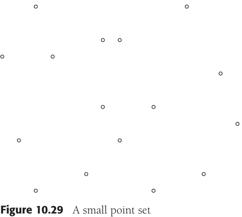


### The Selection Problem

The selection problem requires us to find the $k$th smallest element in a collection $S$ of $N$ elements.

The basic pivot selection algorithm is as follows:

1. Arrange the $N$ elements into $\lfloor N/5 \rfloor$ groups of five elements, ignoring the (at most four) extra elements.
2. Find the median of each group. This gives a list $M$ of $\lfloor N/5 \rfloor$ medians.
3. Find the median of $M$. Return this as the pivot, $v$.

, We will use the term **median-of-median-of-five partitioning** to describe the quick-select algorithm that uses the pivot selection rule given above.


**Theorem 10.9** The running time of quickselect using median-of-median-of-five partitioning is $O(N)$.

### Theoretical improvements for Arithmetic Problems

1. Multiplying Integers

   Suppose we want to multiply two $N$-digit numbers, $X$ and $Y$. If exactly one of $X$ and $Y$ is negative, then the answer is negative; otherwise it is positive. Thus, we can perform this check and then assume that $X, Y \geq 0$. The algorithm that almost everyone uses when multiplying by hand requires $\theta(N^2)$ operations, because each digit in $X$ is multiplied by each digit in $Y$.

2. Matrix Multiplication

   A fundamental numerical problem is the multiplication of two matrices. For example:

   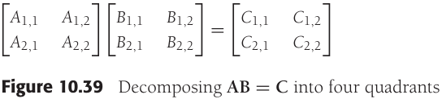

   ```c++
   // 简单的O(N^3)矩阵乘法
   matrix<int> operator*(const matrix<int> &a, const matrix<int> &b)
   {
       int n = a.numrows();
       matrix<int> c(n, n);
       int i;
       for (i = 0; i < n; i++)
           for (int j = 0; j < n; j++)
               c[i][j] = 0;
       
       for (i = 0; i < n; i++)
           for (int j = 0; j < n; j++)
               for (int k = 0; k < n; j++)
                   c[i][j] += a[i][k] * b[k][j];
       
       return c;
   }
   ```

   

## Dynamic Programming

### Using a Table Instead of Recursion

```c++
// 计算斐波那契数的低效算法
int fib(int n)
{
    if (n <= 1)
        return 1;
    else
        return fib(n - 1) + fib(n - 2);
}
```

```c++
// 计算斐波那契数的线性算法
int fibonacci(int n)
{
    if (n <= 1)
        return 1;
    
    int last = 1;
    int nextToLast = 1;
    int answer = 1;
    for (int i = 2; i <= n; i++)
    {
        answer = last + nextToLast;
        nextToLast = last;
        last = answer;
    }
    return answer;
}
```


```c++
double eval(int n)
{
    if (n == 0)
        return 1.0;
    else
    {
        double sum = 0.0;
        for (int i = 0; i < n; i++)
            sum += eval(i);
        return 2.0 * sum / n + n;
    }
}
```

*Recursive function to evaluate $C(N) = 2/N \sum_{i=0}^{N-1} C(i) + N$*


```c++
double eval(int n)
{
    vector<double> c(n + 1);
    c[0] = 1.0;
    for (int i = 1; i <= n; i++)
    {
        double sum = 0.0;
        for(int j = 0; j < i; j++)
            sum += c[j];
        c[i] = 2.0 * sum / i + i;
    }
    return c[n];
}
```

*Evaluating$C(N) = 2/N \sum_{i=0}^{N-1} C(i) + N$ with a table*

### Ordering Matrix Multiplications

Suppose we define $T(N)$ to be this number. Then $T(1) = T(2) = 1, T(3) = 2$, and $T(4) = 5$, as we have seen. In general:
$$
T(N) = \sum_{i=1}^{N-1} T(i)T(N-i)
$$
If we define $M_{Left, Right}$ to be the number of multiplications required in an `optimal` ordering, then, if $Left < Right$:
$$
M_{Left, Right} = \underset{Left \leqslant i < Right}{min} \{M_{Left, i} + M_{i+1, Right} + C_{Left - 1} C_i C_{Right} \}
$$
, This equation implies that if we have an optimal multiplication arrangement of $A_{Left} ... A_{Right}$, the subproblems $A_{Left} ... A_i$ and $A_{i+1} ... A_{Right}$ cannot be performed suboptimally.

```c++
// 找出矩阵乘法最优顺序的程序
void optMatrix(const vector<int> &c, matrix<long> &m, matrix<int> &lastChange)
{
    int n = c.size() - 1;
    for (int left = 1; left <= n; left++)
        m[left][left] = 0;
    for (int k = 1; k < n; k++) // k is right - left
        for (int left = 1; left <= n - k; left++)
        {
            // For each position
            int right = left + k;
            m[left][right] = INFINITY;
            for (int i = left; i < right; i++)
            {
                long thisCost = m[lseft][i] + m[i + 1][right] + 
                                    c[left - 1] * c[i] * c[right];
                if (thisCost < m[left][right]) // Update min
                {
                    m[left][right] = thisCost;
                    lastChange[left][right] = i;
                }
            }
        }
}
```

### Optimal Binary Search Tree

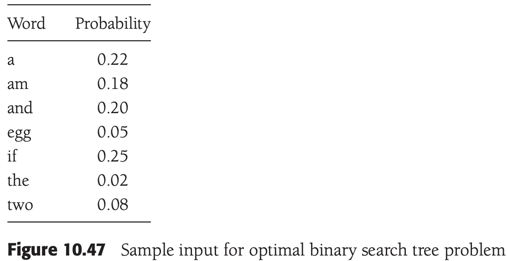


As Figure 10.50 shows, each node in these subtrees is one level deeper from $w_i$ than from their respective roots, so we must add $\sum_{j=Left}^{i - 1}p_j$ and $\sum_{j = i + 1}^{Right}p_j$. This gives the formula:
$$
\begin{equation}\begin{split} 
C_{Left, Right} &= \underset{Left \leqslant i \leqslant Right}{min}\{P_i + C_{Left, i-1} + C_{i+1, Right} + \sum_{j=Left}^{i-1} P_j + \sum_{j=i+1}^{Right} P_j\} \\ 
& = \underset{Left \leqslant i \leqslant Right}{min} \{C_{Left, i-1} + C_{i+1, Right} + \sum_{j=Left}^{Right} P_j\}
\end{split}\end{equation}
$$

Example:


### All-Pairs Shortest Path

Dijkstra's algorithm provides the idea for the dynamic programming algorithm: We select the vertices in sequential order. We will define $D_{k,i,j}$ to be the weight of the shortest path from $v_i$ to $v_j$ that uses only $v_1, v_2, ..., v_k$ as intermediates. By this definition, $D_{0,i,j} = c_{i,j}$, where $c_{i,j}$ is $\infty$ if $(v_i, j_j)$ is not an edge in the graph. Also, by definition, $D_{|V|, i, j}$ is the shortest path from $v_i$ to $v_j$ in the graph.

```c++
// 所有点对最短路径
void allPairs(const matrix<int> &a, matrix<int> &d, matrix<int> &path)
{
    int n = a.numrows();
    
    // Initialize d and path
    for (int i = 0; i < n; i++)
        for (int j = 0; j < n; j++)
        {
            d[i][j] = a[i][j];
            path[i][j] = NOT_A_VERTEX;
        }
    
    for (int k = 0; k < n; k++)
        // Consider each vertex as an intermediate
        for (int i = 0; i < n; i++)
            for (int j = 0; j < n; j++)
                if (d[i][k] + d[k][j] < d[i][j])
                {
                    // Update shortest path
                    d[i][j] = d[i][k] + d[k][j];
                    path[i][j] = k;
                }
}
```

, when $k > 0$ we can write a simple formula for $D_{k,i,j}$. The shortest path from $v_i$ to $v_j$ that uses only $v_1, v_2, ..., v_k$ as intermediates is the shortest path that either does not use $v_k$ as an intermediate at all, or consists of the merging of the two paths $v_i \rightarrow v_k$ and $v_k \rightarrow v_j$, each of which uses only the first $k - 1$ vertices as intermediates. This leads to the formula: $D_{k, i, j} = min\{D_{k-1, i, j}, D_{k-1, i, k} + D_{k-1, k, j}\}$. The time requirement is once again $O(|V|^3)$.

```c++
// 所有点对最短路径
void allPairs(const matrix<int> &a, matrix<int> &d, matrix<int> &path)
{
    int n = a.numrows();
    
    // Initialize d and path
    for (int i = 0; i < n; i++)
        for (int j = 0; j < n; j++)
        {
            d[i][j] = a[i][j];
            path[i][j] = NOT_A_VERTEX;
        }
    
    for (int k = 0; k < n; k++)
        // Consider each vertex as an intermediate
        for (int i = 0; i < n; i++)
            for (int j = 0; j < n; j++)
                if (d[i][k] + d[k][j] < d[i][j])
                {
                    // Update shortest path
                    d[i][j] = d[i][k] + d[k][j];
                    path[i][j] = k;
                }
}
```


## Randomized Algorithms

### Random-Number Generators

The simplest method to generate random numbers is the **linear congruential generator**, which was first described by Lehmer in 1951. Numbers $x_1, x_2, ...$ are generated satisfying:$x_{i+1} = Ax_i\ mod\ M$.

```c++
// 不能正常工作的随机数生成器
static const int A = 48271;
static const int M = 2147483647;

class Random
{
public:
    explicit Random(int initialValue = 1);
    int randomInt();
    double random0_1();
    int randomInt(int low, int high);
    
private:
    int state;
};

Random::Random(int initialValue)
{
    if (initialValue < 0)
        initialValue += M;
    
    state = initialValue;
    if (state == 0)
        state = 1;
}

int Random::randomInt()
{
    return state = (A * state) % M;
}

double Random::random)_1()
{
    return (double)randomInt() / M;
}
```

We compute the quotient and remainder of $M/A$ and define these as $Q$ and $R$, respectively. We have:
$$
\begin{equation}\begin{split}
x_{i+1} &= Ax_i mod\ M = Ax_i - M \lfloor \frac{Ax_i}{M} \rfloor\\
&= Ax_i - M\lfloor \frac{x_i}{Q} \rfloor + M \lfloor \frac{x_i}{Q} \rfloor - M\lfloor \frac{Ax_i}{M} \rfloor\\
&= Ax_i - M\lfloor \frac{x_i}{Q} \rfloor + M(\lfloor \frac{x_i}{Q} \rfloor - \lfloor \frac{Ax_i}{M} \rfloor)
\end{split}\end{equation}
$$

, Since $x_i = Q\lfloor \frac{x_i}{Q} \rfloor + x_i\ mod\ Q$, we can replace the leading $Ax_i$ and obtain:
$$
\begin{equation}\begin{split}
x_{i+1} &= A(Q\lfloor \frac{x_i}{Q} \rfloor + x_i\ mod\ Q) - M\lfloor \frac{x_i}{Q} \rfloor + M(\lfloor \frac{x_i}{Q} \rfloor - \lfloor \frac{Ax_i}{M} \rfloor)\\
&= (AQ-M)\lfloor \frac{x_i}{Q} \rfloor + A(x_i\ mod\ Q) + M(\lfloor \frac{x_i}{Q} \rfloor - \lfloor \frac{Ax_i}{M} \rfloor)
\end{split}\end{equation}
$$

, Since $M = AQ + R$, it follows that $AQ - M = -R$. Thus, we obtain:

$x_{i+1} = A(x_i\ mod\ Q) - R\lfloor \frac{x_i}{Q} \rfloor + M(\lfloor \frac{x_i}{Q} \rfloor - \lfloor \frac{Ax_i}{M} \rfloor)$

, The term $\delta(x_i) = \lfloor \frac{x_i}{Q} \rfloor - \lfloor \frac{Ax_i}{M} \rfloor$ is either 0 or 1, because both terms are integers and their difference lies between 0 and 1. Thus, we have: $x_{i+1} = A(x_i\ mod\ Q) - R\lfloor \frac{x_i}{Q} \rfloor + M\delta(x_i)$.

```c++
// 不溢出的随机数生成器
static const int A = 48271;
static const int M = 2147483647;
static const int Q = M / A;
static const int R = M % A;

int Random::randomInt()
{
    int tmpState = A * (state % Q) - R * (state / Q);
    if (tmpState >= 0)
        state = tmpState;
    else
        state = tmpState + M;
    
    return state;
}
```

### Skip Lists

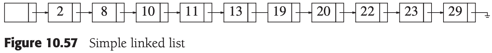

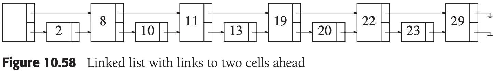


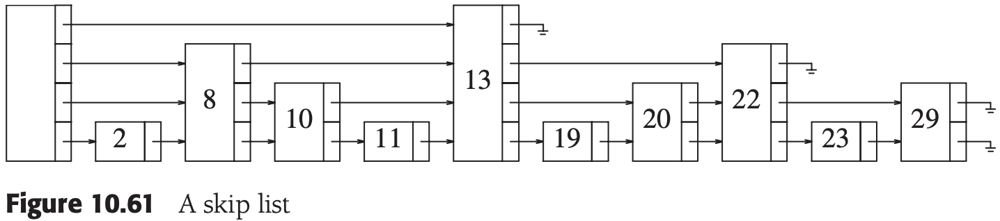


### Primality Testing

**Theorem 10.10 (Femat's Lesser Theorem)** If $P$ is prime, and $0 < A < P$, then $A^{P-1} \equiv 1(mod P)$.

**Proof** A proof of this theorem can be found in any textbook on number theory.

**Theorem 10.11** If $P$ is prime and $0 < X < P$, the only solutions to $x^2 \equiv 1 (mod\ P)$ are $X = 1, P - 1$.

**Proof** $X^2 \equiv 1(mod\ P)$ implies that $X^2 - 1 \equiv 0(mod\ P)$. This implies $(X - 1)(X + 1) \equiv 0(mod\ P)$. Since $P$ is prime, $0 < X < P$, and $P$ must divide either $(X-1)$ or $(X + 1)$, the theorem follows.

```c++
// 一种概率素性测试算法（伪代码）
HugeInt witness(const HugeInt &a, const HugeInt &i, const HugeInt &n)
{
    if (i == 0)
        return 1;
    
    HugeInt x = witness(a, i / 2, n);
    if (x == 0)
        return 0;
    
    HugeInt y = (x * x) % n;
    if (y == 1 && x != 1 && x != n - 1)
        return 0;
    
    if (i % 2 != 0)
        y = (a * y) % n;
    
    return y;
}

const int TRIALS = 5;

bool isPrime(const HugeInt &n)
{
    Random r;
    for (int counter = 0; counter < TRAILS; counter++)
        if (witness(r.randomInt(2, (int)n - 2), n - 1, n) != 1)
            return false;
    return true;
}
```


## Backtracking Algorithms

### The Turnpike Reconstruction Problem


```c++
// 公路收费点重建算法：驱动例程（伪代码）
bool turnpike(vector<int> &x, DistSet d, int n)
{
    x[1] = 0;
    d.deleteMax(x[n]);
    d.deleteMax(x[n - 1]);
    if (x[n] - x[n - 1] in d)
    {
        d.remove(x[n] - x[n - 1]);
        return place(x, d, n, 2, n - 2);
    }
    else
        return false;
}
```

### Games

TODO
