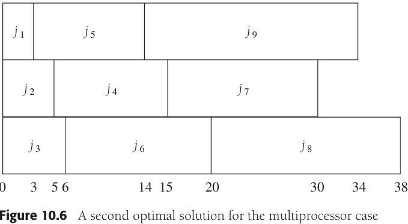
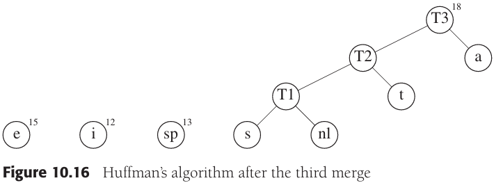
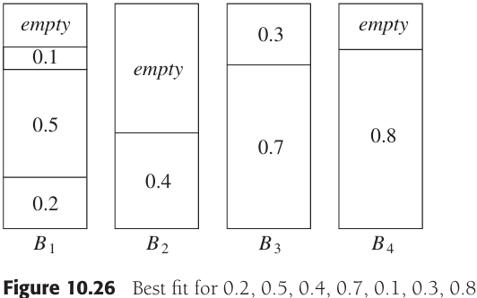

# 第十章 算法设计技巧

[TOC]

## 10.1 贪心算法

### 10.1.1 一个简单的调度问题

*作业和时间*

*1号调度*

*2号调度（最优）*

上图中2号调度是按照最短的作业最先进行来安排的，可以证明这将总会产生一个最优的调度：令调度表中的作业是$j_{i_1}, j_{i_2}, ..., j_{i_N}$，第一个作业以时间$t_{i_1}$完成，第二个作业在$t_{i_1} + t_{i_2}$后完成，而第三个作业在$t_{i_1} + t_{i_2} + t_{i_3}$后完成。由此可以看到，该调度的总值$C$为：

$C = \sum_{k=1}^{N}(N - k + 1)t_{i_k} \qquad \qquad \qquad \qquad (10-1)$

$C = (N+1)\sum_{k=1}^{N}t_{i_k} - \sum_{k=1}^{N}k \times t_{i_k} \qquad \quad (10-2)$

**多处理器的情形：**

设有作业$j_1, j_2, ..., j_N$，对应的运行时间分别为$t_1, t_2, ..., t_N$，另有处理器的个数$P$。不失一般性，假设作业是有序的，最短的最先运行。

作为一个例子，设$P=3$，作业如图所示：

*作业和时间*

*多处理器情形的一个最优解*

*多处理器情形的第二个最优解*

**将最后完成时间最小化：**

*将最后完成时间最小化*

### 10.1.2 赫夫曼编码

*使用一个标准编码方案*

*树中原始编码的表示*

*稍微好一些的树*

*最优前缀码的树*

*最优前缀码*

**赫夫曼算法**

`赫夫曼算法（Huffman algorithm）`：维护一个由树组成的森林。一棵树的权等于它的叶子的频率的和。任意选取最小权的两棵树T1和T2，并任意形成以T1和T2为子树的新树，将这样的过程进行C-1次。在算法的开始，存在C棵单结点树 -- 每个字符一棵。在算法结束时得到一棵树，这棵树就是最优赫夫曼编码树。

*赫夫曼算法的初始状态*

*第一次合并后的赫夫曼算法*

*第二次合并后的赫夫曼算法*

*第三次合并后的赫夫曼算法*

*第四次合并后的赫夫曼算法*

*第五次合并后的赫夫曼算法*

*最后一次合并后的赫夫曼算法*

### 10.1.3近似装箱问题

设给定$N$项物品，大小为$s_1, s_2, ..., s_N$，所有的大小都满足$o < s_i \leqslant 1$。问题是要把这些物品装到最少数量的箱子中去，已知每个箱子的容量是1个单位。

*对0.2, 0.5, 0.4, 0.7, 0.1, 0.3, 0.8的最优装箱*

**联机算法**

**定理10.1** 存在一些输入使得任意联机装箱算法至少使用最优箱子数的$\frac{4}{3}$。

**证明**        假设情况相反，为简单起见设$M$是偶数。考虑任一运行在上面的输入序列$I_1$上的联机算法A。注意，该序列由$M$个小项后接$M$个大项组成。设$A$已经用了$b$个箱子。此时，箱子的最优个数是$M/2$，因为可以在每个箱子里放入两件物品。根据好于$\frac{4}{3}$的性能保证的假设，得知$2b/M < \frac{4}{3}$。

​                在$b$个箱子之后开辟的所有箱子中每箱恰好包含一项物品，因为所有小物品都被放在了前$b$个箱子中，而两个大项物品又装不进一个箱子中。由于前$b$个箱子每箱最多有两项物品，而其余的箱子每箱都有一项物品，因此我们看到，将$2M$项物品装箱将至少需要$2M-b$个箱子。但$2M$项物品可以用$M$个箱子最优装箱，因此性能保证可以确保得到$(2M-b)/M < \frac{4}{3}$。

​                第一个不等式意味着$b/M < \frac{2}{3}$，而第二个不等式意味着$b/M > \frac{2}{3}$，这是矛盾的。因此，没有能够保证使用小于$\frac{4}{3}$的最优装箱数完成装箱的联机算法。

**下项适配**

`下项适配算法`当处理任何一项物品时，我们都要检查看它是否还能装进刚刚装进物品的那个箱子中去。如果能够装进去，那么就把它放入该箱中；否则，开辟一个新的箱子。

*对0.2, 0.5, 0.4, 0.7, 0.1, 0.3, 0.8的下项适配算法*

**定理10.2** 令$M$是将一批物品$I$装箱所需的最优装箱数，则下项适配算法所用的箱子数决不超过$2M$个。存在一些序列使得下项适配算法用箱$2M-2$个。

**证明**         考虑任何相邻的两个箱子$B_j$和$B_{j+1}$。$B_j$和$B_{j+1}$中所有物品的大小之和必然大于1，否则这些物品就会全部放入$B_j$中。如果将该结果用于所有相邻的两个箱子，那么可以看到，最多有一半的空间闲置。因此，下项适配算法最多使用两倍的最优箱子数。

*对0.5, 2/N, 0.5, 2/N, 0.5, 2/N, ...的最优装箱方法*

*对0.5, 2/N, 0.5, 2/N, 0.5, 2/N, ...的下项适配装箱法*

**首次适配**

`首次适配（first fit）`依序扫描这些箱子并把一项新的物品放入足够能盛下它的第一个箱子中。因此，只有前面放置物品的箱子已经容不下当前物品的时候，才开辟一个新箱子。

*对0.2, 0.5, 0.4, 0.7, 0.1, 0.3, 0.8的首次适配装箱*

**定理10.3** 令$M$是将一批$I$个物品装箱所需要的最优箱子数，则首次适配算法使用的箱子数决不多于$\lceil \frac{17}{10}M \rceil$。存在使得首次适配算法使用$\lceil \frac{17}{10}(M-1) \rceil$个箱子的序列。

**证明**        略。

*首次适配算法使用$10M$个而不是$6M$个箱子的情形*

**最佳适配**

`最佳适配（best fit）算法`把一项新物品放到所有能够容纳它的箱子里最满的一个中。

*对0.2, 0.5, 0.4, 0.7, 0.1, 0.3, 0.8的最佳适配算法*

**脱机算法**

`首次适配递减（first fit decreasing）`又叫做首次适配非增（first fit nonincreasing）算法，对联机算法的改进，把最大的物品放在最先。

*对0.8, 0.7, 0.5, 0.4, 0.3, 0.2, 0.1的首次适配算法*

**引理10.1** 令$N$项物品的输入大小（以递减顺序排序）分别为$s_1, s_2, ..., s_N$，并设最优装箱法使用$M$个箱子。那么，首次适配递减算法放到$M$个箱子之外的其余箱子中的所有物品的大小最多为$\frac{1}{3}$。

TODO

