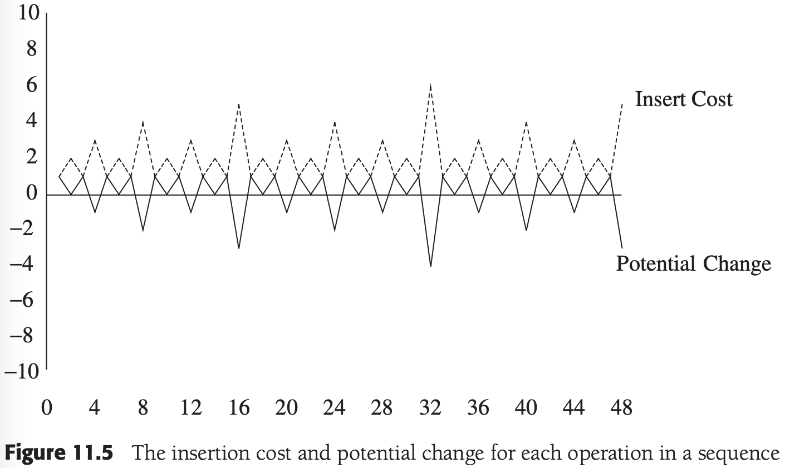
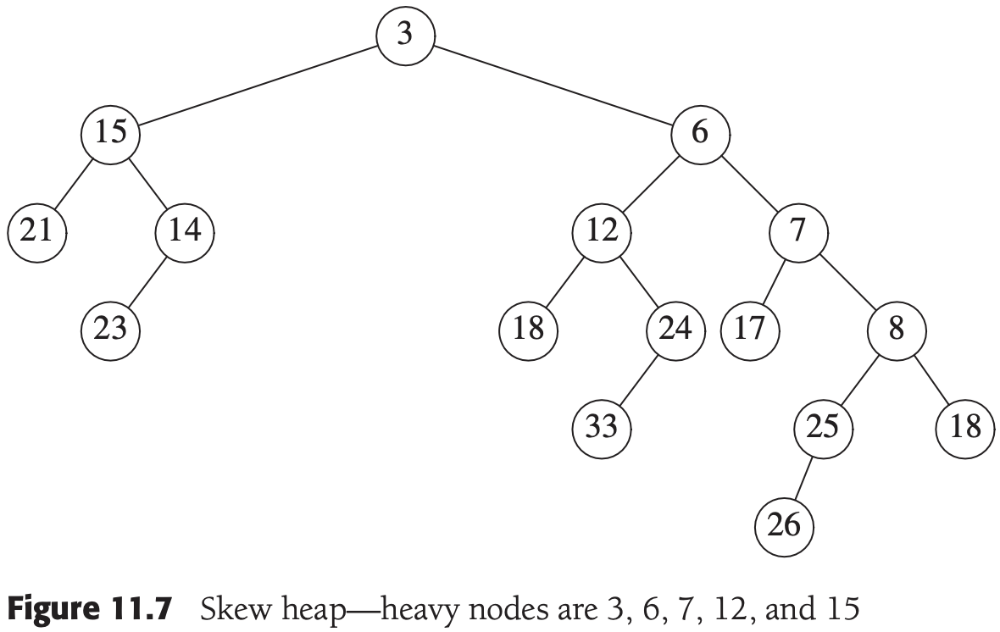
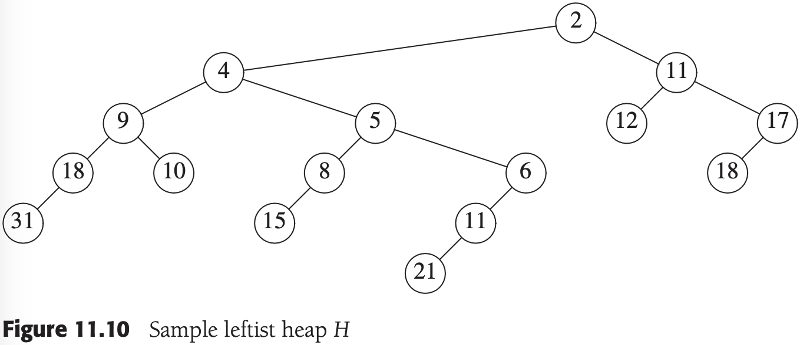
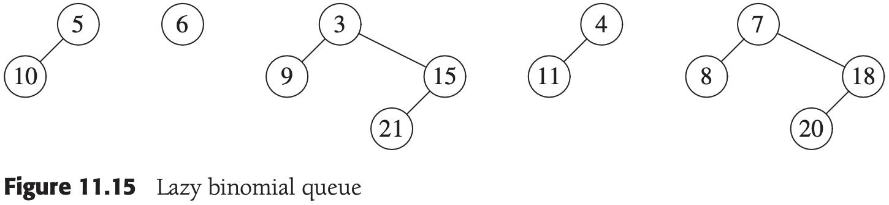
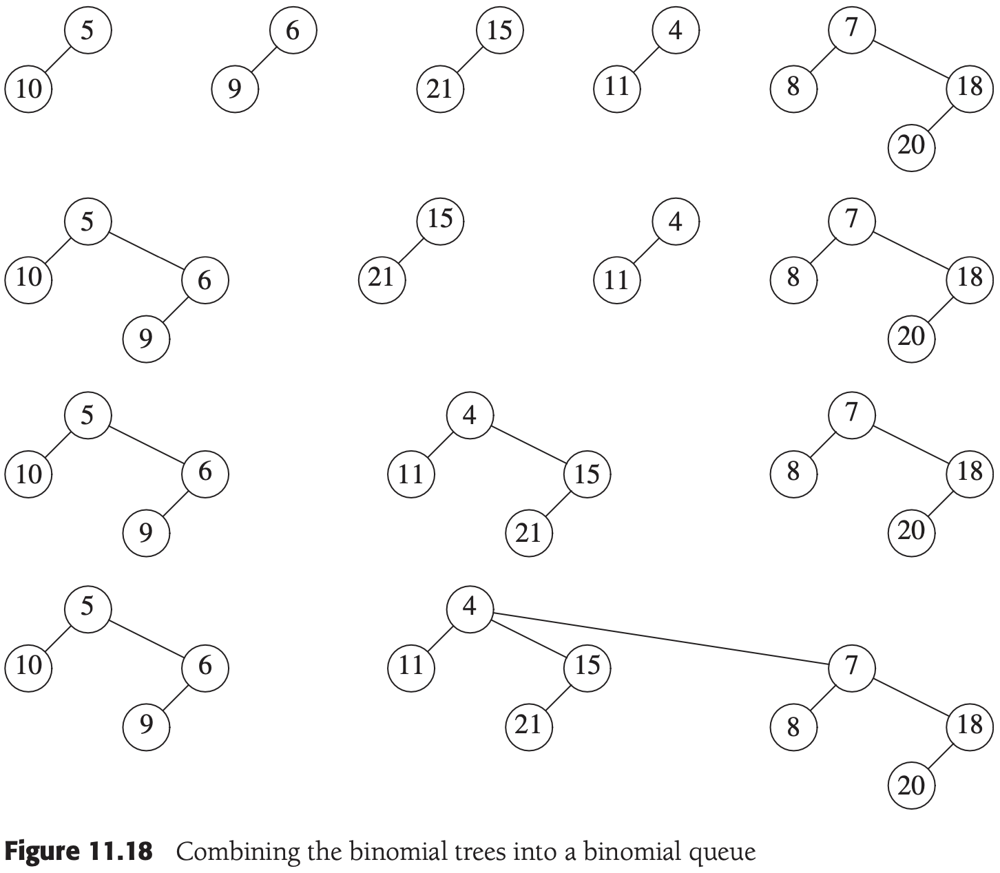
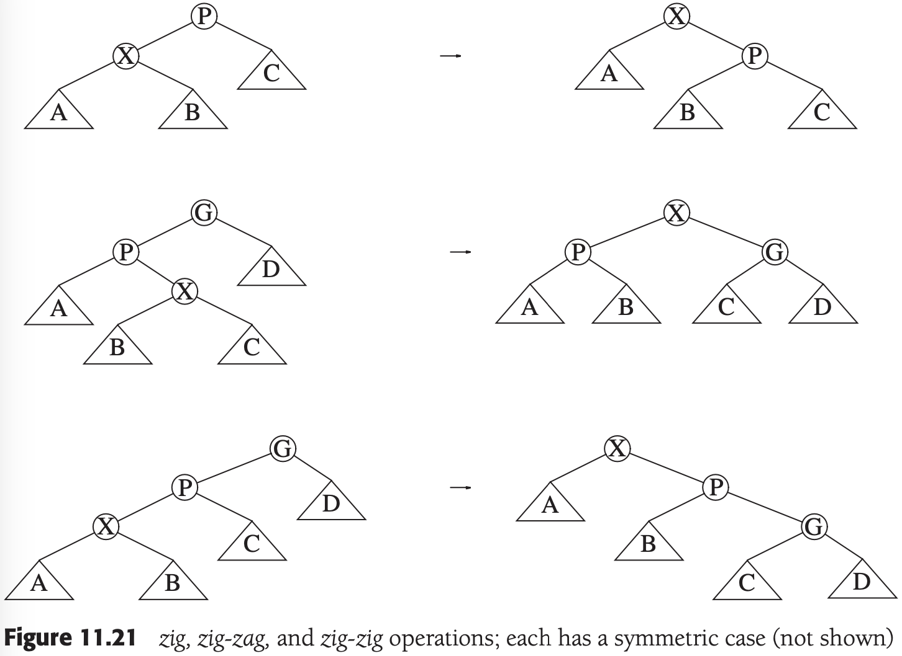
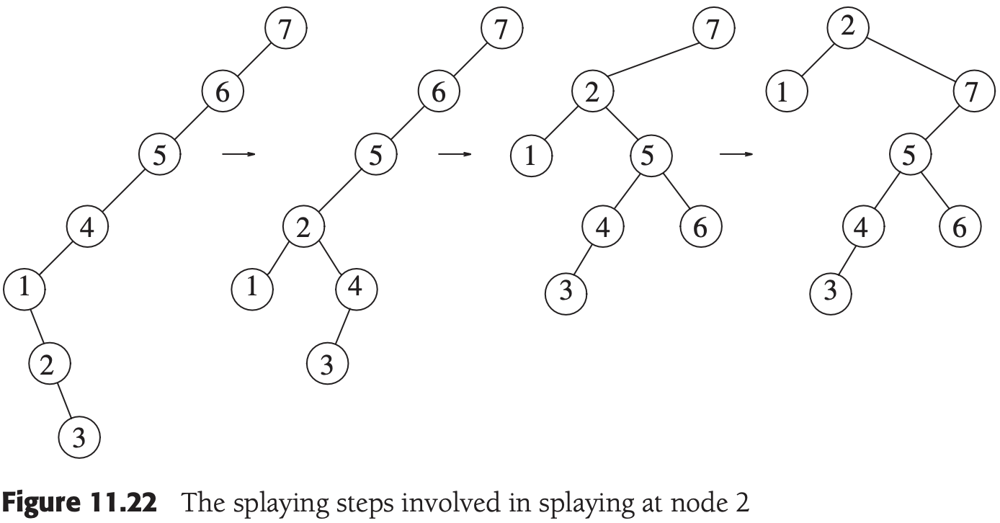

# CHAPTER 11 Amortized Analysis

[TOC]

## An Unrelated Puzzle

Sometimes, it is easier to solve a problem indirectly than directly. The amortized analyses that we will perform will use this idea. We will introduce an extra variable, known as the **potential**, to allow us to prove results that seem very difficult to establish otherwise.

## Binomial Queues

**Claim** A binomial queue of $N$ elements can be built by $N$ successive insertions in $O(N)$.

**Proof** Let $C_i$ be the cost of the $i$th insertion. Let $T_i$ be the number of trees `after` the $i$th insertion. $T_0 = 0$ is the number of trees initially. Then we have the invariant:

$C_i + (T_i - T_{i-1}) = 2 \qquad \qquad (11-1)$

, We then have:

$C_1 + (T_1 - T_0) = 2$

$C_2 + (T_2 - T_1) = 2$

$\vdots$

$C_{N-1} + (T_{N-1} - T_{N-2}) = 2$

$C_{N} + (T_{N} - T_{N-1}) = 2$

, If we add all these equations, most of the $T_i$ terms cancel, leaving:

$\sum_{i=1}^{N}C_i + T_N - T_0 = 2N$

, or equivalently:

$\sum_{i-1}^{N}C_i = 2N - (T_N - T_0)$

, Recall that $T_0 = 0$, and $T_N$, the number of trees after the $N$ insertions, is certainly not negative, so $(T_N - T_0)$ is not negative. Thus:

$\sum_{i=1}^{N} C_i \leqslant 2N$

, which proves the claim.

Once a potential function is chosen, we write the main equation:
$$
T_{actual} + \Delta\text{Potential} = T_{amortized}
$$
, $T_{actual}$, the actual time of an operation, represents the exact (observed) amount of time required to execute a particular operation.

The potential function should:

- Always assume its minimum at the start of the sequence. A popular method of choosing potential functions is to ensure that the potential function is initially 0 and always nonnegative. All the example that we will encounter use this strategy.

- Cancel a term in the actual time. In our case, if the actual cost was $c$, then the potential change was $2 - c$. When these are added, an amortized cost of 2 is obtained. This is shown in Figure 11.5:

  

**Theorem 11.1** The amortized running times of `insert`, `deleteMin`, and `merge` are $O(1)$, $O(log\ N)$, and $O(log\ N)$, respectively, for binomial queues.

## Skew Heaps

**Definition** A node, $p$, is **heavy** if the number of descendants of $p$'s right subtree is at least half of the number of descendants of $p$, and **light** otherwise. Note that the number of descendants of a node includes the node itself.

**Theorem 11.2** The amortized time to merge two skew heaps is $O(log\ N)$.

## Fibonacci Heaps

The **Fibonacci heap** is a data structure that supports all the basic heap operations in $O(1)$ amortized time, with the exception of `deleteMin` and `remove`, which take $O(log\ N)$ amortized time. It imediately follows that the heap operations in Dijkstra's algorithm will require a total of $O(|E|+|V|log|V|)$ time.

Fibonacci heaps generalize binomial queues by adding two new concepts:

- A `different implementation of` decreaseKey: The method we have seen before is to percolate the element up toward the root. It does not seem reasonable to expect an $O(1)$ amortized bound for this strategy, so a new method is needed.
- `Lazy merging`: Two heaps are merged only when it is required to do so. This is similar to lazy deletion.

### Cutting Nodes in Leftist Heaps

### Lazy Merging for Binomial Queues

**Theorem 11.3** The amortized running times of `merge` and `insert` are both $O(1)$ for lazy binomial queues. The amortized running time of `deleteMin` is $O(log\ N)$.

### The Fibonacci Heap Operations

In order to ensure that $R=O(logN)$, we apply the following rules to all non-root nodes:

- Mark a (non-root) node the first time that it loses a child (because of a cut).
- If a marked node loses another child, then cut it from its parent. This node now becomes the root of a separate tree and is no longer marked. This is called a **cascading cut**, because several of these could occur in one `decreaseKey` operation.

### Proof of the Time Bound

**Lemma 11.1** Let $X$ be any node in a Fibonacci heap. Let $c_i$ be the $i$th oldest child of $X$. Then the rank of $c_i$ is at least $i - 2$.

**Lemma 11.2** Let $F_k$ be the Fibonacci numbers defined by $F_0 = 1, F_1 = 1$, and $F_k = F_{k - 1} + F_{k - 2}$. Any node of rank $R \geq 1$ has at least $F_{R + 1}$ descendants (including itself).

**Lemma 11.3** The rank of any node in a Fibonacci heap is $O(log\ N)$.

**Theorem 11.4** The amortized time bounds for Fibonacci heaps are $O(1)$ for `insert`, `merge`, and `decreaseKey` and $O(log\ N)$ for `deleteMin`.

## Splay Trees

**Lemma 11.4** If $a + b \leq c$, and $a$ and $b$ are both positive integers, then $loga + logb \leq 2log\ c - 2$.

**Theorem 11.5** The amortized time to splay a tree with root $T$ at node $X$ is at most $3(R(T) - R(X)) + 1 = O(logN)$.

