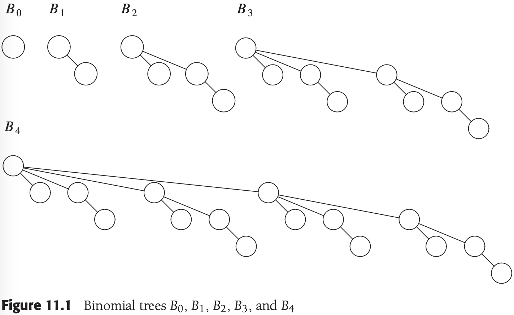
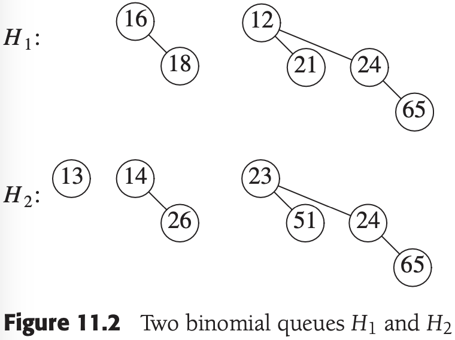
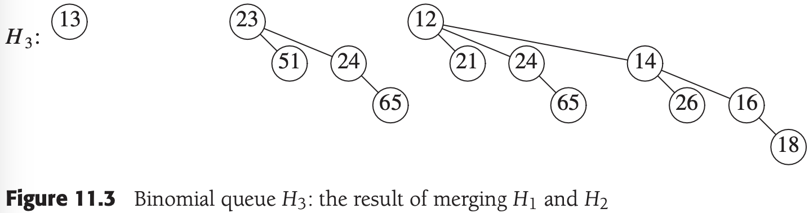
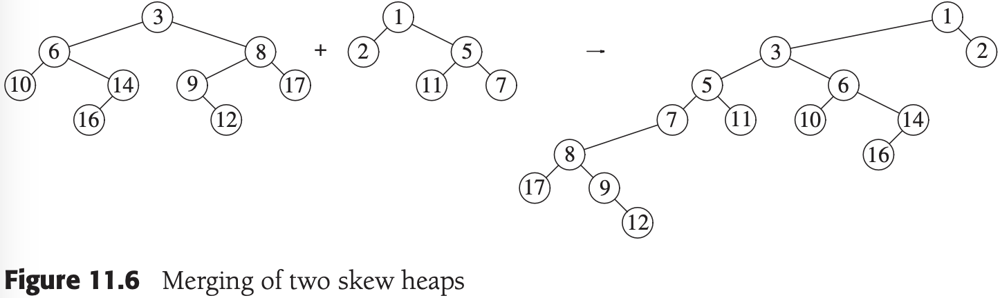
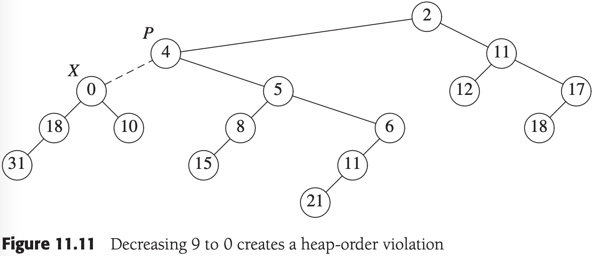
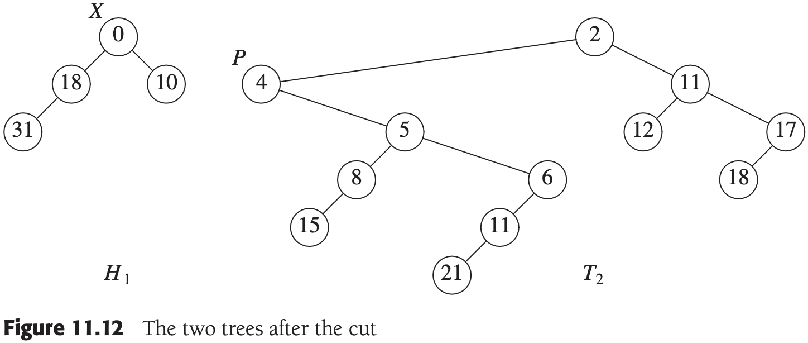
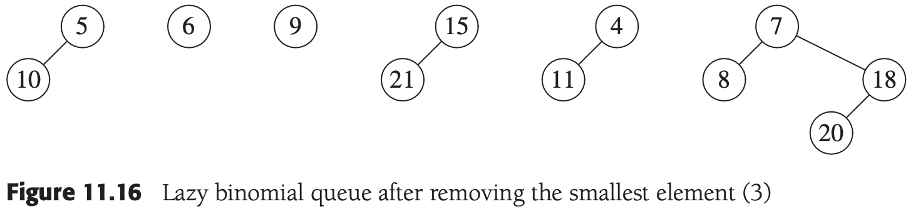
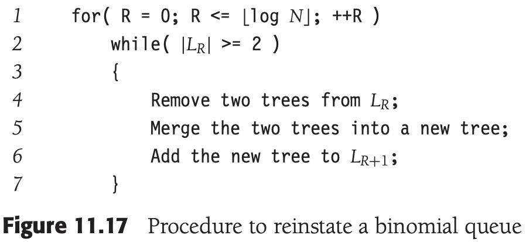
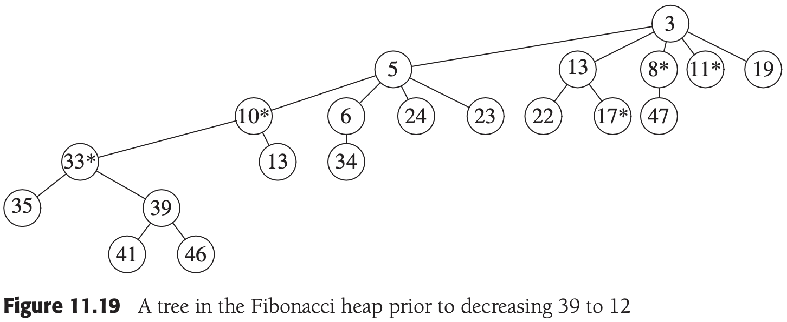
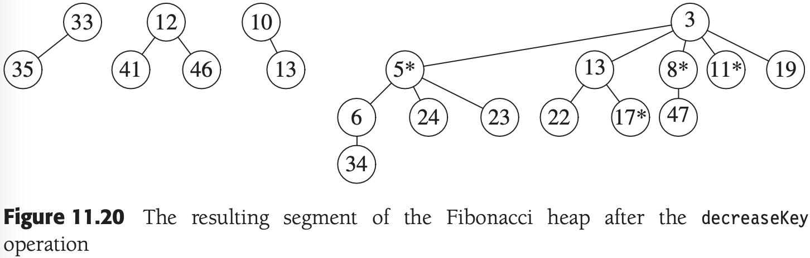

# 第十一章 摊还分析

[TOC]

## 11.1 一个无关的智力问题

有时候间接求解要比直接求解容易。摊还分析将用到这个思路。我们将引入一个附加变量，叫做位势（potential），有了它可以证明以前很难证明的一些结果。

## 二项队列

*二项树$B_0$, $B_1$, $B_2$, $B_3$和$B_4$*

*两个二项队列$H_1$和$H_2$*

*二项队列$H_3$：合并$H_1$和$H_2$的结果*

**断言** $N$个元素的二项队列可以通过$N$次相继插入而以时间$O(N)$建成。

**证明** 令$C_i$是第$i$次插入的代价，$T_i$位第$i$次插入之后树的棵数，$T_0 = 0$为树的初始棵数。此时得到不变式：

$C_i + (T_i - T_{i-1}) = 2 \qquad \qquad (11-1)$

于是有：

$C_1 + (T_1 - T_0) = 2$

$C_2 + (T_2 - T_1) = 2$

$\vdots$

$C_{N-1} + (T_{N-1} - T_{N-2}) = 2$

$C_{N} + (T_{N} - T_{N-1}) = 2$

把所有这些方程加起来，则大部分的$T_i$项被消去，最后剩下：

$\sum_{i=1}^{N}C_i + T_N - T_0 = 2N$

或等价地，

$\sum_{i-1}^{N}C_i = 2N - (T_N - T_0)$

考虑到$T_0 = 0$以及$N$次插入后树的棵数$T_N$确实非负，因此$(T_N - T_0)$非负。于是：

$\sum_{i=1}^{N} C_i \leqslant 2N$

断言得证。

*连续$N$次insert*

一旦选定位势函数，就可写出主要的方程：

$T_{actual} + \Delta 位势 = T_{amortized} \qquad \qquad (11-2)$

- $T_{actual}$ 一次操作的实际时间，代表执行一次特定操作需要的精确时间量。

位势函数性质：

- 总假设它的最小值位于操作序列的开始处。选择位势函数的一种常用方法是保证位势函数初始值为0，而且总是非负的。

- 消去实际时间中的一项，如图所示：

  

  *在一系列操作中插入的开销和每一次操作的位势变化*

**定理11.1** insert, deleteMin以及merge对于二项队列的摊还运行时间分别是$O(1)$，$O(logN)$和$O(logN)$。

**证明**        位势函数是树的棵数。初始的位势函数为0，且位势总是非负的，因此摊还时间是实际时间的一个上界。对insert的分析从上面的论证可以得到。对于merge1，假设两棵树分别有$N_1$和$N_2$个结点以及对应的$T_1$和$T_2$棵树，令$N = N_1 + N_2$，执行合并的实际时间为$O(log(N_1) + log(N_2)) = O(logN)$。在合并之后，最多可能存在$logN$棵树，因此位势最多可以增加$O(logN)$，这就给出一个摊还的界$O(logN)$。deleteMin操作的界可用类似的方法得到。

## 11.3 斜堆

*合并两个斜堆*

**定义** 对于一个结点$p$，如果其右子树的后裔数至少是该$p$的后裔总数的一半，则称结点$p$是重的，否则称之为轻的。注意，一个结点的后裔个数包括该结点本身。

*斜堆 -- 重结点是3，6，7，12和15*

**定理11.2** 合并两个斜堆的摊还时间为$O(logN)$。

**证明**        令$H_1$和$H_2$为两个堆，分别具有$N_1$和$N_2$个结点。设$H_1$的右路径有$l_1$个轻结点和$h_1$个重结点，共有$l_1 + h_1$个结点。同样，$H_2$在其右路径上有$l_2$个轻结点和$h_2$个重结点，共有$l_2 + h_2$个结点。

*合并后重/轻状态的变化*

## 11.4 斐波那契堆

`斐波那契堆（Fibonacci heap）`是以$O(1)$摊还时间支持所有基本的堆操作的一种数据结构，但deleteMin和delete除外，它们花费$O(logN)$的摊还时间。立即得出，在Dijkstra算法中的那些堆操作将总共需要$O(|E|+|V|log|V|)$的时间。

斐波那契堆通过添加下面两个观念推广了二项队列：

- decreaseKey的一种不同的实现方法：我们以前看到的方法是把元素朝向根结点上滤。对于这种方法似乎没有理由期望$O(1)$的摊还时间界，因此需要一种新的方法。
- `懒惰合并（lazy merging）`：只有两个堆需要合并时才进行合并，这类似于懒惰删除。

### 11.4.1 切除左式堆中的结点

*通过上滤将$N-1$递减到0花费$\theta(N)$时间*

*样本左式堆$H$*

*将9降到0引起堆序的破坏*

*切断之后得到的两棵树*

*将$T_2$转变成左式堆$H_2$后的情形*

*童工合并$H_1$和$H_2$来完成操作$decreaseKey(X, 9)$*

### 11.4.2 二项队列的懒惰合并

*懒惰的二项队列*

*删除最小元素（3）后的懒惰二项队列*

*恢复二项队列的过程*

*把一些二项树合并成一个二项队列*

**定理11.3** merge和insert的摊还运行时间对于懒惰二项队列均为$O(1)$；deleteMin的摊还运行时间为$O(logN)$。

**证明** 这里的位势函数为二项队列集合中树的棵数。初始的位势为0，而且位势总是非负的。因此，经过一系列的操作之后，总的摊还时间是总的实际时间的一个上界。

### 11.4.3 斐波那契堆操作

由于在懒惰二项队列中deleteMin的摊还时间已被证明是$2logN + R$，为使deleteMin的界成立需要$R=O(logN)$成立，对所有的非根结点应用如下规则：

- 将第一次（因为切除而）失去一个儿子的（非根）结点做上标记。
- 如果被标记的结点又失去另外一个儿子结点，那么将其从它的父结点切除；这个结点现在变成了一棵分离的树的根并且不再被标记。

*将39减成12之前斐波那契堆中的一棵树*

*在decreaseKey操作之后斐波那契堆的结果*

### 11.4.4 时间界的证明

**引理11.1** 令$X$是斐波那契堆中的任一结点，$c_i$为$X$的第$i$个最年轻的儿子，则$c_i$的秩至少是$i-2$。

**证明**        在$c_i$被链接到$X$上的时候，$X$已经有（年长的）儿子$c_1, c_2, ..., c_{i-1}$。于是，当连接到$c_i$时$X$至少有$i-1$个儿子。由于只有当结点有相同的秩的时候它们才链接，由此可知在$c_i$被链接到$X$上的时候$c_i$至少也有$i-1$个儿子。从这时起，它可能至多失去一个儿子，否则它就已经被从$X$切除。因此，$c_i$至少有$i-2$个儿子。

**引理11.2** 令$F_k$是由$F_0 = 1, F_1 = 1$以及$F_k = F_{k-1} + F_{k-2}$定义的斐波那契数。秩为$R \geqslant 1$的任意结点至少有$F_{R+1}$个后裔（包括它自身）。

**证明**        令$S_R$是秩为$R$的最小的树。显然，$S_0 = 1$和$S_1 = 2$。根据引理11.1，一棵秩为$R$的树必然含有秩至少为$R-2, R-3, ..., 1$和$0$的子树，再加上另一棵至少有一个结点的子树。连同$S_R$的根本身一起，这就给出$S_R \approx 2 + \sum_{i=0}^{R-2} S_i(S_R > 1)$的一个最小值。容易证明，$S_r = F_{R+1}$。

**引理11.3** 斐波那契堆中任意结点的秩为$O(logN)$。

**证明**        直接从上面的讨论得出。

**定理11.4** 斐波那契堆对于insert, merge和decreaseKey的摊还时间界均为$O(1)$，而对于deleteMin则是$O(logN)$。

**证明**        位势是斐波那契堆的集合中树的棵数加上两倍的标记结点数。初始的位势为0并且总是非负的。于是，经过一系列操作之后，总的摊还时间则是总的实际时间的一个上界。

​                对于merge操作：实际时间为常数，而树和标记结点的数目是不变的，因此根据公式（11.2），摊还时间为$O(1)$。

​                对于insert操作：实际时间是常数，树的棵数增加1，而标记结点的个数不变。因此，位势最多增加1，所以摊还时间也是$O(1)$。

​                对于deleteMin操作：令$R$为包含最小元素的树的秩，并令$T$是操作前树的棵树。为执行一次deleteMin，我们再一次将树的儿子分离，得到另外$R$棵新的树。这$R$棵新树，和其余$T$棵树一起，现在必须合并，根据引理11.3其开销为$T + R + logN = T + O(logN)$。由于最多有$O(logN)$棵树，而标记结点的个数又不可能增加，因此位势的变化最多是$O(logN) - T$。将实际时间和位势的变化加起来则得到deleteMin的$O(logN)$摊还时间界。

​                对于decreaseKey操作：令$C$为级联切除的次数。decreaseKey的实际花费为$C+1$，它是所执行的切除的总数。第一期（非级联）切除创建一棵新树从而使位势增1。每次级联切除都建立一棵新树，但却把一个标记结点转变成未标记的（根结点），合计每次级联切除有一个单位的净损失。最后一次切除也把一个未标记结点转变成标记结点，这就使得位势增加2。因此，位势总的变化最多是$3-C$。把实际时间和位势变化加起来则得到总和为4，即$O(1)$。

## 11.5 伸展树

*单旋转，之字形和一字形旋转操作：每个都有一个对称的情形（未示出）*

**引理11.4** 如果$a + b \leqslant c$，且$a$和$b$均为正整数，那么$loga + logb \leqslant 2logc - 2$。

**证明**        根据算术-几何平均不等式：$\sqrt{ab} \leqslant (a + b) / 2$。于是$\sqrt{ab} \leqslant c/2$，两边平方得到$ab \leqslant c^2/4$，两边再取对数，则定理得证。

**引理11.5** 在结点$X$伸展一棵根为$T$的树的摊还时间最多为$3(R(T) - R(X)) + 1 = O(logN)$。

**证明**        略

*在结点2的伸展中涉及的伸展步骤*

