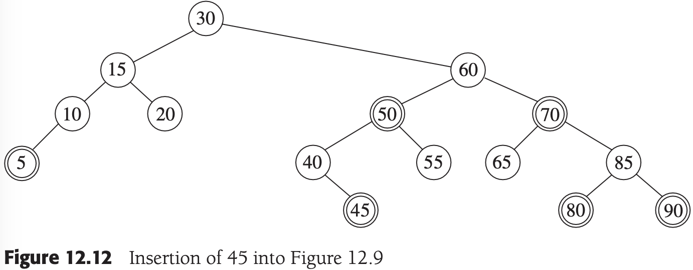

# 第12章 高级数据结构及其实现

[TOC]


## 12.1 自顶向下伸展树


*自顶向下伸展旋转：单旋转，一字形旋转和之字形旋转*


*简化的自顶向下的之字形旋转*


*自顶向下伸展的最后整型*


*自顶向下伸展的各步（访问上面树中的19）*

例，伸展树，类接口，构造函数和析构函数：

```c++
template <typename Comparable>
class SplayTree
{
public:
    SplayTree() 
    {
        nullNode = new BinaryNode;
        nullNode->left = nullNode->right = nullNode;
        root = nullNode;
    }
    ~SplayTree() 
    {
        makeEmpty();
        delete nullNode;
    }
    SplayTree(const SplayTree& rhs);
    const SplayTree& operator=(const SplayTree& rhs);

private:
    struct BinaryNode {};

    BinaryNode *root;
    BinaryNode *nullNode;

    void rotateWithLeftChild(BinaryNode * & k2);
    void rotateWithRightChild(BinaryNode * & k1);
    void splay(const Comparable& x, BinaryNode * & t) 
    {
        BinaryNode *leftTreeMax, *rightTreeMin;
        static BinaryNode header;

        header.left = header.right = nullNode;
        leftTreeMax = rightTreeMin = &header;

        nullNode->element = x;

        for (; ;)
            if (x < t->left->element) 
            {
                if (x < t->left->element) 
                    rotateWithLeftChild(t);
                if (t->left == nullNode)
                    break;
                // Link Right
                rightTreeMin->left = t;
                rightTreeMin = t;
                t = t->left;
            }
            else if (t->element < x) 
            {
                if (t->right->element < x)
                    rotateWithRightChild(t);
                if (t->right == nullNode)
                    break;
                // Link Left
                leftTreeMax->right = t;
                leftTreeMax = t;
                t = t->right;
            }
            else
                break;

        leftTreeMax->right = t->left;
        rightTreeMin->left = t->right;
        t->left = header.right;
        t->right = header.left;
    };

    void insert(const Comparable& x) 
    {
        static BinaryNode *newNode = NULL;
        if (newNode == NULL)
            newNode = new BinaryNode;
        newNode->element = x;

        if (root == nullNode) 
        {
            newNode->left = newNode->right = nullNode;
            root = newNode;
        } 
        else 
        {
            splay(x, root);
            if (x < root->element) 
            {
                newNode->left = root->left;
                newNode->right = root;
                root->left = nullNode;
                root = newNode;
            } 
            else 
            {
                if (root->element < x) 
                {
                    newNode->right = root->right;
                    newNode->left = root;
                    root->right = nullNode;
                    root = newNode;
                } 
                else
                    return; 
            }
            newNode = NULL;
        }
    }
};
```


## 12.2 红黑树

红黑树是具有下列性质的二叉查找树：

1. 每一个结点或者红色，或者黑色；
2. 根是黑色的；
3. 如果一个结点是红色的，那么它的子结点必须是黑色的；
4. 从一个结点到一个NULL指针的每一条路径都必须包含相同数目的黑色结点。


*红黑树的例子（插入序列为：10, 85, 15, 70, 20, 60, 30, 50, 65, 80, 90, 40, 5, 55）*

例，自顶向下的删除过程和makeEmpty：

```c++
void remove(const Comparable& x)
{
    BinaryNode *newTree;
    splay(x, root);
    if (root->element != x)
        return;
    if (root->left == nullNode)
        newTree = root->right;
    else
    {
        newTree = root->left;
        splay(x, newTree);
        newTree->right = root->right;
    }
    delete root;
    root = newTree;
}

void makeEmpty()
{
    while(!isEmpty())
    {
        findMax();
        remove(root->element);
    }
}
```

### 12.2.1 自底向上插入


*如果S是黑色的，则单旋转和之字形旋转有效*

### 12.2.2 自顶向下红黑树


*颜色翻转：只有当X的父节点是红色的时候才继续旋转*



*将45插入到上图（红黑树的例子）中的树上*

### 12.2.3 自顶向下删除


*当X是一个左儿子并有两个黑色的儿子时的三种情形*


## 确定性跳跃表

**定义** 两个元素称为是`链接的（linked）`，如果至少存在一个链从一个元素指向另一个元素。

**定义** 两个在高度$h$链接的元素间的`间隙容量（gap size）`等于它们之间高度为$h - 1$的元素的个数。


*一个1-2-3确定性跳跃表*


*插入27：首先，通过提升25将含3个高度2的结点的间隙分裂*


*插入27：其次，通过提升35将含3个高度1的结点的间隙分裂*


*插入27：最后，将27作为高度1的结点插入*


*1-2-3确定性跳跃表的链表实现*


*1-2-3确定性跳跃表的水平数组实现*

跳表的优点：

- 跳表比红黑树占用的存储资源更少。

```c++
template <typename Comparable>
class DSL
{
public:
    explicit DSL(const Comparable &inf) : INFINITY(inf)
    {
        bottom = new SkipNode();
        bottom->right = bottom->down = bottom;
        tail = new SkipNode(INFINITY);
        tail->right = tail;
        header = new SkipNode(INFINITY, tail, bottom);
    }

    bool contains(const Comparable &x) const;
    void insert(const Comparable &x);

private:
    struct SkipNode
    {
        Comparable element;
        SkipNode   *right;
        SkipNode   *down;

        SkipNode(const Comparable &theElement = Comparable(),
                 SkipNode *rt = NULL, SkipNode *dt = NULL)
            : element(theElement), right(rt), down(dt) {}
    };

    Comparable INFINITY;
    SkipNode   *header;
    SkipNode   *bottom;
    SkipNode   *tail;
};

template <typename Comparable>
bool DSL<Comparable>::contains(const Comparable &x) const
{
    SkipNode *current = header;

    bottom->element = x;
    for (; ;)
        if (x < current->element)
            current = current->down;
        else if (current->element < x)
            current = current->right;
        else
            return current != bottom;
}

template <typename Comparable>
void DSL<Comparable>::insert(const Comparable &x)
{
    SkipNode *current = header;
    bottom->element = x;
    while (current != bottom)
    {
        while (current->element < x)
            current = current->right;

        if (current->down->right->right->element < current->element)
        {
            current->right = new SkipNode(current->element, current->right, 
                currernt->down->right->right);
            current->element = current->down->right->element;
        }
        else
            current = current->down;
    }

    if (header->right != tail)
        header = new SkipNode(INFINITY, tail, header);
}
```


## 12.4 AA树

`二叉B树（binary B-tree）`又称为BB树，是带有一个附加条件的红黑树：一个结点最多有一个红色的儿子。

```c++
public:
	AATree()
    {
        nullNode = new AANode;
        nullNode->left = nullNode->right = nullNode;
        nullNode->level = 0;
        root = nullNode;
    }

private:
	struct AANode
    {
        Comparable element;
        AANode     *left;
        AANode     *right;
        int        level;
        
        AANode() : left(NULL), right(NULL), level(1) {}
        AANode(const Comparable &e, AANode *lt, AANode *rt, int lv = 1)
            : element(e), left(lt), right(rt), level(lv) {}
    };
```

`水平链接（horizontal link）`是一个结点与同层次上的儿子之间的连接；这种结构需求使得水平连接是右链接，并且不可能有两个连续的水平链接。


*插入10，85，15，70，20，60，30，50，65，80，90，40，5，55，35后得到的一棵AA树*


*skew和split。注意R的层次在一次split中增加*

```c++
void skew(AANode * & t)
{
    if (t->left->level == t->level)
        rotateWithLeftChild(t);
}
void split(AANode * & t)
{
    if (t->right->right->level == t->level)
    {
        rotateWithRightChild(t);
        t->level++;
    }
}
```


*在将45插入到示例树中以后*


在35处进行split之后*


*在50处进行skew之后*


*在40处进行split之后*


*在70处进行skew和在30处进行split后得到的树*


*当1被删除时，引入水平左链接，所有结点的层次变成1.使所有的链接指向右侧是通过三次调用skew来完成的。通过两次调用split移去水平链接*


## 12.5 treap树

```c++
template <typename Comparable>
class Treap
{
public:
    Treap()
    {
        nullNode = new TreapNode;
        nullNode->left = nullNode->right = nullNode;
        nullNode->priority = INT_MAX;
        root = nullNode;
    }
    Treap(const Treap &rhs);
    ~Treap();

    void insert(const Comparable &x, TreapNode *&t);

private:
    struct TreapNode
    {
        Comparable element;
        TreapNode  *left;
        TreapNode  *right;
        int        priority;

        TreapNode() : left(NULL), right(NULL), priority(INT_MAX) {}
        TreapNode(const Comparable &e, TreapNode *lt, TreapNode *rt, int pr)
            : element(e), left(lt), right(rt), priority(pr) {}
    };

    TreapNode *root;
    TreapNode *nullNode;
    Random randomNums;
};

template <typename Comparable>
void Treap<Comparable>::insert(const Comparable &x, TreapNode *&t)
{
    if (t == nullNode)
        t = new TreapNode(x, nullNode, nullNode, randomNums.randomInt());
    else if (x < t->element)
    {
        insert(x, t->left);
        if (t->left->priority < t->priority)
            rotateWithLeftChild(t);
    }
    else if (t->element < x)
    {
        insert(x, t->right);
        if (t->right->priority < t->priority)
            rotateWithRightChild(t);
    }
}

template <typename Comparable>
void Treap<Comparable>::remove(const Comparable &x, TreapNode *&t)
{
    if (t != nullNode)
    {
        if (x < t->element)
            remove(x, t->left);
        else if(t->element < x)
            remove(x, t->right);
        else
        {
            if (t->left->priority < t->right->priority)
                rotateWithRightChild(t);
            else
                rotateWithRightChild(t);

            if (t != nullNode)
                remove(x, t);
            else
            {
                delete t->left;
                t->left = nullNode;
            }
        }
    }
}
```


## 12.6 k-d树

`二位查找树(two-dimensional search tree)`具有简单的性质：在奇数层上的分支按照第一个键进行，而在偶数层上的分支按照第二个键进行。


*2-d树示例*

例，2-d树的插入：

```c++
public:
	void insert(const vector<Comparable> &x)
    {
        insert(x, root, 0);
    }
private:
	void insert(const vector<Comparable> &x, kdNode *&t, int level)
    {
        if (t == NULL)
            t = new KdNode(x);
        elsea if(x[level] < t->data[level])
            insert(x, t->left, 1 - level);
        else
            insert(x, t->right, 1 - level);
    }
```

例，2-d树的范围查找：

```c++
public:
	void printRange(const vector<Comparable> &low, 
                    const vector<Comparable> &high) const
    {
        printRange(low, high, root, 0);
    }
private:
	void printRange(const vector<Comparable> &low, 
                    const vector<Comparable> &high, KdNode *t, int level) const
    {
        if (t != NULL)
        {
            if (low[0] <= t->data[0] && high[0] >= t->data[0] &&
                low[1] <= t->data[1] && high[1] >= t->data[1])
                cout << "(" <, t->data[0] << "," << t->data[1] << ")" << endl;
            if (low[level] <= t->data[level])
                printRange(low, high, t->left, 1 - level);
            if (high[level] >= t->data[level])
                printRange(low, high, t->right, 1 - level);
        }
    }
```

对于理想平衡树，一次范围查询的最坏情形运行时间为$O(M + kN^{1-1/k})$。在随机构造的k-d树中，涉及$k$个键中的$p$个键的部分匹配查询花费$O(M+N^{\alpha})$，其中$\alpha$是方程：

$(2 + \alpha)^p(1 + \alpha)^{k-p} = 2^k$

的唯一正根。


## 12.7 配对堆


*示例配对堆：抽象表示*


*前面的配对堆的具体表示*


*compareAndLink合并两个子堆*

```c++
struct PairNode;
typedef PairNode *Position;

void compareAndLink(PairNode *&first, PairNode *second)
{
    if (second == NULL)
        return;
    
    if (second->element < first->element)
    {
        second->prev = first->prev;
        first->prev = second;
        first->nextSibling = second->leftChild;
        if (first->nextSibling != NULL)
            first->nextSibling->prev = first;
        second->leftChild = first;
        first = second;
    }
    else
    {
        second->prev = first;
        first->nextSibiling = second->nextSibling;
        if (first->nextSibling != NULL)
            first->nextSibling->prev = first;
        second->nextSibling = first->leftChild;
        if (second->nextSibling != NULL)
            second->nextSibling->prev = second;
        first->leftChild = second;
    }
}

Position insert(const Comparable &x)
{
    PairNode *newNode = new PairNode(x);
    if (root == NULL)
        root = newNode;
    else
        compareAndLink(root, newNode);
    return newNode;
}

void decreaseKey(Position p, const Comparable &newVal)
{
    if (p->element < newVal)
        throw IllegalArgumentException();
    p->element = newVal;
    if (p != root)
    {
        if (p->nextSibling != NULL)
            p->nextSibling->prev = p->prev;
        if (p->prev->leftChild == p)
            p->prev->leftChild = p->nextSibling;
        else
            p->prev->nextSibling = p->nextSibling;
        p->nextSibling = NULL;
        compareAndLink(root, p);
    }
}

void deleteMin()
{
    if (isEmpty())
        throw UnderflowException();
    PairNode *oldRoot = root;
    if (root->leftChild == NULL)
        root = NULL;
    else
        root = combineSiblings(root->leftChild);
    
    delete oldRoot;
}

PairNode* combineSiblings(PairNode *firstSibling)
{
    if (firstSibling->nextSibling == NULL)
        return firstSibling;
    static vector<PairNode*> treeArray(5);
    int numSiblings = 0;
    for (; firstSibling != NULL; numSiblings++)
    {
        if (numSibling == treeArray.size())
            treeArray.resize(numSiblings * 2);
        treeArray[numSiblings] = firstSibling;
        firstSibling->prev->nextSibling = NULL; // break links
        firstSibling = firstSibling->nextSibling;
    }
    if (numSiblings == treeArray.size())
        treeArray.resize(numSiblings + 1);
    treeArray[numSiblings] = NULL;
    
    int i = 0;
    for (; i + 1 < numSiblings; i += 2)
        compareAndLink(treeArray[i], treeArray[i + 1]);
    
    int j = i - 2;
    
    if (j == numSiblings - 3)
        compareAndLink(treeArray[j], treeArray[j + 2]);
    
    for (; j >= 2; j -= 2)
        compareAndLink(treeArray[j - 2], treeArray[j]);
    return treeArray[0];
}
```

