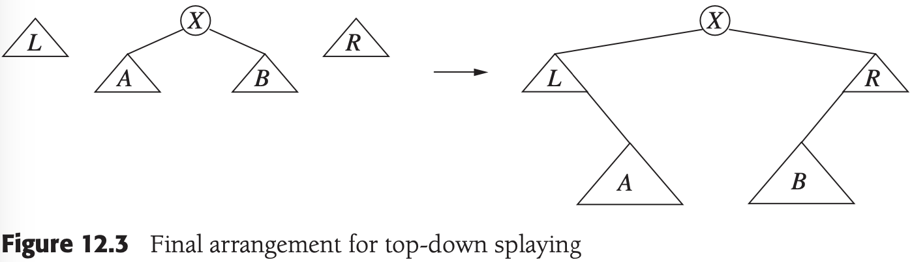
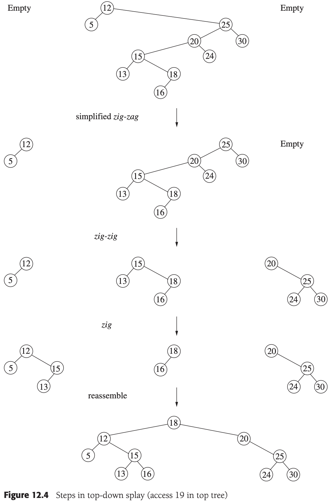

# CHAPTER 12 Advanced Data Structures and Implementation

[TOC]


## Top-Down Splay Trees






Example. Splay trees:

```c++
template <typename Comparable>
class SplayTree
{
public:
    SplayTree() 
    {
        nullNode = new BinaryNode;
        nullNode->left = nullNode->right = nullNode;
        root = nullNode;
    }
    ~SplayTree() 
    {
        makeEmpty();
        delete nullNode;
    }
    SplayTree(const SplayTree& rhs);
    const SplayTree& operator=(const SplayTree& rhs);

private:
    struct BinaryNode {};

    BinaryNode *root;
    BinaryNode *nullNode;

    void rotateWithLeftChild(BinaryNode * & k2);
    void rotateWithRightChild(BinaryNode * & k1);
    void splay(const Comparable& x, BinaryNode * & t) 
    {
        BinaryNode *leftTreeMax, *rightTreeMin;
        static BinaryNode header;

        header.left = header.right = nullNode;
        leftTreeMax = rightTreeMin = &header;

        nullNode->element = x;

        for (; ;)
            if (x < t->left->element) 
            {
                if (x < t->left->element) 
                    rotateWithLeftChild(t);
                if (t->left == nullNode)
                    break;
                // Link Right
                rightTreeMin->left = t;
                rightTreeMin = t;
                t = t->left;
            }
            else if (t->element < x) 
            {
                if (t->right->element < x)
                    rotateWithRightChild(t);
                if (t->right == nullNode)
                    break;
                // Link Left
                leftTreeMax->right = t;
                leftTreeMax = t;
                t = t->right;
            }
            else
                break;

        leftTreeMax->right = t->left;
        rightTreeMin->left = t->right;
        t->left = header.right;
        t->right = header.left;
    };

    void insert(const Comparable& x) 
    {
        static BinaryNode *newNode = NULL;
        if (newNode == NULL)
            newNode = new BinaryNode;
        newNode->element = x;

        if (root == nullNode) 
        {
            newNode->left = newNode->right = nullNode;
            root = newNode;
        } 
        else 
        {
            splay(x, root);
            if (x < root->element) 
            {
                newNode->left = root->left;
                newNode->right = root;
                root->left = nullNode;
                root = newNode;
            } 
            else 
            {
                if (root->element < x) 
                {
                    newNode->right = root->right;
                    newNode->left = root;
                    root->right = nullNode;
                    root = newNode;
                } 
                else
                    return; 
            }
            newNode = NULL;
        }
    }
};
```


## Red-Black Trees

A red-black tree is a binary search tree with the following coloring properties:

1. Every node is colored either red or black.
2. The root is black.
3. If a node is red, its children must be black.
4. Every path from a node to a null pointer must contain the same number of black nodes.

### Bottom-Up Insertion


### Top-Down Red-Black Trees


## Treaps

```c++
template <typename Comparable>
class Treap
{
public:
    Treap()
    {
        nullNode = new TreapNode;
        nullNode->left = nullNode->right = nullNode;
        nullNode->priority = INT_MAX;
        root = nullNode;
    }
    Treap(const Treap &rhs);
    ~Treap();

    void insert(const Comparable &x, TreapNode *&t);

private:
    struct TreapNode
    {
        Comparable element;
        TreapNode  *left;
        TreapNode  *right;
        int        priority;

        TreapNode() : left(NULL), right(NULL), priority(INT_MAX) {}
        TreapNode(const Comparable &e, TreapNode *lt, TreapNode *rt, int pr)
            : element(e), left(lt), right(rt), priority(pr) {}
    };

    TreapNode *root;
    TreapNode *nullNode;
    Random randomNums;
};

template <typename Comparable>
void Treap<Comparable>::insert(const Comparable &x, TreapNode *&t)
{
    if (t == nullNode)
        t = new TreapNode(x, nullNode, nullNode, randomNums.randomInt());
    else if (x < t->element)
    {
        insert(x, t->left);
        if (t->left->priority < t->priority)
            rotateWithLeftChild(t);
    }
    else if (t->element < x)
    {
        insert(x, t->right);
        if (t->right->priority < t->priority)
            rotateWithRightChild(t);
    }
}

template <typename Comparable>
void Treap<Comparable>::remove(const Comparable &x, TreapNode *&t)
{
    if (t != nullNode)
    {
        if (x < t->element)
            remove(x, t->left);
        else if(t->element < x)
            remove(x, t->right);
        else
        {
            if (t->left->priority < t->right->priority)
                rotateWithRightChild(t);
            else
                rotateWithRightChild(t);

            if (t != nullNode)
                remove(x, t);
            else
            {
                delete t->left;
                t->left = nullNode;
            }
        }
    }
}
```
