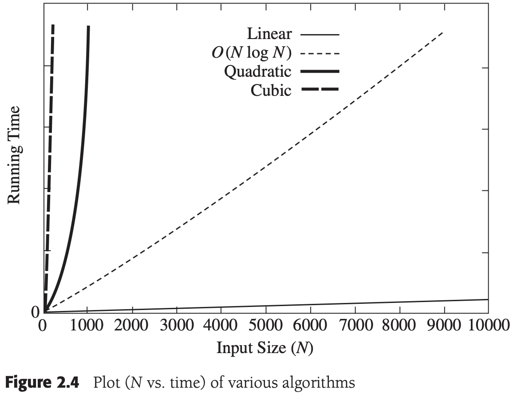

# Chapter 2 Algorithm Analysis

[TOC]


## Mathematical Background

**Definition 2.1** $T(N) = O(f(N))$ if there are positive constants $c$ and $n_0$ such that $T(N) \leqslant cf(N)$ when $N \geqslant n_0$.

**Definition 2.2** $T(N)= \Omega (g(N))$ if there are positive `constants` $c$ and $n_{0}$ such that $T(N) \geqslant cg(N)$ when $N \geqslant n_0$.

**Definition 2.3** $T(N) = \Theta (h(N))$ if and only if $T(N) = O(h(N))$ and $T(N) = \Omega(h(N)) $.

**Definition 2.4** $T(N) = o(p(N))$ if, for all positive constants $c$, there exists an $n_{0}$ such that $T(N) < cp(N)$ when $N > n_0$. Less formally, $T(N) = o(p(N))$ if $T(N) = O(p(N))$ and $T(N) \neq \Theta(p(N))$.

**Rule 1** If $T_1(N) = O(f(N))$ and $T_2(N) = O(g(N))$, then

(a) $T_1(N) + T_2(N) = O(f(N) + g(N))$ (intuitively and less formally it is $O(max(f(N), g(N))$),

(b) $T_1(N) * T_2(N) = O(f(N) * g(N))$

**Rule 2** If $T(N)$ is a polynomial of degree $k$, then $T(N) = \Theta(N^k)$.

**Rule 3** $log^k N = O(N)$ for any constant $k$. This tells us that logarithms grow very slowly.

Typical growth rates:

| Function   | Name        |
| ---------- | ----------- |
| $c$        | Constant    |
| $log\ N$   | Logarithmic |
| $log^2\ N$ | Log-squared |
| $N$        | Linear      |
| $N logN$   |             |
| $N^2$      | Quadratic   |
| $N^3$      | Cubic       |
| $2^N$      | Exponential |


## What to Analyze




## Running-Time Calculations

### General Rules

**Rule 1-FOR loops** The running time of a `for` loop is at most the running time of the statements inside the `for` loop (including tests) times the number of iterations.

**Rule 2-Netsted loops** Analyze these inside out. The total running time of a statement inside a group of nested loops is the running time of the statement multiplited by the product of the size of all the loops.

**Rule 3-Consecutive Statements** These just add (which means that the maximum is the one that counts).

**Rule 4-If/Else** For the fragment:
```c++
if (condition)
  S1
else
  S2
```

, the running time of an `if/else` statement is never more than the running time of the test plus the larger of the running time of $S_1$ and $S_2$.

### Logarithms in the Running Time

The most confusing aspect of analyzing algorithms probably centers around the logarithm. We have already seen that some divide-and-conquer algorithms will run in $O(N log N)$ time. Besides divide-and-conquer algorithms, the most frequent appearance of logarithms centers around the following general rule: An algorithm is $O(log N)$ if it takes constant (O(1)) time to cut the problem size by a fraction (which is usually $\frac{1}{2}$). On the other hand, if constant time is required to merely reduce the problem by a constant `amount` (such as to make the problem smaller by 1), then the algorithm is $O(N)$.

1. Binary Search

   `Binary Search` Given an integer $X$ and integers $A_0, A_1, ..., A_{N-1}$, which are presorted and already in memory, find $i$ such that $A_i = X$, or return $i = -1$ if $X$ is not in the input.

   Thus, the running time is $O(log N)$.

2. Euclid's Algorithm

   **Theorem 2.1** if $M > N$, then $M \text{ mod } N < M / 2$.

   **Proof** There are two cases. If $N \leq M / 2$, then since the remainder is smaller then $N$, the theorem is true for this case. The other case is $N > M / 2$. But then $N$ goes into $M$ once with a remainder $M - N < M / 2$, proving the theorem.

3. Exponentiation

   A recurrence formula can be written and solved. Simple intuition obviates the need for a brute-force approach.
