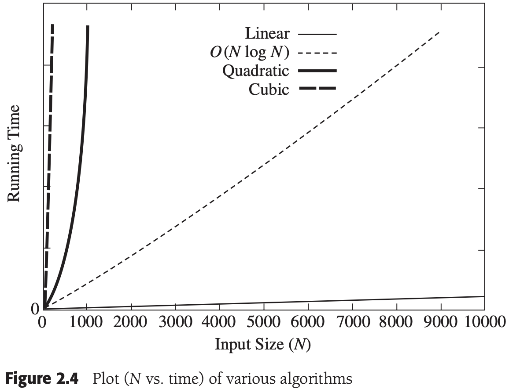

# 第2章 算法分析

[TOC]


## 数学基础

**定义2.1** 如果存在正常数$c$和$n_0$使得当$N \geqslant n_0$时$T(N) \leqslant cf(N)$，则记为$T(N) = O(f(N))$。

**定义2.2** 如果存在正常数$c$和$n_0$使得当$N \geqslant n_0$时$T(N) \geqslant cg(N)$，则记为$T(N)= \Omega (g(N))$。

**定义2.3** $T(N) = \Theta (h(N))$当前仅当$T(N) = O(h(N))$和$T(N) = \Omega(h(N)) $。

**定义2.4** 如果对所有的常数$c$存在$n_0$使得当$N > n_0$时$T(N) < cp(N)$，则记为$T(N) = o(p(N))$。非正式的定义为：如果$T(N) = O(p(N))$且$T(N) \neq \Theta(p(N))$，则$T(N) = o(p(N))$。

**法则1** 如果$T_1(N) = O(f(N))$且$T_2(N) = O(g(N))$，那么

(a) $T_1(N) + T_2(N) = O(f(N) + g(N))$（直观地非正式地表达为$O(max(f(N), g(N))$）

(b) $T_1(N) * T_2(N) = O(f(N) * g(N))$

**法则2** 如果$T(N)$是一个$k$次多项式，则$T(N) = \Theta(N^k)$。

**法则3** 对任意常数$k$, $log^kN = O(N)$。它告诉我们对数增长得非常缓慢。

典型的增长率：

| 函数       | 名称       |
| ---------- | ---------- |
| $c$        | 常量       |
| $log\ N$   | 对数       |
| $log^2\ N$ | 对数的平方 |
| $N$        | 线性       |
| $Nlog\ N$  | 现行对数   |
| $N^2$      | 二次       |
| $N^3$      | 三次       |
| $2^N$      | 指数       |


## 模型


## 要分析的问题



*各种计算最大子序列和的算法图（横坐标为N，纵坐标为时间）*


## 运行时间计算

### 一般法则

**法则1：for循环** 一个for循环的运行时间至多是该for循环内语句（包括测试）的运行时间乘以迭代的次数。

**法则2：嵌套循环** 从里向外分析这些循环。在一组嵌套循环内部的一条语句总的运行时间为该语句的运行时间乘以改组所有循环的大小的乘积。

**法则3：顺序语句** 将各个语句的运行时间求和即可。

**法则4：If/Else语句** 对于程序片段

```c++
if (condition)
  S1
else
  S2
```

一个if/else语句的运行时间从不超过判断再加上$S_1$和$S_2$中运行时间较长者的总的运行时间。

### 最大子序列和问题的解

### 运行时间中的对数

对数最常出现的规律为：如果一个算法用常数时间$O(1)$将问题的大小削减为其一部分（通常是1/2），那么该算法就是$O(log\ N)$的；另一方面，如果使用常数时间只是把问题减少一个常数的数量（如将问题减少1），那么这种算法就是$O(N)$的。

1. 二分搜索

   `二分搜索（binary serch）` 给定一个整数$X$和整数$A_0, A_1, ..., A_{N-1}$，后者已经预先排序并在内存中，求下标$i$使得$A_i = X$，如果$X$不在数据中，则返回$i = -1$。

   运行时间是$O(log\ N)$。

2. 欧几里得算法

   **定理2.1** 如果$M > N$，则$M mod N < M/2$。

3. 幂运算

### 检验你的分析

### 分析结果的正确性

