# CHAPTER 3 Lists, Stacks, and Queues

[TOC]

An `abstract data type`(ADT) is a set of objects together with a set of operations.

We deal with a general list of the form $A_0, A_1, A_2, ..., A_{N - 1}$. We say that the size of this list is $N$. We will call the special list of size 0 an `empty list`.

## Linked Lists

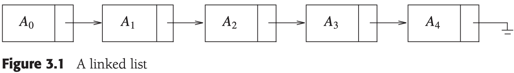

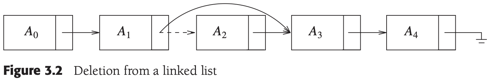


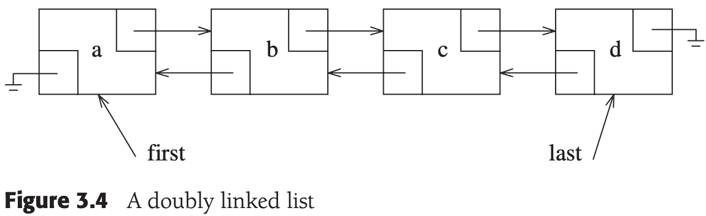

**Implementation of vector**:

```c++
template <typename Object>
class Vector
{
public:
    explicit Vector(int initSize = 0) : 
        theSize(initSize), theCapacity(initSize + SPARE_CAPACITY)
        { objects = new Object[theCapacity]; }
    Vector(const Vector& rhs) : objects(NULL) { operator=(rhs); }
    ~Vector() { delete []objects; }

    const Vector& operator= (const Vector& rhs)
    {
        if (this != &rhs)
        {
            delete []objects;
            theSize = rhs.size();
            theCapacity = rhs.theCapacity;

            objects = new Object[capacity()];
            for (int k = 0; k < size(); k++)
                objects[k] = rhs.objects[k];
        }
        return *this;
    }

    void resize(int newSize)
    {
        if (newSize > theCapacity)
            reserve(newSize * 2 + 1);
        theSize = newSize;
    }

    void reserve(int newCapacity)
    {
        if (newCapacity < theSize)
            return;

        Object * oldArray = objects;
        objects = new Object[newCapacity];
        for (int k = 0; k < theSize; k++)
            objects[k] = oldArray[k];

        theCapacity = newCapacity;

        delete []oldArray;
    }

    Object& operator[] (int index) { return objects[index]; }
    const Object& operator[](int index) const { return objects[index]; }

    bool empty() const { return size() == 0; }
    int size() const { return theSize; }
    int capacity() const { return theCapacity; }

    void push_back(const Object& x)
    {
        if (theSize == theCapacity)
            reserve(2 * theCapacity + 1);
        objects[theSize++] = x;
    }

    void pop_back() { theSize--; }
    const Object& back() const { return objects[theSize - 1]; }
    
    typedef Object *iterator;
    typedef const Object *const_iterator;
    iterator begin(){ return &objects[0]; }
    const_iterator begin() const { return &objects[0]; }
    iterator end() { return &objects[size()]; }
    const_iterator end() const { return &objects[size()]; }

    enum {SPARE_CAPACITY = 16};

private:
    int     theSize;
    int     theCapacity;
    Object *objects;
};
```

**Implementation of list:**


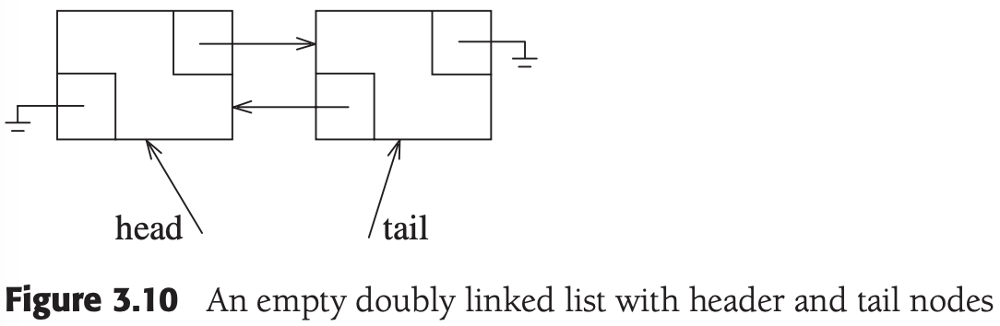


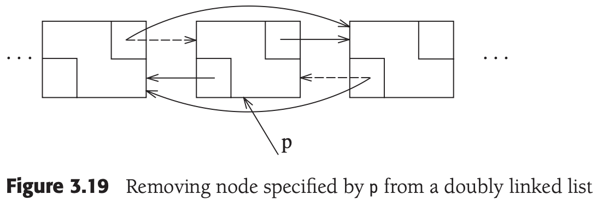

```c++
template <typename Object>
class List
{
private:
    struct Node 
    {
        Object data;
        Node   *prev;
        Node   *next;

        Node(const Object& d = Object(), Node *p = NULL, Node *n = NULL) :
            data(d), prev(p), next(n) {}
    };

public:
    class const_iterator
    {
    public:
        const_iterator() : current(NULL) {}
        const Object& operator* () const { return retrieve(); }
        const_iterator& operator++ () 
        {
            current = current->next;
            return *this;
        }
        const_iterator operator++(int)
        {
            const_iterator old = *this;
            ++(*this);
            return old;
        }
        bool operator== (const const_iterator& rhs) const { return current == rhs.current; }
        bool operator!= (const const_iterator& rhs) const { return !(*this == rhs); }

    protected:
        Node *current;

        Object &retrieve() const { return current->data; }
        const_iterator(Node *p) : current(p) {}
        friend class List<Object>;
    };

    class iterator : public const_iterator 
    {
    public:
        iterator() {}
        Object& operator* () { return this->retrieve(); }
        const Object& operator* () const { return const_iterator::operator*(); }
        iterator& operator++() { this->current = this->current->next; return *this; }   
        iterator operator++(int)
        {
            iterator old = *this;
            ++(*this);
            return old;
        }

    protected:
        iterator(Node *p) : const_iterator(p) {}
        friend class List<Object>;
    };

    List() { init(); }
    List(const List& rhs) 
    {
        init();
        *this = rhs;
    }
    ~List() 
    {
        clear();
        delete head;
        delete tail;
    }
    const List& operator= (const List& rhs) 
    {
        if (this == &rhs)
            return *this;
        clear();
        for (const_iterator itr = rhs.begin(); itr != rhs.end(); ++itr)
            push_back(*itr);
        return *this;
    }

    iterator begin() { return iterator(head->next); }
    const_iterator begin() const { return const_iterator(head->next); }
    iterator end() { return iterator(tail); }
    const iterator end() const { return const_iterator(tail); }
    int size() const { return theSize; }
    bool empty() const { return size() == 0; }
    void clear() { while (!empty()) {pop_front();} }
    Object& front() { return *begin(); }
    const Object& front() const { return *begin(); }
    Object& back() { return *--end(); }
    const Object& back() const { return *--end(); }
    void push_front(const Object& x) { insert(begin(), x); }
    void push_back(const Object& x) { insert(end(), x); }
    void pop_front() { erase(begin()); }
    void pop_back() { erase(--end()); }

    iterator insert(iterator itr, const Object& x) 
    {
        Node *p = itr.current;
        theSize++;
        return iterator(p->prev = p->prev->next = new Node(x, p->prev, p));
    }

    iterator erase(iterator itr)
    {
        Node *p = itr.current;
        iterator retVal(p->next);
        p->prev->next = p->next;
        p->next->prev = p->prev;
        delete p;
        theSize--;

        return retVal;
    }

    iterator erase(iterator start, iterator end)
    {
        for (iterator itr = start; itr != end; )
            itr = erase(itr);

        return end;
    }

private:
    int   theSize;
    Node *head;
    Node *tail;

    void init() 
    {
        theSize = 0;
        head = new Node;
        tail = new Node;
        head->next = tail;
        tail->prev = head;
    }
};
```


## Stack


### Implementation of Stacks

- Linked List Implementation of Stacks
- Array Implementation of Stacks

### Applications

- Balancing Symbols
- Postfix Expressions
- Infix to Postfix Conversion
- Function Calls


## The Queue ADT

### Array Implementation of Queues


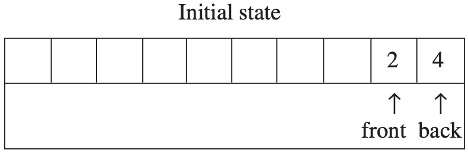

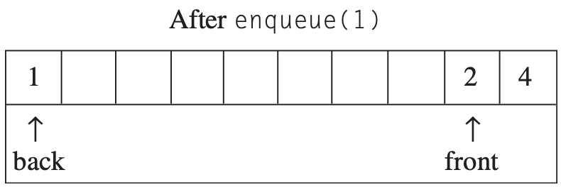

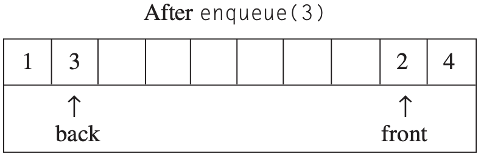

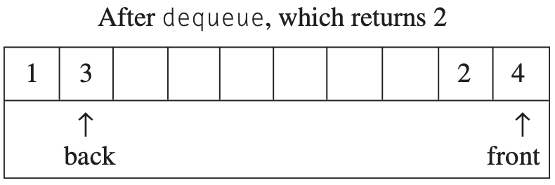

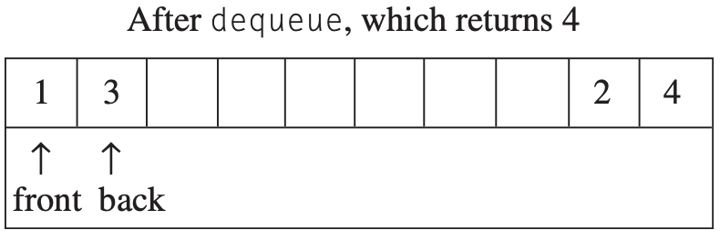

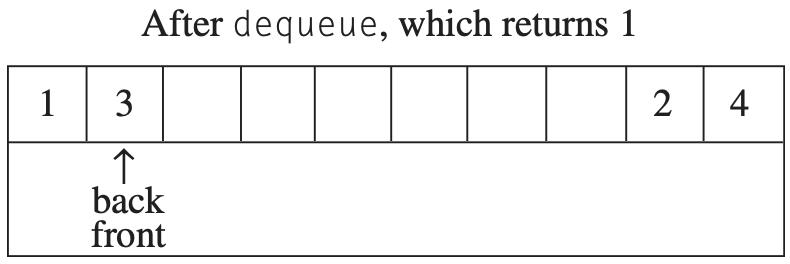

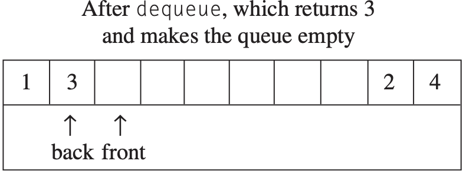
