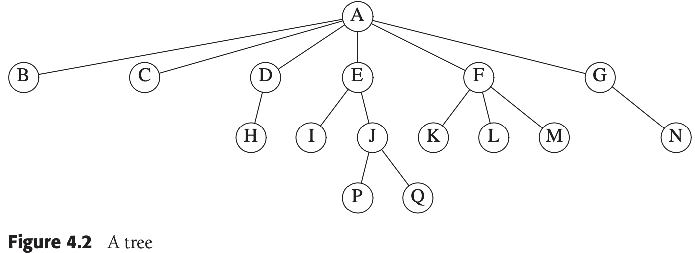
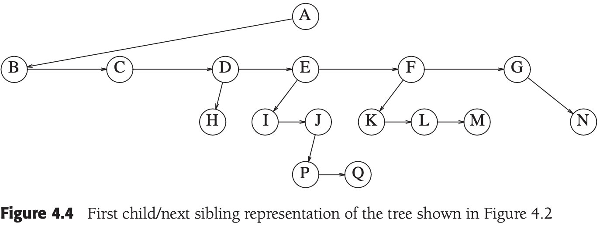
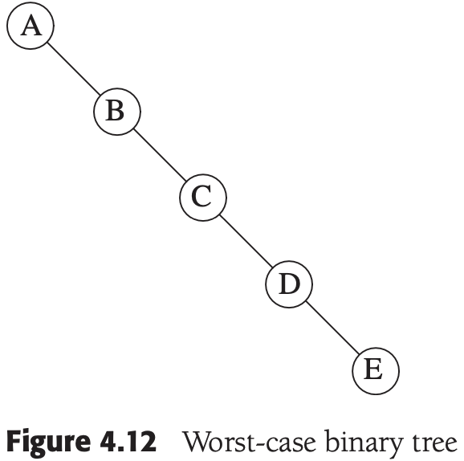
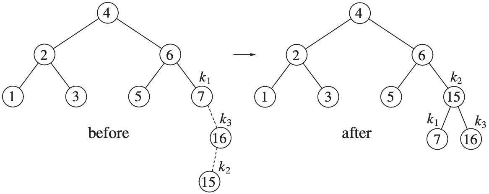
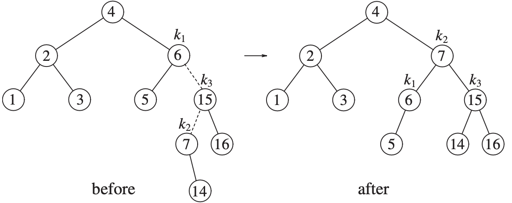
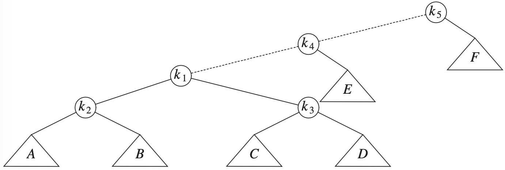
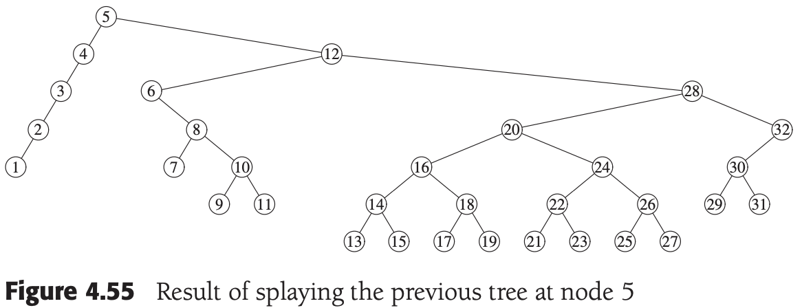
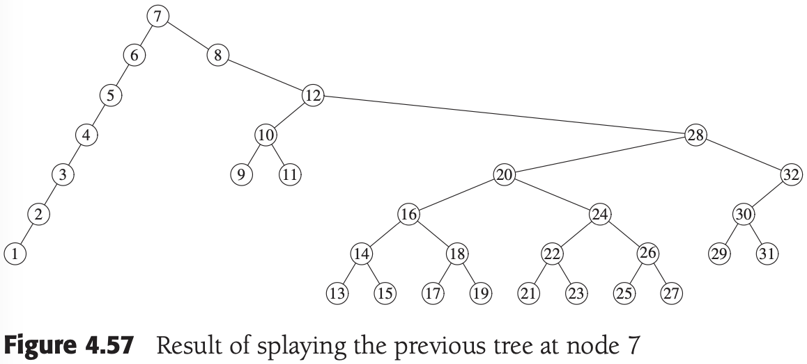
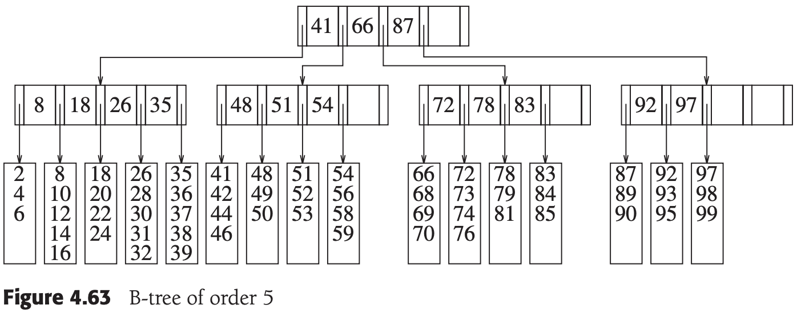

# 第四章 树

[TOC]


## 预备知识

`树（tree）` 一棵树是一些结点的集合；这个集合可以是空集；若不是空集，则树由称作`根（root）`的结点$r$以及零个或多个非空的（子）树$T_1, T_2, ..., T_k$组成，这些子树中每一棵的根都被来自根$r$的一条有向的`边（edge）`所连接。


*一般的树*

每条边都将某个结点连接到它的父亲，而除去根结点外每一个结点都有一个父亲。



*一棵具体的树*

- `兄弟（siblings）结点` 具有相同父亲的结点（如：K，L，M）。
- `叶（leaf）结点` 没有儿子的结点（如：B，C，H，I，P，Q，K，L，M，N）。

如果存在从$n_1$到$n_2$的一条路径，那么$n_1$是$n_2$的一位`祖先（ancestor）`而$n_2$是$n_1$的一个`后裔（descendant）`。如果$n_1 \neq n_2$，那么$n_1$是$n_2$的一位`真祖先（proper ancestor）`而$n_2$是$n_1$的一个`真后裔（proper descendant）`。

### 树的实现



*在上图（一棵具体的树）中所表示的树的第一儿子/下一兄弟的表示法*

```c++
struct TreeNode
{
	Object   element;
  TreeNode *firstChild;
  TreeNode *nextSibling;
};
```

### 树的遍历及应用

`前序遍历（preorder traversal）` 对结点的处理工作是在它的诸儿子结点被处理之前进行的；运行时间为$O(N)$。

`后序遍历（postORDER TRAVERSAL）` 在一个结点的工作是在它的诸儿子结点被计算后进行的。


*经由后序遍历得到的带有文件大小的UNIX目录*


## 二叉树

`二叉树（binary tree）` 是一棵每个结点都不能有多于两个儿子的树；平均二叉树的深度要比结点个数$N$小得多。


*一般二叉树*



*最坏情形的二叉树*

### 实现

```c++
struct BinaryNode
{
	Object     element;
  BinaryNode *left;
  BinaryNode *right;
};
```

### 一个例子-表达式树

`表达式树（expression tree）` 树叶是`操作数（operand）`，其他结点是`操作符（operator）`。


$(a+b*c)+((d*e+f)*g)$的表达式树

`中缀表达式（infix expression）`

`中序遍历（inorder traversal）`

`后序遍历（postorder traversal）`

`前序遍历（preorder traversal）`

例，构造一刻表达式树：

1. 假设输入为 `a b + c d e + * *`

2. 前两个符号是操作数，因此创建两棵单结点树并将指向它们的指针压入栈中

   

3. "+"被读入，因此指向两棵树的指针被弹出，形成一棵新的树，并将指向它的指针压入栈中

   

4. c，d和e被读入，在每个单结点树创建后，指向对应的树的指针被压入栈中

   

5. 读入"+"号，因此两棵树合并

   

6. 读入`"*"`号，因此，弹出两棵树的指针并形成一棵新的树，`"*"`号是他的根

   

7. 读入最后一个符号，两棵树合并，而窒息那个最后的树的指针被留在栈中。

   


## 查找树ADT-二叉查找树


*查找树*

二叉查找树的平均深度是$O(log\ N)$，一般不必担心栈空间用尽。

### contains

### findMin和findMax

### insert


*插入5之前的二叉查找树*


*插入5以后的二叉查找树*

### remove


*具有一个儿子的结点4删除前的情况*


*具有一个儿子的结点4删除后的情况*


*删除具有2个儿子的结点2前的情况*


*删除具有2个儿子的结点2后的情况*

### 析构函数和复制赋值操作符

### 平均情况分析

`内部路径长（internal path length）` 一棵树的所有结点的深度和。

**结论** 如果所有的插入序列都是等可能的，那么，树的所有结点的平均深度为$O(logN)$。

**证明** 令$D(N)$是具有$N$个结点的某棵树$T$的内部路径长，$D(1) = 0$。一棵$N$结点树是由一棵$i$结点左子树和一棵$(N-i-1)$结点右子树以及深度为0的一个根节点组成，其中$0 \leqslant i < N$, $D(i)$为根的左子树的内部路径长。但是在原树中，所有这些结点都要加深一层。同样的结论对于右子树也是成立的。因此我们得到递推关系：

$D(N) = D(i) + D(N-i-1) + N - 1$

如果所有子树的大小都是等可能的出现，这对于二叉查找树是成立的（因为子树的大小只依赖于第一个插入到树中的元素的相对秩（rank）），但对二叉树不成立，那么$D(i)$和$D(N-i-1)$的平均值都是$(1/N) \sum_{j=0}^{N-1} D(j)$。于是

$D(N) \frac{2}{N} \left[ \sum_{j=0}^{N-1} D(j)\right] + N - 1$

求解这个递推关系，得到平均值为$D(N) = O(NlogN)$。因此任意结点预期的深度为$O(logN)$。


*一棵随机生成的二叉查找树（500个结点，结点期望深度为9.98）*

如果交替插入和删除$\Theta(N^2)$次，那么树的期望深度将是$\Theta(\sqrt{N})$。

*在$\Theta(n^2)$次insert/remove操作后的二叉查找树（平均深度=12.51)*

二叉搜索树源码：

```c++
// 二叉查找树的框架
template <typename Comparable>
class BinarySearchTree
{
public:
    BinarySearchTree();
    BinarySearchTree(const BinarySearchTree& rhs);
    ~BinarySearchTree() {
        makeEmpty();
    };

    const Comparable& findMin() const;
    const Comparable& findMax() const;
    bool contains(const Comparable& x) const;
    bool isEmpty() const;
    void printTree() const;

    void makeEmpty();
    void insert(const Comparable& x);
    void remove(const Comparable& x);

    const BinarySearchTree& operator=(const BinarySearchTree& rhs) {
        if (this != &rhs) {
            makeEmpty();
            root = clone(rhs.root);
        }
        return *this;
    };

private:
    struct BinaryNode
    {
        Comparable element;
        BinaryNode* left;
        BinaryNode* right;

        BinaryNode(const Comparable& theElement, BinaryNode* lt, BinaryNode* rt)
            : element(theElement), left(lt), right(rt) {}
    };

    BinaryNode* root;
    void insert(const Comparable& x, BinaryNode* & t) const {
        if (t == NULL)
            t = new BinarySearchTree(x, NULL, NULL);
        else if (x < t->element)
            insert(x, t->left);
        else if (t->element < x)
            insert(x, t->right);
        else
            // todo
    };

    void remove(const Comparable& x, BinaryNode* & t) const {
        if (t == NULL)
            return;
        if (x < t->element)
            remove(x, t->left);
        else if(t->element < x)
            remove(x, t->right);
        else if(t->left != NULL && t->right != NULL)
        {
            t->element = findMin(t->right)->element;
            remove(t->element, t->right);
        }
        else
        {
            BinaryNode* oldNode = t;
            t = (t->left != NULL) ? t->left : t->right;
            delete oldNode;
        }
    };

    BinaryNode* findMin(BinaryNode* t) const {
        if (t == NULL)
            return NULL;
        if (t->left == NULL)
            return t;
        return findMin(t->left);
    };

    BinaryNode* findMax(Binarynode* t) const {
        if (t != NULL)
            while(t->right != NULL)
                t = t->right;
        return t;
    };

    bool contains(const Comparable& x, BinaryNode* t) const {
        if (t == NULL)
            return false;
        else if(x < t->element)
            return contains(x, t->left);
        else if(t->element < x)
            return contains(x, t->right);
        else
            return true;
    };

    void makeEmpty(BinaryNode* & t) {
        if (t != NULL) {
            makeEmpty(t->left);
            makeEmpty(t->right);
            delete t;
        }
        t = NULL;
    };
    void printTree(BinaryNode* t) const;
    BinaryNode* clone(BinaryNode* t) const {
        if (t == NULL)
            return NULL;
        return new BinaryNode(t->element, clone(t->left), clone(t->right));
    };
};
```


## AVL树

`AVL(Adelson-Velskii and Landis)树` 带有平衡条件（balance condition）的二叉查找树。

1. 必须保证树的深度是$O(logN)$; 
2. 要求每个结点都必须有相同高度（高度最多相差1）的左子树和右子树；


*高度为9的最小AVL树*

`旋转（rotation）`

`单旋转（single rotation）`

`双旋转（double rotation）`

### 单旋转


*单旋转修正情形(1)*


*插入6破坏了AVL性质，而后经过单旋转又将AVL性质恢复*


*单旋转修正情形*


### 双旋转

*单旋转不能修正情形*


*左-右双旋转修正情形*


*右-左双旋转修正情形*


*单旋转*


*双旋转*

例：

1. 插入15

   

2. 插入14

   

3. 插入13

   

4. 插入12

   

5. 插入11，10，8

   

6. 插入9

   

```c++
struct AvlNode
{
    Comparable element;
    AvlNode*   left;
    AvlNode*   right;
    int        height;

    AvlNode(const Comparable& theElement, AvlNode* lt, AvlNode* rt, int h = 0)
        : element(theElement), left(lt), right(rt), height(h){};

  	// 使用后序遍历计算高度
    int height(AvlNode* t) const 
    {
        return t == NULL ? -1 : t->height;
    }

    void insert(const Comparable& x, AvlNode* &t)
    {
        if (t == NULL)
            t = new AvlNode(x, NULL, NULL);
        else if(x < t->element)
        {
            insert(x, t->left);
            if (height(t->left) - height(t->right) == 2)
                if (x < t->left->element)
                    rotateWithLeftChild(t);
                else
                    doubleWithLeftChild(t);
        }
        else if(t->element < x)
        {
            insert(x, t->right);
            if (height(t->right) - height(t->left) == 2)
                if (t->right->element < x)
                    rotateWithRightChild(t);
                else
                    doubleWithRightChild(t);
        }
        else
            // TODO
        t->height = max(height(t->left), height(t->right)) + 1;
    }

    void rotateWithLeftChild(AvlNode* & k2)
    {
        AvlNode *k1 = k2->left;
        k2->left = k1->right;
        k1->right = k2;
        k2->height = max(height(k2->left), height(k2->right)) + 1;
        k1->height = max(height(k1->left), k2->height) + 1;
        k2 = k1;
    }

    void doubleWithLeftChild(AvlNode * & k3)
    {
        rotateWithRightChild(k3->left);
        rotateWithLeftChild(k3);
    }
};
```


## 伸展树

`伸展树（splay tree）` 它保证从空树开始任意连续$M$次对树的操作最多花费$O(Mlog\ N)$时间；当一个节点被访问后，它就要经过一系列AVL树的旋转被推到根上。

当$M$次操作的序列总的最坏情形运行时间为$O(Mf(N))$时，我们说它的`摊还（amortized）`运行时间为$O(f(N))$；每次操作最坏情形时间$O(N)$并非不好，只要它相对不常发生就行。

### 一个简单的想法（不能直接使用）

例，在树中对$k_1$进行一次find之后所发生的情况：


*虚线是访问的路径。首先，在$k_1$和它的父结点之间实施一次单旋转，得到下面的树。*


*然后，在$k_1$和$k_3$之间旋转，得到下一棵树。*



*再实行两次旋转直到$k_1$到达树根*


### 伸展


*将全部由左儿子构成的树在结点1伸展的结果*


*将前面的树在结点2伸展的结果*


*将前面的树在结点3伸展的结果*


*将前面的树在结点4伸展的结果*


*将前面的树在结点5伸展的结果*



*将前面的树在结点6伸展的结果*


*将前面的树在结点7伸展的结果*



*将前面的树在结点8伸展的结果*


*将前面的树在结点9伸展的结果*


## 树的遍历

`中序遍历（inorder traversal）`

`后序遍历（postorder traversal）`

`前序遍历（preorder traversal）`

`层序遍历（level-order traversal）` 所有深度为$d$的结点要在深度为$d+1$的结点之前进行处理。

```c++
    void printTree(ostream& out = cout) const
    {
        if (isEmpty())
            out << "Empty tree" << endl;
        else
            printTree(root, out);
    }

    void printTree(BinaryNode* t, ostream& out) const 
    {
        if (t != NULL)
        {
            printTree(t->left, out);
            out << t->element << endl;
            printTree(t->right, out);
        }
    }
```


## B树

阶为$M$的B树是一棵具有下列结构特性的树：

1. 数据项存储在树叶上；
2. 非叶结点存储直到$M-1$键，以指示搜索方向；键$i$代表子树$i+1$中的最小的键；
3. 树的根或者是一片树叶，或者其儿子数载2和$M$之间；
4. 除根外，所有非树叶结点的儿子数载$\lceil L/2 \rceil$和$M$之间；
5. 所有的树叶都在相同的深度上并有$\lceil L/2 \rceil$和$L$之间个数据项，稍后描述$L$的确定。


*5阶B树*



*将57插入到B树*


*将55插入到B树中引起分裂成两片树叶*


*把40插入到上图的B树中，引起树叶被分裂为两片然后又造成父结点的分裂*


*从上图的B树中删除99后的B树*


## 标准库中的set和map

### set

set是一个排序后的容器，该容器不允许重复；set特有的操作是高效的插入，删除和执行基本查找。

STL定义了以下insert/erase函数：

```c++
pair<iterator, bool> insert(const Object& x); // 如果已存在，插入失败
pair<iterator, bool> insert(iterator hint, const Object& x); // 如果已存在，插入失败

int erase(const Object& x);
iterator erase(iterator itr);
iterator erase(iterator start, iterator end);
```

使用示例：

```c++
set<int> s;
for (int i = 0; i < 1000000; i++)
  s.insert(s.end(), i);
```

### map

map用来存储排序后的由键和值组成的项的集合，键必须唯一，但是多个键可以对应同一值；所以只不需要唯一。

map的`operator[]`不能用于常量的map，例：

```c++
map<string, double> salaries;
salaries["Pat"] = 75000.00;

map<string, double>::const_iterator itr;
itr = salaries.find("Chris");
if (itr == salaries.end())
	cout << "end" << endl;
else
  cout << itr->second << endl;
```

### set和map的实现

C++需要set和map支持在最坏的情况下对基本的操作如：insert，erase和find仅消耗对数时间，底层实现是平衡二叉查找树（以RB-tree居多）。

如何高效地将迭代器推进到下一个节点的方法：

1. 当迭代器构造完成后，每一个迭代器都将一个包含set项的数组作为自己的数据存储；这没有用：这使得在修改过set后返回一个迭代器的任何例程的实现都不可能高效；例如：erase，insert。
2. 使迭代器维持一个栈，用来存储通向当前结点的路径上的结点。基于这个信息，可以推出在迭代器中的下一个结点，它可能是当前结点的右子树所包含的最小项，或者是最近的在其左子树中包含当前结点的祖先。这使得迭代器有一点大，并且使得迭代器的代码很笨拙。
3. 使查找树中的每一个结点除了存储其儿子外，也存储其父亲。迭代器不会很大，但是现在每个结点都需要额外的存储空间，而且迭代代码还是很笨拙。
4. 使每个结点保持额外的链接：一个至下一个较小结点，另一个至下一个较大结点。这样也占用空间，但是此时的迭代过程就很容易实现，而且很容易对这些链接进行维护。
5. 仅为那些左侧或右侧的链接为NULL的结点保持额外的链接，通过使用额外的布尔变量使得例程可以指示出是否一个左链接正在作为标准二叉查找树的左链接或者至下一个较小结点的链接而使用，对于右结点也做同样处理。

### 使用几个map的例子

例1，给定一个map，其键为单词，值为指向只有一个字符不同的单词组的vector。
输出具有minwords或更多个通过一个字符替换就可以得到其他单词的那些单词（低效模式）：

```c++
// 打印单词
void printHightChangeables(const map<string, vector<string> >& adjWords, int minWords = 15)
{
	map<string, vector<string> >::const_iterator itr;
  for (itr = adjWords.begin(); itr != adjWords.end(); ++itr)
  {
  	const pair<string, vectors<string> >& entry = *itr;
    const vector<string>&                 words = entry.second;
    
    if (words.size() >= minWords)
    {
    	cout << entry.first << "(" << words.size() << "):";
      for (int i = 0; i < words.size(); i++)
        cout << " " << words[i];
      cout << endl;
    }
  }
}

// 检查一字之差
bool oneCharOff(const string& word1, const string& word2)
{
	if (word1.length() != word2.length())
    return false;
  
  int diffs = 0;
  
  for (int i = 0; i < word1.length(); i++)
    if (word1[i] != word2[i])
      if (++diffs > 1) // 仅有一个字母不同
        return false;
  
  return diffs == 1;
}

map<string, vector<string> > computeAdjacentWords(const vector<string>& words)
{
	map<string, vector<string> > adjWords;
  
  for (int i = 0; i < words.size(); i++)
    for (int j = i + 1; j < words.size(); j++)
      if (oneCharOff(words[i], words[j]))
      {
      	adjWords[words[i]].push_back(words[j]);
        adjWords[words[j]].push_back(words[i]);
      }
  
  return adjWords;
}
```

例2，例1的优化版：

```c++
map<string, vector<String> > computeAdjacentWords(const vector<string>& words) 
{
	map<string, vector<string> > adjWords;
  map<int, vector<string> >    wordsByLength;

  for (int i = 0; i < words.size(); i++)
    wordsByLength[words[i].length()].push_back(words[i]); // key:len, value:vector
  
  map<int, vector<string> >::const_iterator itr;
  for (itr = wordsByLength.begin(); itr != wordsByLength.end(); ++itr)
  {
  	const vector<string>& groupsWords = itr->second;
    int groupNum = itr->first;
    
    for (int i = 0; i < groupNum; i++)
    {
    	map<string, vector<string> > repToWord;
      for (int j = 0; j < groupsWords.size(); j++)
      {
      	string rep = groupsWords[j];
        rep.erase(i, 1);
        repToWord[rep].push_back(groupsWords[j]);
      }
      
      map<string, vector<string> >::const_iterator itr2;
      for (itr2 = repToWord.begin(); itr2 != repToWord.end(); ++itr2)
      {
      	const vector<string>& clique = itr2->second;
        if (clique.size() >= 2)
          for (int p = 0; p < clique.size(); p++)
            for (int q = p + 1; q < clique.size(); q++)
            {
            	adjWords[clique[p]].push_back(clique[q]);
              adjWords[clique[q]].push_back(clique[p]);
            }
      }
    }
  }
  return adjWords;
}
```

