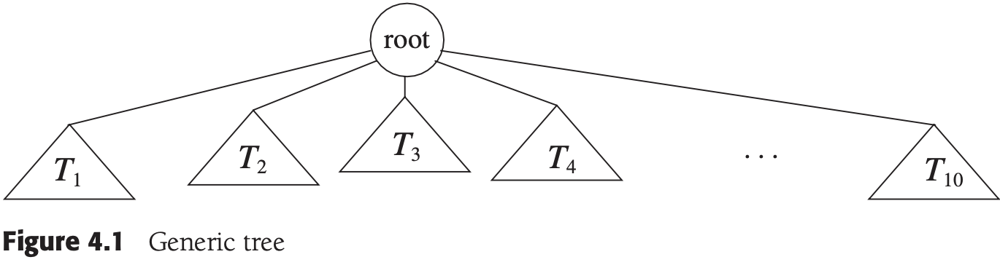
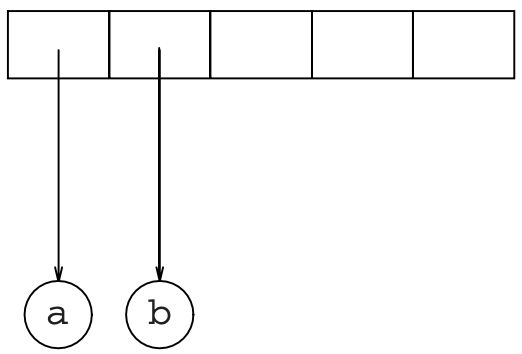
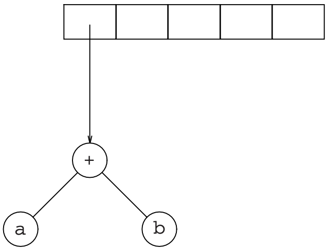
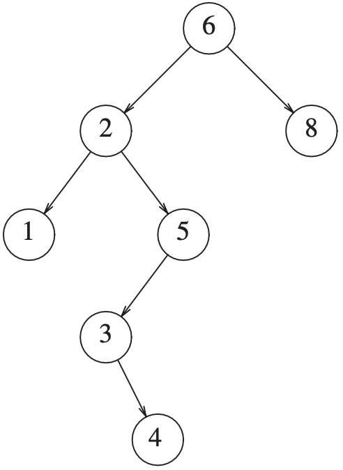
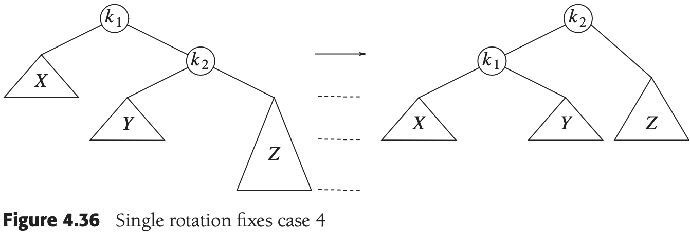
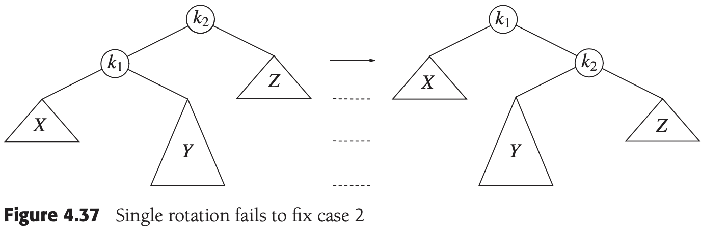
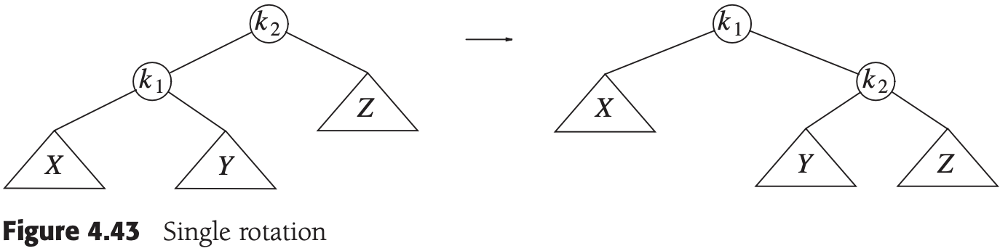
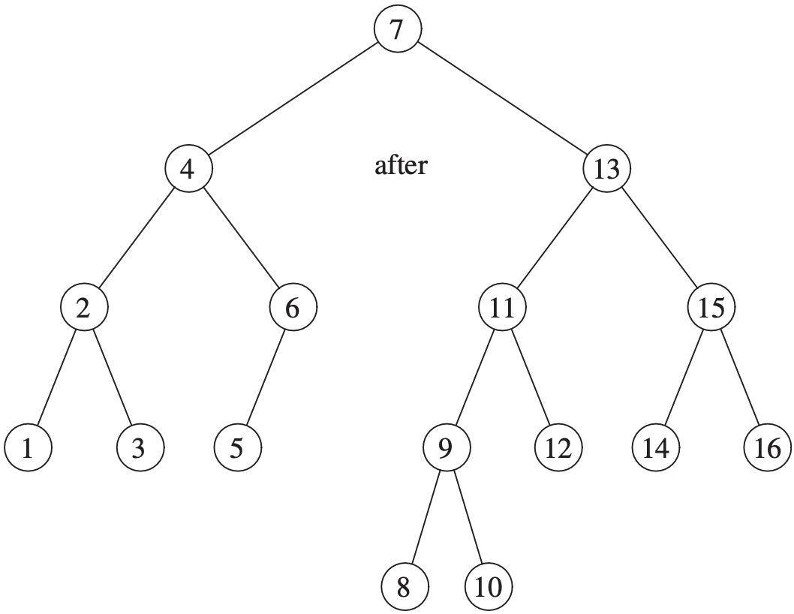
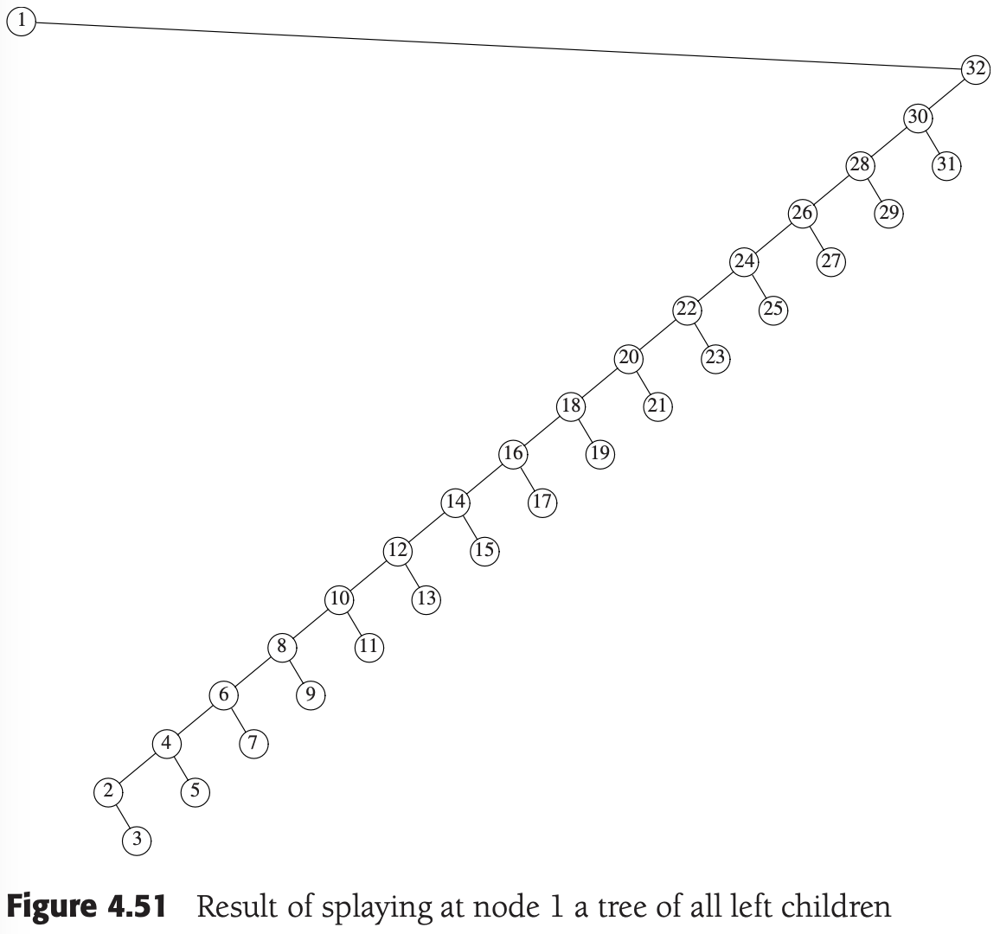
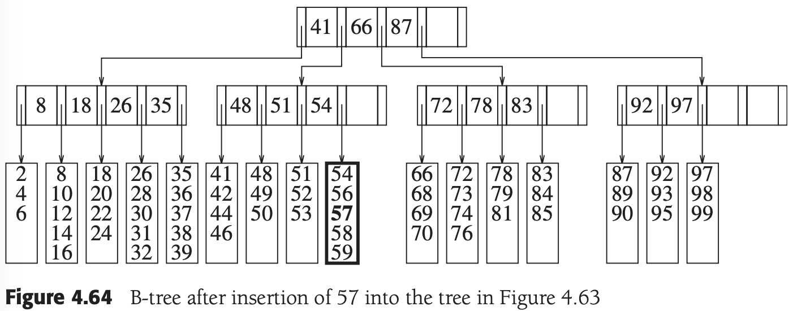

# CHAPTER 4 Trees

[TOC]


## Preliminaries

A `tree` can be defined in several ways. One natural way to define a tree is recursively. A tree is a collection of nodes. The collection can be empty; otherwise, a tree consists of a distinguished node, $r$, called the `root`, and zero or more nonempty (sub)trees $T_1, T_2, ..., T_k$, each of whose roots are connected by a directed `edge` from $r$.



The root of each subtree is said to be a `child` of $r$, and $r$ is the `parent` of each subtree root.


- `siblings`: Nodes with the same parent are **siblings** (K，L，M).
- `leaves`: Nodes with no children are known as **leaves** (B，C，H，I，P，Q，K，L，M，N).

If there is a path from $n_1$ to $n_2$, then $n_1$ is an **ancestor** of $n_2$ and $n_2$ is a **descendant** of $n_1$. If $n_1 \neq n_2$, then $n_1$ is a **proper ancestor** of $n_2$ and $n_2$ is a **proper descendant** of $n_1$.

### Implementation of Trees


```c++
struct TreeNode
{
	Object   element;
  TreeNode *firstChild;
  TreeNode *nextSibling;
};
```

### Tree Traversals with an Application

In a `preorder traversal`, work at a node is performed before (pre) its children are processed. The running time is $O(N)$.

In a `postorder traversal`, the work at a node is performed after (post) its children are evaluated.


## Binary Trees

A binary tree is a tree in which no node can have more than two children. A property of a binary tree that is sometimes important is that the depth of an average binary tree is considerably smaller than $N$.


### An Example: Expression Trees

An `expression tree`. The leaves of an expression tree are `operands`, such as constants or variable names, and the other nodes contain `operators`.

Binary tree node class (pseudocode):

```c++
struct BinaryNode
{
	Object     element;
  BinaryNode *left;
  BinaryNode *right;
};
```


Example, Constructing an Expression Tree:

1. suppose the input is: `a b + c d e + * *`

2. The first two symbols are operands, so we create one-node trees and push pointers to them onto a stack

   

3. A `+` is read, so two pointers to trees are popped, a new tree is formed, and a pointer to it is pushed onto the stack

   

4. c, d, and e are read, and for each a one-node tree is created and a pointer to the corresponding tree is pushed onto the stack

   

5. a `+` is read, so two trees are merged

   

6. A `*` is read, so we pop two tree pointers and form a new tree with a `*` as root

   

7. The last symbol is read, two trees are merged, and a pointer to the final tree is left on the stack

   


## The Search Tree ADT-Binary Serch Trees


The average depth of a binary search tree turns out to be $O(log N)$, we generally do not need to worry about running out of stack space.

二叉查找树的平均深度是$O(log\ N)$，一般不必担心栈空间用尽。

### insert


*Binary search trees before inerting 5*


*Binary search trees after inerting 5*

### remove


*Deletion of a node (4) with one child, before*


*Deletion of a node (4) with one child, after*



*Deletion of a node (2) with two children, before*


*Deletion of a node (2) with two children, after*

### Average-Case Analysis

The sum of the depths of all nodes in a tree is known as the `internal path length`.

**Result** The average depth over all nodes in a tree is $O(logN)$ on the assumption that all insertion sequences are equally likely.

**Proof** Let $D(N)$ be the internal path length for some tree $T$ of $N$ nodes. $D(1) = 0$. An N-node tree consists of an $i$-node left subtree and an $(N - i - 1)$-node right subtree, plus a root at depth zero for $0 \leq i < N$. $D(i)$ is the internal path length of the left subtree with respect to tis root. In the main tree, all these nodes are one level deeper. The same holds for the right subtree. Thus, we get the recurrence: 
$$
D(N) = D(i) + D(N-i-1) + N - 1
$$
, If all subtree sizes are equally likely, which is true for binary search trees (since the subtree size depends only on the relative rank of the first element inerted into the tree), but not binary trees, then the average value of both $D(i)$ and $D(N - i - 1)$ is $(1/N) \sum_{j=0}^{N-1} D(j)$. This yields:
$$
D(N) \frac{2}{N} \left[ \sum_{j=0}^{N-1} D(j)\right] + N - 1
$$
, obtaining an average value of $D(N) = O(NlogN)$. Thus, the expected depth of any node is $O(logN)$.


It has been shown that if we alternate insertions and deletions $\Theta(N^2)$ times, then the trees will have an expected depth of $\Theta(\sqrt{N})$.


The source of binary search tree:

```c++
// 二叉查找树的框架
template <typename Comparable>
class BinarySearchTree
{
public:
    BinarySearchTree();
    BinarySearchTree(const BinarySearchTree& rhs);
    ~BinarySearchTree() {
        makeEmpty();
    };

    const Comparable& findMin() const;
    const Comparable& findMax() const;
    bool contains(const Comparable& x) const;
    bool isEmpty() const;
    void printTree() const;

    void makeEmpty();
    void insert(const Comparable& x);
    void remove(const Comparable& x);

    const BinarySearchTree& operator=(const BinarySearchTree& rhs) {
        if (this != &rhs) {
            makeEmpty();
            root = clone(rhs.root);
        }
        return *this;
    };

private:
    struct BinaryNode
    {
        Comparable element;
        BinaryNode* left;
        BinaryNode* right;

        BinaryNode(const Comparable& theElement, BinaryNode* lt, BinaryNode* rt)
            : element(theElement), left(lt), right(rt) {}
    };

    BinaryNode* root;
    void insert(const Comparable& x, BinaryNode* & t) const {
        if (t == NULL)
            t = new BinarySearchTree(x, NULL, NULL);
        else if (x < t->element)
            insert(x, t->left);
        else if (t->element < x)
            insert(x, t->right);
        
      	balance(t);
    };

    void remove(const Comparable& x, BinaryNode* & t) const {
        if (t == NULL)
            return;
        if (x < t->element)
            remove(x, t->left);
        else if(t->element < x)
            remove(x, t->right);
        else if(t->left != NULL && t->right != NULL)
        {
            t->element = findMin(t->right)->element;
            remove(t->element, t->right);
        }
        else
        {
            BinaryNode* oldNode = t;
            t = (t->left != NULL) ? t->left : t->right;
            delete oldNode;
        }
    };

    BinaryNode* findMin(BinaryNode* t) const {
        if (t == NULL)
            return NULL;
        if (t->left == NULL)
            return t;
        return findMin(t->left);
    };

    BinaryNode* findMax(Binarynode* t) const {
        if (t != NULL)
            while(t->right != NULL)
                t = t->right;
        return t;
    };

    bool contains(const Comparable& x, BinaryNode* t) const {
        if (t == NULL)
            return false;
        else if(x < t->element)
            return contains(x, t->left);
        else if(t->element < x)
            return contains(x, t->right);
        else
            return true;
    };

    void makeEmpty(BinaryNode* & t) {
        if (t != NULL) {
            makeEmpty(t->left);
            makeEmpty(t->right);
            delete t;
        }
        t = NULL;
    };
    void printTree(BinaryNode* t) const;
    BinaryNode* clone(BinaryNode* t) const {
        if (t == NULL)
            return NULL;
        return new BinaryNode(t->element, clone(t->left), clone(t->right));
    };
};
```


## AVL Trees

An AVL (Adelson-Velskii and Landis) tree is a binary search tree with a `balance condition`, it requires:

1. the depth of the tree is $O(logN)$.
2. the left and right subtrees have the same height.


It is easy to see that a violation might occur in four cases:

1. An insertion into the left subtree of the left child of $\alpha$.
2. An insertion into the right subtree of the left child of $\alpha$.
3. An insertion into the left subtree of the right child of $\alpha$.
4. An insertion into the right subtree of the right child of $\alpha$.

### Single Rotation





### Double Rotation







Example:

1. Insert 15

   

2. Insert 14

   

3. Insert 13

   

4. Insert 12

   

5. Insert 11，10，8

   

6. Insert 9

   

```c++
struct AvlNode
{
    Comparable element;
    AvlNode*   left;
    AvlNode*   right;
    int        height;

    AvlNode(const Comparable& theElement, AvlNode* lt, AvlNode* rt, int h = 0)
        : element(theElement), left(lt), right(rt), height(h){};

  	// 使用后序遍历计算高度
    int height(AvlNode* t) const 
    {
        return t == NULL ? -1 : t->height;
    }

    void insert(const Comparable& x, AvlNode* &t)
    {
        if (t == NULL)
            t = new AvlNode(x, NULL, NULL);
        else if(x < t->element)
        {
            insert(x, t->left);
            if (height(t->left) - height(t->right) == 2)
                if (x < t->left->element)
                    rotateWithLeftChild(t);
                else
                    doubleWithLeftChild(t);
        }
        else if(t->element < x)
        {
            insert(x, t->right);
            if (height(t->right) - height(t->left) == 2)
                if (t->right->element < x)
                    rotateWithRightChild(t);
                else
                    doubleWithRightChild(t);
        }
        
        t->height = max(height(t->left), height(t->right)) + 1;
    }

    void rotateWithLeftChild(AvlNode* & k2)
    {
        AvlNode *k1 = k2->left;
        k2->left = k1->right;
        k1->right = k2;
        k2->height = max(height(k2->left), height(k2->right)) + 1;
        k1->height = max(height(k1->left), k2->height) + 1;
        k2 = k1;
    }

    void doubleWithLeftChild(AvlNode * & k3)
    {
        rotateWithRightChild(k3->left);
        rotateWithLeftChild(k3);
    }
};
```


## Splay Trees

**Splay tree** that guarantees that any $M$ consecutive tree operations starting from an empty tree take at most $O(Mlog\ N)$ time.

Generally, when a sequence of $M$ operations has total worst-case running time of $O(Mf(N))$, we say that the **amortized** running time is $O(f(N))$.

### A Simple Idea (That Does Not Work)

As an example, consider what happens after an access (a `find`) on $k_1$ in the following tree:


The access path is dashed. First, we would perform a single rotation between $k_1$ and its parent, obtaining the following tree:


Then, we rotate between $k_1$ and $k_3$, obtaining the next tree:


Then two more rotations are performed until we reach the root:


### Splaying





## Tree Traversals(Revisited)

```c++
    void printTree(ostream& out = cout) const
    {
        if (isEmpty())
            out << "Empty tree" << endl;
        else
            printTree(root, out);
    }

    void printTree(BinaryNode* t, ostream& out) const 
    {
        if (t != NULL)
        {
            printTree(t->left, out);
            out << t->element << endl;
            printTree(t->right, out);
        }
    }
```


## B-Trees

A B-tree of order $M$ is an $M$-ary tree with the following properties:

1. The data items are stored at leaves.
2. The nonleaf nodes store up to $M - 1$ keys to guide the searching; key $i$ represents the smallest key in subtree $i + 1$.
3. The root is either a leaf or has between two and $M$ children.
4. All nonleaf nodes (except the root) have between $\lceil M / 2 \rceil$ and $M$ children.
5. All leaves are at the same depth and have between $\lceil L / 2 \rceil$ and $L$ data items, for some $L$ (the determination of $L$ is described shortly).





## Sets and Maps in the Standard Library

### Sets

The `set` is an ordered container that does not allow duplicates.

The unique operations required by the `set` are the abilities to insert, remove, and perform a basic search (efficiently).

The STL defines insert/erase function:

```c++
pair<iterator, bool> insert(const Object& x); // 如果已存在，插入失败
pair<iterator, bool> insert(iterator hint, const Object& x); // 如果已存在，插入失败

int erase(const Object& x);
iterator erase(iterator itr);
iterator erase(iterator start, iterator end);
```

For example:

```c++
set<int> s;
for (int i = 0; i < 1000000; i++)
  s.insert(s.end(), i);
```

### Maps

A `map` is used to store a collection of ordered entries that consists of keys and their values. Keys must be unique, but several keys can map to the same values. Thus values need not be unique.

Consequently, the underlying implementation is a balanced binary search tree. Typically, an AVL tree is not used; instead, top-down red-black trees are often used:

```c++
map<string, double> salaries;
salaries["Pat"] = 75000.00;

map<string, double>::const_iterator itr;
itr = salaries.find("Chris");
if (itr == salaries.end())
	cout << "end" << endl;
else
  cout << itr->second << endl;
```

The hard part is efficiently advancing to the next node. There are several possible solutions, some of which are lsited here:

1. When the iterator is constructed, have each iterator store as its data an array containing the `set` items. This doesn't work: It makes it impossible to efficiently implement any of the routines that return an iterator after modifying the `set`, such as some of the versions of `erase` and `insert`.
2. Have the iterator maintain a stack storing nodes on the path to the current node. With this information, one can deduce the next node in the iteration, which is either the node in the current node's right subtree that contains the minimum item or the nearest ancestor that contains the current node in its left subtree. This makes the iterator somewhat large and makes the iterator code clumsy.
3. Have each node in the search tree store its parent in addition to the children. The iterator is not as large, but there is now extra memory required in each node, and the code to iterate is still clumsy.
4. Have each node maintain extra links: one to the next smaller, and one to the next larger node. This takes space, but the iteration is very simple to do, and it is easy to maintain these links.
5. Maintain the extra links only for nodes that have `nullptr` left or right links by using extra Boolean variables to allow the routines to tell if a left link is being used as a standard binary search tree left link or a link to the next smaller node, and similarly for the right link.

### An Example That Uses Several Maps

Example1. use a `map` in which the keys are words and the value are vectors containing the words that can be changed from the key with a one-character substitution:

```c++
// 打印单词
void printHightChangeables(const map<string, vector<string> >& adjWords, int minWords = 15)
{
	map<string, vector<string> >::const_iterator itr;
  for (itr = adjWords.begin(); itr != adjWords.end(); ++itr)
  {
  	const pair<string, vectors<string> >& entry = *itr;
    const vector<string>&                 words = entry.second;
    
    if (words.size() >= minWords)
    {
    	cout << entry.first << "(" << words.size() << "):";
      for (int i = 0; i < words.size(); i++)
        cout << " " << words[i];
      cout << endl;
    }
  }
}

// 检查一字之差
bool oneCharOff(const string& word1, const string& word2)
{
	if (word1.length() != word2.length())
    return false;
  
  int diffs = 0;
  
  for (int i = 0; i < word1.length(); i++)
    if (word1[i] != word2[i])
      if (++diffs > 1) // 仅有一个字母不同
        return false;
  
  return diffs == 1;
}

map<string, vector<string> > computeAdjacentWords(const vector<string>& words)
{
	map<string, vector<string> > adjWords;
  
  for (int i = 0; i < words.size(); i++)
    for (int j = i + 1; j < words.size(); j++)
      if (oneCharOff(words[i], words[j]))
      {
      	adjWords[words[i]].push_back(words[j]);
        adjWords[words[j]].push_back(words[i]);
      }
  
  return adjWords;
}
```

Example2:

```c++
map<string, vector<String> > computeAdjacentWords(const vector<string>& words) 
{
	map<string, vector<string> > adjWords;
  map<int, vector<string> >    wordsByLength;

  for (int i = 0; i < words.size(); i++)
    wordsByLength[words[i].length()].push_back(words[i]); // key:len, value:vector
  
  map<int, vector<string> >::const_iterator itr;
  for (itr = wordsByLength.begin(); itr != wordsByLength.end(); ++itr)
  {
  	const vector<string>& groupsWords = itr->second;
    int groupNum = itr->first;
    
    for (int i = 0; i < groupNum; i++)
    {
    	map<string, vector<string> > repToWord;
      for (int j = 0; j < groupsWords.size(); j++)
      {
      	string rep = groupsWords[j];
        rep.erase(i, 1);
        repToWord[rep].push_back(groupsWords[j]);
      }
      
      map<string, vector<string> >::const_iterator itr2;
      for (itr2 = repToWord.begin(); itr2 != repToWord.end(); ++itr2)
      {
      	const vector<string>& clique = itr2->second;
        if (clique.size() >= 2)
          for (int p = 0; p < clique.size(); p++)
            for (int q = p + 1; q < clique.size(); q++)
            {
            	adjWords[clique[p]].push_back(clique[q]);
              adjWords[clique[q]].push_back(clique[p]);
            }
      }
    }
  }
  return adjWords;
}
```

