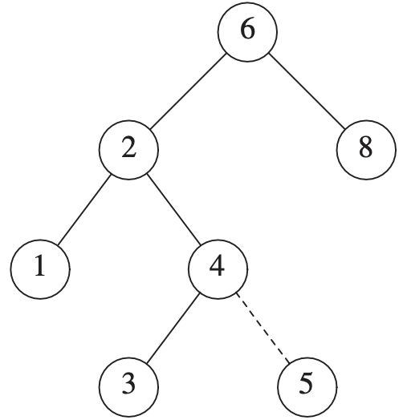
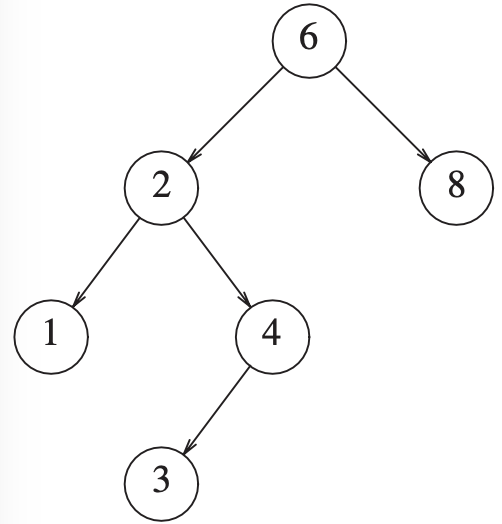
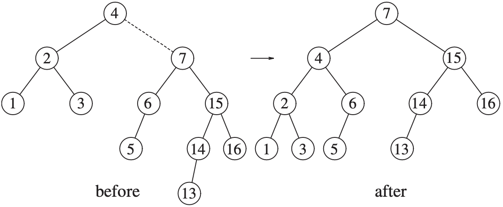
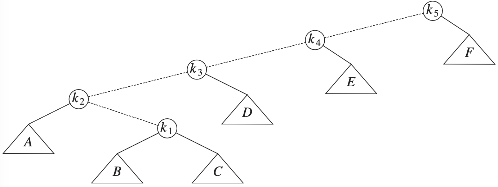
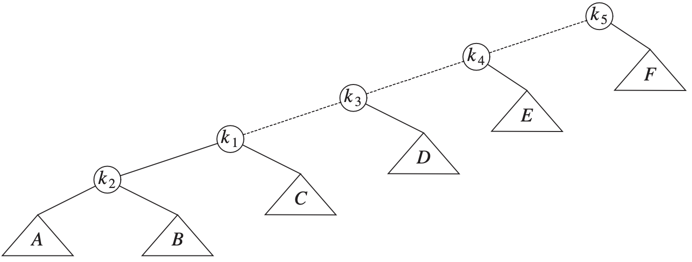
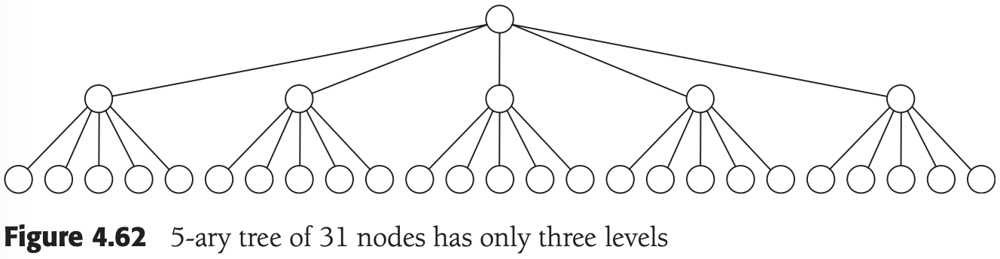

# 第四章 树

[TOC]


## 预备知识

每条边都将某个结点连接到它的父亲，而除去根结点外每一个结点都有一个父亲。


*一棵具体的树*

- `兄弟（siblings）结点` 具有相同父亲的结点（如：K，L，M）。
- `叶（leaf）结点` 没有儿子的结点（如：B，C，H，I，P，Q，K，L，M，N）。

如果存在从$n_1$到$n_2$的一条路径，那么$n_1$是$n_2$的一位`祖先（ancestor）`而$n_2$是$n_1$的一个`后裔（descendant）`。如果$n_1 \neq n_2$，那么$n_1$是$n_2$的一位`真祖先（proper ancestor）`而$n_2$是$n_1$的一个`真后裔（proper descendant）`。

### 树的实现


```c++
struct TreeNode
{
	Object   element;
  TreeNode *firstChild;
  TreeNode *nextSibling;
};
```

### 树的遍历及应用

`前序遍历（preorder traversal）` 

`后序遍历（postORDER TRAVERSAL）`


*仅由后序遍历得到的带有文件大小的UNIX目录*


## 二叉树

`二叉树（binary tree）` 是一棵每个结点都不能有多于两个儿子的树；平均二叉树的深度要比结点个数$N$小得多。


*一般二叉树*


*最坏情形的二叉树*

### 实现

```c++
struct BinaryNode
{
	Object     element;
  BinaryNode *left;
  BinaryNode *right;
};
```

### 一个例子-表达式树

`表达式树（expression tree）` 树叶是`操作数（operand）`，其他结点是`操作符（operator）`。


$(a+b*c)+((d*e+f)*g)$的表达式树

`中缀表达式（infix expression）`

`中序遍历（inorder traversal）`

`后序遍历（postorder traversal）`

`前序遍历（preorder traversal）`


## 查找树ADT-二叉查找树


*查找树*

二叉查找树的平均深度是$O(log\ N)$，一般不必担心栈空间用尽。

```c++

```

### insert


*插入5之前的二叉查找树*



*插入5以后的二叉查找树*

### remove



*具有一个儿子的结点4删除前的情况*


*具有一个儿子的结点4删除后的情况*


*删除具有2个儿子的结点2前的情况*


*删除具有2个儿子的结点2后的情况*

### 析构函数和复制赋值操作符

### 平均情况分析

`内部路径长（internal path length）` 一棵树的所有结点的深度和。

TODO


*一棵随机生成的二叉查找树*

*在$\Theta(n^2)$次insert/remove操作后的二叉查找树*


## AVL树

`AVL(Adelson-Velskii and Landis)树` 带有平衡条件（balance condition）的二叉查找树。


*高度为9的最小AVL树*

### 单旋转


*单旋转修正情形(1)*


*插入6破坏了AVL性质，而后经过单旋转又将AVL性质恢复*


*单旋转修正情形*


### 双旋转

*单旋转不能修正情形*


*左-右双旋转修正情形*


*右-左双旋转修正情形*


*单旋转*


*双旋转*

例：

1. 插入15

   

2. 插入14

   

3. 插入13

   

4. 插入12

   

5. 插入11，10，8

   

6. 插入9

   


## 伸展树

`伸展树（splay tree）` 它保证从空树开始任意连续$M$次对树的操作最多花费$O(Mlog\ N)$时间；当一个节点被访问后，它就要经过一系列AVL树的旋转被推到根上。

当$M$次操作的序列总的最坏情形运行时间为$O(Mf(N))$时，我们说它的`摊还（amortized）`运行时间为$O(f(N))$。

### 一个简单的想法（不能直接使用）

例，在树中对$k_1$进行一次find之后所发生的情况：



*虚线是访问的路径。首先，在$k_1$和它的父结点之间实施一次单旋转，得到下面的树。*



*然后，在$k_1$和$k_3$之间旋转，得到下一棵树。*


*再实行两次旋转直到$k_1$到达树根*


### 伸展


*将全部由左儿子构成的树在结点1伸展的结果*


*将前面的树在结点2伸展的结果*


*将前面的树在结点3伸展的结果*


*将前面的树在结点4伸展的结果*


*将前面的树在结点5伸展的结果*


*将前面的树在结点6伸展的结果*


*将前面的树在结点7伸展的结果*


*将前面的树在结点8伸展的结果*


*将前面的树在结点9伸展的结果*


## 树的遍历

`中序遍历（inorder traversal）`

`后序遍历（postorder traversal）`

`前序遍历（preorder traversal）`

`层序遍历（level-order traversal）` 所有深度为$d$的结点要在深度为$d+1$的结点之前进行处理。


## B树

阶为$M$的B树是一棵具有下列结构特性的树：

1. 数据项存储在树叶上；
2. 非叶结点存储直到$M-1$键，以指示搜索方向；键$i$代表子树$i+1$中的最小的键；
3. 树的根或者是一片树叶，或者其儿子数载2和$M$之间；
4. 除根外，所有非树叶结点的儿子数载$\lceil L/2 \rceil$和$M$之间；
5. 所有的树叶都在相同的深度上并有$\lceil L/2 \rceil$和$L$之间个数据项，稍后描述$L$的确定。



*5阶B树*


*将57插入到B树*


*将55插入到B树中引起分裂成两片树叶*


## 标准库中的set和map

### set

set特有的操作是高效的插入，删除和执行基本查找。

### map

### set和map的实现

如何高效地将迭代器推进到下一个节点的方法：

1. 当迭代器构造完成后，每一个迭代器都将一个包含set项的数组作为自己的数据存储；这没有用：这使得在修改过set后返回一个迭代器的任何例程的实现都不可能高效；例如：erase，insert。
2. 使迭代器维持一个栈，用来存储通向当前结点的路径上的结点。基于这个信息，可以推出在迭代器中的下一个结点，它可能是当前结点的右子树所包含的最小项，或者是最近的在其左子树中包含当前结点的祖先。这使得迭代器有一点大，并且使得迭代器的代码很笨拙。
3. 使查找树中的每一个结点除了存储其儿子外，也存储其父亲。迭代器不会很大，但是现在每个结点都需要额外的存储空间，而且迭代代码还是很笨拙。
4. 使每个结点保持额外的链接：一个至下一个较小结点，另一个至下一个较大结点。这样也占用空间，但是此时的迭代过程就很容易实现，而且很容易对这些链接进行维护。
5. 仅为那些左侧或右侧的链接为NULL的结点保持额外的链接，通过使用额外的布尔变量使得例程可以指示出是否一个左链接正在作为标准二叉查找树的左链接或者至下一个较小结点的链接而使用，对于右结点也做同样处理。

### 使用几个map的例子

