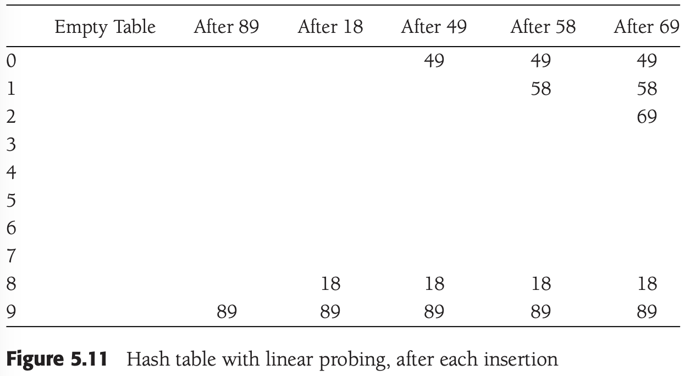
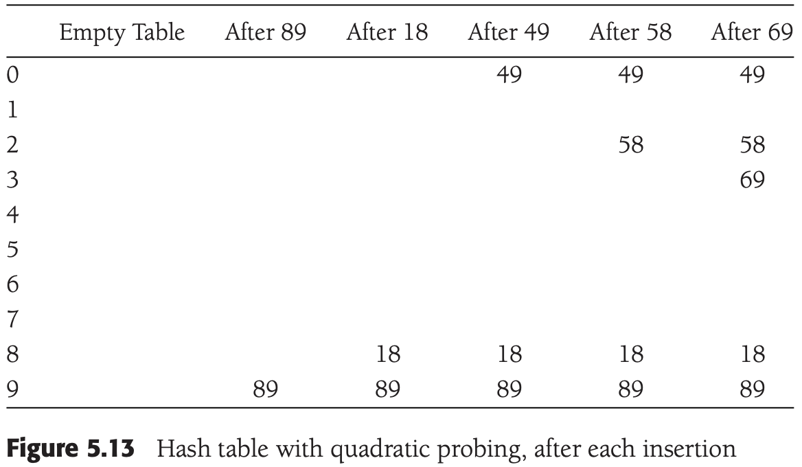
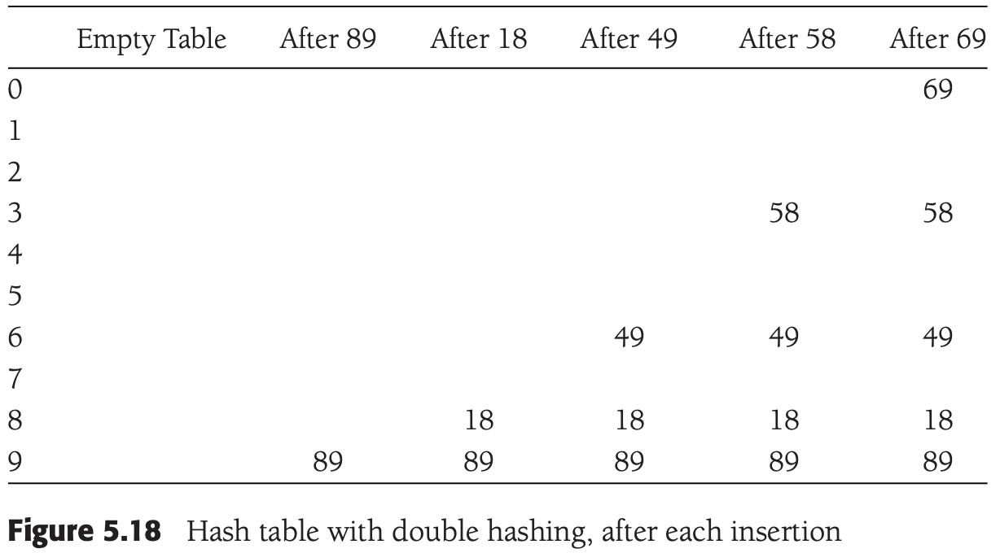
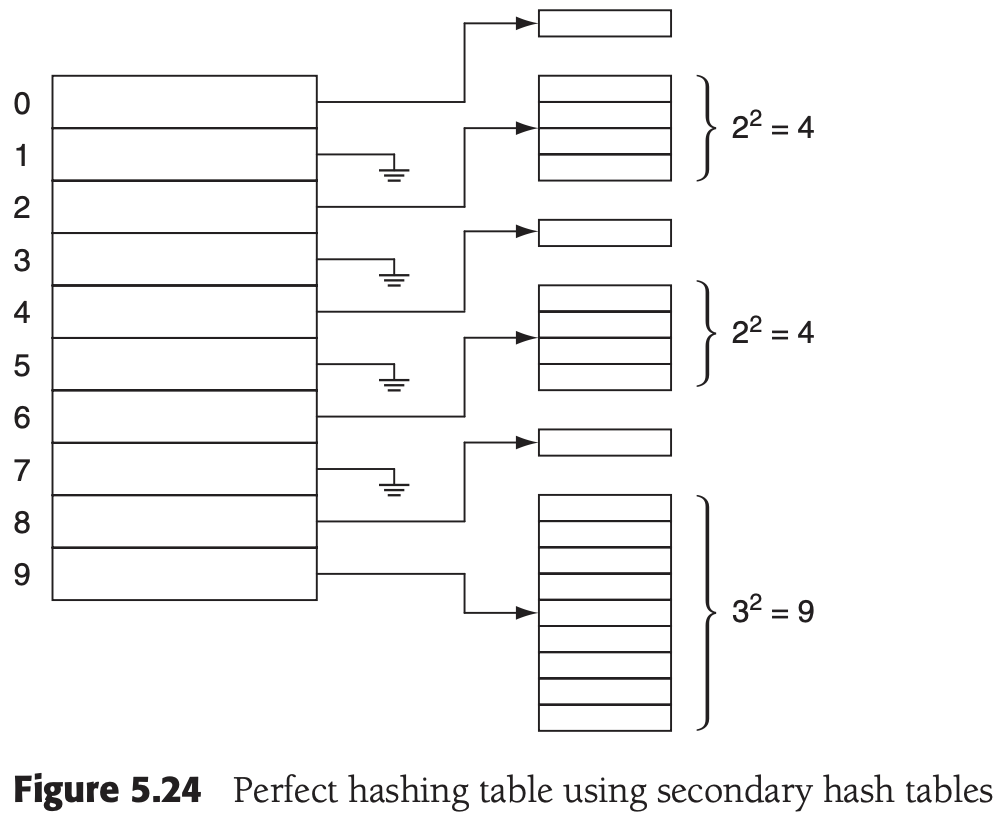

# CHAPTER 5 Hashing

[TOC]


## General Idea


**hash function**, which ideally should be simple to compute and should ensure that any two distinct keys get different cells.


## Hash Function

Example. A simple Hash Function:

```c++
// 一个简单的散列函数
int hash(const string& key, int tableSize)
{
    int hashVal = 0;
    for (int i = 0; i < key.length(); i++)
        hashVal += key[i];

    return hashVal % tableSize;
}
```

Example. Another possible hash function--not too good:

```c++
// 另一个可能的散列函数
int hash(const string& key, int tableSize)
{
    return (key[0] + 27 * key[1] + 729 * key[2]) % tableSize;
}
```

Example. A good hash function:

```c++
// 一个好的散列函数
int hash(const string& key, int tableSize)
{
    int hashVal = 0;

    for (int i = 0; i < key.length(); i++)
        hashVal = 37 * hashVal + key[i];

    hashVal %= tableSize;
    if (hashVal < 0)
        hashVal += tableSize;

    return hashVal;
}
```


## Separate Chaining

**separate chaining**: is to keep a list of all elements that hash to the same value.


## Hash Tables without Linked Lists

### Linear Probing



We can estimate the average by using an integral to calculate the mean value of the insertion time, obtaining:

$I(\lambda) = \frac{1}{\lambda} \int^{\lambda}_{0} \frac{1}{1-x} dx = \frac{1}{\lambda} ln \frac{1}{1-\lambda}$




**Theorem 5.1** If quadratic probing is used, and the table size is prime, then a new element can always be inserted if the table is at least half empty.

**Proof** Let the table size, $TableSize$, be an (odd) prime greater than 3. We show that the first $\lceil TableSize / 2 \rceil$ alternative locations (including the initial location $h_0(x)$) are all distinct. Two of these locations are $h(x) + i^2 (\text{mod TableSize})$ and $h(x) + j^2 (\text{mod TableSize}), \text{ where } 0 \leq i,j \leq \lceil TableSize / 2 \rceil$. Suppose, for the sake of contradiction, that these locations are the same, but $i \neq j$. Then:
$$
h(x) + i^2 = h(x) + j^2 &(\text{mod TableSize}) \\

i^2 = j^2 &(\text{mod TableSize}) \\

i^2 - j^2 = 0 &(\text{mod TableSize}) \\

(i-j)(i+j)=0 &(\text{mod TableSize})
$$

### Double Hashing




## Rehashing


## Hash Tables with Worst-Case O(1) Access

### Perfect hashing

**Theorem 5.2** If $N$ balls are placed into $M = N^2$ bins, the probability that no bin has more than one ball is less than $\frac{1}{2}$.

**Proof** If a $pair(i, j)$ of balls are placed in the same bin, we call that a collision. Let $C_{i, j}$ be the expected number of collisions produced by any two $balls(i, j)$. Clearly the probability that any two specified balls collide is $1/M$, and thus $C_{i,j}$ is $1/M$, since the number of collisions that involve the $pair(i, j)$ is either 0 or 1. Thus the expected number of collisions in the entire table is $\sum_{(i, j), i < j} C_{i, j}$. Since there are $N(N - 1) / 2$ pairs, this sum is $N(N - 1) / (2M) = N(N - 1) / (2N^2) < \frac{1}{2}$. Since the expected number of collisions is below $\frac{1}{2}$, the probability that there is even one collision must also be below $\frac{1}{2}$.

**Theorem 5.3** If $N$ items are placed into a primary hash table containing $N$ bins, then the total size of the secondary hash tables has expected value at most $2N$.

**Proof** Using the same logic as in the proof of Theorem 5.2, the expected number of pairwise collisions is at most $N(N - 1) / 2N$, or $(N - 1) / 2$. Let $b_i$ be the number of items that hash to position $i$ in the primary hash table; observe that $b_i^2$ space is used for this cell in the secondary hash table, and that this accounts for $b_i(b_i - 1) / 2$ pairwise collisions, which we will call $c_i$. Thus the amount of space, $b_i^2$, used for the $i$th secondary hash table is $2c_i + b_i$. The total space is then $2\sum c_i + \sum b_i$. The total number of collisions is $(N - 1) / 2$ (from the first sentence of this proof); the total number of items is of course $N$, so we obtain a total secondary space requirement of $2(N - 1) / 2 + N < 2N$.



### Hopscotch Hashing

**Hopscotch hashing** is a new algorithm that tries to improve on the classic linear probing algorithm.


## Universal Hashing

Althouth hash tables are very efficient and have constant average cost per operation assuming appropriate load factors, their analysis and performance depend on the hash function having two fundamental properties:

1. The hash function must be computable in constant time (i.e., independent of the number of items in the hash table).
2. The hash function must distribute its items uniformly among the array slots.

**Definition 5.1** A family $H$ of hash functions is `universal`, if for any $x \neq y$, the number of hash functions $h$ in $H$ for which $h(x) = h(y)$ is at most $|H|/M$.

**Definition 5.2** A family $H$ of hash functions is $k$-universal, if for any $x_1 \neq y_1, x_2 \neq y_2, ..., x_k \neq y_k$, the number of hash function $h$ in $H$ for which $h(x_1) = h(y_1), h(x_2) = h(y_2), ..., $ and $h(x_k) = h(y_k)$ is at most $|H|/M^k$.

**Theorem 5.4** The hash family $H = \{H_{a,b}(x) = ((ax + b)\ mod\ p) mod\ M, where\ 1 \leq a \leq p - 1, 0 \leq b \leq p - 1)\} \text{is universal}$ 

**extendible hashing** allows a search to be performed in two disk accesses. Insertions also require few disk accesses.

