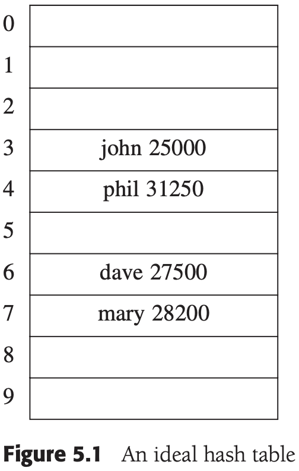
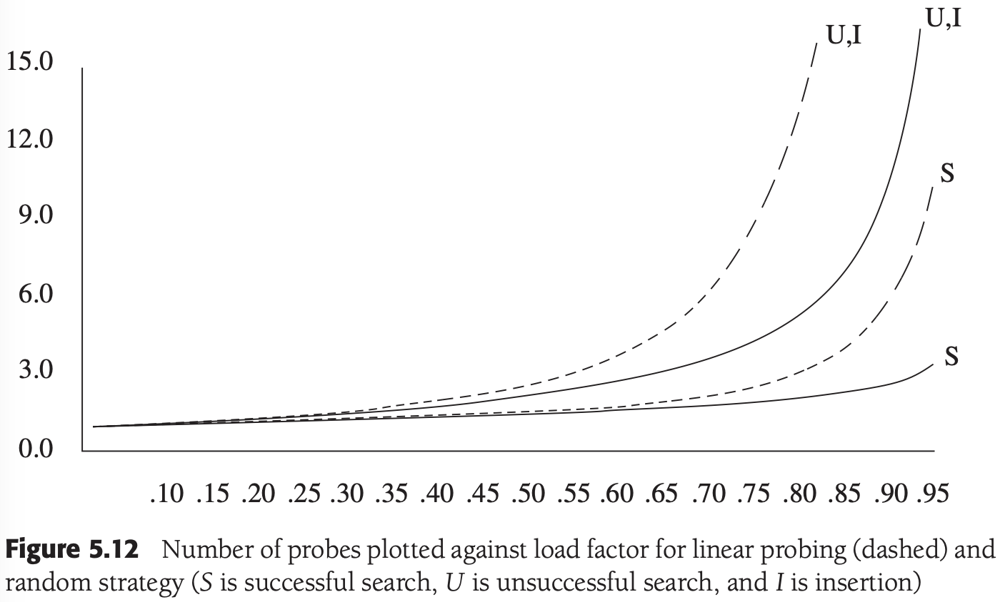

# 第五章 散列

[TOC]


## 基本思想



*一个理想的散列表*

`散列函数（hash function）` 将键映射到散列表中的适当单元（理想情况下它应该运算简单并且应该保证任何两个不同键映射到不同的单元）。


## 散列函数

一个简单的散列函数：

```c++
// 一个简单的散列函数
int hash(const string& key, int tableSize)
{
    int hashVal = 0;
    for (int i = 0; i < key.length(); i++)
        hashVal += key[i];

    return hashVal % tableSize;
}
```

另一个可能的散列函数：

```c++
// 另一个可能的散列函数
int hash(const string& key, int tableSize)
{
    return (key[0] + 27 * key[1] + 729 * key[2]) % tableSize;
}
```

一个好的散列函数：

```c++
// 一个好的散列函数
int hash(const string& key, int tableSize)
{
    int hashVal = 0;

    for (int i = 0; i < key.length(); i++)
        hashVal = 37 * hashVal + key[i];

    hashVal %= tableSize;
    if (hashVal < 0)
        hashVal += tableSize;

    return hashVal;
}
```


## 分离链接法

`分离链接法（separate chaining）` 将散列到同一个值的所有元素保留到一个链表中。


*分离链接散列表*


## 不使用链表的散列表

`探测散列表（probing hash tables）`

### 线性探测


*每次插入后使用线性探测得到的散列表*

通过使用积分计算插入时间平均值的方法来估计平均值，得到：$I(\lambda) = \frac{1}{\lambda} \int^{\lambda}_{0} \frac{1}{1-x} dx = \frac{1}{\lambda} ln \frac{1}{1-\lambda}$



*对线性探测（虚线）和随机方法的装填因子画出的探测次数（S为成功查找，U为不成功查找，而I为插入）*

### 平方探测


*在每次插入后，利用平方探测得到的散列表*

**定理5-1** 如果使用平方探测，且表的大小是素数，那么当表至少有一半是空的时候，总能够插入一个新的元素。

**证明** 令表的大小`TableSize`是一个大于3的（奇）素数。我们证明，前$\lceil TableSize/2 \rceil$个备选位置（包括初始位置$h_0(x)$）是互异的。其中的两个位置是$h(x) + i^2 (mod TableSize)$和$h(x) + j^2 (mod\ TableSize)$，其中$0 \leqslant i, j \leqslant \lfloor TableSize/2 \rfloor$。为推出矛盾，假设这两个位置相同，但$i \neq j$。有

$h(x) + i^2 = h(x) + j^2\ (mod\ TableSize)$

$i^2 = j^2\ (mod\ TableSize)$

$i^2 - j^2 = 0\ (mod\ TableSize)$

$(i-j)(i+j)=0 (mod TableSize)$

### 双散列


*使用双散列方法在每次插入后的散列表*


## 再散列


*散列表的再散列(rehashing)过程*


## 标准库中的散列表

标准库不包括set和map的散列表实现（具体的函数如`hash_set`和`hash_map`由编译器提供）


## 可扩散列

`可扩散列（extendible hashing）` 对于数据量太大以至于装不进主存的情况，允许用两次磁盘访问执行一次查找。


*可扩散列：原始数据*


*可扩散列：在100100插入及目录分裂后*


*可扩散列：在000000插入及树叶分裂后*

