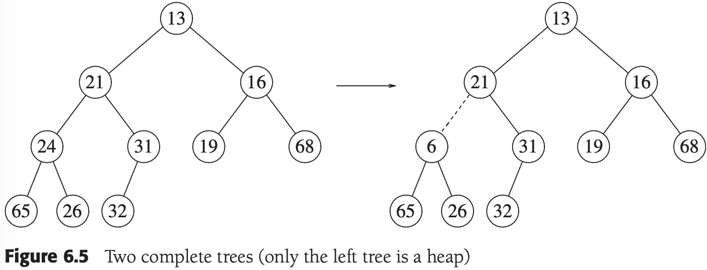
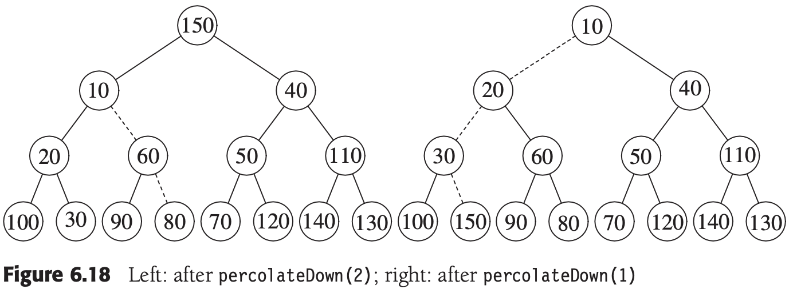
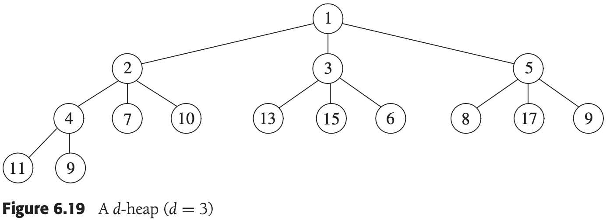
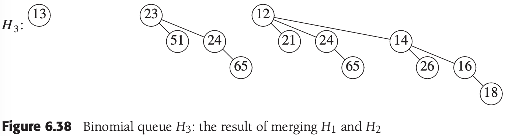
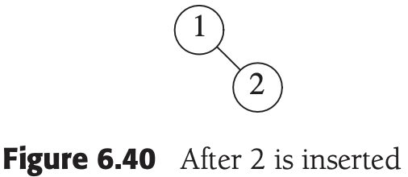

# CHAPTER 6 Priority Queues (Heaps)

[TOC]


## Model


## Binary Heap

### Structure Property

It is easy to show that a complete binary tree of height $h$ has between $2^h$ and $2^{h + 1} - 1$ nodes. This implies that the height of a complete binary tree is $\lfloor logN \rfloor$, which is clearly $O(logN)$.


### Heap-Order Property



By the heap-order property, the minimum element can always be found at the root. Thus, we get the extra operation, `findMin`, in constant time.

### Basic Heap Operations

1. insert

   

   

2. deleteMin

   

   

   


### Other Heap Operations


1. decreaseKey

   The $decreaseKey(p, \Delta)$ operation lowers the value of the item at position $p$ by a positive amount $\Delta$. Since this might violate the heap order, it must be fixed by a `percolate up`. This operation could be useful to system administrators: They can make their programs run with highest priority.

2. increaseKey

   The $increaseKey(p, \Delta)$ operation increases the value of the item at position $p$ by a positive amount $\Delta$. This is done with a `percolate down`. Many schedulers automatically drop the priority of a process that is consuming excessive CPU time.

3. remove

   The $remove(p)$ operation removes the node at position $p$ from the heap. This is done by first perfoming $decreaseKey(p, \infty)$ and then performing $delteMin()$. When a process is terminated by a user (instead of finishing normally), it must be removed from the priority queue.

4. buildHeap

   The binary heap is sometimes constructed from an initial collection of items. This constructor takes as input $N$ items and places them into a heap.




**Theorem 6.1** For the perfect binary tree of height $h$ containing $2^{h + 1} - 1$ nodes, the sum of the heights of the nodes is $2^{h + 1} - 1 - (h + 1)$.

**Proof** It is easy to see that this tree consists of 1 node at height $h$, 2 nodes at height $h - 1$, $2^2$ nodes at height $h - 2$, and in general $2^i$ nodes at height $h - i$. The sum of the heights of all the nodes is then:
$$
\begin{equation}\begin{split}
S &= \sum_{i = 0}^{h} 2^i(h - i) \\
&= h + 2(h - 1) + 4(h - 2) + 8(h - 3) + 16(h - 4) + ... + 2^{h - 1}(1) \qquad (6.1)
\end{split}\end{equation}
$$
, Multiplying by 2 gives the equation:
$$
2S = 2h + 4(h - 1) + 8(h - 2) + 16(h - 3) + ... + 2^h(1) \qquad (6.2)
$$
, We subtract these two equations and obtain Equation(6.3). We find that certain terms almost cancel. For instance, we have $2h - 2(h - 1) = 2$, $4(h - 1) - 4(h - 2) = 4$, and so on. The last term in Equation(6.2), $2^h$, does not appear in Equation(6.1); thus, it appears in Equation(6.3). The first term in Equation(6.1), $h$, does not appear in Equation(6.2); thus, $-h$ appears in Equation(6.3). We obtain:
$$
S = -h + 2 + 4 + 8 + ... + 2^{h - 1} + 2^h = (2^{h + 1} - 1) - (h + 1) \qquad (6.3)
$$
, which proves the theorem.

Example. implement of binary heap:

```c++
#include <vector>
#include <exception>

template <typename Comparable>
class BinaryHeap
{
public:
    explicit BinaryHeap(int capacity = 100);
    explicit BinaryHeap(const std::vector<Comparable>& items)
        : array(items.size() + 10), currentSize(items.size()) {
        for (int i = 0; i < items.size(); i++)
            array[i + 1] = items[i];
        buildHeap();
    };

    bool isEmpty() const;
    const Comparable& findMin() const;

    void insert(const Comparable& x) {
        if (currentSize == array.size() - 1)
            array.resize(array.size() * 2);
        int hole = ++currentSize;
        for (; hole > 1 && x < array[hole / 2]; hole /= 2)
            array[hole] = array[hole / 2];
        array[hole] = x;
    }
    void deleteMin() {
        if (isEmpty())
            throw UnderflowException();
        array[1] = array[currentSize--];
        percolateDown(1);
    }
    void deleteMin(Comparable& minItem) {
        if (isEmpty())
            throw UnderflowException();
        minItem = array[1];
        array[1] = array[currentSize--];
        percolateDown(1);
    }
    void makeEmpty();

private:
    int                     currentSize;
    std::vector<Comparable> array;

    void buildHeap() {
        for (int i = currentSize / 2; i > 0; i--)
            percolateDown(i);
    }
    void percolateDown(int hole) {
        int child;
        Comparable tmp = array[hole];
        for (; hole * 2 <= currentSize; hole = child) {
            child = hole * 2;
            if (child != currentSize && array[child + 1] < array[child])
                child++;
            if (array[child] < tmp)
                array[hole] = array[child];
            else
                break;
        }
        array[hole] = tmp;
    }
};
```


## Applications of Priority Queues

### The Selection Problem

We give two algorithms here, both of which run in $O(NlogN)$ in the extreme case of $k = \lceil N/2 \rceil$, which is a distinct improvement:

1. Algorithm 6A

   We read the $N$ elements into an array. We then apply the `buildHeap` algorithm to this array. Finally, we perform $k$ `deleteMin` operations. The last element extracted from the heap is our answer. It should be clear that by changing the heap-order property, we could solve the original problem of finding the $k$th largest element.

2. Algorithm 6B

   For the second algorithm, we return to the original problem and find the $k$th largest element. We use the idea from algorithm 1B. At any point in time we will maintain a set $S$ of the $k$ largest elements. After the first $k$ elements are read, when a new element is read it is compared with the $k$th largest element, which we denote by $S_k$. Notice that $S_k$ is the smallest element in $S$. If the new element is larger, then it replaces $S_k$ in $S$. $S$ will then have a new smallest element, which may or may not be the newly added element. At the end of the input, we find the smallest element in $S$ and return it as the answer.


## d-Heaps

**d-heap**, which is exactly like a binary heap except that all nodes have $d$ children (thus, a binary heap is a 2-heap).




## Leftist Heaps

Like a binary heap, a **leftist heap** has both a structural property and an ordering property. Indeed, a leftist heap, like virtually all heaps used, has the same heap-order property we have already seen. Furthermore, a leftist heap is also a binary tree. The only difference between a leftist heap and a binary heap is that leftist heaps are not perfectly balanced, but actually attempt to be very unbalanced.

### Leftist Heap Property

We define the **null path length**, $npl(X)$, of any node $X$ to be the length of the shortest path from $X$ to a node without two children. Thus, the `npl` of a node with zero or one child is 0, while $npl(nullptr) = -1$.


The leftist heap property is that for every node $X$ in the heap, the null path length of the left child is at least as large as that of the right child.

**Theorem 6.2** A leftist tree with $r$ nodes on the right path must have at least $2^r - 1$ nodes.

**Proof** The proof is by induction. If $r = 1$, there must be at least one tree node. Otherwise, suppose that the theorem is true for $1, 2, ..., r$. Consider a leftist tree with $r + 1$ nodes on the right path. Then the root has a right subtree with $r$ nodes on the right path, and a left subtree with at least $r$ nodes on the right path (otherwise it would not be leftist). Applying the inductive hypothesis to these subtrees yields a minimum of $2^r - 1$ nodes in each subtree. This plus the root gives at least $2^{r+1} - 1$ nodes in the tree, proving the theorem.

From this theorem, it follows immediately that a leftist tree of $N$ nodes has a right path containing at most $\lfloor log(N + 1) \rfloor$ nodes.

### Leftist Heap Operations


Example. the implement of LeftistHeap:

```c++

template <typename Comparable>
class LeftistHeap
{
public:
    LeftistHeap();
    LeftistHeap(const LeftistHeap& rhs);
    ~LeftistHeap();

    bool isEmpty() const;
    const Comparable& findMin() const;
    void insert(const Comparable& x) { root = merge(new LeftistNode(x), root); };
    void deleteMin() {
        if (isEmpty())
            throw UnderflowException();
        LeftistNode *oldRoot = root;
        root = merge(root->left, root->right);
        delete oldRoot;
    };
    void deleteMin(Comparable& minItem) {
        minItem = findMin(); deleteMin();
    };
    void makeEmpty();
    void merge(LeftistHeap& rhs) {
        if (this == &rhs)
            return;
        root = merge(root, rhs.root);
        rhs.root = NULL;
    };
    const LeftistHeap& operator=(const LeftistHeap& rhs);

private:
    struct LeftistNode
    {
        Comparable   element;
        LeftistNode *left;
        LeftistNode *right;
        int          npl;

        LeftistNode(const Comparable& theElement, LeftistNode *lt = NULL, 
                    LeftistNode *rt = NULL, int np = 0)
            : element(theElement), left(lt), right(rt), npl(np) {}
    };

    LeftistNode *root;

    LeftistNode *merge(LeftistNode *h1, LeftistNode *h2) {
        if (h1 == NULL)
            return h2;
        if (h2 == NULL)
            return h1;
        if (h1->element < h2->element)
            return merge1(h1, h2);
        else
            return merge1(h2, h1);
    };
    LeftistNode *merge1(LeftistNode *h1, LeftistNode *h2) {
        if (h1->left == NULL)
            h1->left = h2;
        else {
            h1->right = merge(h1->right, h2);
            if (h1->left->npl < h1->right->npl)
                swapChildren(h1);
            h1->npl = h1->right->npl + 1;
        }
        return h1;
    };
    void swapChildren(LeftistNode *t);
    void reclaimMemory(LeftistNode *t);
    LeftistNode *clone(LeftistNode *t) const;
};
```


## Skew Heaps

A **skew heap** is a self-adjusting version of a leftist heap that is incredibly simple to implement.


## Binomial Queues

### Binomial Queue Structure

**Binomial queues** differe from all the priority queue implementations that we have seen in that a binomial queue is not a heap-ordered tree but rather a `collection` of heap-ordered trees, known as a **forest**. Each of the heap-ordered trees is of a constrained form known as a **binomial tree**.

### Binomial Queue Operations

The minimum element can then be found by scanning the roots of all the trees. Since there are at most log $N$ different trees, the minimum can be found in $O(log N)$ time.








### Implementation of Binomial Queues


Example. Binomial queue class interface and node definition:

```c++
template <typename Comparable>
class BinomialQueue
{
public:
    BinomialQueue();
    BinomialQueue(const Comparable& item);
    BinomialQueue(const BinomialQueue& rhs);
    ~BinomialQueue();

    bool isEmpty() const;
    const Comparable& findMin() const;
    void insert(const Comparable& x);
    void deleteMin();
    void deleteMin(Comparable& minItem) {
        if (isEmpty())
            throw UnderflowException();
        int minIndex = findMinIndex();
        minItem = theTrees[minIndex]->element;
        
        BinomialNode* oldRoot = theTrees[minIndex];
        BinomialNode* deletedTree = oldRoot->leftChild;
        delete oldRoot;

        // Construct H''
        BinomialQueue deletedQueue;
        deletedQueue.theTrees.resize(minIndex + 1);
        deletedQueue.currentSize = (1 << minIndex) - 1;
        for (int j = minIndex - 1; j >= 0; j--) {
            deletedQueue.theTrees[j] = deletedTree;
            deletedTree = deletedTree->nextsibling;
            deletedQueue.theTrees[j]->nextSibling = NULL;
        }

        // Construct H'
        theTrees[minIndex] = NULL;
        currentSize -= deletedQueue.currentSize + 1;

        merge(deletedQueue);
    };
    void makeEmpty();
    void merge(BinomialQueue& rhs) {
        if (this == &rhs)
            return;
        currentSize += rhs.currentSize;
        if (currentSize > capacity()) {
            int oldNumTrees = theTrees.size();
            int newNumTrees = max(theTrees.size(), rhs.theTrees.size()) + 1;
            theTrees.resize(newNumTrees);
            for (int i = oldNumTrees; i < newNumTrees; i++)
                theTrees[i] = NULL;
        }
        BinomialNode* carry = NULL:
        for (int i = 0, j = 1; j < = currentSize; i++, j *= 2) {
            BinomialNode* t1 = theTrees[i];
            BinomialNode* t2 = i < rhs.theTrees.size() ? rhs.theTrees[i] : NULL;
            int whichCase = t1 == NULL ? 0 : 1;
            whichCase += t2 == NULL ? 0 : 2;
            whichCase += carry = NULL ? 0 : 4;
            switch (whichCase)
            {
                case 0:
                case 1:
                    break;
                case 2:
                    theTrees[i] = t2;
                    rhs.theTrees[i] = NULL;
                    break;
                case 4:
                    theTrees[i] = carry;
                    carry = NULL;
                    break;
                case 3:
                    carry = combineTrees(t1, t2);
                    theTrees[i] = rhs.theTrees[i] = NULL;
                    break;
                case 5:
                    carry = combineTrees(t1, carry);
                    theTrees[i] = NULL;
                    break;
                case 6:
                    carry = combineTrees(t2, carry);
                    rhs.theTrees[i] = NULL;
                    break;
                case 7:
                    theTrees[i] = carry;
                    carry = combineTrees(t1, t2);
                    rhs.theTrees[i] = NULL;
                    break;
            }
        }
        for (int k = 0; k < rhs.theTrees.size(); k++)
            rhs.theTrees[k] = NULL;
        rhs.currentSize = 0;
    };
    const BinomialQueue& operator=(const BinomialQueue& rhs);

private:
    struct BinomialNode
    {
        Comparable   element;
        BinomialNode *leftChild;
        BinomialNode *nextSibling;
        BinomialNode(const Comparable& theElement, BinomialNode *lt, BinomialNode *rt)
            : element(theElement), leftChild(lt), nextSibling(rt) {}
    };
    enum { DEFAULT_TREES = 1 };

    int currentSize;
    std::vector<BinomialNode*> theTrees;

    int findMinIndex() const {
        int i;
        int minIndex;
        for (i = 0; theTrees[i] == NULL; i++) {}
        for (minIndex = i; i < theTrees.size(); i++)
            if (theTrees[i] != NULL && 
                theTrees[i]->element < theTrees[minIndex]->element)
                minIndex = i;
        return minIndex;
    };
    int capacity() const;
    BinomialNode* combineTrees(BinomialNode *t1, BinomialNode *t2) {
        if (t2->element < t1->element)
            return combineTrees(t2, t1);
        t2->nextSibling = t1->leftChild;
        t1->leftChild = t2;
        return t1;
    };
    void makeEmpty(BinomialNode * & t);
    BinomialNode* clone(BinomialNode* t) const;
};
```


## Priority Queues in the Standard Library

```c++
#include <iostream>
#include <vector>
#include <queue>
#include <functional>
#include <string>

template <typename PriorityQueue>
void dumpContents(const std::string &msg, PriorityQueue &pq)
{
    std::cout << msg << ":" << std::endl;
    while (!pq.empty())
    {
        std::cout << pq.top() << std::endl;
        pq.pop();
    }
}

int main()
{
    std::priority_queue<int>                                       maxPQ;
    std::priority_queue<int, std::vector<int>, std::greater<int> > minPQ;

    minPQ.push(4); minPQ.push(3); minPQ.push(5);
    maxPQ.push(4); maxPQ.push(3); maxPQ.push(5);

    dumpContents("minPQ", minPQ); // 3 4 5
    dumpContents("maxPQ", maxPQ); // 5 4 3

    return 0;
}
```


