# 第六章 优先队列（堆）

[TOC]


## 6.1 模型


*优先队列的基本模型*


## 6.2 一些简单的实现


## 6.3 二叉堆

`二叉堆(binary heap)`

### 6.3.1 结构性质

容易证明，一棵高为$h$的完全二叉树有$2^h$到$2^{h+1} - 1$个结点；这意味着，完全二叉树的高是$\lfloor logN \rfloor$，显然它是$O(logN)$。

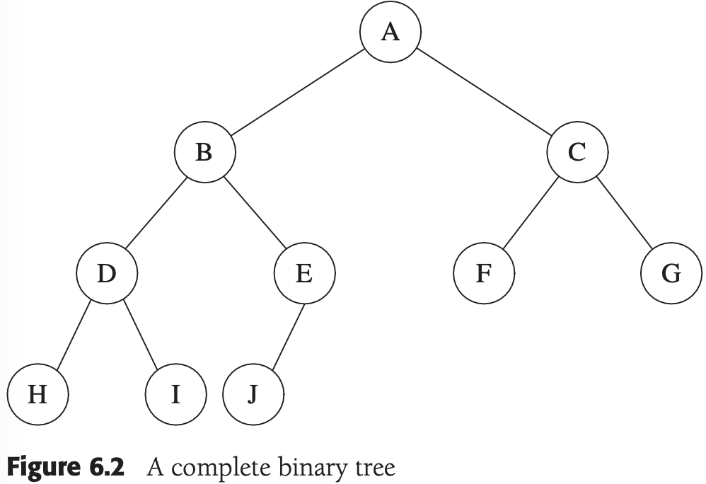

*一棵完全二叉树*


*完全二叉树的数组实现*

### 6.3.2 堆序性质


*两棵完全树（只有左边的树是堆）*

根据堆序性质，最小元总可以在根处找到。因此，我们以常数时间得到附加操作findMin。

### 6.3.3 基本的堆操作

1. insert

   

   *尝试插入14：创建一个空穴，再将空穴上冒*

   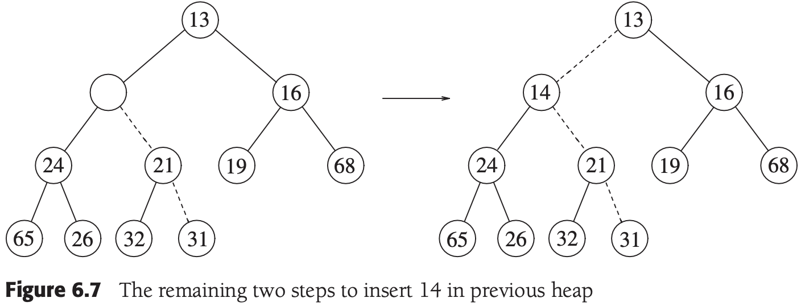

   *将14插入到前面的堆中的最后两步*

2. deleteMin

   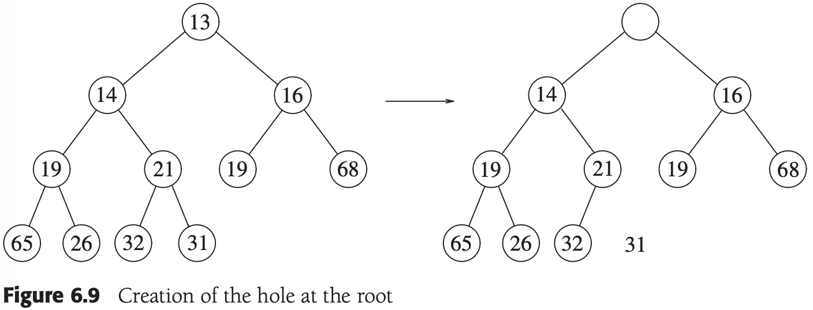

   *在根处建立空穴*

   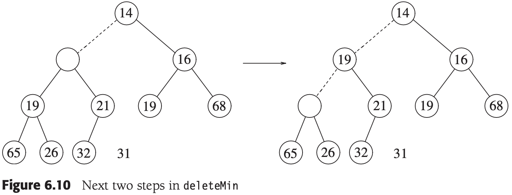

   *在deleteMin中的接下来的两步*

   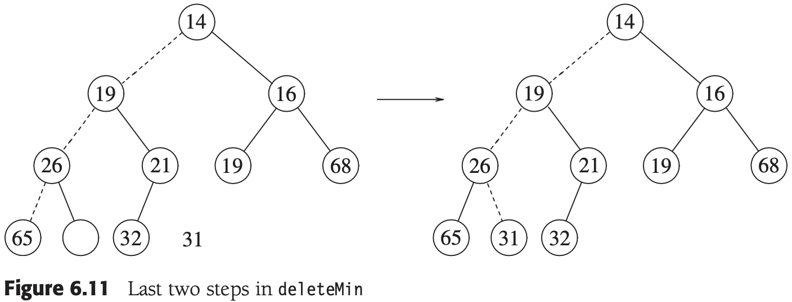

   *在deleteMin中的最后两步*

### 6.3.4 堆的其它操作

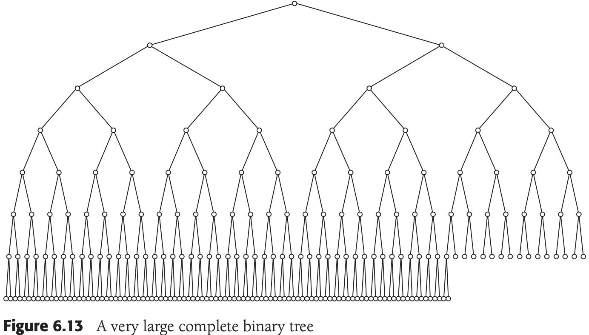

*一棵巨大的完全二叉树*

1. decreaseKey

   $decreaseKey(p, \Delta)$操作减小在位置$p$处的元素的值，减小的幅度为正的量$\Delta$。由于这可能破坏堆序性质，因此必须通过上滤操作对堆进行调整。该操作对系统管理员是有用的：系统管理程序能够使它们的程序以最高的优先级来运行。

2. increaseKey

   $increaseKey(p, \Delta)$操作增加在位置$p$处的元素的值，增加的幅度为正的量$\Delta$。这可以用下滤来完成。许多调度程序自动地降低过多消耗CPU时间的进程的优先级。

3. remove

   $remove(p)$操作删除堆中位置$p$上的结点。这通过首先执行$decreaseKey(p, \infty)$然后再执行`delteMin()`来完成。当一个进程由用户中止（而不是正常终止）时，必须将其从优先队列中除去。

4. buildHeap

   通过项的原始集合来构造，这个构造函数将$N$项作为输入并把它们放入一个堆中。

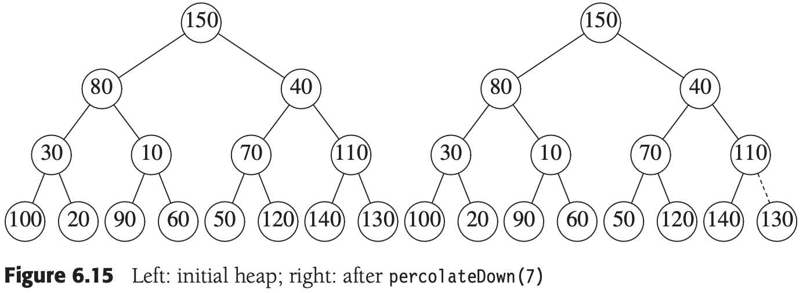

*左 - 初始堆；右 - 在percolateDown(7)之后*


*左 - percolateDown(6)之后；右 - percolateDown(5)之后*

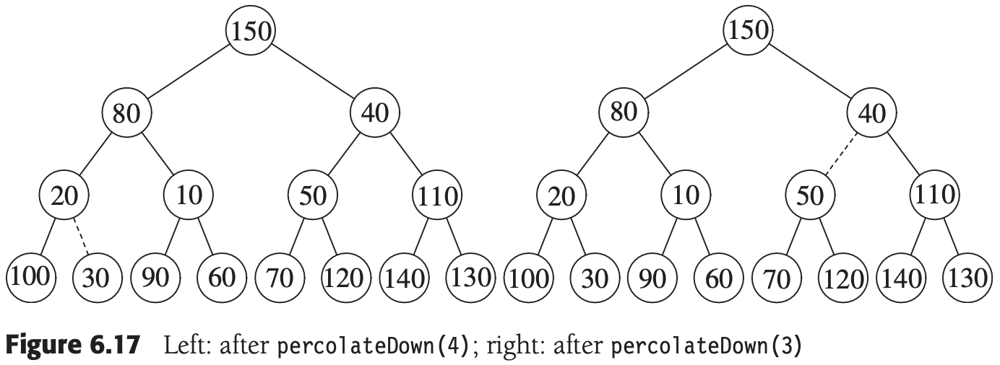

*左 - percolateDown(4)之后；右 - percolateDown(3)之后*


*左 - percolateDown(2)之后；右 - percolateDown(1)之后*

**定理6.1** 包含$2^{h+1} - 1$个结点且高为$h$的理想二叉树（perfect binary tree）的结点的高度和为$2^{h+1} - 1 - (h + 1)$。

**证明** 容易看出，该树由高度$h$上的1个结点，高度$h - 1$上的2个结点，高度$h - 2$上的$2^2$个结点以及一般在高度$h - i$上的$2^i$个结点组成。则所有结点的高度和为：

$S = \sum_{i = 0}^{h} 2^i(h - i)$

$= h + 2(h - 1) + 4(h - 2) + 8(h - 3) + 16(h - 4) + ... + 2^{h - 1}(1) \qquad (6.1)$

两边乘以$2$得到方程：

$2S = 2h + 4(h - 1) + 8(h - 2) + 16(h - 3) + ... + 2^h(1) \qquad (6.2)$

将这两个方程相减得到方程$(6.3)$。我们发现，非常数项几乎都消去了，例如我们有$2h - 2(h - 1) = 2$, $4(h - 1) - 4(h - 2) = 4$，等等。方程$(6.2)$的最后一项$2^h$在方程$(6.1)$中不出现；因此，它出现在方程$(6.3)$中。方程$(6.1)$中的第一项$h$在方程$(6.2)$中不出现；因此，$-h$出现在方程$(6.3)$中。我们得到：

$S = -h + 2 + 4 + 8 + ... + 2^{h - 1} + 2^h = (2^{h + 1} - 1) - (h + 1) \qquad (6.3)$

定理得证。

例，二叉堆实现：

```c++
#include <vector>
#include <exception>

template <typename Comparable>
class BinaryHeap
{
public:
    explicit BinaryHeap(int capacity = 100);
    explicit BinaryHeap(const std::vector<Comparable>& items)
        : array(items.size() + 10), currentSize(items.size()) {
        for (int i = 0; i < items.size(); i++)
            array[i + 1] = items[i];
        buildHeap();
    };

    bool isEmpty() const;
    const Comparable& findMin() const;

    void insert(const Comparable& x) {
        if (currentSize == array.size() - 1)
            array.resize(array.size() * 2);
        int hole = ++currentSize;
        for (; hole > 1 && x < array[hole / 2]; hole /= 2)
            array[hole] = array[hole / 2];
        array[hole] = x;
    }
    void deleteMin() {
        if (isEmpty())
            throw UnderflowException();
        array[1] = array[currentSize--];
        percolateDown(1);
    }
    void deleteMin(Comparable& minItem) {
        if (isEmpty())
            throw UnderflowException();
        minItem = array[1];
        array[1] = array[currentSize--];
        percolateDown(1);
    }
    void makeEmpty();

private:
    int                     currentSize;
    std::vector<Comparable> array;

    void buildHeap() {
        for (int i = currentSize / 2; i > 0; i--)
            percolateDown(i);
    }
    void percolateDown(int hole) {
        int child;
        Comparable tmp = array[hole];
        for (; hole * 2 <= currentSize; hole = child) {
            child = hole * 2;
            if (child != currentSize && array[child + 1] < array[child])
                child++;
            if (array[child] < tmp)
                array[hole] = array[child];
            else
                break;
        }
        array[hole] = tmp;
    }
};
```


## 6.4 优先队列的应用

### 6.4.1 选择问题

对于`选择问题`，以下两个算法，在$k = \lceil N/2 \rceil$的极端情形下，这两个算法都以$O(NlogN)$时间运行：

1. 算法6A

   先将$N$个元素读入一个数组，然后对该数组应用`buildHeap算法`。最后，执行$k$次deleteMin操作。最后从该堆提取的元素就是正确答案。显然，只要改变堆序性质，就可以求解原始的问题：找出第$k$个最大的元素。

2. 算法6B

   在任一时刻都将维持$k$个最大元素的集合$S$。在前$k$个元素读入以后，当再读入一个新的元素时，该元素将与第$k$个最大元素进行比较，设第$k$个最大的元素为$S_k$。注意，$S_k$是$S$中最小的元素。如果新的元素更大，那么用新元素代替$S$中的$S_k$。此时，$S$将有一个新的最小元素，它可能是新添加进来的元素，也可能不是。再输入完成时，我们找到$S$中的最小元素，将其返回，它就是该问题的答案。

### 6.4.2 事件模拟

TODO


## 6.5 d堆

d堆是二叉堆的简单推广，它与二叉堆很像，但其所有的结点都有d个儿子（二叉堆是2堆）。


*一个3堆（d == 3）*


## 6.6 左式堆

`左式堆（leftist heap）`像二叉堆那样既有结构性质，又有堆序性质；和所有使用的堆一样，左式堆具有相同的堆序性质，左式堆也是二叉树。左式堆和二叉堆唯一的区别是：左式堆不是理想平衡的（perfectly balanced），而且事实上是趋于非常不平衡的。

### 6.6.1 左式堆性质

把任一结点$X$的`零路径长（null path length）`$npl(X)$定义为从$X$到一个不具有两个儿子的结点的最短路径的长；因此，具有0个或1个儿子的结点的$npl$为0，而$npl(NULL) = -1$。

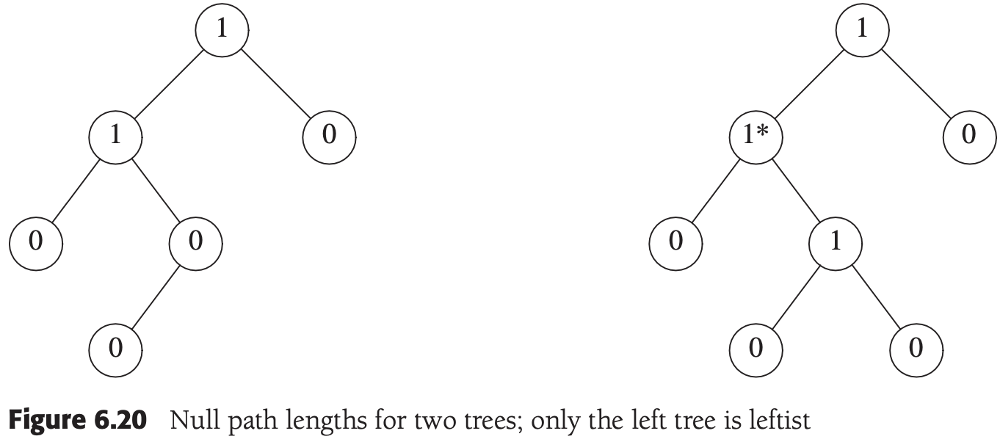

*两棵树的零路径长；只有左边的树是左式的*

左式堆性质：对于堆中的每一个结点$X$，左儿子的零路径长至少与右儿子的零路径长一样大。

**定理6.2** 在右路径上有$r$个结点的左式树必然至少有$2^r - 1$个结点。

**证明** 数学归纳法证明。如果$r = 1$，则必然至少存在一个树结点。其次，设定理对$1, 2, ..., r$个结点成立。考虑在右路径上有$r + 1$个结点的左式树。此时，根具有在右路径上含有$r$个结点的右子树，以及在右路径上至少含有$r$个结点的左子树（否则它就不是左式树）。对这两条子树应用归纳假设，得知在每棵子树上最少有$2^r - 1$个结点，再加上根结点，于是在该树上至少有$2^{r+1} - 1$个结点，定理得证。

从上述定理可以得到：$N$个结点的左式树有一条右路径最多含有$\lfloor log(N + 1) \rfloor$个结点。

### 6.6.2 左式堆操作

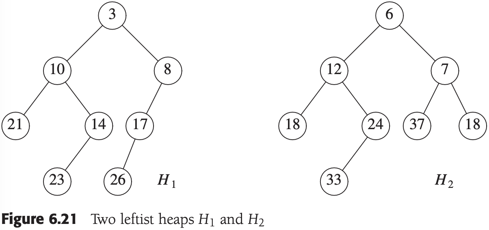

*两个左式堆$H_1$和$H_2$*


*将H_2与H_1的右子堆合并的结果*


*将前面图中的左式堆作为$H_1$的右儿子接上后的结果*


*交换$H_1$的根的儿子得到的结果*

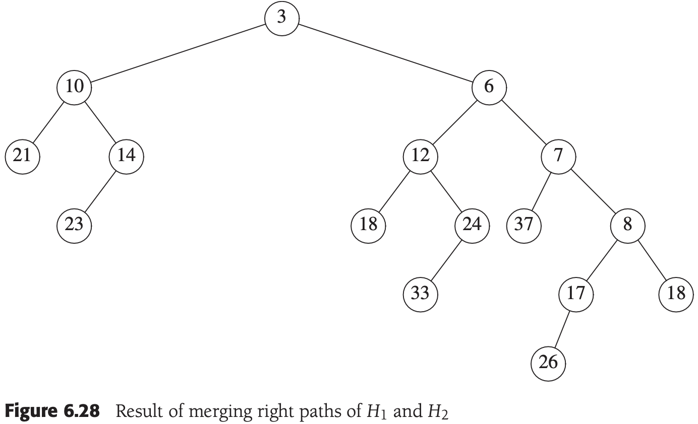

*合并$H_1$和$H_2$的右路径的结果*

例，左式堆实现：

```c++

template <typename Comparable>
class LeftistHeap
{
public:
    LeftistHeap();
    LeftistHeap(const LeftistHeap& rhs);
    ~LeftistHeap();

    bool isEmpty() const;
    const Comparable& findMin() const;
    void insert(const Comparable& x) { root = merge(new LeftistNode(x), root); };
    void deleteMin() {
        if (isEmpty())
            throw UnderflowException();
        LeftistNode *oldRoot = root;
        root = merge(root->left, root->right);
        delete oldRoot;
    };
    void deleteMin(Comparable& minItem) {
        minItem = findMin(); deleteMin();
    };
    void makeEmpty();
    void merge(LeftistHeap& rhs) {
        if (this == &rhs)
            return;
        root = merge(root, rhs.root);
        rhs.root = NULL;
    };
    const LeftistHeap& operator=(const LeftistHeap& rhs);

private:
    struct LeftistNode
    {
        Comparable   element;
        LeftistNode *left;
        LeftistNode *right;
        int          npl;

        LeftistNode(const Comparable& theElement, LeftistNode *lt = NULL, 
                    LeftistNode *rt = NULL, int np = 0)
            : element(theElement), left(lt), right(rt), npl(np) {}
    };

    LeftistNode *root;

    LeftistNode *merge(LeftistNode *h1, LeftistNode *h2) {
        if (h1 == NULL)
            return h2;
        if (h2 == NULL)
            return h1;
        if (h1->element < h2->element)
            return merge1(h1, h2);
        else
            return merge1(h2, h1);
    };
    LeftistNode *merge1(LeftistNode *h1, LeftistNode *h2) {
        if (h1->left == NULL)
            h1->left = h2;
        else {
            h1->right = merge(h1->right, h2);
            if (h1->left->npl < h1->right->npl)
                swapChildren(h1);
            h1->npl = h1->right->npl + 1;
        }
        return h1;
    };
    void swapChildren(LeftistNode *t);
    void reclaimMemory(LeftistNode *t);
    LeftistNode *clone(LeftistNode *t) const;
};
```


## 6.7 斜堆

`斜堆（skew heap）`是具有堆序的二叉树，但是不存在对树的结构限制。

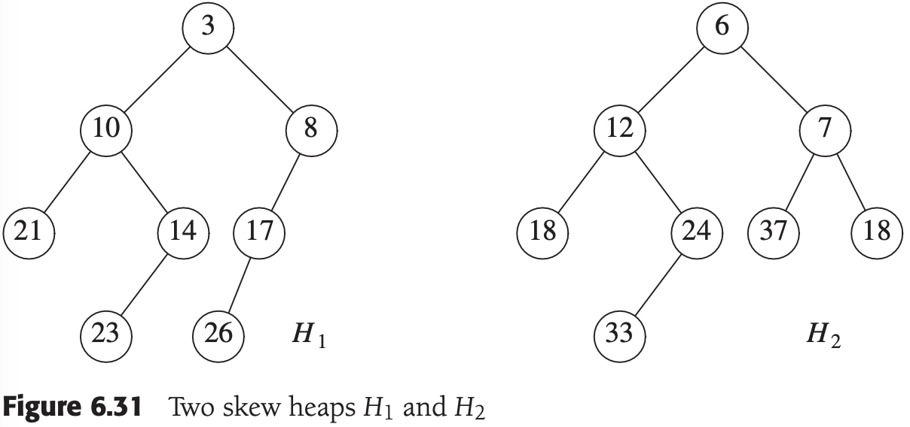

*两个斜堆$H_1$和$H_2$*


*将$H_2$与$H_1$的右子堆合并的结果*

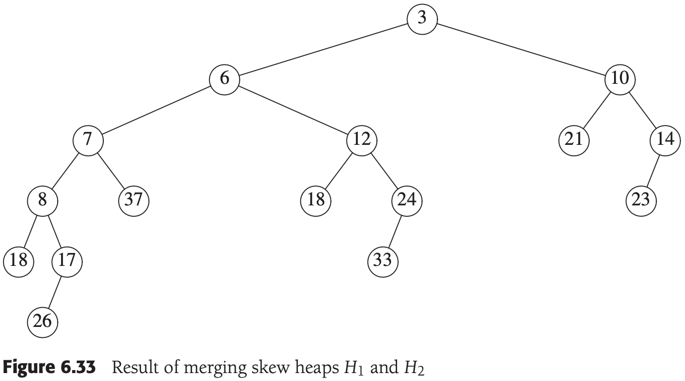

*合并斜堆$H_1$和$H_2$的结果*


## 6.8 二项队列

### 6.8.1 二项队列结构

`二项队列（binomial queue）`不是一棵堆序的树，而是堆序的树的集合，称为**森林（forest）**。


*二项树$B_0, B_1, B_2, B_3以及B_4$*

二项树$B_k$由一个带有儿子$B_0, B_1, ..., B_{k - 1}$的根组成。高度为$k$的二项树恰好有$2^k$个结点，而在深度$d$处的结点数是二项系数${k \choose d}$。如果我们把堆序施加到二项树上并允许任意高度上最多一棵二项树，那么我们能够用二项树的集合唯一地表示任意大小的优先队列。

例，6个元素的优先队列可以表示为下图的形状：


*具有6个元素的二项队列$H_1$*

### 6.8.2 二项队列操作

最小元可以通过搜索所有树的根来找出，由于最多有$logN$棵不同的树，因此最小元可以以$O(logN)$时间找到。

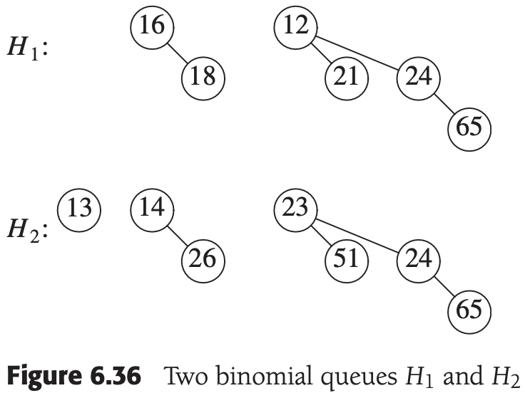

*两个二项队列$H_1$和$H_2$*


*$H_1$和$H_2$中两棵$B_1$树合并*


*二项队列$H_3$：合并$H_1$和$H_2$的结果*

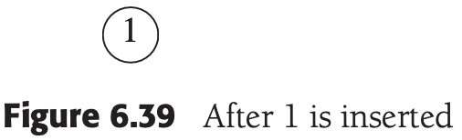

*依次插入1~7来构成一个二项队列*

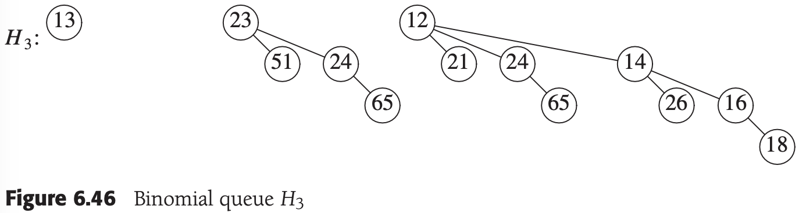

*二项队列$H_3$*

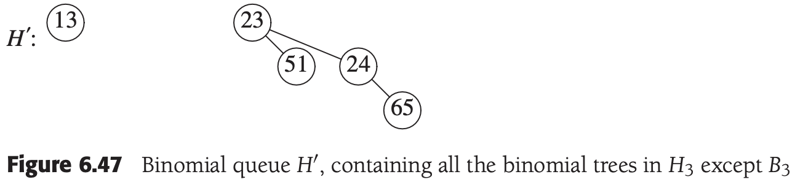

*二项队列H'，包含除$B_3$外的$H_3$中所有的二项树*

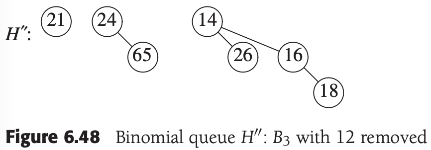

*二项队列H''：除去$12$后的$B_3$*

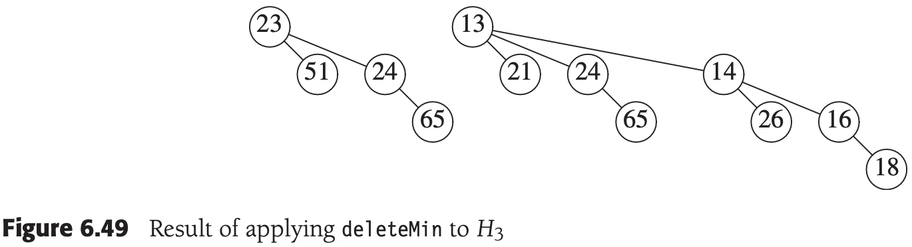

*deleteMin应用到$H_3$的结果*

### 6.8.3 二项队列的实现

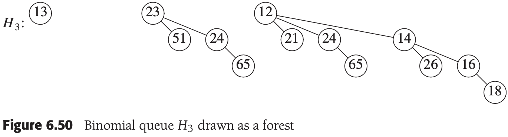

*画成森林的二项队列$H_3$*

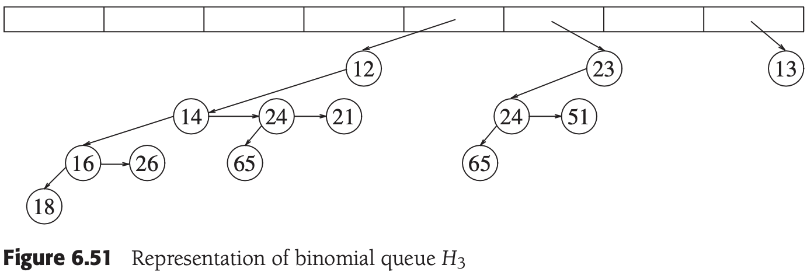

*二项队列$H_3$的表示方式*


*合并两棵二项树*

```c++
template <typename Comparable>
class BinomialQueue
{
public:
    BinomialQueue();
    BinomialQueue(const Comparable& item);
    BinomialQueue(const BinomialQueue& rhs);
    ~BinomialQueue();

    bool isEmpty() const;
    const Comparable& findMin() const;
    void insert(const Comparable& x);
    void deleteMin();
    void deleteMin(Comparable& minItem) {
        if (isEmpty())
            throw UnderflowException();
        int minIndex = findMinIndex();
        minItem = theTrees[minIndex]->element;
        
        BinomialNode* oldRoot = theTrees[minIndex];
        BinomialNode* deletedTree = oldRoot->leftChild;
        delete oldRoot;

        // Construct H''
        BinomialQueue deletedQueue;
        deletedQueue.theTrees.resize(minIndex + 1);
        deletedQueue.currentSize = (1 << minIndex) - 1;
        for (int j = minIndex - 1; j >= 0; j--) {
            deletedQueue.theTrees[j] = deletedTree;
            deletedTree = deletedTree->nextsibling;
            deletedQueue.theTrees[j]->nextSibling = NULL;
        }

        // Construct H'
        theTrees[minIndex] = NULL;
        currentSize -= deletedQueue.currentSize + 1;

        merge(deletedQueue);
    };
    void makeEmpty();
    void merge(BinomialQueue& rhs) {
        if (this == &rhs)
            return;
        currentSize += rhs.currentSize;
        if (currentSize > capacity()) {
            int oldNumTrees = theTrees.size();
            int newNumTrees = max(theTrees.size(), rhs.theTrees.size()) + 1;
            theTrees.resize(newNumTrees);
            for (int i = oldNumTrees; i < newNumTrees; i++)
                theTrees[i] = NULL;
        }
        BinomialNode* carry = NULL:
        for (int i = 0, j = 1; j < = currentSize; i++, j *= 2) {
            BinomialNode* t1 = theTrees[i];
            BinomialNode* t2 = i < rhs.theTrees.size() ? rhs.theTrees[i] : NULL;
            int whichCase = t1 == NULL ? 0 : 1;
            whichCase += t2 == NULL ? 0 : 2;
            whichCase += carry = NULL ? 0 : 4;
            switch (whichCase)
            {
                case 0:
                case 1:
                    break;
                case 2:
                    theTrees[i] = t2;
                    rhs.theTrees[i] = NULL;
                    break;
                case 4:
                    theTrees[i] = carry;
                    carry = NULL;
                    break;
                case 3:
                    carry = combineTrees(t1, t2);
                    theTrees[i] = rhs.theTrees[i] = NULL;
                    break;
                case 5:
                    carry = combineTrees(t1, carry);
                    theTrees[i] = NULL;
                    break;
                case 6:
                    carry = combineTrees(t2, carry);
                    rhs.theTrees[i] = NULL;
                    break;
                case 7:
                    theTrees[i] = carry;
                    carry = combineTrees(t1, t2);
                    rhs.theTrees[i] = NULL;
                    break;
            }
        }
        for (int k = 0; k < rhs.theTrees.size(); k++)
            rhs.theTrees[k] = NULL;
        rhs.currentSize = 0;
    };
    const BinomialQueue& operator=(const BinomialQueue& rhs);

private:
    struct BinomialNode
    {
        Comparable   element;
        BinomialNode *leftChild;
        BinomialNode *nextSibling;
        BinomialNode(const Comparable& theElement, BinomialNode *lt, BinomialNode *rt)
            : element(theElement), leftChild(lt), nextSibling(rt) {}
    };
    enum { DEFAULT_TREES = 1 };

    int currentSize;
    std::vector<BinomialNode*> theTrees;

    int findMinIndex() const {
        int i;
        int minIndex;
        for (i = 0; theTrees[i] == NULL; i++) {}
        for (minIndex = i; i < theTrees.size(); i++)
            if (theTrees[i] != NULL && 
                theTrees[i]->element < theTrees[minIndex]->element)
                minIndex = i;
        return minIndex;
    };
    int capacity() const;
    BinomialNode* combineTrees(BinomialNode *t1, BinomialNode *t2) {
        if (t2->element < t1->element)
            return combineTrees(t2, t1);
        t2->nextSibling = t1->leftChild;
        t1->leftChild = t2;
        return t1;
    };
    void makeEmpty(BinomialNode * & t);
    BinomialNode* clone(BinomialNode* t) const;
};
```


## 6.9 标准库中的优先队列

```c++
#include <iostream>
#include <vector>
#include <queue>
#include <functional>
#include <string>

template <typename PriorityQueue>
void dumpContents(const std::string &msg, PriorityQueue &pq)
{
    std::cout << msg << ":" << std::endl;
    while (!pq.empty())
    {
        std::cout << pq.top() << std::endl;
        pq.pop();
    }
}

int main()
{
    std::priority_queue<int>                                       maxPQ;
    std::priority_queue<int, std::vector<int>, std::greater<int> > minPQ;

    minPQ.push(4); minPQ.push(3); minPQ.push(5);
    maxPQ.push(4); maxPQ.push(3); maxPQ.push(5);

    dumpContents("minPQ", minPQ); // 3 4 5
    dumpContents("maxPQ", maxPQ); // 5 4 3

    return 0;
}
```


