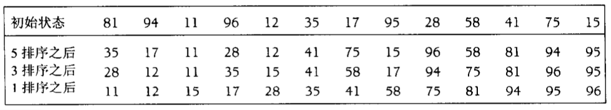
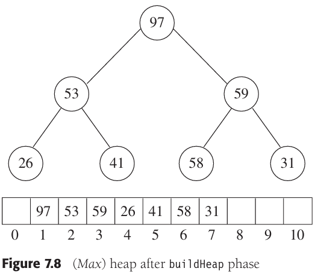
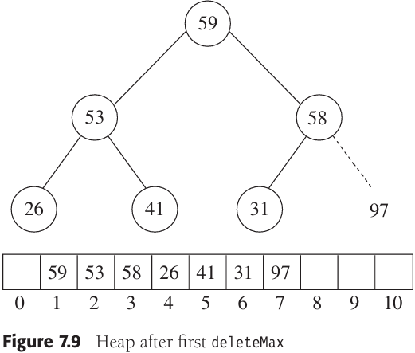
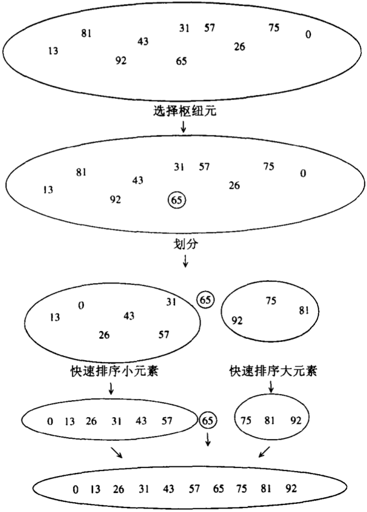
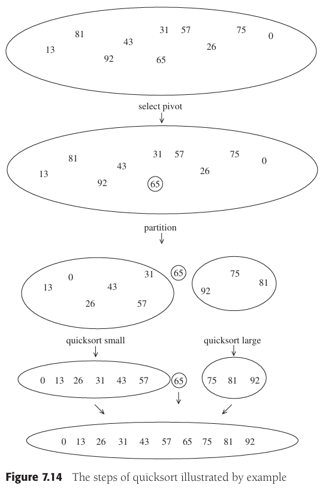
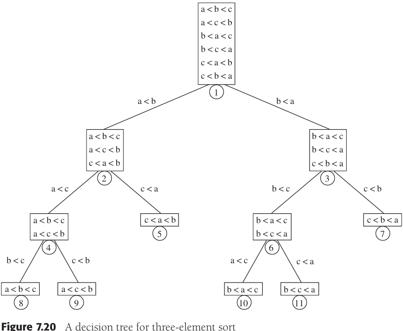

# CHAPTER 7 Sorting

[TOC]


## Insertion Sort

### The Algorithm


### STL Implementation of Insertion Sort

```c++
// 单参数
template <typename Comparable>
void insertionSort(vector<Comparable>& a)
{
    int j;
    for (int p = 1; p < a.size(); p++)
    {
        Comparable tmp = a[p];
        for (j = p; j > 0 && tmp < a[j - 1]; j--)
            a[j] = a[j - 1];
        a[j] = tmp;
    }
}

// 双参数插入排序排
template <typename Iterator>
void insertionSort(const Iterator& begin, const Iterator& end)
{
    if (begin != end)
        inertionSortHelp(begin, end, *begin);
}
template <typename Iterator, typename Object>
void insertionSortHelp(const Iterator& begin, const Iterator& end, const Object& obj)
{
    insertionSort(begin, end, less<Object>());
}

// 三参数插入排序
template<typename Iterator, typename Comparator>
void insertionSort(const Iterator& begin, const Iterator& end, Comparator lessThan)
{
    if (begin != end)
        insertionSort(begin, end, lessThan, *begin);
}
template<typename Iterator, typename Comparator, typename Object>
void insertionSort(const Iterator& begin, const Iterator& end, 
    Comparator lessThan, const Object& obj)
{
    Iterator j;

    for (Iterator p = begin + 1; p != end; ++p)
    {
        Object tmp = *p;
        for (j = p; j != begin && lessThan(tmp, *(j-1)); --j)
            *j = *(j - 1);
        *j = tmp;
    }
}
```

### Analysis of Insertion Sort

Because of the nested loops, each of which can take $N$ iterations, insertion sort is $O(N^2)$.

$\sum_{i=2}^{N} i=2+3+4+...+N = \Theta(N^2)$


## A Lower Bound for Simple Sorting Algorithms

An **inversion** in an array of numbers in any ordered $pair(i, j)$ having the property that $i < j$ but $a[i] > a[j]$.

**Theorem 7.1** The average number of inversions in an array of $N$ distinct elements is $N(N - 1) / 4$.

**Proof** For any list, $L$, of elements, consider $L_r$, the list in reverse order. The reverse list of the example is 21, 32, 51, 64, 8, 34. Consider any pair of two elements in the $list(x, y)$ with $y > x$. Clearly, in exactly one of $L$ and $L_r$ this ordered pair represents an inversion. The total number of these pairs in a list $L$ and its reverse $L_r$ is $N(N - 1) / 2$. Thus, an average lsit has half this amount, or $N(N - 1) / 4$ inversions.

**Theorem 7.2** Any algorithm that sorts by exchanging adjacent elements requires $\Omega(N^2)$ time on average.

**Proof** The average number of inversions is initially $N(N-1)/4=\Omega(N^2)$. Each swap removes only one inversion, so $\Omega(N^2)$ swaps are required.


## Shellsort

Shellsort works by comparing elements that are distant; the distance between comparisons decreases as the algorithm runs until the last phase, in which adjacent elements are compared. For this reason, Shellsort is sometimes referred to as **diminishing increment sort**.



Example. Shellsort routine using Shell's increments (better increments are possible):

```c++
// shell排序
template <typename Comparable>
void shellsort(vector<Comparable>& a)
{
    for (int gap = a.size() / 2; gap > 0; gap /= 2)
        for (int i = gap; i < a.size(); i++)
        {
            Comparable tmp = a[i];
            int j = i;

            for (; j >= gap && tmp < a[j-gap]; j -= gap)
                a[j] = a[j - gap];
            a[j] = tmp;
        }
}
```

**Theorem 7.3** The worst-case running time of Shellsort using Shell's increments is $\Theta(N^2)$​.

**Proof** TODO

**Theorem 7.4** The worst-case running time of Shellsort using Hibbard's increments is $\Theta(N^{3/2})$.

**Proof** TODO


## Heapsort





Example. Heapsort:

```c++
// 堆排序
template <typename Comparable>
void heapsort(vector<Comparable>& a)
{
    for (int i = a.size() / 2; i >= 0; i--)
        percDown(a, i, a.size());
    for (int j = a.size() - 1; j > 0; j--)
    {
        swap(a[0], a[j]);
        percDown(a, 0, j);
    }
}
inline int leftChild(int i)
{
    return 2 * i + 1;
}
template <typename Comparable>
void percDown(vector<Comparable>& a, int i, int n)
{
    int child;
    Comparable tmp;

    for (tmp = a[i]; leftChild(i) < n; i = child)
    {
        child = leftChild(i);
        if (child != n - 1 && a[child] < a[child + 1])
            child++;
        if (tmp < a[child])
            a[i] = a[child];
        else
            break;
    }
    a[i] = tmp;
}
```

In the worst case, at most $2NlogN - O(N)$​ comparisons are used by heapsort.

**Theorem 7.5** The average number of comparisons used to heapsort a random permutation of $N$ distinct items is $2NlogN-O(Nlog\ logN)$.

**Proof** TODO


## Mergesort

Mergesort runs in $O(N log N)$​ worst-case running time, and the number of comparisons used is nearly optimal.

Example. Mergesort routines:

```c++
// 归并排序
template <typename Comparable>
void mergeSort(vector<Comparable>& a)
{
    vector<Comparable> tmpArray(a.size());
    mergeSort(a, tmpArray, O, a.size() - 1);
}
template <typename Comparable>
void mergeSort(vector<Comparable>& a, vector<Comparable>& tmpArray,
    int left, int right)
{
    if (left < right)
    {
        int center = (left + right) / 2;
        mergeSort(a, tmpArray, left, center);
        mergeSort(a, tmpArray, center + 1, right);
        merge(a, tmpArray, left, center + 1, right);
    }
}
template <typename Comparable>
void merge(vector<Comparable>& a, vector<Comparable>& tmpArray
    int leftPos, int rightPos, int rightEnd)
{
    int leftEnd = rightPos - 1;
    int tmpPos = leftPos;
    int numElements = rightEnd - leftPos + 1;

    while (leftPos <= leftEnd && rightPos <= rightEnd)
        if (a[leftPos] <= a[rightPos])
            tmpArray[tmpPos++] = a[leftPos++];
        else
            tmpArray[tmpPos++] = a[rightPos++];

    while (leftPos <= leftEnd)
        tmpArray[tmpPos++] = a[leftPos++];

    while (rightPos <= rightEnd)
        tmpArray[tmpPos++] = a[rightPos++];

    for (int i = 0; i < numElements; i++, rightEnd--)
        a[rightEnd] = tmpArray[rightEnd];
}
```

For $N = 1$, the time to mergesort is constant, which we will denote by 1. Otherwise, the time to mergesort $N$ numbers is equal to the time to do two recursive mergesorts of size $n/2$, plus the time to merge, which is linear. The following equations say this exactly:

$T(1) = 1$

$T(N) = 2T(N/2) + N$

, This is a standard recurrence relation, which can be solved several ways.


## Quicksort

The classic quicksort algorithm to sort an array $S$ consists of the following four easy steps:

1. If the number of elements in $S$ is 0 or 1, then return.
2. Pick any element $v$ in $S$. This is called the **pivot**.
3. **Partition** $S-\{v\}$ (the remaining elements in $S$) into two disjoint groups: $S_1 = \{x \in S - \{v\}|x \leq v\}$, and $S_2 = \{x \in S-\{v\} | x \geq v \}$​.
4. Return $\{quicksort(S_1) \text{ followed by v followed by } quicksort(S_2) \}$



Example. Simple recursive sorting algorithm:

```c++
// 快速排序
template <typename Comparable>
void quicksort(vector<Comparable>& a)
{
    quicksort(a, 0, a.size() - 1);
}
template <typename Comparable>
const Comparable& median3(vector<Comparable>& a, int left, int right)
{
    int center = (left + right) / 2;
    if (a[center] < a[left])
        swap(a[left], a[center]);
    if (a[right] < a[left])
        swap(a[left], a[right]);
    if (a[right] < a[center])
        swap(a[center], a[right]);

    swap(a[center], a[right - 1]);
    return a[right - 1];
}
template <typename Comparable>
void quicksort(vector<Comparable>& a, int left, int right)
{
    if (left + 10 <= right)
    {
        Comparable pivot = median3(a, left, right);

        int i = left + 1, j = right - 2;
        for ( ; ; )
        {
            while (a[i] < pivot) i++;
            while (pivot < a[j]) j--;
            if (i < j)
                swapt(a[i], a[j]);
            else
                break;
        }

        swap(a[i], a[right - 1]);

        quicksort(a, left, i - 1);
        quicksort(a, i + 1, right);
    }
    else
        insertionSort(a, left, right);
}
```

### Picking the Pivot



### Analyssi of Quicksort

The basic quicksort relation:

$T(N) = T(i) + T(N-i-1) + cN$

, where $i = |S_1|$ is the number of elements in $S_1$.

**Worst-Case Analysis**

The pivot is the smallest element, all the time. Then $i = 0$, and if we ignore $T(0) = 1$, which is insignificant, the recurrence is:

$T(N) = T(N-1) + cN, N>1$

Thus:

$T(N-1) = T(N-2)+c(N-1)$

$T(N-2) = T(N-3)+c(N-2)$

...

$T(2) = T(1) + c(2)$

Adding up all these equations yields:

$T(N) = T(1) + c \sum_{i=2}^{N} = O(N^2)$

**Best-Case Analysis**

The pivot is in the middle. To simplify the math, we assume that the two subarrays are ach exactly half the size of the original, and although this gives a slight overestimate, this is acceptable because we are only interested in a Big-Oh answer:

$T(N) = 2T(N/2) + cN$

, Divide both slides by $N$:

$\frac{T(N)}{N} = \frac{T(N/2)}{N/2} + c$

, We will telescope using this equation:

$\frac{T(N/2)}{N/2} = \frac{T(N/4)}{N/4} + c$

$\frac{T(N/4)}{N/4} = \frac{T(N/8)}{N/8} + c$

...

$\frac{T(2)}{2} = \frac{T(1)}{1} + c$

, We add all the above equations and note that there are $log N$ of them:

$\frac{T(N)}{N} = \frac{T(1)}{1} + clog\ N$

, which yields:

$T(N) = cNlog\ N + N = O(Nlog\ N)$

**Average-Case Analysis**

For the average case, we assume that each of the size for $S_1$ is equally likely, and hence has probability $1/N$. With this assumption, the average value of $T(i)$, and hence $T(N-i-1)$, is $(1/N) \sum_{j=0}^{N-1} T(j)$. Equation $T(N) = T(i) + T(N-i-1) + cN$ then becomes:

$T(N) = \frac{2}{N} \left[ \sum_{j=0}^{N-1} T(j) \right] + cN$​

, If above equation is multiplied by $N$, it becomes:

$NT(N) = 2 \left[ \sum_{j=0}^{N-1} T(j) \right] + cN^2$。

, We need to remove the summation sign to simplify matters. We note that we can telescope with one more equation:

$(N-1)T(N-1) = 2 \left[ \sum_{j=0}^{N-2} T(j) \right] + c(N-1)^2$。

, If we subtract above equations, we obtain:

$NT(N) - (N-1)T(N-1) = 2T(N-1) + 2cN -c$

, We rearrange terms and drop the insignificant $-c$ on the right, obtaining:

$NT(N) - (N-1)T(N-1) = 2T(N-1) + 2cN$

, We now have a formula for $T(N)$ in terms of $T(N - 1)$ only. Again the idea is to telescope, but above equation is in the wrong form. Divide this equation by $N(N + 1)$:

$\frac{T(N)}{N+1} = \frac{T(N-1)}{N} + \frac{2c}{N+1}$

, Now we can telescope:

$\frac{T(N-1)}{N} = \frac{T(N-2)}{N-1} + \frac{2c}{N}$

$\frac{T(N-2)}{N-1} = \frac{T(N-3)}{N-2} + \frac{2c}{N-1}$

...

$\frac{T(2)}{3} = \frac{T(1)}{2} + \frac{2c}{3}$

, Adding above equation through yields:

$\frac{T(N)}{N+1} = \frac{T(1)}{2} + 2c \sum_{i=3}^{N+1} \frac{1}{i}$

, The sum is about $log_e(N+1) + \gamma - 3/2$，where$\gamma \approx 0.577$ is known as Euler's constant, so:

$\frac{T(N)}{N+1} = O(log\ N)$

, And so:

$T(N) = O(N\ log\ N)$

### A Linear-Expected-Time Algorithm for Selection

Let $|S_i|$ denote the number of elements in $S_i$. The steps of quickselect are:

1. If $|S| = 1$, then $k = 1$ and return the element in $S$ as the answr. If a cutoff for small arrays is being used and $|S| \leq CUTOFF$, then sort $S$ and return the $k$th smallest element.
2. Pick a pivot element, $v \in S$.
3. Partition $S - \{v\}$ into $S_1$ and $S_2$, as was done with quicksort.
4. If $k \leq |S-1|$, then the $k$th smallest element must be in $S_1$. In this case, return $quickselect(S_1, k)$. If $k = 1 + |S_1|$, then the pivot is the $k$th smallest element element and we can return it as the answer. Otherwise, the $k$th smallest element lies in $S_2$, and it is the $(k - |S_1| - 1)$st smallest element in $S_2$. We make a recursive call and return $quickselect(S_2, k - |S_1| - 1)$.


## Lower Bound

Any algorithm for sorting that uses only comparisons requires $\Omega(NlogN)$ comparisons (and hence time) in the worst case, so that mergesort and heapsort are optimal to within a constant factor.

Any sorting algorithm that uses only comparisons requires $\lceil log(N!) \rceil$ comparisons in the worst case and $log(N!)$​ comparisons on average.

A **decision tree** is an abstraction used to prove lower bonds.



**Lemma 7.1** Let $T$ be a binary tree of depth $d$. Then $T$ has at most $2^d$ leaves.

**Proof** The proof is by induction. If $d = 0$, then there is at most one leaf, so the basis is true. Otherwise, we have a root, which cannot be a leaf, and a left and right subtree, each of depth at most $d - 1$. By the induction hypothesis, they can each have at most $2^{d - 1}$ leaves, giving a total of at most $2^d$ leaves. This proves the lemma.

**Lemma 7.2** A binary tree with $L$ leaves must have depth at least $\lceil logL \rceil$.

**Proof** Immediate from the preceding lemma.

**Lemma 7.3** If all the leaves in a decision tree are at depth $d$ or higher, the decision tree must have at least $2^d$ leaves.

**Proof** Note that all nonleaf nodes in a decision tree have two children. The proof is by induction and follows Lemma 7.1.

**Lemma 7.4** The decision tree for finding the smallest of $N$ elements must have at least $2^{N - 1}$ leaves.

**Proof** By Theorem 7.8, all leaves in this decision tree are at hepth $N - 1$​ or higher. Then this lemma follows from Lemma 7.3.

**Lemma 7.5** The decision tree fro finding the $k$th smallest of $N$ elements must have at least ${N \choose k - 1} 2^{N - k}$​ leaves.

**Proof** TODO

**Theorem 7.6** Any sorting algorithm that uses only comparisons between elements requires at least $\lceil log(N!) \rceil$ comparisons in the worst case.

**Proof** A decision tree to sort $N$ elements must have $N!$ leaves. The theorem follows from the preceding lemma.

**Theorem 7.7** Any sorting algorithm that uses only comparisons between elements requires $\Omega(NlogN)$ comparisons.

**Proof** From the previous theorem, $log(N!)$ comparisons are rquired:
$$
\begin{equation}\begin{split}
log(N!) &= log(N(N-1)(N-2)...(2)(1)) \\
 & = logN + log(N-1) + log(N-2) + ... + log2 + log1 \\
 & \geqslant log N + log(N - 1) + log(N - 2) + ... + log(N/2) \\
 & \geqslant \frac{N}{2} log \frac{N}{2} \\
 & \geqslant \frac{N}{2} log N - \frac{N}{2} \\
 & = \Omega(NlogN)
 \end{split}\end{equation}
$$
**Theorem 7.8** Any comparison-based algorithm to find the smallest element must use at least $N - 1$ comparisons.

**Proof** TODO

**Theorem 7.9** Any comparison-based algorithm to find the $k$th smallest element must use at least $N - k + \lceil log {N \choose k - 1} \rceil$ comparisons.

**Proof** Immediate from Lemma 7.5 and Lemma 7.2.

**Theorem 7.10** Any comparison-based algorithm to find the secodn smallest element must use at least $N + \lceil logN \rceil - 2$ comparisons.

**Proof** Applying Theorem 7.9, with $k = 2$ yields $N - 2 + \lceil log N \rceil$.

**Theorem 7.11** Any comparison-based algorithm to find the median must use at least $\lceil 3N / 2 \rceil - O(log N)$ comparison.

**Proof** Apply Theorem 7.9, with $k = \lceil N / 2 \rceil$​.

**Theorem 7.12** Any comparison-based algorithm to find the minimum and maximum must use at least $\lceil 3N / 2 \rceil - 2$ comparisons.


## Linear-Time Sorts: Bucket Sort and Radix Sort

**bucket sort**: Keep an array called `count`, of size M, which is initialized to all 0s. Thus, `count` has $M$ cells, or buckets, whiich are initially empty. When $A_i$ is read, increment $count[A_i]$ by 1. After all the input is read, scan the `count` array, printing out a representation of the sorted list. This algorithm takes $O(M + N)$; the proof is left as an exercise. If $M$ is $O(N)$, then the total is $O(N)$.
