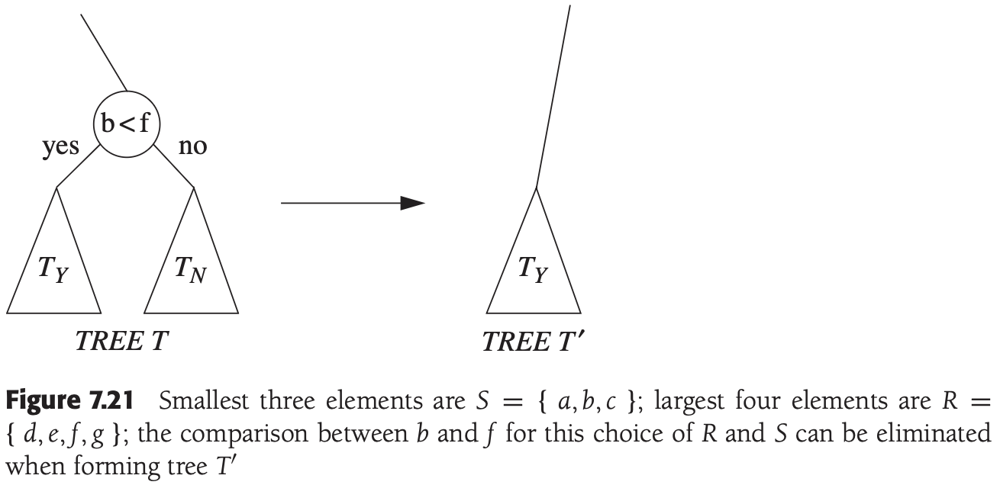

# CHAPTER 7 Sorting

[TOC]


## Insertion Sort

### The Algorithm


### STL Implementation of Insertion Sort

```c++
// 单参数
template <typename Comparable>
void insertionSort(vector<Comparable>& a)
{
    int j;
    for (int p = 1; p < a.size(); p++)
    {
        Comparable tmp = a[p];
        for (j = p; j > 0 && tmp < a[j - 1]; j--)
            a[j] = a[j - 1];
        a[j] = tmp;
    }
}

// 双参数插入排序排
template <typename Iterator>
void insertionSort(const Iterator& begin, const Iterator& end)
{
    if (begin != end)
        inertionSortHelp(begin, end, *begin);
}
template <typename Iterator, typename Object>
void insertionSortHelp(const Iterator& begin, const Iterator& end, const Object& obj)
{
    insertionSort(begin, end, less<Object>());
}

// 三参数插入排序
template<typename Iterator, typename Comparator>
void insertionSort(const Iterator& begin, const Iterator& end, Comparator lessThan)
{
    if (begin != end)
        insertionSort(begin, end, lessThan, *begin);
}
template<typename Iterator, typename Comparator, typename Object>
void insertionSort(const Iterator& begin, const Iterator& end, 
    Comparator lessThan, const Object& obj)
{
    Iterator j;

    for (Iterator p = begin + 1; p != end; ++p)
    {
        Object tmp = *p;
        for (j = p; j != begin && lessThan(tmp, *(j-1)); --j)
            *j = *(j - 1);
        *j = tmp;
    }
}
```

### Analysis of Insertion Sort

Because of the nested loops, each of which can take $N$ iterations, insertion sort is $O(N^2)$.

$\sum_{i=2}^{N} i=2+3+4+...+N = \Theta(N^2)$


## A Lower Bound for Simple Sorting Algorithms

An **inversion** in an array of numbers in any ordered $pair(i, j)$ having the property that $i < j$ but $a[i] > a[j]$.

**Theorem 7.1** The average number of inversions in an array of $N$ distinct elements is $N(N - 1) / 4$.

**Proof** For any list, $L$, of elements, consider $L_r$, the list in reverse order. The reverse list of the example is 21, 32, 51, 64, 8, 34. Consider any pair of two elements in the $list(x, y)$ with $y > x$. Clearly, in exactly one of $L$ and $L_r$ this ordered pair represents an inversion. The total number of these pairs in a list $L$ and its reverse $L_r$ is $N(N - 1) / 2$. Thus, an average lsit has half this amount, or $N(N - 1) / 4$ inversions.

**Theorem 7.2** Any algorithm that sorts by exchanging adjacent elements requires $\Omega(N^2)$ time on average.

**Proof** The average number of inversions is initially $N(N-1)/4=\Omega(N^2)$. Each swap removes only one inversion, so $\Omega(N^2)$ swaps are required.


## Shellsort

Shellsort works by comparing elements that are distant; the distance between comparisons decreases as the algorithm runs until the last phase, in which adjacent elements are compared. For this reason, Shellsort is sometimes referred to as **diminishing increment sort**.


Example. Shellsort routine using Shell's increments (better increments are possible):

```c++
// shell排序
template <typename Comparable>
void shellsort(vector<Comparable>& a)
{
    for (int gap = a.size() / 2; gap > 0; gap /= 2)
        for (int i = gap; i < a.size(); i++)
        {
            Comparable tmp = a[i];
            int j = i;

            for (; j >= gap && tmp < a[j-gap]; j -= gap)
                a[j] = a[j - gap];
            a[j] = tmp;
        }
}
```

**Theorem 7.3** The worst-case running time of Shellsort using Shell's increments is $\Theta(N^2)$​.

**Proof** The proof requires showing not only an upper bound on the worst-case running time but also showing that there exists some input that actually takes $\Omega(N^2)$ time to run. We prove the lower bound first by constructing a bad case. First, we choose $N$ to be a power of 2. This makes all the increments even, except for the last increment, which is 1. Now, we will give as input an array with the $N/2$ largest numbers in the even positions and the $N/2$ smallest numbers in the odd positions (for this proof, the first position is position 1). As all the increments except the last are even, when we come to the last pass, the $N/2$ largest numbers are still all in even positions and the $N/2$ smallest numbers are still all in odd positions. The $i$th smallest number $(i \leq N/2)$ is thus in position $2i - 1$ before the beginning of the last pass. Restoring the $i$th element to its correct place requires moving it $i - 1$ spaces in the array. Thus, to merely place the $N/2$ smallest elements in the correct place requires at least $\sum_{i = 1}^{N/2} i - 1 = \Omega(N^2)$ work. 

To finish the proof, we show the upper bound of $O(N^2)$. As we have observed before, a pass with increment $h_k$ consists of $h_k$ insertion sorts of about $N/h_k$ elements. Since insertion sort is quadratic, the total cost of a pass is $O(h_k(N/h_k)^2) = O(N^2/h_k)$. Summing over all passes gives a total bound of $O(\sum_{i = 1}^{t}N^2/h_i) = O(N^2 \sum_{i = 1}^{t}1/h_i)$. Because the increments form a geometric series with common ratio 2, and the largest term in the series is $h_1 = 1, \sum_{i = 1}^{t}1/h_i < 2$. Thus we obtain a total bound of $O(N^2)$.

**Theorem 7.4** The worst-case running time of Shellsort using Hibbard's increments is $\Theta(N^{3/2})$.

**Proof** For the upper bound, as before, we bound the running time of each pass and sum over all passes. For increments $h_k > N^{1/2}$, we will use the bound $O(N^2 / h_k)$ from the previous theorem. Although this bound holds for the other increments, it is too large to be useful. Intuitively, we must take advantage of the fact that this increment sequence is special. What we need to show is that for any element $a[p]$ in position $p$, when it is time to perform an $h_k$-sort, there are only a few elements to the left of position $p$ that are larger than $a[p]$.

When we come to $h_k$-sort the input array, we know that it has already been $h_{k + 1}$- and $h_{k + 2}$-sorted. Prior to the $h_k$-sort, consider elements in positions $p$ and $p - i, i \leq p$. If $i$ is a multiple of $h_{k + 1}$ or $h_{k + 2}$, then clearly $a[p - i] < a[p]$. We can say more, however. If $i$ is expressible as a linear combination (in nonnegative integers) of $h_{k + 1}$ and $h_{k + 2}$, then clearly $a[p - i] < a[p]$. We can say more, however. If $i$ is expressible as a linear combination (in nonnegative integers) of $h_{k + 1}$ and $h_{k + 2}$, then $a[p - i] < a[p]$.

Now, $h_{k + 2} = 2h_{k + 1} + 1$, so $h_{k + 1}$ and $h_{k + 2}$ cannot share a common factor. In this case, it is possible to show that all integers that are at least as large as $(h_{k + 1} - 1)(h_{k + 2} - 1) = 8h_k^2 + 4h_k$ can be expressed as a linear combination of $h_{k + 1}$ and $h_{k + 2}$.

This tells us that the body of the innermost for loop can be executed at most $8h_k + 4 = O(h_k)$ times for each of the $N - h_k$ positions. This gives a bound of $O(Nh_k)$ per pass.

Using the fact that about half the increments satisfy $h_k < \sqrt{N}$, and assuming that $t$ is even, the total running time is then:
$$
O(\sum_{k = 1}^{t / 2}Nh_k + \sum_{k = t / 2 + 1}^{t}N^2/h_k) = O(N\sum_{k = 1}^{t / 2}h_k + N^2 \sum_{k = t / 2 + 1}^{t}1/h_k)
$$
Because both sums are geometric series, and since $h_{t/2} = \Theta(\sqrt{N})$, this simplifies to:
$$
= O(Nh_{t/2}) + O(\frac{N^2}{h_{t/2}}) = O(N^{3/2})
$$


## Heapsort


Example. Heapsort:

```c++
// 堆排序
template <typename Comparable>
void heapsort(vector<Comparable>& a)
{
    for (int i = a.size() / 2; i >= 0; i--)
        percDown(a, i, a.size());
    for (int j = a.size() - 1; j > 0; j--)
    {
        swap(a[0], a[j]);
        percDown(a, 0, j);
    }
}
inline int leftChild(int i)
{
    return 2 * i + 1;
}
template <typename Comparable>
void percDown(vector<Comparable>& a, int i, int n)
{
    int child;
    Comparable tmp;

    for (tmp = a[i]; leftChild(i) < n; i = child)
    {
        child = leftChild(i);
        if (child != n - 1 && a[child] < a[child + 1])
            child++;
        if (tmp < a[child])
            a[i] = a[child];
        else
            break;
    }
    a[i] = tmp;
}
```

In the worst case, at most $2N\log N - O(N)$​ comparisons are used by heapsort.

**Theorem 7.5** The average number of comparisons used to heapsort a random permutation of $N$ distinct items is $2N\log N-O(N\log \log N)$.

**Proof** The heap construction phase uses $\Theta(N)$ comparisons on average, and so we only need to prove the bound for the second phase. We assume a permutation of $\{1, 2, ..., N\}$. 

Suppose the $i$th `deleteMax` pushes the root element down $d_i$ levels. Then it uses $2d_i$ comparisons. For heap sort on any input, there is a cost sequence $D:d_1, d_2, ..., d_N$ that defines the cost of phase 2. That cost is given by $M_D = \sum_{i = 1}^{N}d_i$; the number of comparisons used is thus $2M_D$.

Because level $d_i$ has at most $2^{d_i}$ nodes, there are $2^{d_i}$ possible places that the root element can go for any $d_i$. Consequently, for any sequence $D$, the number of distinct corresponding `deleteMax` sequences is at most:
$$
S_D = 2^{d_1} 2^{d_2} \cdots 2^{d_N}
$$
A simple algebraic manipulation shows that `for a given sequence D`,
$$
S_D = 2^{M_D}
$$
Because each $d_i$ can assume any value between 1 and $\lfloor \log N \rfloor$, there are at most $(\log N)^N$ possible sequences $D$. It follows that the number of distinct `deleteMax` sequences that require cost exactly equal to $M$ is at most the number of cost sequences of total cost $M$ times the number of `deleteMax` sequences for each of these cost sequences. A bound of $(\log N)^N 2^M$ follows immediately.

The total number of heaps with cost sequence less than $M$ is at most
$$
\sum_{i = 1}^{M - 1}(\log N)^N 2^i < (\log N)^N 2^M
$$
If we choose $M = N(\log N - \log \log N - 4)$, then the number of heaps that have cost sequence less than $M$ is at most $(N / 16)^N$, and the theorem follows from our earlier comments.

Using a more complex argument, it can be shown that heapsort always uses at least $N \log N - O(N)$ comparisons and that there are inputs that can achieve this bound. The average-case analysis can also be improved to $2N \log N - O(N)$ comparisons.


## Mergesort

Mergesort runs in $O(N log N)$​ worst-case running time, and the number of comparisons used is nearly optimal.

Example. Mergesort routines:

```c++
// 归并排序
template <typename Comparable>
void mergeSort(vector<Comparable>& a)
{
    vector<Comparable> tmpArray(a.size());
    mergeSort(a, tmpArray, O, a.size() - 1);
}
template <typename Comparable>
void mergeSort(vector<Comparable>& a, vector<Comparable>& tmpArray,
    int left, int right)
{
    if (left < right)
    {
        int center = (left + right) / 2;
        mergeSort(a, tmpArray, left, center);
        mergeSort(a, tmpArray, center + 1, right);
        merge(a, tmpArray, left, center + 1, right);
    }
}
template <typename Comparable>
void merge(vector<Comparable>& a, vector<Comparable>& tmpArray
    int leftPos, int rightPos, int rightEnd)
{
    int leftEnd = rightPos - 1;
    int tmpPos = leftPos;
    int numElements = rightEnd - leftPos + 1;

    while (leftPos <= leftEnd && rightPos <= rightEnd)
        if (a[leftPos] <= a[rightPos])
            tmpArray[tmpPos++] = a[leftPos++];
        else
            tmpArray[tmpPos++] = a[rightPos++];

    while (leftPos <= leftEnd)
        tmpArray[tmpPos++] = a[leftPos++];

    while (rightPos <= rightEnd)
        tmpArray[tmpPos++] = a[rightPos++];

    for (int i = 0; i < numElements; i++, rightEnd--)
        a[rightEnd] = tmpArray[rightEnd];
}
```

For $N = 1$, the time to mergesort is constant, which we will denote by 1. Otherwise, the time to mergesort $N$ numbers is equal to the time to do two recursive mergesorts of size $n/2$, plus the time to merge, which is linear. The following equations say this exactly:

$T(1) = 1$

$T(N) = 2T(N/2) + N$

, This is a standard recurrence relation, which can be solved several ways.


## Quicksort

The classic quicksort algorithm to sort an array $S$ consists of the following four easy steps:

1. If the number of elements in $S$ is 0 or 1, then return.
2. Pick any element $v$ in $S$. This is called the **pivot**.
3. **Partition** $S-\{v\}$ (the remaining elements in $S$) into two disjoint groups: $S_1 = \{x \in S - \{v\}|x \leq v\}$, and $S_2 = \{x \in S-\{v\} | x \geq v \}$​.
4. Return $\{quicksort(S_1) \text{ followed by v followed by } quicksort(S_2) \}$


Example. Simple recursive sorting algorithm:

```c++
// 快速排序
template <typename Comparable>
void quicksort(vector<Comparable>& a)
{
    quicksort(a, 0, a.size() - 1);
}
template <typename Comparable>
const Comparable& median3(vector<Comparable>& a, int left, int right)
{
    int center = (left + right) / 2;
    if (a[center] < a[left])
        swap(a[left], a[center]);
    if (a[right] < a[left])
        swap(a[left], a[right]);
    if (a[right] < a[center])
        swap(a[center], a[right]);

    swap(a[center], a[right - 1]);
    return a[right - 1];
}
template <typename Comparable>
void quicksort(vector<Comparable>& a, int left, int right)
{
    if (left + 10 <= right)
    {
        Comparable pivot = median3(a, left, right);

        int i = left + 1, j = right - 2;
        for ( ; ; )
        {
            while (a[i] < pivot) i++;
            while (pivot < a[j]) j--;
            if (i < j)
                swapt(a[i], a[j]);
            else
                break;
        }

        swap(a[i], a[right - 1]);

        quicksort(a, left, i - 1);
        quicksort(a, i + 1, right);
    }
    else
        insertionSort(a, left, right);
}
```

### Picking the Pivot


### Analyssi of Quicksort

The basic quicksort relation:

$T(N) = T(i) + T(N-i-1) + cN$

, where $i = |S_1|$ is the number of elements in $S_1$.

**Worst-Case Analysis**

The pivot is the smallest element, all the time. Then $i = 0$, and if we ignore $T(0) = 1$, which is insignificant, the recurrence is:

$T(N) = T(N-1) + cN, N>1$

Thus:

$T(N-1) = T(N-2)+c(N-1)$

$T(N-2) = T(N-3)+c(N-2)$

...

$T(2) = T(1) + c(2)$

Adding up all these equations yields:

$T(N) = T(1) + c \sum_{i=2}^{N} = O(N^2)$

**Best-Case Analysis**

The pivot is in the middle. To simplify the math, we assume that the two subarrays are ach exactly half the size of the original, and although this gives a slight overestimate, this is acceptable because we are only interested in a Big-Oh answer:

$T(N) = 2T(N/2) + cN$

, Divide both slides by $N$:

$\frac{T(N)}{N} = \frac{T(N/2)}{N/2} + c$

, We will telescope using this equation:

$\frac{T(N/2)}{N/2} = \frac{T(N/4)}{N/4} + c$

$\frac{T(N/4)}{N/4} = \frac{T(N/8)}{N/8} + c$

...

$\frac{T(2)}{2} = \frac{T(1)}{1} + c$

, We add all the above equations and note that there are $log N$ of them:

$\frac{T(N)}{N} = \frac{T(1)}{1} + clog\ N$

, which yields:

$T(N) = cNlog\ N + N = O(Nlog\ N)$

**Average-Case Analysis**

For the average case, we assume that each of the size for $S_1$ is equally likely, and hence has probability $1/N$. With this assumption, the average value of $T(i)$, and hence $T(N-i-1)$, is $(1/N) \sum_{j=0}^{N-1} T(j)$. Equation $T(N) = T(i) + T(N-i-1) + cN$ then becomes:

$T(N) = \frac{2}{N} \left[ \sum_{j=0}^{N-1} T(j) \right] + cN$​

, If above equation is multiplied by $N$, it becomes:

$NT(N) = 2 \left[ \sum_{j=0}^{N-1} T(j) \right] + cN^2$。

, We need to remove the summation sign to simplify matters. We note that we can telescope with one more equation:

$(N-1)T(N-1) = 2 \left[ \sum_{j=0}^{N-2} T(j) \right] + c(N-1)^2$。

, If we subtract above equations, we obtain:

$NT(N) - (N-1)T(N-1) = 2T(N-1) + 2cN -c$

, We rearrange terms and drop the insignificant $-c$ on the right, obtaining:

$NT(N) - (N-1)T(N-1) = 2T(N-1) + 2cN$

, We now have a formula for $T(N)$ in terms of $T(N - 1)$ only. Again the idea is to telescope, but above equation is in the wrong form. Divide this equation by $N(N + 1)$:

$\frac{T(N)}{N+1} = \frac{T(N-1)}{N} + \frac{2c}{N+1}$

, Now we can telescope:

$\frac{T(N-1)}{N} = \frac{T(N-2)}{N-1} + \frac{2c}{N}$

$\frac{T(N-2)}{N-1} = \frac{T(N-3)}{N-2} + \frac{2c}{N-1}$

...

$\frac{T(2)}{3} = \frac{T(1)}{2} + \frac{2c}{3}$

, Adding above equation through yields:

$\frac{T(N)}{N+1} = \frac{T(1)}{2} + 2c \sum_{i=3}^{N+1} \frac{1}{i}$

, The sum is about $log_e(N+1) + \gamma - 3/2$，where$\gamma \approx 0.577$ is known as Euler's constant, so:

$\frac{T(N)}{N+1} = O(log\ N)$

, And so:

$T(N) = O(N\ log\ N)$

### A Linear-Expected-Time Algorithm for Selection

Let $|S_i|$ denote the number of elements in $S_i$. The steps of quickselect are:

1. If $|S| = 1$, then $k = 1$ and return the element in $S$ as the answr. If a cutoff for small arrays is being used and $|S| \leq CUTOFF$, then sort $S$ and return the $k$th smallest element.
2. Pick a pivot element, $v \in S$.
3. Partition $S - \{v\}$ into $S_1$ and $S_2$, as was done with quicksort.
4. If $k \leq |S-1|$, then the $k$th smallest element must be in $S_1$. In this case, return $quickselect(S_1, k)$. If $k = 1 + |S_1|$, then the pivot is the $k$th smallest element element and we can return it as the answer. Otherwise, the $k$th smallest element lies in $S_2$, and it is the $(k - |S_1| - 1)$st smallest element in $S_2$. We make a recursive call and return $quickselect(S_2, k - |S_1| - 1)$.


## Lower Bound

Any algorithm for sorting that uses only comparisons requires $\Omega(NlogN)$ comparisons (and hence time) in the worst case, so that mergesort and heapsort are optimal to within a constant factor.

Any sorting algorithm that uses only comparisons requires $\lceil log(N!) \rceil$ comparisons in the worst case and $log(N!)$​ comparisons on average.

A **decision tree** is an abstraction used to prove lower bonds.


**Lemma 7.1** Let $T$ be a binary tree of depth $d$. Then $T$ has at most $2^d$ leaves.

**Proof** The proof is by induction. If $d = 0$, then there is at most one leaf, so the basis is true. Otherwise, we have a root, which cannot be a leaf, and a left and right subtree, each of depth at most $d - 1$. By the induction hypothesis, they can each have at most $2^{d - 1}$ leaves, giving a total of at most $2^d$ leaves. This proves the lemma.

**Lemma 7.2** A binary tree with $L$ leaves must have depth at least $\lceil logL \rceil$.

**Proof** Immediate from the preceding lemma.

**Lemma 7.3** If all the leaves in a decision tree are at depth $d$ or higher, the decision tree must have at least $2^d$ leaves.

**Proof** Note that all nonleaf nodes in a decision tree have two children. The proof is by induction and follows Lemma 7.1.

**Lemma 7.4** The decision tree for finding the smallest of $N$ elements must have at least $2^{N - 1}$ leaves.

**Proof** By Theorem 7.8, all leaves in this decision tree are at hepth $N - 1$​ or higher. Then this lemma follows from Lemma 7.3.

**Lemma 7.5** The decision tree fro finding the $k$th smallest of $N$ elements must have at least ${N \choose k - 1} 2^{N - k}$​ leaves.

**Proof** Observe that any algorithm that correctly identifies the $k$th smallest element $t$ must be able to prove that all other elements $x$ are either larger than or smaller than $t$. Otherwise, it would be giving the same answer regardless of whether $x$ was larger or smaller than $t$, and the answer cannot be the same in both circumstances. Thus each leaf in the tree, in addition to representing the $k$th smallest element, also represents the $k - 1$ smallest items that have been identified.

Let $T$ be the decision tree, and consider two sets: $S = \{x_1, x_2, ..., x_{k - 1}\}$, representing the $k - 1$ smallest items, and $R$ which are the remaining items, including the $k$th smallest. Form a new decision tree, $T'$, by purging any comparisons in $T$ between an element in $S$ and an element in $R$. Since any element in $S$ is smaller than an element in $R$, the comparison tree node and its right subtree may be removed from $T$ without any loss of information. The following figure shows how nodes can be pruned.



Any permutation of $R$ that is fed into $T'$ follows the same path of nodes and leads to the same leaf as a corresponding sequence consisting of a permutation of $S$ followed by the same permutation of $R$. Since $T$ identifies the overall $k$th smallest element, and the smallest element in $R$ is that element, it follows that $T'$ identifies the smallest element in $R$. Thus $T'$ must have at least $2^{|R| - 1} = 2^{N - k}$ leaves. These leaves in $T'$ directly correspond to $2^{N - k}$ leaves representing $S$. Since there are ${N \choose k - 1}$ choice for $S$, there must be at least ${N \choose k - 1}2^{N - k}$ leaves in $T$.

**Theorem 7.6** Any sorting algorithm that uses only comparisons between elements requires at least $\lceil log(N!) \rceil$ comparisons in the worst case.

**Proof** A decision tree to sort $N$ elements must have $N!$ leaves. The theorem follows from the preceding lemma.

**Theorem 7.7** Any sorting algorithm that uses only comparisons between elements requires $\Omega(NlogN)$ comparisons.

**Proof** From the previous theorem, $log(N!)$ comparisons are rquired:
$$
\begin{equation}\begin{split}
log(N!) &= log(N(N-1)(N-2)...(2)(1)) \\
 & = logN + log(N-1) + log(N-2) + ... + log2 + log1 \\
 & \geqslant log N + log(N - 1) + log(N - 2) + ... + log(N/2) \\
 & \geqslant \frac{N}{2} log \frac{N}{2} \\
 & \geqslant \frac{N}{2} log N - \frac{N}{2} \\
 & = \Omega(NlogN)
 \end{split}\end{equation}
$$
**Theorem 7.8** Any comparison-based algorithm to find the smallest element must use at least $N - 1$ comparisons.

**Proof** Every element, $x$, except the smallest element, must be involved in a comparison with some other element, $y$, in which $x$ is declared larger than $y$. Otherwise, if there were two different elements that had not been declared larger than any other elements, then either could be the smallest.

**Theorem 7.9** Any comparison-based algorithm to find the $k$th smallest element must use at least $N - k + \lceil log {N \choose k - 1} \rceil$ comparisons.

**Proof** Immediate from Lemma 7.5 and Lemma 7.2.

**Theorem 7.10** Any comparison-based algorithm to find the secodn smallest element must use at least $N + \lceil logN \rceil - 2$ comparisons.

**Proof** Applying Theorem 7.9, with $k = 2$ yields $N - 2 + \lceil log N \rceil$.

**Theorem 7.11** Any comparison-based algorithm to find the median must use at least $\lceil 3N / 2 \rceil - O(log N)$ comparison.

**Proof** Apply Theorem 7.9, with $k = \lceil N / 2 \rceil$​.

**Theorem 7.12** Any comparison-based algorithm to find the minimum and maximum must use at least $\lceil 3N / 2 \rceil - 2$ comparisons.


## Linear-Time Sorts: Bucket Sort and Radix Sort

**bucket sort**: Keep an array called `count`, of size M, which is initialized to all 0s. Thus, `count` has $M$ cells, or buckets, whiich are initially empty. When $A_i$ is read, increment $count[A_i]$ by 1. After all the input is read, scan the `count` array, printing out a representation of the sorted list. This algorithm takes $O(M + N)$; the proof is left as an exercise. If $M$ is $O(N)$, then the total is $O(N)$.
