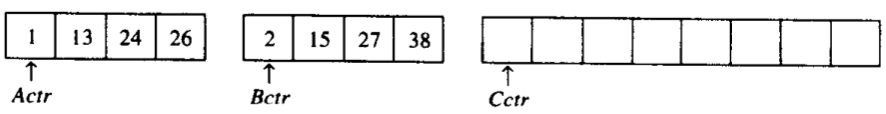
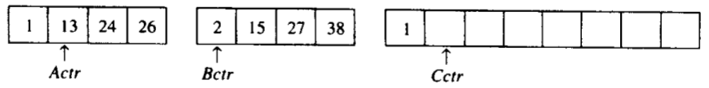
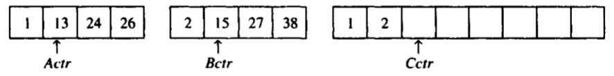
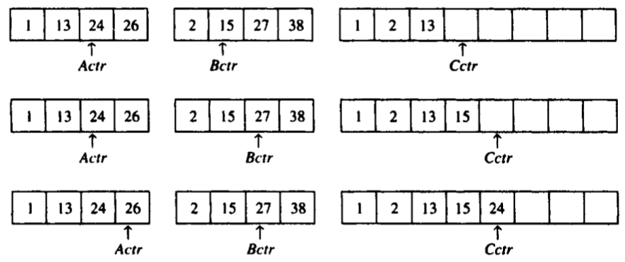
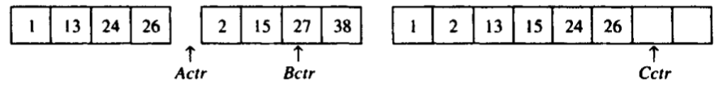
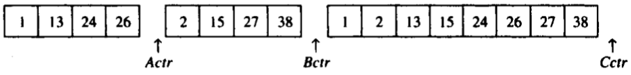
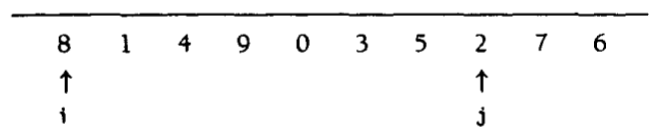
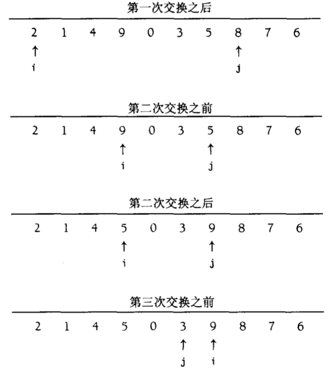
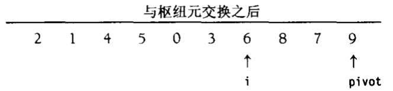

# 第七章 排序

[TOC]

## 预备知识

`基于比较的排序（comparison-based sorting）`

## 插入排序

### 算法

`插入排序（insertion sort）`

*每趟后的插入排序*

### 插入排序的STL实现

### 插入排序的分析

$\sum_{i=2}^{N} i=2+3+4+...+N = \Theta(N^2)$

## 一些简单排序算法的下界

以数为成员的数组的`逆序（inversion）`是指具有性质$i < j$但$a[i] > a[j]$的序偶$(i, j)$。

**定理 7.1** $N$个互异元素的数组的平均逆序数是$N(N-1)/4$。

**定理7.2** 通过交换相邻元素进行排序的任何算法平均需要$\Omega(N^2)$时间。

**证明** 初始的平均逆序数是$N(N-1)/4=\Omega(N^2)$，而每次交换只减少一个逆序，因此需要$\Omega(N^2)$次交换。

## shell排序

`希尔排序（shell sort）` 又叫缩减增量排序（diminishing increment sort），通过比较相距一定间隔的元素来工作；各趟比较所用的距离随着算法的进行而减少，直到只比较相邻元素的最后一趟排序为止。

*shell排序每趟之后的情况*

**定理7.3** 使用shell增量时shell排序的最坏情形运行时间为$\Theta(N^2)$。

**定理7.4** 使用Hibbard增量的shell排序的最坏情形运行时间为$\Theta(N^{3/2})$。

## 堆排序

`堆排序（heap sort）` 根据二叉堆的特性：最小的元素先离开堆；每次deleteMin后，堆空出一个位置，将刚刚删除的元素放在堆的最后单元。

*在buildHeap阶段以后的(max)堆*

*在第一次deleteMax后的堆*

**定理7.5** 对$N$个互异项的随机排列进行堆排序，所用的比较平均次数为$2NlogN-O(Nlog\ logN)$。

## 归并排序

`归并排序（mergesort）` 合并两个已排序的表。

例：

*数组A含有1，13，24，26；数组B含有2，15，27，38；*

*首先，比较在1和2之间进行，1被添加到C中，然后13和2进行比较；*

*2被添加到C中，然后13和15进行比较；*

*13被添加到C中，接下来比较24和15，以此类推...，一直到26和27进行比较；*

*26被添加到C中，数组A已经用完；*

*将数组B的奇遇部分复制到C中；*

## 快速排序

`快速排序（quick sort）` 步骤：

1. 如果$S$中元素个数是0或1，则返回；
2. 取$S$中任一元素$v$，称之为`枢纽元（pivot）`；
3. 将$S-\{v\}$(S中其余元素)划分成两个不相交的集合：$S_1 = {x \in S - \{v\}|x \leqslant v}$和$S_2 = \{x \in S-\{v\} | x \geqslant v \}$；
4. 返回$\{quicksort(S_1)$，后跟$v$，继而$quicksort(S_2)\}$。

*说明快速排序各步的演示示例*

### 选取枢纽元

1. 一种错误的方法

   - 第一个元素作为枢纽元（错误）
   - 选取前两个互异的键中的较大者作为枢纽元（错误）

2. 一种安全的做法

   随机选取枢纽元。

3. 三数中值分割法

   使用左端，右端和中心位置上的三个元素的中值作为枢纽元。

### 分割策略

例：

*交换由i和j指向的元素，重复该过程知道i和j彼此交错*

*将枢纽元与i所指向的元素交换*

### 小数组

### 快速排序的分析

$T(N) = T(i) + T(N-i-1) + cN$

- $i = |S_1|$是$S_1$中的元素的个数

**最坏情形分析：**

枢纽元始终是最小元素。此时$i = 0$，如果我们忽略无关紧要的$T(0) = 1$，那么递推关系为：

$T(N) = T(N-1) + cN, N>1$

得到：

$T(N-1) = T(N-2)+c(N-1)$

$T(N-2) = T(N-3)+c(N-2)$

...

$T(2) = T(1) + c(2)$

将这些方程相加，得到：

$T(N) = T(1) + c \sum_{i=2}^{N} = O(N^2)$

**最佳情况分析:**

枢纽元正好位于中间。两个子数组刚好为原数组的一半，那么递推关系为：

$T(N) = 2T(N/2) + cN$

用$N$去除以上面的方程得到：

$\frac{T(N)}{N} = \frac{T(N/2)}{N/2} + c$

反复套用这个方程得到：

$\frac{T(N/2)}{N/2} = \frac{T(N/4)}{N/4} + c$

$\frac{T(N/4)}{N/4} = \frac{T(N/8)}{N/8} + c$

...

$\frac{T(2)}{2} = \frac{T(1)}{1} + c$

将以上$log\ N$个方程加起来得到：

$\frac{T(N)}{N} = \frac{T(1)}{1} + clog\ N$

从而得到：

$T(N) = cNlog\ N + N = O(Nlog\ N)$

**平均情况分析：**

假设对于$S_1$，每一个文件的大小都是等可能的，因此每个大小均有概率$1/N$。

由该假设可知，$T(i)$（从而$T(N-i-1)$）的平均值为：

$(1/N) \sum_{j=0}^{N-1} T(j)$。

此时公式$T(N) = T(i) + T(N-i-1) + cN$变为：

$T(N) = \frac{2}{N} \left[ \sum_{j=0}^{N-1} T(j) \right] + cN$。

如果用$N$乘以上面的方程，则有：

$NT(N) = 2 \left[ \sum_{j=0}^{N-1} T(j) \right] + cN^2$。

我们需要除去求和符号以简化计算，得到：

$(N-1)T(N-1) = 2 \left[ \sum_{j=0}^{N-2} T(j) \right] + c(N-1)^2$。

上面两个公式相减，得到：

$NT(N) - (N-1)T(N-1) = 2T(N-1) + 2cN -c$

移项，合并并除去右边无关紧要的项$-c$，得到：

$NT(N) - (N-1)T(N-1) = 2T(N-1) + 2cN$

用$N(N+1)$除式：

$\frac{T(N)}{N+1} = \frac{T(N-1)}{N} + \frac{2c}{N+1}$

进行叠缩：

$\frac{T(N-1)}{N} = \frac{T(N-2)}{N-1} + \frac{2c}{N}$

$\frac{T(N-2)}{N-1} = \frac{T(N-3)}{N-2} + \frac{2c}{N-1}$

...

$\frac{T(2)}{3} = \frac{T(1)}{2} + \frac{2c}{3}$

将以上公式相加，得到：

$\frac{T(N)}{N+1} = \frac{T(1)}{2} + 2c \sum_{i=3}^{N+1} \frac{1}{i}$

该和大约为$log_e(N+1) + \gamma - 3/2$，其中$\gamma \approx 0.577$，叫做`欧拉常数（Euler's constant）`，于是：

$\frac{T(N)}{N+1} = O(log\ N)$

从而

$T(N) = O(N\ log\ N)$

### 选择问题的线性期望时间算法

TODO