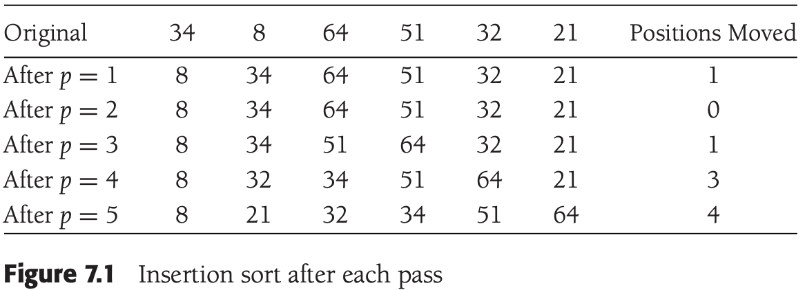
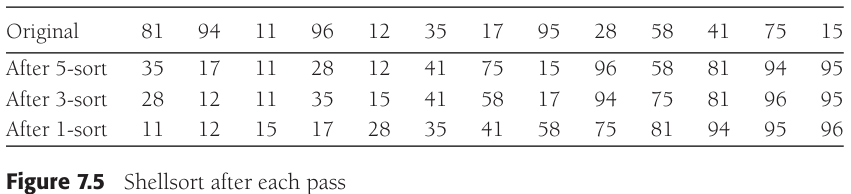

# 第七章 排序

[TOC]


## 预备知识

`基于比较的排序（comparison-based sorting）`


## 插入排序

### 算法

`插入排序（insertion sort）`



*每趟后的插入排序*

### 插入排序的STL实现

```c++
// 单参数
template <typename Comparable>
void insertionSort(vector<Comparable>& a)
{
    int j;
    for (int p = 1; p < a.size(); p++)
    {
        Comparable tmp = a[p];
        for (j = p; j > 0 && tmp < a[j - 1]; j--)
            a[j] = a[j - 1];
        a[j] = tmp;
    }
}

// 双参数插入排序排
template <typename Iterator>
void insertionSort(const Iterator& begin, const Iterator& end)
{
    if (begin != end)
        inertionSortHelp(begin, end, *begin);
}
template <typename Iterator, typename Object>
void insertionSortHelp(const Iterator& begin, const Iterator& end, const Object& obj)
{
    insertionSort(begin, end, less<Object>());
}

// 三参数插入排序
template<typename Iterator, typename Comparator>
void insertionSort(const Iterator& begin, const Iterator& end, Comparator lessThan)
{
    if (begin != end)
        insertionSort(begin, end, lessThan, *begin);
}
template<typename Iterator, typename Comparator, typename Object>
void insertionSort(const Iterator& begin, const Iterator& end, 
    Comparator lessThan, const Object& obj)
{
    Iterator j;

    for (Iterator p = begin + 1; p != end; ++p)
    {
        Object tmp = *p;
        for (j = p; j != begin && lessThan(tmp, *(j-1)); --j)
            *j = *(j - 1);
        *j = tmp;
    }
}
```

### 算法分析

**最差情况/平均情况：**

由于每一个嵌套循环都花费$N$次迭代，因此插入排序为$O(N^2)$。

$\sum_{i=2}^{N} i=2+3+4+...+N = \Theta(N^2)$

**最好情况：** $O(N)$


## 一些简单排序算法的下界

以数为成员的数组的`逆序（inversion）`是指具有性质$i < j$但$a[i] > a[j]$的序偶$(i, j)$。

**定理 7.1** $N$个互异元素的数组的平均逆序数是$N(N-1)/4$。

**证明** 对于任意的元素的表$L$，考虑其反序表$L_r$。上例中的反序表是21，32，51，64，8，34。考虑该表中任一两个元素的序偶$(x, y)$，且$y > x$。显然，恰好是$L$和$L_r$中的一个，该序偶对应一个逆序。在表$L$和它的反序表$L_r$中，这样的序偶的总个数为$N(N-1)/2$。因此，平均表有该量的一半，即$N(N-1)/4$个逆序。

**定理7.2** 通过交换相邻元素进行排序的任何算法平均需要$\Omega(N^2)$时间。

**证明** 初始的平均逆序数是$N(N-1)/4=\Omega(N^2)$，而每次交换只减少一个逆序，因此需要$\Omega(N^2)$次交换。


## shell排序

`希尔排序（shell sort）` 又叫缩减增量排序（diminishing increment sort），通过比较相距一定间隔的元素来工作；各趟比较所用的距离随着算法的进行而减少，直到只比较相邻元素的最后一趟排序为止。



*shell排序每趟之后的情况*

```c++
// shell排序
template <typename Comparable>
void shellsort(vector<Comparable>& a)
{
    for (int gap = a.size() / 2; gap > 0; gap /= 2)
        for (int i = gap; i < a.size(); i++)
        {
            Comparable tmp = a[i];
            int j = i;

            for (; j >= gap && tmp < a[j-gap]; j -= gap)
                a[j] = a[j - gap];
            a[j] = tmp;
        }
}
```

**定理7.3** 使用shell增量时shell排序的最坏情形运行时间为$\Theta(N^2)$。

**证明** 我们首先选择$N$是2的幂，这使得除最后一个增量是1外所有的增量都是偶数。现在，给出一个数组作为输入，它的偶数位置上有$N/2$个同是最大的数，而在奇数位置上有$N/2$个同为最小的数（对该证明，第一个位置是位置1）。由于除最后一个增量外所有的增量都是偶数，因此，当我们进行最后一趟排序前，$N/2$个最大的元素仍然在偶数位置上，而$N/2$个最小的元素也还是在奇数位置上。于是，在最后一趟排序开始之前第$i$个最小的数$(i \leqslant N/2)$在位置$2i - 1$上。将第$i$个元素恢复到其正确位置需要在数组中移动$i-1$个间隔。这样，仅仅将$N/2$个最小的元素放到正确的位置上就需要至少$\sum_{i=1}^{N/2} i - 1 = \Omega(N^2)$的工作。

​        带有增量$h_k$的一趟排序由$h_k$个关于$N/h_k$个元素的插入排序组成。由于插入排序是二次的，因此一趟排序总的开销是$O(h_k(N/h_k)^2) = O(N^2/h_k)$。对所有各趟排序求和则给出总的界为$O(\sum_{i=1}^{t} N^2/h_i) = O(N^2\sum_{i=1}{t} 1/h_i)$。因为这些增量形成一个几何级数，其公比为2，而该级数中的最大项是$h_1 = 1$，因此，$\sum_{i=1}^{t} 1/h_i < 2$。于是，我们得到总的界$O(N^2)$。

**定理7.4** 使用Hibbard增量的shell排序的最坏情形运行时间为$\Theta(N^{3/2})$。

**证明** 当对输入数组进行$h_k$排序时，我们知道它已经是$h_{k+1}$和$h_{k+2}$排序的了。在$h_k$排序以前，考虑位置$p$和$p-i$上的两个元素，其中$i \leqslant p$。如果$i$是$h_{k+1}$或$h_{k+2}$的倍数，那么显然$a[p-i] < a[p]$。不仅如此，如果$i$可以表示为$h_{k+1}$和$h_{k+2}$的线性组合（以非负整数的形式），那么也有$a[p - i] < a[p]$。

​        现在，$h_{k+2} = 2h_{k+1}$，因此$h_{k+1}$和$h_{k+2}$没有公因子。在这种情形下，可以证明，至少和$(h_{k+1} - 1)(h_{k+2} - ) = 8h_k^2 + 4h_k$一样大的所有整数都可以表示为$h_{k+1}$和$h_{k+2}$的线性组合。

​        这就告诉我们，最内层for循环体对于这些$N - h_k$位置上的每一个位置最多执行$8h_k + 4 = O(h_k)$次，于是我们得到每趟的界为$O(Nh_k)$。

​        利用大约一半的增量满足$h_k < \sqrt{N}$的事实并假设$t$是偶数，那么总的运行时间为：

$O\left(\sum_{k=1}^{t/2}\right) + \sum_{k=t/2+1}{t} N^2/h_k = O\left( N\sum_{k=1}^{t/2} h_k + N^2 \sum_{k=t/2+1}^{t} 1/h_k \right)$

因为两个和都是几何级数，并且$h_{t/2} = \Theta(\sqrt{N})$，所以上式简化为：

$= O(Nh_{t/2}) + O \left( \frac{N^2}{h_{t/2}} \right) = O \left(N^{3/2}\right)$


## 堆排序

`堆排序（heap sort）` 根据二叉堆的特性：最小的元素先离开堆；每次deleteMin后，堆空出一个位置，将刚刚删除的元素放在堆的最后单元。


*在buildHeap阶段以后的(max)堆*


*在第一次deleteMax后的堆*

```c++
// 堆排序
template <typename Comparable>
void heapsort(vector<Comparable>& a)
{
    for (int i = a.size() / 2; i >= 0; i--)
        percDown(a, i, a.size());
    for (int j = a.size() - 1; j > 0; j--)
    {
        swap(a[0], a[j]);
        percDown(a, 0, j);
    }
}
inline int leftChild(int i)
{
    return 2 * i + 1;
}
template <typename Comparable>
void percDown(vector<Comparable>& a, int i, int n)
{
    int child;
    Comparable tmp;

    for (tmp = a[i]; leftChild(i) < n; i = child)
    {
        child = leftChild(i);
        if (child != n - 1 && a[child] < a[child + 1])
            child++;
        if (tmp < a[child])
            a[i] = a[child];
        else
            break;
    }
    a[i] = tmp;
}
```

在最坏情况下，堆排序最多使用$2NlogN - O(N)$次比较。

**定理7.5** 对$N$个互异项的随机排列进行堆排序，所用的比较平均次数为$2NlogN-O(Nlog\ logN)$。

**证明** 设有${1, 2, ..., N}$的一个排列；设第$i$次deleteMax将根元素向下推了$d_i$层。此时它使用了$2d_i$次比较。对于任意的输入数据的堆排序，存在一个`开销序列（const sequence）`$D: d_1, d_2, ..., d_N$，它确定了第二阶段的开销，该开销由$M_D = \sum_{i=1}^{N} d_i$给出：因此所使用的比较次数是$2M_D$。

​        令$f(N)$是$N$项的堆的个数。可以证明$f(N) > (N/(4e))^N$（其中，e=2.71828...）。只有这些堆中指数上很小的部分（特别是$(N/16)^N$）的开销小于$M=N(logN - log\ logN - 4)$。当该结论得证时可以推出，$M_D$得平均值至少是$M$减去大小为$o(1)$的一项，这样，比较的平均次数至少是$2M$。因此，我们的基本目标则是证明存在很少的具有小开销序列的堆。

​        因为第$d_i$层上最多有$2^{d_i}$个结点，所以对于任意的$d_i$，存在根元素可能到达的$2^{d_i}$个可能的位置。于是，对于任意的序列$D$，对应deleteMax的互异序列的个数最多是：

$S_D = 2^{d_1} 2^{d_2} ... 2^{d_N}$

简单的代数处理指出，对一个给定的序列$D$：

$S_D = 2 ^ {M_D}$

​        因为每个$d_i$可取$1$和$\lfloor log\ N \rfloor$之间的任一值，所以最多存在$(logN)^N$个可能的序列$D$。由此可知，需要花费的开销恰好为$M$的互异deleteMax序列的个数，最多是总开销为$M$的开销序列的个数乘以每个这种开销序列的deleteMax序列的个数。这样就立刻得到界$(logN)^N2^M$。

​        开销序列小于$M$的堆的总数最多为：

$\sum_{i=1}^{M-1} (logN)^N2^i < (logN)^N 2^M$

​        如果我们选择$M=N(logN - log\ logN-4)$，那么开销序列小于$M$的堆的个数最多为$(N/16)^N$，定理得证。


## 归并排序

`归并排序（mergesort）` 合并两个已排序的表。

例：


*数组A含有1，13，24，26；数组B含有2，15，27，38；*


*首先，比较在1和2之间进行，1被添加到C中，然后13和2进行比较；*


*2被添加到C中，然后13和15进行比较；*


*13被添加到C中，接下来比较24和15，以此类推...，一直到26和27进行比较；*


*26被添加到C中，数组A已经用完；*


*将数组B的其余部分复制到C中；*

```c++
// 归并排序
template <typename Comparable>
void mergeSort(vector<Comparable>& a)
{
    vector<Comparable> tmpArray(a.size());
    mergeSort(a, tmpArray, O, a.size() - 1);
}
template <typename Comparable>
void mergeSort(vector<Comparable>& a, vector<Comparable>& tmpArray,
    int left, int right)
{
    if (left < right)
    {
        int center = (left + right) / 2;
        mergeSort(a, tmpArray, left, center);
        mergeSort(a, tmpArray, center + 1, right);
        merge(a, tmpArray, left, center + 1, right);
    }
}
template <typename Comparable>
void merge(vector<Comparable>& a, vector<Comparable>& tmpArray
    int leftPos, int rightPos, int rightEnd)
{
    int leftEnd = rightPos - 1;
    int tmpPos = leftPos;
    int numElements = rightEnd - leftPos + 1;

    while (leftPos <= leftEnd && rightPos <= rightEnd)
        if (a[leftPos] <= a[rightPos])
            tmpArray[tmpPos++] = a[leftPos++];
        else
            tmpArray[tmpPos++] = a[rightPos++];

    while (leftPos <= leftEnd)
        tmpArray[tmpPos++] = a[leftPos++];

    while (rightPos <= rightEnd)
        tmpArray[tmpPos++] = a[rightPos++];

    for (int i = 0; i < numElements; i++, rightEnd--)
        a[rightEnd] = tmpArray[rightEnd];
}
```

对$N$个数归并排序的用时等于完成两个大小为$N/2$的递归排序所用的时间再加上合并的时间，它是线性的。下述方程给出准确的表示：

$T(1) = 1$

$T(N) = 2T(N/2) + N$

归并排序以复杂度为$O(NlogN)$的最坏情形运行。

**证明一** 用$N$去除递推关系的两边，相除后得到

$\frac{T(N)}{N} = \frac{T(N/2)}{N/2} + 1$

该方程对2的幂的任意$N$是成立的，于是还可以写成

$\frac{T(N/2)}{N/2} = \frac{T(N/4)}{N/4} + 1$

和

$\frac{T(N/4)}{N/4} = \frac{T(N/8)}{N/8} + 1$

...

$\frac{T(2)}{2} = \frac{T(1)}{1} + 1$

将以上方程相加，得到

$\frac{T(N)}{N} = \frac{T(1)}{1} + logN$

这是因为所有其余的项都被消去了而方程的个数是$logN$，故而将各方程末尾的1相加起来得到$logN$。再将两边同乘以$N$，得到最后的答案

$T(N) = NlogN + N = O(NlogN)$

**证明二** 在右边连续地代入递推关系，得到

$T(N) = 2T(N/2) + N$

由于可以将$N/2$代入到主要的方程中，

$2T(N/2) = 2(2(T(N/4)) + N/2) = 4T(N/4) + N$

因此得到

$T(N) = 4T(N/4) + 2N$

再将$N/4$代入到主要的方程中，我们看到

$4T(N/4) = 4(2T(N/8) + N/4) = 8T(N/8) + N$

因此有

$T(N) = 8T(N/8) + 3N$

按这种方式继续下去，得到

$T(N) = 2^k T(N/2^k) + k \times N$

利用$k = logN$，得到

$T(N) = NT(1) + NlogN = NlogN + N$

**注意：对于归并排序，当对象很大时，复制对象的代价很大。**


## 快速排序

`快速排序（quick sort）` 步骤：

1. 如果$S$中元素个数是0或1，则返回；
2. 取$S$中任一元素$v$，称之为`枢纽元（pivot）`；
3. 将$S-\{v\}$(S中其余元素)划分成两个不相交的集合：$S_1 = {x \in S - \{v\}|x \leqslant v}$和$S_2 = \{x \in S-\{v\} | x \geqslant v \}$；
4. 返回$\{quicksort(S_1)$，后跟$v$，继而$quicksort(S_2)\}$。


*说明快速排序各步的演示示例*

```c++
// 快速排序
template <typename Comparable>
void quicksort(vector<Comparable>& a)
{
    quicksort(a, 0, a.size() - 1);
}
template <typename Comparable>
const Comparable& median3(vector<Comparable>& a, int left, int right)
{
    int center = (left + right) / 2;
    if (a[center] < a[left])
        swap(a[left], a[center]);
    if (a[right] < a[left])
        swap(a[left], a[right]);
    if (a[right] < a[center])
        swap(a[center], a[right]);

    swap(a[center], a[right - 1]);
    return a[right - 1];
}
template <typename Comparable>
void quicksort(vector<Comparable>& a, int left, int right)
{
    if (left + 10 <= right)
    {
        Comparable pivot = median3(a, left, right);

        int i = left + 1, j = right - 2;
        for ( ; ; )
        {
            while (a[i] < pivot) i++;
            while (pivot < a[j]) j--;
            if (i < j)
                swapt(a[i], a[j]);
            else
                break;
        }

        swap(a[i], a[right - 1]);

        quicksort(a, left, i - 1);
        quicksort(a, i + 1, right);
    }
    else
        insertionSort(a, left, right);
}
```

### 选取枢纽元

1. 一种错误的方法

   - 第一个元素作为枢纽元（错误）
   - 选取前两个互异的键中的较大者作为枢纽元（错误）

2. 一种安全的做法

   随机选取枢纽元。

3. 三数中值分割法

   使用左端，右端和中心位置上的三个元素的中值作为枢纽元。

### 分割策略

例：


*交换由i和j指向的元素，重复该过程知道i和j彼此交错*


*将枢纽元与i所指向的元素交换*


### 小数组

### 快速排序的分析

$T(N) = T(i) + T(N-i-1) + cN$

- $i = |S_1|$是$S_1$中的元素的个数

**最坏情形分析：**

枢纽元始终是最小元素。此时$i = 0$，如果我们忽略无关紧要的$T(0) = 1$，那么递推关系为：

$T(N) = T(N-1) + cN, N>1$

得到：

$T(N-1) = T(N-2)+c(N-1)$

$T(N-2) = T(N-3)+c(N-2)$

...

$T(2) = T(1) + c(2)$

将这些方程相加，得到：

$T(N) = T(1) + c \sum_{i=2}^{N} = O(N^2)$

**最佳情况分析:**

枢纽元正好位于中间。两个子数组刚好为原数组的一半，那么递推关系为：

$T(N) = 2T(N/2) + cN$

用$N$去除以上面的方程得到：

$\frac{T(N)}{N} = \frac{T(N/2)}{N/2} + c$

反复套用这个方程得到：

$\frac{T(N/2)}{N/2} = \frac{T(N/4)}{N/4} + c$

$\frac{T(N/4)}{N/4} = \frac{T(N/8)}{N/8} + c$

...

$\frac{T(2)}{2} = \frac{T(1)}{1} + c$

将以上$log\ N$个方程加起来得到：

$\frac{T(N)}{N} = \frac{T(1)}{1} + clog\ N$

从而得到：

$T(N) = cNlog\ N + N = O(Nlog\ N)$

**平均情况分析：**

假设对于$S_1$，每一个文件的大小都是等可能的，因此每个大小均有概率$1/N$。

由该假设可知，$T(i)$（从而$T(N-i-1)$）的平均值为：

$(1/N) \sum_{j=0}^{N-1} T(j)$。

此时公式$T(N) = T(i) + T(N-i-1) + cN$变为：

$T(N) = \frac{2}{N} \left[ \sum_{j=0}^{N-1} T(j) \right] + cN$。

如果用$N$乘以上面的方程，则有：

$NT(N) = 2 \left[ \sum_{j=0}^{N-1} T(j) \right] + cN^2$。

我们需要除去求和符号以简化计算，得到：

$(N-1)T(N-1) = 2 \left[ \sum_{j=0}^{N-2} T(j) \right] + c(N-1)^2$。

上面两个公式相减，得到：

$NT(N) - (N-1)T(N-1) = 2T(N-1) + 2cN -c$

移项，合并并除去右边无关紧要的项$-c$，得到：

$NT(N) - (N-1)T(N-1) = 2T(N-1) + 2cN$

用$N(N+1)$除式：

$\frac{T(N)}{N+1} = \frac{T(N-1)}{N} + \frac{2c}{N+1}$

进行叠缩：

$\frac{T(N-1)}{N} = \frac{T(N-2)}{N-1} + \frac{2c}{N}$

$\frac{T(N-2)}{N-1} = \frac{T(N-3)}{N-2} + \frac{2c}{N-1}$

...

$\frac{T(2)}{3} = \frac{T(1)}{2} + \frac{2c}{3}$

将以上公式相加，得到：

$\frac{T(N)}{N+1} = \frac{T(1)}{2} + 2c \sum_{i=3}^{N+1} \frac{1}{i}$

该和大约为$log_e(N+1) + \gamma - 3/2$，其中$\gamma \approx 0.577$，叫做`欧拉常数（Euler's constant）`，于是：

$\frac{T(N)}{N+1} = O(log\ N)$

从而

$T(N) = O(N\ log\ N)$

### 选择问题的线性期望时间算法

快速选择的步骤：

1. 如果$|S| = 1$，那么$k = 1$并将$S$中的元素作为答案返回。如果正在使用小数组的截止方法且$|S| \leqslant CUTOFF$，则将$S$排序并返回第$K$个最小元。
2. 选取一个枢纽元$v \in S$。
3. 将集合$S-{v}$分割成$S_1$和$S_2$，就像快速排序中所做的那样。
4. 如果$k \leqslant |S_1|$，那么第$k$个最小元必然在$S_1$中。在这种情况下，返回$quickselect(S_1, k)$。如果$k = 1 + |S_1|$，那么枢纽元就是第$k$个最小元。将它作为答案返回。否则，第$k$个最小元就在$S_2$中，它是$S_2$中的第$(k-|S_1|-1)$个最小元。我们进行一次递归调用并返回$quickselect(S_2, k-|S_1|-1)$。


## 间接排序


*使用指针数组排序*

对给定$N$个元素的数组，令$C_L$是长度为$L$的循环的次数。Comparable复制次数$M$如下：

$M = N - C_1 + (C_2 + C_3 + ... + C_N)$

### vector<Comparable*>不运行

基本的思想就是声明指针数组$p$为`vector<Comparable*>`，然后调用`quicksort(p)`来重新排列指针。

```c++
// 对大对象进行排序的算法
template <typename Comparable>
class Pointer
{
public:
    Pointer(Comparable* rhs = NULL) : pointee(rhs) {}

    bool operator<(const Pointer& rhs) const
    { return *pointee < *rhs.pointee; }

    operator Comparable* () const 
    { return pointee; }
private:
    Comparable* pointee;
};
template <typename Comparable>
void largeObjectSort(vector<Comparable>& a)
{
    vector<Pointer<Comparable> > p(a.size());
    int i, j, nextj;

    for (i = 0; i < a.size(); i++)
        p[i] = &a[i];

    quicksort(p);

    for (i = 0; i < a.size(); i++)
        if (p[i] != &a[i])
        {
            Comparable tmp = a[i];
            for (j = i; p[j] != &a[i]; j = nextj)
            {
                nextj = p[j] - &a[0];
                a[j] = *p[j];
                p[j] = &a[j];
            }
            a[j] = tmp;
            p[j] = &a[j];
        }
}
```

### 智能指针类

`智能指针类（smart pointer classes）`

### 重载operator<

### 使用"*"解引用指针

如果ptr是一个指向对象的指针，那么`*ptr`就是所指向对象的同义词。

### 重载类型转换操作符

### 随处可见的隐式类型转换

### 双向隐式类型转换会导致歧义

### 指针减法是合法的


## 排序算法的一般下界

任何只用到比较的排序算法在最坏情形下需要$\Omega(NlogN)$次比较，因此并归排序和堆排序在一个常数因子范围内是最优的。

只用到比较的任何排序算法在最坏情形下都需要$\lceil log(N!) \rceil$次比较并平均需要$log(N!)$次比较。

`决策树（decision tree）` 是用于证明下界的抽象过程。


*三元素排序的决策树*

**引理7.1** 令$T$是深度为$d$的二叉树，则$T$最多有$2^d$片树叶。

**证明** 用数学归纳法证明。如果$d=0$，则最多存在一片树叶，因此基准情形为真。若$d > 0$，则有一个根，它不可能是树叶，其左子树和右子树中每一个的深度最多是$d-1$。由归纳假设，每一棵子树最多有$2^{d-1}$片树叶，因此总数最多有$2^d$片树叶。引理得证。

**引理7.2** 具有$L$片树叶的二叉树的深度至少是$\lceil logL \rceil$。

**证明** 由前面的引理立即推出。

**定理7.6** 只使用元素间比较的任何排序算法在最坏情形下至少需要$\lceil log(N!) \rceil$次比较。

**证明** 对$N$个元素排序的决策树必然有$N!$片树叶。从上面的引理即可推出该定理。

**定理7.7** 只使用元素间比较的任何排序算法需要$\Omega(NlogN)$次比较。

**证明** 由前面的定理可知，需要$log(N!)$次比较。
$$
\begin{equation}\begin{split}
log(N!) &= log(N(N-1)(N-2)...(2)(1)) \\
 & = logN + log(N-1) + log(N-2) + ... + log2 + log1 \\
 & \geqslant log N + log(N - 1) + log(N - 2) + ... + log(N/2) \\
 & \geqslant \frac{N}{2} log \frac{N}{2} \\
 & \geqslant \frac{N}{2} log N - \frac{N}{2} \\
 & = \Omega(NlogN)
 \end{split}\end{equation}
$$


## 桶排序

`桶排序（bucket sort）` 使用一个大小为$M$的称为count的数组，它被初始化为全0。于是，count有$M$个单元（或桶），这些桶初始化为空。当读$A_1$时，$count[A_i]$增1。在所有的输入数据读入后，扫描数组count，打印出排序后的表。


## 外部排序

### 为什么需要新算法

### 外部排序模型

### 简单算法

### 多路合并

### 多相合并

### 替换选择

`替换选择（replacement selection）`


*顺串构建的例子*

