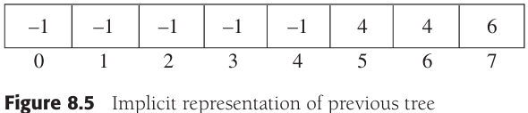
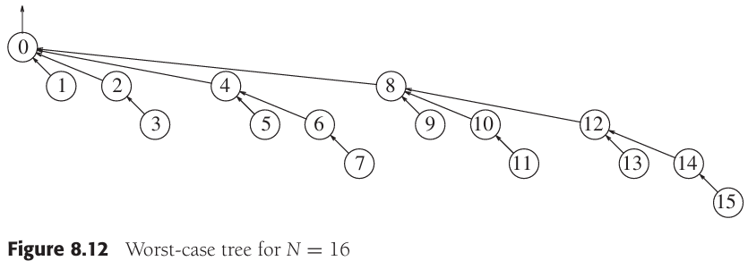

# CHAPTER 8 The Disjoint Sets Class

[TOC]


## Equivalence Relations

A **relation** R is defined on a set $S$ if for every pair of $elements(a, b), a, b \in S$, a R b is either true or false. If a R b is true, then we say that a is related to b.

An **equivalence relation** is a relation R that satisfies three properties:

1. (Reflexive) a R a, for all $a \in S$.
2. (Symmetric) a R b if and only if b R a.
3. (Transitive) a R b and b R c implies that a R c.


## Basic Data Structure




Example. Disjoint sets class interface:

```c++
class DisjSets
{
public:
    explicit DisjSets(int numElements);
    
    int find(int x) const;
    int find(int x);
    void unionSets(int root1, int root2);
    
private:
    vector<int> s;
};

DisjSets::DisjSets(int numElements) : s(numElements)
{
    for (int i = 0; i < s.size(); i++)
        s[i] = -1;
}

void DisjSets::unionSets(int root1, int root2)
{
    s[root2] = root1;
}

int DisjSets::find(int x) const
{
    if (s[x] < 0)
        return x;
    else
        return find(s[x]);
}
```


## Smart Union Algorithms





Example. Code for union-by-height (rank):

```c++
// 按高度求并
void DisjSets::unionSets(int root1, int root2)
{
    if (s[root2] < s[root1])
        s[root1] = root2;
    else
    {
        if (s[root1] == s[root2])
            s[root1]--;
        s[root2] = root1;
    }
}
```


## Path Compression


Example. An example of path compression:

```c++
// 利用路径压缩进行不相交集find的
int DisjSets::find(int x)
{
    if (s[x] < 0)
        return x;
    else
        return s[x] = find(s[x]);
}
```


## Worst Case for Union-by-Rank and Path Compression

When both heuristics are used, the algorithm is almost linear in the worst case. Specifically, the time required in the worst case is $\theta(M \alpha(M, N)) (provided\ M \geq N)$, where $\alpha(M, N)$ is an incredibly slowly growing function that, for all intents and purposes, is at most 5 for any problem instance. However, $\alpha(M, N)$ is not a constant, so the running time is not linear.

The definition of Ackermann function：

$A(1, j) = 2^j, j \geqslant 1$

$A(i, 1) = A(i - 1, 2), i \geqslant 2$

$A(i, j) = A(i - 1, A(i, j - 1)), i, j \geqslant 2$

, then, define:

$\alpha(M, N) = min \{i \geqslant 1|A(i, \lfloor M/N \rfloor) > logN\}$​

**Lemma 8.1** When executing a sequence of `union` instructions, a node of rank $r > 0$ must have at least one child of rank $0, 1, ..., r - 1$.

**Proof** By induction. The basis $r = 1$ is clearly true. When a node grows from rank $r - 1$ to rank $r$, it obtains a child of rank $r - 1$. By the inductive hypothesis, it already has children of ranks 0, 1, ..., r - 2, thus establishing the lemma.

**Lemma 8.2** At any point in the union/find algorithm, the ranks of the nodes on a path from the leaf to a root increase monotonically.

**Proof** The lemma is obvious if there is no path compression. If, after path compression, some node $v$ is a descendant of $w$, then clearly $v$ must have been a descendant of $w$ when only `unions` were considered. Hence the rank of $v$ is less than the rank of $w$.

**Lemma 8.3** $M = M_t + M_b$.

**Proof** In cases 1 and 3, each original partial find operation is replaced by a partial find on the top half, and in case 2, it is replaced by a partial find on the bottom half. Thus each partial find is replaced by exactly one partial find operation on one of the halves.

**Lemma 8.4** Let $C(M, N, r)$ be the number of parent changes for a sequence of $M$ finds with path compression on $N$ items whose maximum rank is $r$. Suppose we partition so that all nodes with rank at $s$ or lower are in the bottom, and the remaining nodes are in the top. Assuming appropriate initial conditions:
$$
C(M, N, r) < C(M_t, N_t, r) + C(M_b, N_b, s) + M_t + N_{nrb}
$$
**Proof** The path compression that is performed in each of the three cases is covered by $C(M_t, N_t, r) + C(M_b, N_b, s)$. Node $w$ in case 3 is accounted for by $M_t$. Finally, all the other bottom nodes on the path are non-root nodes that can have their parent set to themselves at most once in the entire sequence of compressions. They are accounted for by $N_{nrb}$.

**Lemma 8.5** Let $C(M, N, r)$ be the number of parent changes for a sequence of $M$ finds with path compression on $N$ items whose maximum rank is $r$. Suppose we partition so that all nodes with rank at $s$ or lower are in the bottom, and the remaining nodes are in the top. Assuming appropriate initial conditions:
$$
C(M, N, r) < C(M_t, N_t, r) + C(M_b, N_b, s) + M_t + N - (s + 2)N_t
$$
**Proof** Substitute $N_{nrb} < N - (s + 2)N_t$ into Lemma 8.4.

If we look at Lemma 8.5, we see that $C(M, N, r)$ is recursively defined in terms of two smaller instances. Our basic goal at this point is to remove one of these instances by providing a bound for it. In that case, we have a recursive formula in which $r$ is reduced to $s$. If $s$ is small enough, we can make use of a variation of above Equation, namely, that the solution to:
$$
T(N) = 
\begin{cases}
0 &N \leq 1 \\
T(\lfloor f(N) \rfloor) + M &N > 1
\end{cases}
$$
, is $O(M f^{*}(N))$. So, let's start with a simple bound for $C(M, N, r)$.

**Theorem 8.1** $C(M, N, r) < M + N \log r$.

**Proof** We start with Lemma 8.5:
$$
C(M, N, r) < C(M_t, N_t, r) + C(M_b, N_b, s) + M_t + N - (s + 2)N_t
$$
Observe that in the top half, there are only nodes of rank $s + 1, s + 2, ..., r$, and thus no node can have its parent change more than $(r - s - 2)$ times. This yields a trivial bound of $N_t(r - s - 2)$ for $C(M_t, N_t, r)$. Thus:
$$
C(M, N, r) < N_t(r - s - 2) + C(M_b, N_b, s) + M_t + N - (s + 2)N_t
$$
Combining terms,
$$
C(M, N, r) < N_t(r - 2s - 4) + C(M_b, N_b, s) + M_t + N
$$
Select $s = \lfloor r / 2 \rfloor$. Then $r - 2s - 4 < 0$, so:
$$
C(M, N, r) < C(M_b, N_b, \lfloor r / 2 \rfloor) + M_t + N
$$
Equivalently, since according to Lemma 8.3, $M = M_b + M_t$ (the proof falls apart without this),
$$
C(M, N, r) - M < C(M_b, N_b, \lfloor r / 2 \rfloor) - M_b + N
$$
Let $D(M, N, r) = C(M, N, r) - M$; then:
$$
D(M, N, r) < D(M_b, N_b, \lfloor r / 2\rfloor) + N
$$
, which implies $D(M, N, r) < N \log r$. This yields $C(M, N, r) < M + N \log r$.

**Theorem 8.2** Any sequence of $N - 1$ unions and $M$ finds with path compression makes at most $M + N \log \log N$ parent changes during the finds.

**Proof** The bound is immediate from Theorem 8.1 since $r \leq \log N$.

**Theorem 8.3** $C(M, N, r) < 2M + N \log^{*}r$.

**Proof** From Lemma 8.5 we have,
$$
C(M, N, r) < C(M_t, N_t, r) + C(M_b, N_b, s) + M_t + N - (s + 2)N_t
$$
and by Theorem 8.1, $C(M_t, N_t, r) < M_t + N_t \log r$. Thus,
$$
C(M, N, r) < M_t + N_t \log r + C(M_b, N_b, s) + M_t + N - (s + 2)N_t
$$
Rearranging and combining terms yields
$$
C(M, N, r) < C(M_b, N_b, s) + 2M_t + N - (s - \log r + 2)N_t
$$
So choose $s = \lfloor \log r \rfloor$. Clearly, this choice implies that $(s - \log r + 2) > 0$, and thus we obtain
$$
C(M, N, r) < C(M_b, N_b, \lfloor \log r \rfloor) + 2M_t + N
$$
Rearranging as in Theorem 8.1, we obtain
$$
C(M, N, r) - 2M < C(M_b, N_b, \lfloor \log r \rfloor) - 2M_b + N
$$
This time, let $D(M, N, r) = C(M, N, r) - 2M$; then
$$
D(M, N, r) < D(M_b, N_b, \lfloor \log r \rfloor) + N
$$
which implies $D(M, N, r) < N \log^{*}r$. This yields $C(M, N, r) < 2M + N \log^{*}r$.

**Theorem 8.4** $C(M, N, r) < 3M + N \log^{**} r$.

**Proof** Following the steps in the proof of Theorem 8.3, we have
$$
C(M, N, r) < C(M_t, N_t, r) + C(M_b, N_b, s) + M_t + N - (s + 2)N_t
$$
, and by Theorem 8.3, $C(M_t, N_t, r) < 2M_t + N_t \log^{*} r$. Thus,
$$
C(M, N, r) < 2M_t + N_t \log^{*}r + C(M_b, N_b, s) + M_t + N - (s + 2)N_t
$$
, rearranging and combining terms yields
$$
C(M, N, r) < C(M_b, N_b, s) + 3M_t + N - (s - \log^{*}r + 2)N_t
$$
, so choose $s = \log^{*}r$ to obtain
$$
C(M, N, r) < C(M_b, N_b, \log^{*}r) + 3M_t + N
$$
, rearranging as in Theorems 8.1 and 8.3, we obtain
$$
C(M, N, r) - 3M < C(M_b, N_b, \log^{*}r) - 3M_b + N
$$
, this time, let $D(M, N, r) = C(M, N, r) - 3M$; then
$$
D(M, N, r) < D(M_b, N_b, \log^{*}r) + N
$$
, which implies $D(M, N, r) < N \log^{**}r$. This yields $C(M, N, r) < 3M + N \log ^{**}r$.

**Theorem 8.5** Any sequence of $N - 1$ unions and $M$ finds with path compression makes at most
$$
(i + 1)M + N\log^{\overbrace{****}^{i \text{ times}}}(\log N)
$$
, parent changes during the finds.

**Proof** This follows from the above discussion and the fact that $r \leq \log N$.

**Theorem 8.6** Any sequence of $N - 1$ unions and $M$ finds with path compression make at most $M\alpha(M, N) + 2M$ parent changes during the finds.

**Proof** In Theorem 8.5, choose $i$ to be $\alpha(M, N)$; thus, we obtain a bound of $(i + 1)M + N(M / N)$, or $M\alpha(M, N) + 2M$.
