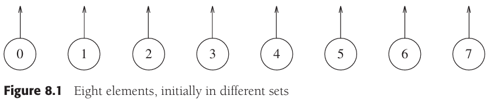

# CHAPTER 8 The Disjoint Sets Class

[TOC]


## Equivalence Relations

A **relation** R is defined on a set $S$ if for every pair of $elements(a, b), a, b \in S$, a R b is either true or false. If a R b is true, then we say that a is related to b.

An **equivalence relation** is a relation R that satisfies three properties:

1. (Reflexive) a R a, for all $a \in S$.
2. (Symmetric) a R b if and only if b R a.
3. (Transitive) a R b and b R c implies that a R c.


## Basic Data Structure




Example. Disjoint sets class interface:

```c++
class DisjSets
{
public:
    explicit DisjSets(int numElements);
    
    int find(int x) const;
    int find(int x);
    void unionSets(int root1, int root2);
    
private:
    vector<int> s;
};

DisjSets::DisjSets(int numElements) : s(numElements)
{
    for (int i = 0; i < s.size(); i++)
        s[i] = -1;
}

void DisjSets::unionSets(int root1, int root2)
{
    s[root2] = root1;
}

int DisjSets::find(int x) const
{
    if (s[x] < 0)
        return x;
    else
        return find(s[x]);
}
```


## Smart Union Algorithms


Example. Code for union-by-height (rank):

```c++
// 按高度求并
void DisjSets::unionSets(int root1, int root2)
{
    if (s[root2] < s[root1])
        s[root1] = root2;
    else
    {
        if (s[root1] == s[root2])
            s[root1]--;
        s[root2] = root1;
    }
}
```


## Path Compression


Example. An example of path compression:

```c++
// 利用路径压缩进行不相交集find的
int DisjSets::find(int x)
{
    if (s[x] < 0)
        return x;
    else
        return s[x] = find(s[x]);
}
```


## Worst Case for Union-by-Rank and Path Compression

When both heuristics are used, the algorithm is almost linear in the worst case. Specifically, the time required in the worst case is $\theta(M \alpha(M, N)) (provided\ M \geq N)$, where $\alpha(M, N)$ is an incredibly slowly growing function that for all intents and purposes is at most 5 for any problem instance. However, $\alpha(M, N)$ is not a constant, so the running time is not linear.

The define of Ackermann function：

$A(1, j) = 2^j, j \geqslant 1$

$A(i, 1) = A(i - 1, 2), i \geqslant 2$

$A(i, j) = A(i - 1, A(i, j - 1)), i, j \geqslant 2$

, then, define:

$\alpha(M, N) = min \{i \geqslant 1|A(i, \lfloor M/N \rfloor) > logN\}$​

**Lemma 8.1** When executing a sequence of `union` instructions, a node of rank $r > 0$ must have at least one child of rank $0, 1, ..., r - 1$.

**Proof** TODO

**Lemma 8.2** At any point in the union/find algorithm, the ranks of the nodes on a path from the leaf to a root increase monotonically.

**Proof** TODO

**Lemma 8.3** $M = M_t + M_b$.

**Proof** TODO

**Lemma 8.4** Let $C(M, N, r)$ be the number of parent changes for a sequence of $M$ finds with path compression on $N$ items whose maximum rank is $r$. Suppose we partition so that all nodes with rank at $s$ or lower are in the bottom, and the remaining nodes are in the top. Assuming appropriate initial conditions:
$$
C(M, N, r) < C(M_t, N_t, r) + C(M_b, N_b, s) + M_t + N_{nrb}
$$
**Proof** TODO

**Lemma 8.5** Let $C(M, N, r)$ be the number of parent changes for a sequence of $M$ finds with path compression on $N$ items whose maximum rank is $r$. Suppose we partition so that all nodes with rank at $s$ or lower are in the bottom, and the remaining nodes are in the top. Assuming appropriate initial conditions:
$$
C(M, N, r) < C(M_t, N_t, r) + C(M_b, N_b, s) + M_t + N - (s + 2)N_t
$$
**Proof** TODO
