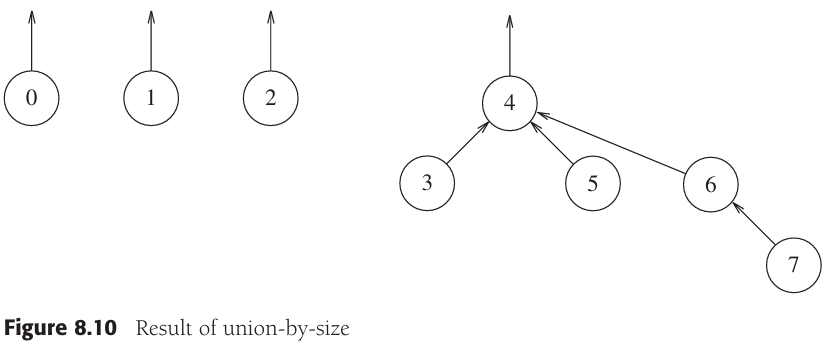
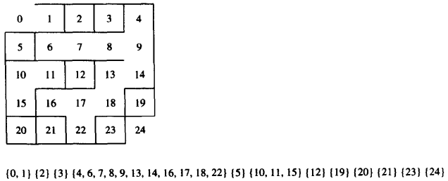

# 第八章 不相交集类

[TOC]


## 8.1 等价关系

若对于每一对元素$(a, b), a, b \in S$，$a \ R\ b$或者为true或者为false，则称在集合$S$上定义`关系(relation)R`。如果$a \ R\ b$为true，那么我们说$a$与$b$有关系。

`等价关系（equivalence relation）`是满足下列性质的关系$R$：

1. 自反性：对于所有的$a \in S, a\ R\ a$。
2. 对称性：$a\ R\ b$当且仅当$b\ R\ a$。
3. 传递性：若$a\ R\ b$且$b\ R\ c$则$a\ R\ c$。


## 8.2 动态等价性问题


## 8.3 基本数据结构


*8个元素，初始时在不同的集合上*


*在union(4, 5)之后*


*在union(6, 7)之后*


*在union(4, 6)之后*


*上面的树的非显式表示*

```c++
class DisjSets
{
public:
    explicit DisjSets(int numElements);
    
    int find(int x) const;
    int find(int x);
    void unionSets(int root1, int root2);
    
private:
    vector<int> s;
};

DisjSets::DisjSets(int numElements) : s(numElements)
{
    for (int i = 0; i < s.size(); i++)
        s[i] = -1;
}

void DisjSets::unionSets(int root1, int root2)
{
    s[root2] = root1;
}

int DisjSets::find(int x) const
{
    if (s[x] < 0)
        return x;
    else
        return find(s[x]);
}
```


## 8.4 灵巧求并算法



*按大小求并的结果*


*进行一次任意的union的结果*


*N=16时最坏情形的树*


*按高度求并*

```c++
// 按高度求并
void DisjSets::unionSets(int root1, int root2)
{
    if (s[root2] < s[root1])
        s[root1] = root2;
    else
    {
        if (s[root1] == s[root2])
            s[root1]--;
        s[root2] = root1;
    }
}
```


## 8.5 路径压缩


*路径压缩的例子*

```c++
// 利用路径压缩进行不相交集find的
int DisjSets::find(int x)
{
    if (s[x] < 0)
        return x;
    else
        return s[x] = find(s[x]);
}
```


## 8.6 按秩求和路径压缩的最坏情形

当使用两种探测法时，算法在最坏情形下几乎是线性的。特别地，在最坏情形下需要的时间是$\Theta(M\alpha(M, N))（假设 M \geqslant N）$，其中，$\alpha(M, N)$是Ackermann函数的逆，Ackermann函数如下定义：

$A(1, j) = 2^j, j \geqslant 1$

$A(i, 1) = A(i - 1, 2), i \geqslant 2$

$A(i, j) = A(i - 1, A(i, j - 1)), i, j \geqslant 2$

由此，定义：

$\alpha(M, N) = min \{i \geqslant 1|A(i, \lfloor M/N \rfloor) > logN\}$

**引理8.1** 当执行一系列union指令时，一个秩为$r$的结点必然至少有$2^r$个后裔结点（包括它自己）。

**证明**      使用数学归纳法。对于基准情形$r = 0$，引理显然成立。令$T$是秩为$r$的具有最少后裔数的树，并令$X$是$T$的根。设涉及$X$的最后一次union是在$T_1$和$T_2$之间进行的。设$T_1$的根为$X$。如果$T_1$的秩是$r$，那么$T_1$就是一棵高度为$r$的树且比$T$有更少的后裔，这与$T$是具有最少后裔数的树的假设相矛盾。因此$T_1$的秩小于等于$r-1$。$T_2$的秩小于等于$T_1$的秩。由于$T$有秩$r$而秩只能因$T_2$增加，因此$T_2$的秩为$r-1$。于是$T_1$的秩为$r-1$。根据归纳假设，每棵树至少有$2^{r-1}$个后裔，从而总数为$2^r$个后裔，引理得证。

**引理8.2** 秩为$r$的结点的个数最多是$N/2^r$。

**证明**      若无路径压缩，每个秩为$r$的结点都是至少有$2^r$个结点的子树的根。在这样的子树中没有其秩为$r$的结点。因此，那些秩为$r$的结点的所有子树都是不相交的。于是，存在至多$N/2^r$个不相交的子树，从而最多有$N/2^r$个秩为$r$的结点。

**引理8.3** 在求并/查找算法的任一时刻，从树叶到根的路径上的结点的秩单调增加。

**证明**      如果不存在路径压缩，那么该引理显然成立。如果在路径压缩后某个结点$v$是$w$的一个后裔，那么当只考虑union操作时显然$v$必然还是$w$的后裔。因此，$v$的秩小于$w$的秩。


*一棵大的不相交集树（节点下面的数是秩）*

对从表示$i$的顶点到根的路径上的每一个顶点$v$，我们在两个账户之一存入一个分币：

1. 如果$v$是根，或者$v$的父亲是根，或者$v$的父亲与$v$在不同的秩组中，那么在该法则之下收取一个单位的费用，这就需要将一个美分币存入公共储金中。
2. 否则，将一个加拿大分币存入该顶点中。

**引理8.4** 对于任意的$find(v)$，不论存入公共储金还是存入顶点，所存分币的总数恰好等于从$v$到根的路径上的结点的个数。

**证明**      这是显而易见的。

**引理8.5** 经过整个算法，在法则1下美分币总的存入量最多为$M(G(N) + 2)$。

**证明**      对于任意的find，由于有根和它的儿子，因此存入两个美分币。由引理8.3，沿路径向上分布的结点按秩单调递增，而由于最多有$G(N)$个秩组，因此对任意特定的find，在路径上只有$G(N)$个其它结点能够按照法则1存入分币。于是，在任意一次find期间最多有$G(N)+2$个美分币可以放入公共储金中。因此，在法则1下，连续$M$次find最多可以存入$M(G(N)+2)$个美分币。

**引理8.6** 秩组$g>0$中顶点的个数$V(g)$至多为$N/2^{F(g-1)}$。

**证明**      由引理8.2，至多存在$N/2^r$个秩为$r$的顶点。对组$g$中的秩求和，得到：
$$
\begin{equation}\begin{split} 
V(g) &\leqslant \sum_{r=F(g-1)+1}^{F(g)} \frac{N}{2^r} \\ 
     &\leqslant \sum_{r=F(g-1)+1}^{\infty} \frac{N}{2^r} \\
     &\leqslant N\sum_{r=F(g-1)+1}^{\infty} \frac{1}{2^r} \\
     &\leqslant \frac{N}{2^{F(g-1)+1}}\sum_{s=0}^{\infty} \frac{1}{2^s} \\
     &\leqslant \frac{2N}{2^{F(g-1)+1}} \\
     &\leqslant \frac{N}{2^{F(g-1)}} \\
\end{split}\end{equation}
$$
**引理8.7** 存入秩组$g$的所有顶点的加拿大分币的最大个数至多是$NF(g)/2^{F(g-1)}$。

**证明**      该秩组的每一顶点当它的父结点同在该秩组时最多可以接收$F(g) - F(g-1) \leqslant F(g)$个加拿大分币，而引理8.6告诉我们这样的顶点存在的个数。通过简单的乘法可以到到定理的结果。

**引理8.8** 在法则2下总的存入分币数最多为$N \sum_{g=1}^{G(N)} F(g)/2^{F(g-1)}$个加拿大分币。

**证明**      因为秩组0只含有秩为0的元素，所以它不能按照法则2接收分币（这样的元素在该秩组中不可能有父节点）。通过将其他秩组求和则可得到引理指出的界。这样，我们就得到在法则1和法则2下存入的分币数，该总数为：

$M(G(N) + 2) + N\sum_{g=1}{G(N)} F(g)/2^{F(g-1)} \qquad \qquad (8-1)$


*在证明中用到的将秩分成秩组的实际划分*

**定理8.1** $M$次union和find的运行时间为$O(Mlog^*N)$。

**证明**      把$F$和$G$的定义插入到公式(8-1)中，美分币的总数为$O(MG(N)) = O(Mlog^*N)$，加拿大分币的总数为$N\sum_{g=1}^{G(N)} F(g)/2^{F(g-1)} = N\sum_{g=1}^{G(N)}1 = NG(N) = O(Nlog^*N)$。由于$M = \Omega(N)$，因此得出定理的界。


## 8.7 一个应用


*生成一个50 x 80迷宫*


*初始状态：所有的墙都存在，所有的单元都在它自己的集合中*


*在算法的某个时刻：几面墙被拆掉，集合合并。如果这时单元8和13之间的墙被随机地选定，那么这面墙将不拆掉，因为单元8和13已经是连通的*



*在上图中单元18和13之间的墙被随机地选定。这面墙被拆掉，因为单元18和13还没有连通。它们所在的集合被合并*


*最后24面墙被拆掉，所有的元素都在一个集合中*


