# 第九章 图论算法

[TOC]


## 若干定义

- `图（grph）` $G = (V, E)$由`顶点(vertex)`的集$V$和`边（edge）`的集$E$组成。
- `边` 也叫`弧（arc）`，图的每一个点对$(v, w)，其中v, w \in V$。
- `有向图（digraph）`点对有序的图。
- `路径（path）` 一个顶点序列$w_1$, $w_2$, $w_3$, ..., $w_N$，其中$(w_i, w_{i+1}) \in E, 1 \leqslant i < N$。
- `回路（cycle）` 有向图中满足$w_1 = w_N$且长至少为1的一条路径。
- `无环（acyclic）` 没有回路的有向图（简称：DAG）；
- `连通无向图` 无向图中从每一个顶点到每个其他顶点都存在一条路径，也称作强连通的（strongly connected）。
- `弱连通(weakly connected)有向图` 有向图不是强连通的，但是它的基础图（underlying graph，即其弧上去掉方向所形成的图）是联通的 。
- `完全图（complete graph）` 每一对顶点间都存在一条边的图。

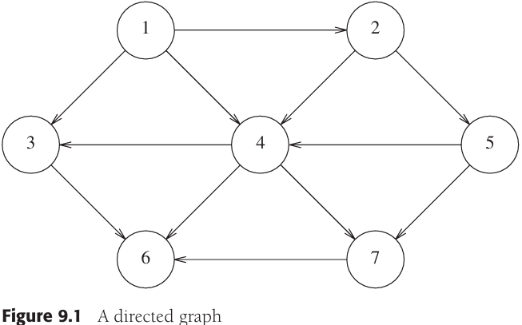

*一个有向图*

表示图的方法：

- `邻接矩阵（adjacent matrix）表示法` 

  使用二维数组，对于每条边$(u, v)$，置$A[u][v] = true$；否则，数组的项就是false。如果边有一个权，那么可以置$A[u][v]$等于该权，而使用一个很大或者很小的权作为标记表示不存在的边。

  这种表示的优点是非常简单，但是，它的空间需求则为$\Theta(|V|^2)$，如果图的边不是很多，那么这种表示的代价非常大；邻接矩阵适合于稠密（dense）的图：$|E| = \Theta(|V|^2)$。

- `邻接表（adjacency list）`

  对于每一个顶点，使用一个表存放所有邻接的顶点；此时的空间需求为$O(|E|+|V|)$，它对于图的大小而言是线性的。

  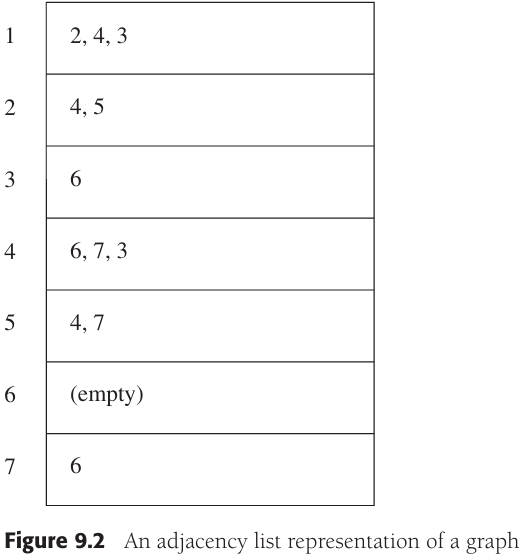

  *图的邻接表表示*


## 拓扑排序

`拓扑排序（topological sort）` 是对有向无环图的顶点的一种排序，它使得如果存在一条从$v_i$到$v_j$的路径，那么在排序中$v_j$出现在$v_i$的后面。

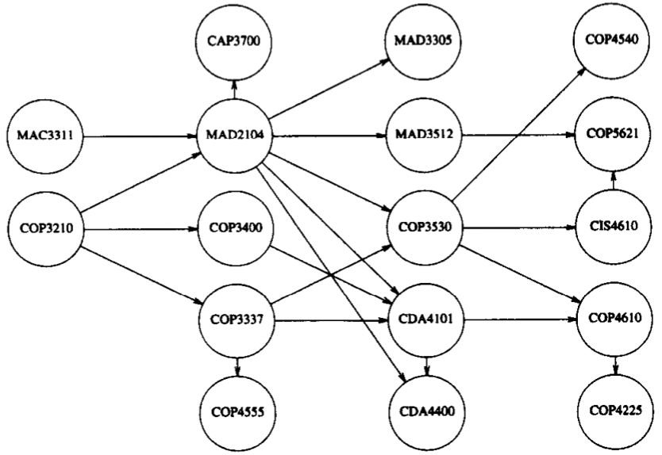

*表示课程结构的无环图*

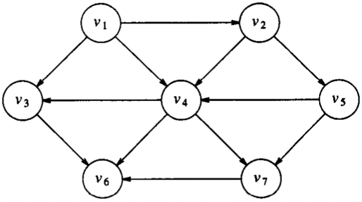*一个无环图*

```c++
// 简单的拓扑排序伪代码
void Graph::topsort()
{
	for (int counter = 0; counter < NUM_VERTICES; counter++)
  {
  	Vertex v = findNewVertexOfIndegreeZero(); // 扫描数组，寻找一个尚未被分配拓扑编号的入度为0的顶点
    if (v == NOT_A_VERTEX)
      throw CycleFoundException();
    v.topNum = counter;
    for each Vertex w adjacent to v
      w.indegree--;
  }
}
```

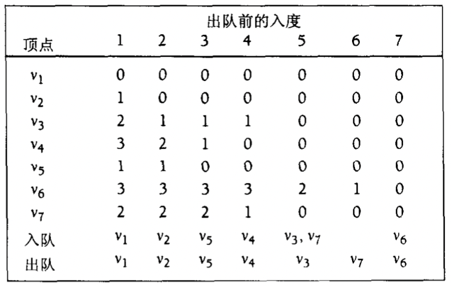

*对上图中的图应用拓扑排序的结果*


## 最短路径算法

输入是一个加权图：与每条边$(v_i, v_j)$相联系的是穿越该边的代价（或称为值）$c_{i,j}$。一条路径$v_1 v_2 ... v_N$的值是$\sum_{i=1}^{N-1} c_{i,i+1}$叫做`加权路径长（weighted path length）`。而`无权路径长（unweighted path length）`只是路径上的边数，即$N-1$。

```c++
// 施行拓扑排序的伪代码
void Graph::topsort()
{
	Queue<Vertex> q;
  int counter = 0;
  
  q.makeEmpty();
  for each Vertex v
    if (v.indegree == 0)
      q.enqueue(v);
  
  while (!q.isEmpty())
  {
  	Vertex v = q.dequeue();
    v.topNum = ++counter;
    
    for each Vertex w adjacent to v
      if (--w.indegree == 0)
        q.enqueue(w);
  }
  
  if (counter != NUM_VERTICES)
    throw CycleFoundException();
}
```

**单源最短路径问题** 给定一个加权图$G=(V, E)$和一个特定顶点$s$作为输入，找出从$s$到$G$中每一个其他顶点的最短加权路径。

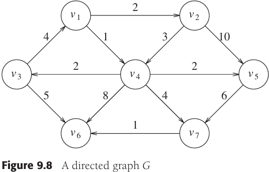*有向图G*

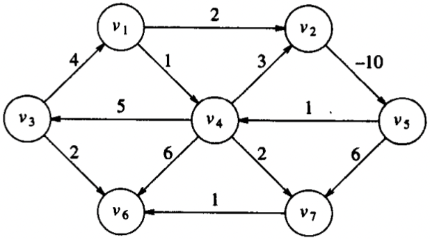

*带有负值回路的图*

### 无权最短路径

`广度优先搜索（breadth-first search）` 该方法按层处理顶点：距开始点最近的那些顶点首先被求值，而最远的那些顶点最后被求值。

例：

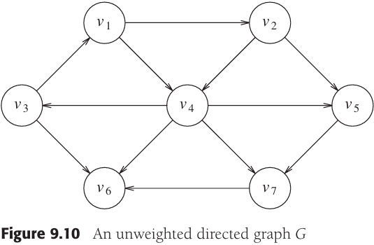

*一个无权有向图G*

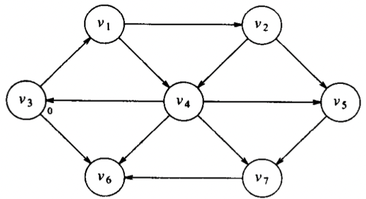

*将开始结点标记为通过0条边可以到达的结点后的图*

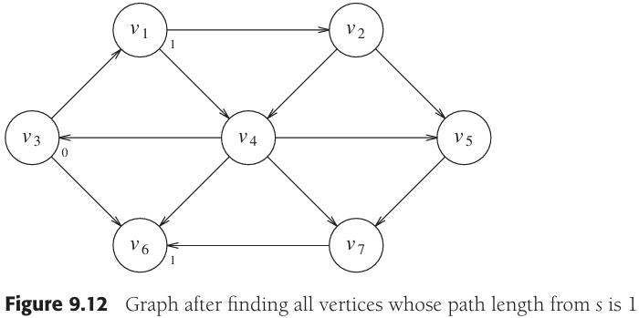

*找出所有从s出发路径长为1的顶点之后的图*

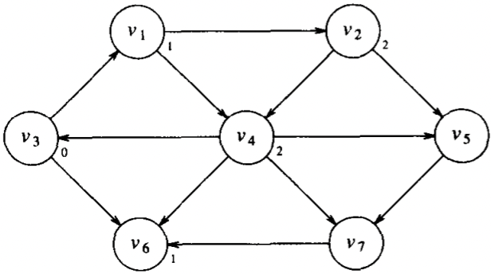

*找出所有从s出发路径长为2的顶点之后的图*


*最后的最短路径*

```c++
// 无权最短路径算法的伪代码
void Graph::unweighted(Vertex s)
{
	for each Vertex v
  {
  	v.dist = INFINITY;
    v.known = false;
  }
  s.dist = 0;
  for (int currDist = 0; currDist < NUM_VERTICES; currDist++)
    for each Vertex v
      if (!v.known && v.dist == currDist)
      {
      	v.known = true;
        for each Vertex w adjacent to v
          if (w.dist == INFINITY)
          {
          	w.dist = currDist + 1;
            w.path = v;
          }
      }
}
```

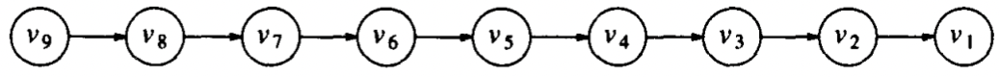

*使用上面伪代码的无权最短路径算法的坏情形*

```c++
// 无权最短路径算法的伪代码（使用邻接表）
void Graph::unweighted(Vertex s)
{
	Queue<Vertex> q;
  
  for each Vertex v
    v.dist = INFINITY;
  
  s.dist = 0;
  q.enqueue(s);
  
  while (!q.isEmpty())
  {
  	Vertex v = q.dequeue();
    for each Vertex w adjacent to v
      if (w.dist == INFINITY)
      {
      	w.dist = v.dist + 1;
        w.path = v;
        q.enqueue(w);
      }
  }
}
```

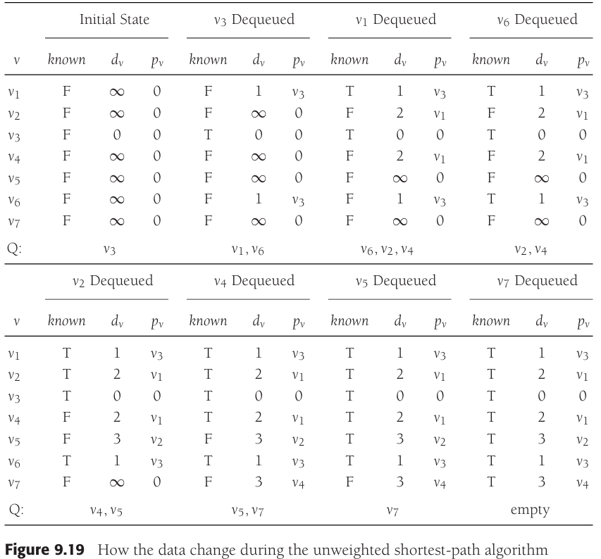

*无权最短路径算法期间数据如何变化*

### Dijkstra算法

Dijkstra算法按阶段进行，在每个阶段，Dijkstra算法选择一个顶点$v$，它在所有unknown顶点中居于最小的$d_v$，同时算法声明从$s$到$v$的最短路径是known的。阶段的其余部分由$d_w$值的更新工作组成。

在无权的情形，若$d_w = \infin$则置$d_w = d_v + 1$。因此，若顶点$v$能提供一条更短路径，则我们本质上就降低了$d_w$的值。如果对加权的情形应用同样的逻辑，那么当$d_w$的新值$d_v + c_{v,w}$是一个改进的值时，就置$d_w = d_v + c_{v, w}$。简言之，使用通向$w$路径上的顶点$v$是不是一个好主意由算法决定。原始的值$d_w$是不用$v$的值；上面所算出的值是使用$v$（和仅仅为known的顶点）的最便宜的路径。

例：

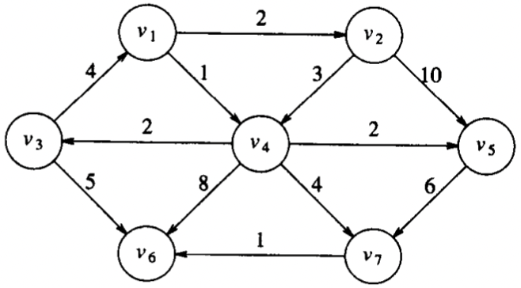

*有向图G*

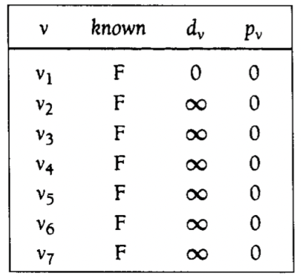

*用于Dijkstra算法的表的初始配置*

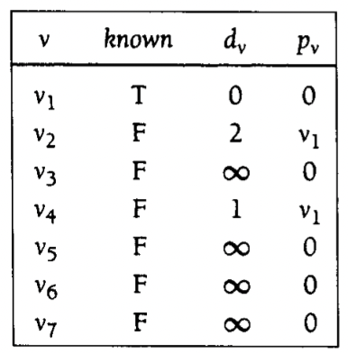

*在$v_1$被声明为known后的表*

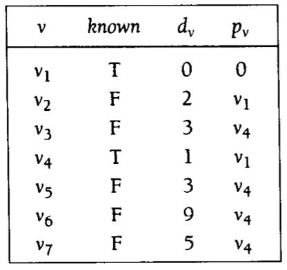

*在$v_4$被声明为known后*

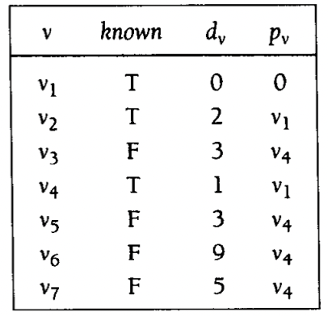

*在$v_2$被声明为known后*

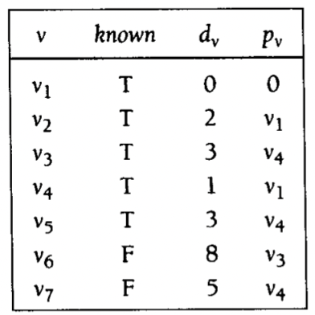

*在$v_5$与$v_3$被声明为known后*

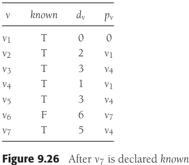

*在$v_7$被声明为known后*

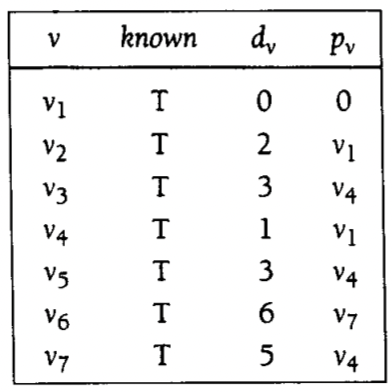

*在$v_6$被声明为known之后，算法终止*

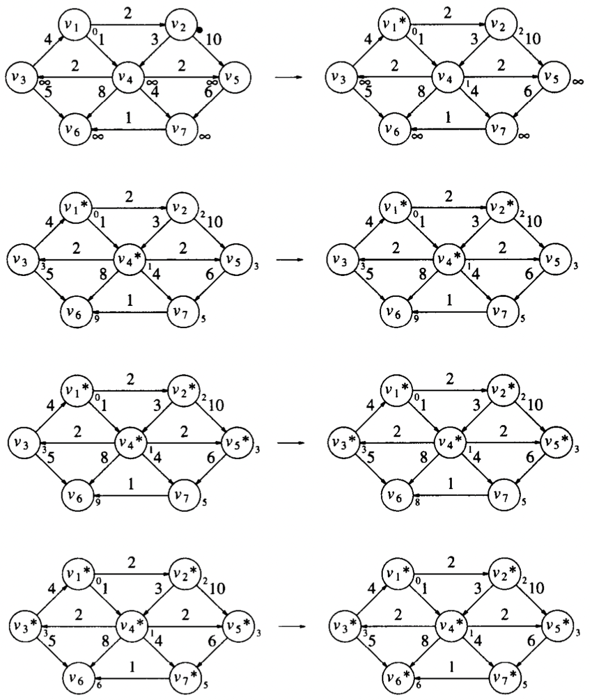

*Dijkstra算法的各个阶段*

```c++
// Dijkstra算法伪代码
struct Vertex
{
	List     adj;
  bool     known;
  DistType dist;
  Vertex   path;
};

void Graph::printPath(Vertex v)
{
	if (v.path != NOT_A_VERTEX)
  {
  	printPath(v.path);
    cout << " to ";
  }
  cout << v;
}

void Graph::dijkstra(Vertex s)
{
	for each Vertex v
  {
  	v.dist = INFINITY;
    v.known = false;
  }
  
  s.dist = 0;
  
  for (;;)
  {
  	Vertex v = smallest unknown distance vertex;
    if (v == NOT_A_VERTEX)
      break;
    v.known = true;
    
    for each Vertex w adjacent to v
      if (!w.known)
        if (v.dist + cvw < w.dist)
        {
        	// Update w
          decrease(w.dist to v.dist + cvw);
          w.path = v;
        }
  }
}
```

### 具有负边值的图

```c++
// 具有负边值的加权最短路径算法的伪代码
void Graph::weightedNegative(Vertex s)
{
	Queue<Vertex> q;
  
  for each Vertex v
    v.dist = INFINITY;
  
  s.dist = 0;
  q.enqueue(s);
  
  while (!q.isEmpty())
  {
  	Vertex v = q.dequeue();
    for each Vertex w adjacent to v
      if (v.dist + cvw < w.dist)
      {
      	w.dist = v.dist + cvw;
        w.path = v;
        if (w is not already in q)
          q.enqueue(w);
      }
  }
}
```

### 无环图

`关键路径分析（critical path analysis）`

`动作结点图（activity-node graph）`

`事件结点图（event-node graph）`

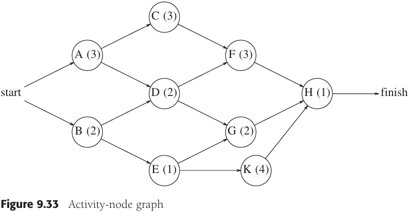

*动作结点图*

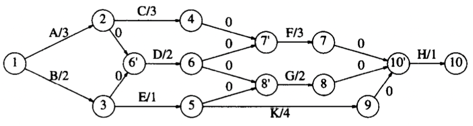

*事件结点图*

事件结点图中每个事件的最早完成时间：

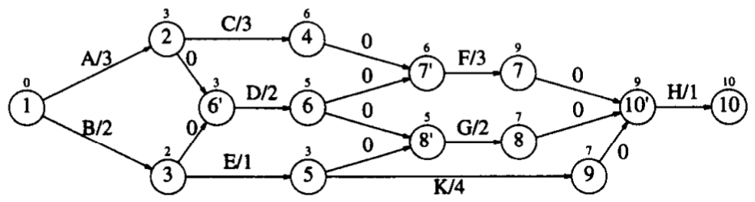

*最早完成时间*

$EC_1 = 0$

$EC_w = \underset{(v,w) \in E}{max} (EC_v + C_{v,w})$

计算能够完成而不影响最后完成时间的最晚时间$LC_i$：

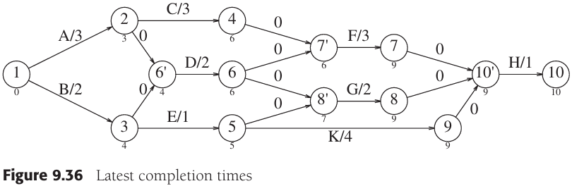

*最晚完成时间*

$LC_n = EC_n$

$LC_v = min(LC_w - c_{v,w})$

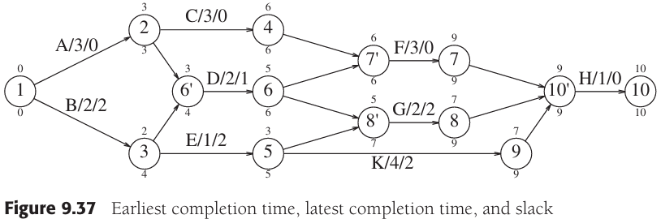

*最早完成时间，最晚完成时间和松弛时间*

每条边的`松弛时间（slack time）`代表对应动作可以被延迟而不推迟整体完成的时间量：

$Slack_{(v, w)} = LC_w - EC_v -c_{v,w}$

### 所有顶点对的最短路径

### 最短路径举例

```c++
// 查找字梯的C++程序
map<string, string> findChain(const map<string, vector<string> >& adjacentWords, const string& first)
{
  map<string, string> previousWord;
  queue<string> q;
  
  q.push(first);
  while (!q.empty())
  {
  	string current = q.front(); q.pop();
    
    map<string, vector<string> >::const_iterator itr;
    itr = adjacentWords.find(current);
    
    const vector<string>& adj = itr->second;
    for (int i = 0; i < adj.size(); i++)
      if (previousWord[adj[i]] == "")
      {
      	previousWord[adj[i]] == current;
        q.push(adj[i]);
      }
  }
  previousWord[first] = "";
  return previousWord;
}

vector<string> getChainFromPrevMap(const map<string, string>& previous, const string& second)
{
	vector<string> result;
  map<string, string>& prev = const_cast<map<string, string> &>(previous);
  
  for (string current = second; current != ""; current = prev[current])
    result.push_back(current);
  
  reverse(result.begin(), result.end());
  return result;
}
```


## 网络流问题

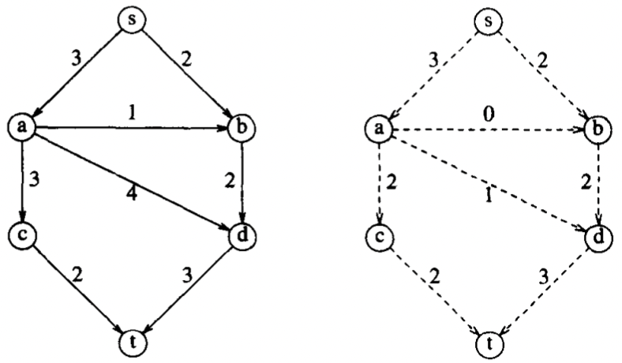

*一个图（左边）和它的最大流*

设给定边容量为$c_{v,w}$的有向图$G=(V, E)$。这些容量可以代表通过一个管道的水的流量或两个交叉路口之间马路上的交通流量。有两个顶点，一个是$s$，称为`源点（source）`，一个是$t$，称为`汇点（sink）`。对于任一条边$(v, w)$，最多有“流”的$c_{v,w}$个单位可以通过。在既不是源点$s$又不是汇点$t$的任一顶点$v$，总的进入的流必须等于总的发出的流。

TODO