# CHAPTER 9 Graph Algorithms

[TOC]


## Definitions

- A **graph** $G = (V, E)$ consists of a set of vertices, $V$​, and a set of edges, E.
- Each graph edge is a pair $(v, w)$, where $v, w \in V$. Edges are sometimes refered to as **arcs**.
- Directed graphs are sometimes referred to as **digraphs**.
- A **path** in a graph is sequence of vertices $w_1, w_2, w_3, ..., w_N$ such that $(w_i, w_{i+1}) \in E$ for $1 \leq i < N$.
- A **cycle** in a direted graph is a path of length at least 1 such that $w_1 = w_N$.
- A directed graph is **acyclic** if it has no cycles.
- An undirected graph is **connected** if there is a path from every vertex to every other vertex.
- A directed graph with this property is called **strongly connected**.
- If a directed graph is not strongly connected, but the underlying graph (without direction to the arcs) is connected, then the graph is said to be **weakly connected**.
- A **complete graph** is a graph in which there is an edge between every pair of vertices.


The ways to represent a graph:

- adjacency matrix

  For each $edge(u, v)$, we set $A[u][v]$ to true; otherwise the entry in the array is false. If the edge has a weight associated with it, then we can set $A[u][v]$ equal to the weight and use either a very large or a very small weight as a sentinel to indicate nonexistent edges.

- adjacency list

  For each vertex, we keep a list of all adjacent vertices. The space requirement is then $O(|E| + |V|)$​, which is linear in the size of the graph.

  


## Topological Sort

A **topological sort** is an ordering of vertices in a directed acyclic graph, such that if there is a path from $v_i$ to $v_j$ appears after $v_i$ in the ordering.

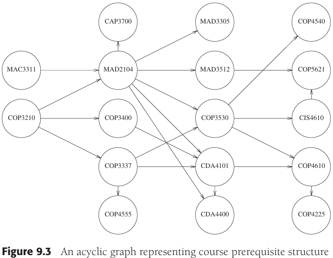

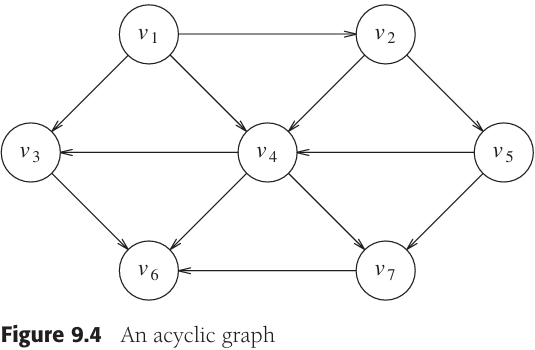

```c++
// 简单的拓扑排序伪代码
void Graph::topsort()
{
	for (int counter = 0; counter < NUM_VERTICES; counter++)
  {
  	Vertex v = findNewVertexOfIndegreeZero(); // 扫描数组，寻找一个尚未被分配拓扑编号的入度为0的顶点
    if (v == NOT_A_VERTEX)
      throw CycleFoundException();
    v.topNum = counter;
    for each Vertex w adjacent to v
      w.indegree--;
  }
}
```


## Shortest-Path Algorithms

The input is a weighted graph: Associated with each edge $(v_i, v_j)$ is a cost $c_{i,j}$ to traverse the edge. The cost of a path $v_1 v_2 ... v_N$ is $\sum_{i=1}^{N-1} c_{i,i+1}$. This is referred to as the **weighted path length**. The **unweighted path length** is merely the number of edges on the path, namely, $N - 1$.

```c++
// 施行拓扑排序的伪代码
void Graph::topsort()
{
	Queue<Vertex> q;
  int counter = 0;
  
  q.makeEmpty();
  for each Vertex v
    if (v.indegree == 0)
      q.enqueue(v);
  
  while (!q.isEmpty())
  {
  	Vertex v = q.dequeue();
    v.topNum = ++counter;
    
    for each Vertex w adjacent to v
      if (--w.indegree == 0)
        q.enqueue(w);
  }
  
  if (counter != NUM_VERTICES)
    throw CycleFoundException();
}
```

**Single-Source Shortest-Path Problem** Given as input a weighted graph, $G = (V, E)$, and a distinguished vertex, $s$, find the shortest weighted path from $s$ to every other vertex in $G$.


### Unweighted Shortest Paths

**breadth-first search** operates by processing vertices in layers: The vertices closest to the start are evaluated first, and the most distant vertices are evaluated last. This is much the same as a level-order traversal for trees.

Example:


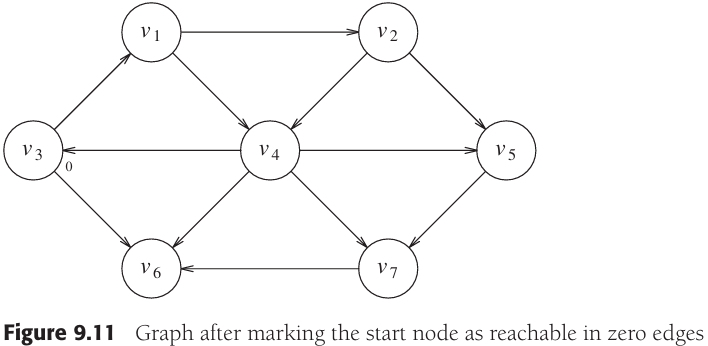


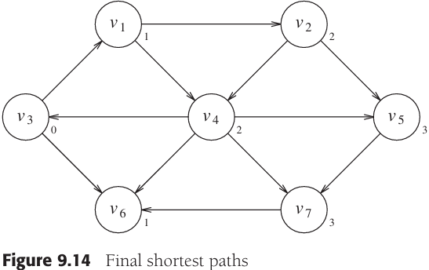

```c++
// 无权最短路径算法的伪代码
void Graph::unweighted(Vertex s)
{
	for each Vertex v
  {
  	v.dist = INFINITY;
    v.known = false;
  }
  s.dist = 0;
  for (int currDist = 0; currDist < NUM_VERTICES; currDist++)
    for each Vertex v
      if (!v.known && v.dist == currDist)
      {
      	v.known = true;
        for each Vertex w adjacent to v
          if (w.dist == INFINITY)
          {
          	w.dist = currDist + 1;
            w.path = v;
          }
      }
}
```


### Dijkstra's Algorithm

```c++
// 无权最短路径算法的伪代码（使用邻接表）
void Graph::unweighted(Vertex s)
{
	Queue<Vertex> q;
  
  for each Vertex v
    v.dist = INFINITY;
  
  s.dist = 0;
  q.enqueue(s);
  
  while (!q.isEmpty())
  {
  	Vertex v = q.dequeue();
    for each Vertex w adjacent to v
      if (w.dist == INFINITY)
      {
      	w.dist = v.dist + 1;
        w.path = v;
        q.enqueue(w);
      }
  }
}
```


Dijkstra's algorithm proceeds in stages, just like the unweighted shortest-path algorithm. At each stage, Dijkstra's algorith selects a vertex, $v$, which has the smallest $d_v$ among all the `unknown` vertices and declares that the shortest path from $s$ to $v$ is `known`. The remainder of a stage consists of updating the values of $d_w$.

In the unweighted case, we set $d_w = d_v + 1$ if $d_w = \infty$. Thus, we essentially lowered the value of $d_w$ if vertex $v$ offered a shorter path. If we apply the same logic to the weighted case, then we should set $d_w = d_v + c_{v,w}$ if this new value for $d_w$ would be an improvement. Put simply, the algorithm decides whether or not it is a good idea to use $v$ on the path to $w$. The original cost, $d_w$, is the cost without using $v$; the cost calculated above is the cheapest path using $v$ (and only `known` vertices).

Example:

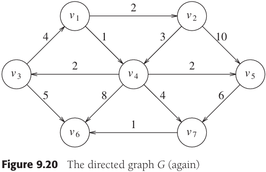

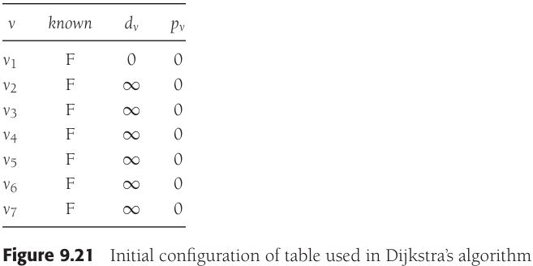


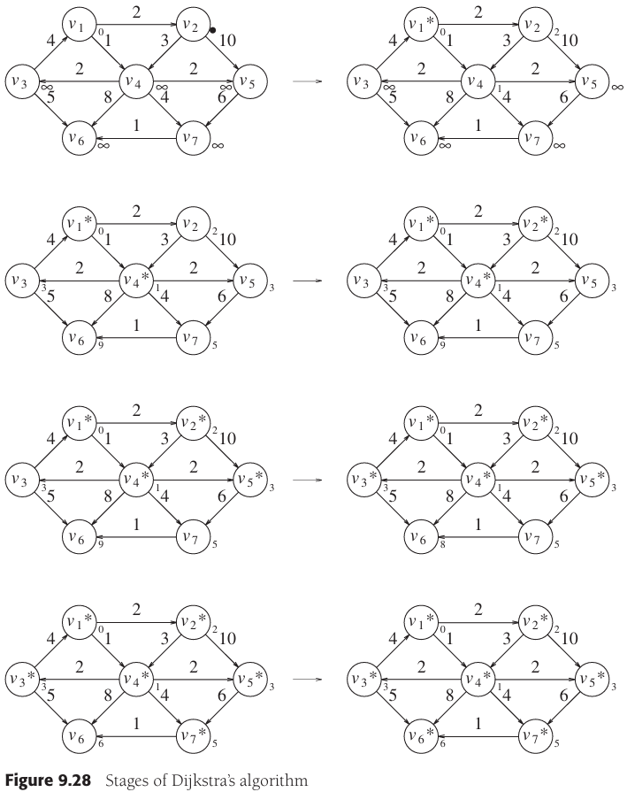

Example. Dijkstra pseudo code:

```c++
// Dijkstra算法伪代码
struct Vertex
{
	List     adj;
  bool     known;
  DistType dist;
  Vertex   path;
};

void Graph::printPath(Vertex v)
{
	if (v.path != NOT_A_VERTEX)
  {
  	printPath(v.path);
    cout << " to ";
  }
  cout << v;
}

void Graph::dijkstra(Vertex s)
{
	for each Vertex v
  {
  	v.dist = INFINITY;
    v.known = false;
  }
  
  s.dist = 0;
  
  for (;;)
  {
  	Vertex v = smallest unknown distance vertex;
    if (v == NOT_A_VERTEX)
      break;
    v.known = true;
    
    for each Vertex w adjacent to v
      if (!w.known)
        if (v.dist + cvw < w.dist)
        {
        	// Update w
          decrease(w.dist to v.dist + cvw);
          w.path = v;
        }
  }
}
```

### Graphs with Negative Edge Costs

Example. Pseudocode for weighted shortest-path algorithm with negative edge costs:

```c++
// 具有负边值的加权最短路径算法的伪代码
void Graph::weightedNegative(Vertex s)
{
	Queue<Vertex> q;
  
  for each Vertex v
    v.dist = INFINITY;
  
  s.dist = 0;
  q.enqueue(s);
  
  while (!q.isEmpty())
  {
  	Vertex v = q.dequeue();
    for each Vertex w adjacent to v
      if (v.dist + cvw < w.dist)
      {
      	w.dist = v.dist + cvw;
        w.path = v;
        if (w is not already in q)
          q.enqueue(w);
      }
  }
}
```

### Acyclic Graphs


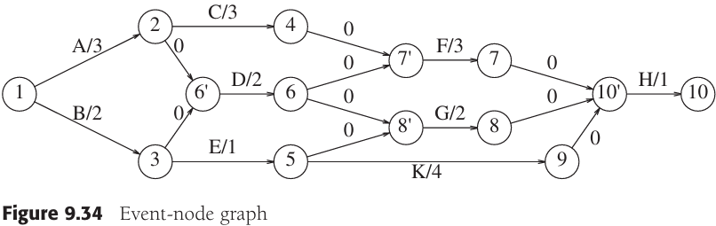


If $EC_i$ is the earliest completion time for node $i$, then the applicable rules are:
$$
\begin{equation}\begin{split} 
EC_1 &= 0 \\
EC_w &= \underset{(v,w) \in E}{max} (EC_v + C_{v,w})
\end{split}\end{equation}
$$
We can also compute the latest time $LC_i$, that each event can finish without affecting the final completion time. The formulas to do this are:
$$
\begin{equation}\begin{split} 
LC_n &= EC_n \\
LC_v &= \underset{(v, w) \in E}{min}(LC_w - c_{v,w})
\end{split}\end{equation}
$$
The **slack time** for each edge in the event-node graph represents the amount of time that the completion of the corresponding activity can be delayed without delaying the overall completion. It is easy to see that:
$$
Slack_{(v, w)} = LC_w - EC_v - c_{v,w}
$$

### Shortest Path Example

Example. C++ code to fid word ladders:

```c++
// 查找字梯的C++程序
map<string, string> findChain(const map<string, vector<string> >& adjacentWords, const string& first)
{
  map<string, string> previousWord;
  queue<string> q;
  
  q.push(first);
  while (!q.empty())
  {
  	string current = q.front(); q.pop();
    
    map<string, vector<string> >::const_iterator itr;
    itr = adjacentWords.find(current);
    
    const vector<string>& adj = itr->second;
    for (int i = 0; i < adj.size(); i++)
      if (previousWord[adj[i]] == "")
      {
      	previousWord[adj[i]] == current;
        q.push(adj[i]);
      }
  }
  previousWord[first] = "";
  return previousWord;
}

vector<string> getChainFromPrevMap(const map<string, string>& previous, const string& second)
{
	vector<string> result;
  map<string, string>& prev = const_cast<map<string, string> &>(previous);
  
  for (string current = second; current != ""; current = prev[current])
    result.push_back(current);
  
  reverse(result.begin(), result.end());
  return result;
}
```


## Network Flow Problems

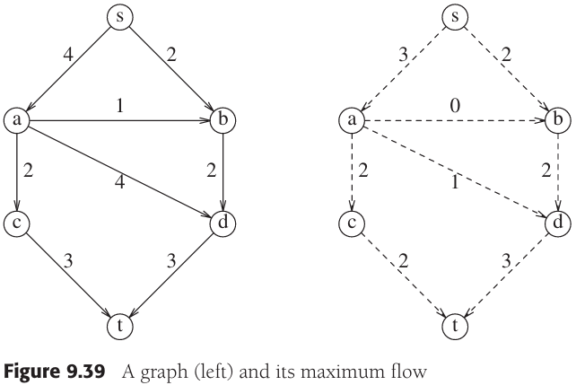

Suppose we given a directed graph $G = (V, E)$ with edge capacities $c_{v, w}$. These capacities could represent the amount of water that could flow through a pipe or the amount of traffic that could flow on a stree between two intersections. We have two vertices: $s$, which we call the **source**, and $t$, which is the **sink**. Through any edge, $(v, w)$, at most $c_{v, w}$ units of "flow" may pass. At any vertex, $v$, that is not either $s$ or $t$, the total flow coming in must equal the total flow going out. The maximum-flow problem is to determine the maximum amount of flow that can pass from $s$ to $t$.

**A Simple Maximum-Flow Algorithm**

**residual graph** tells, for each edge, how much more flow can be added.

**augmenting path** the minimum edge on this path is the amount of flow that can be added to every edge on the path.

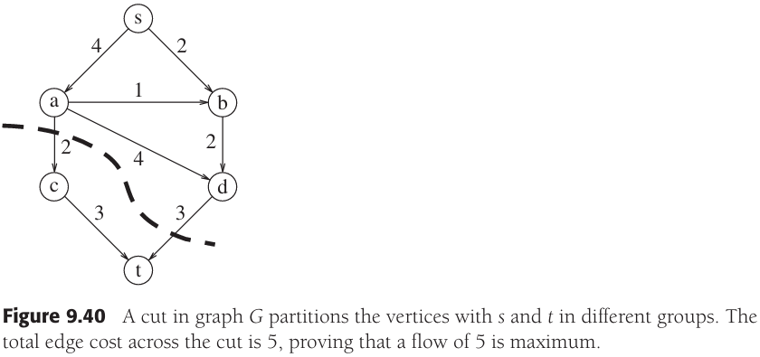

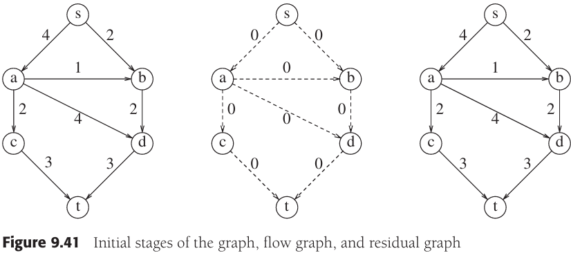

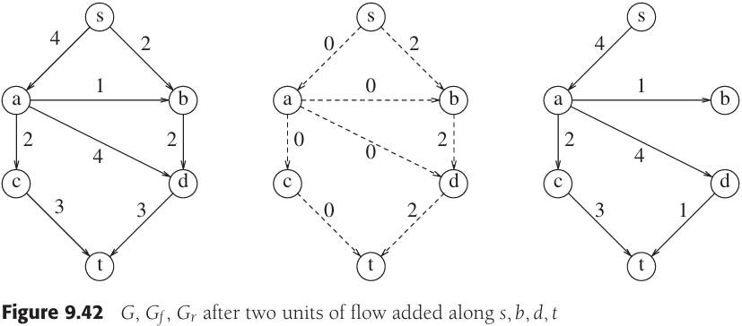


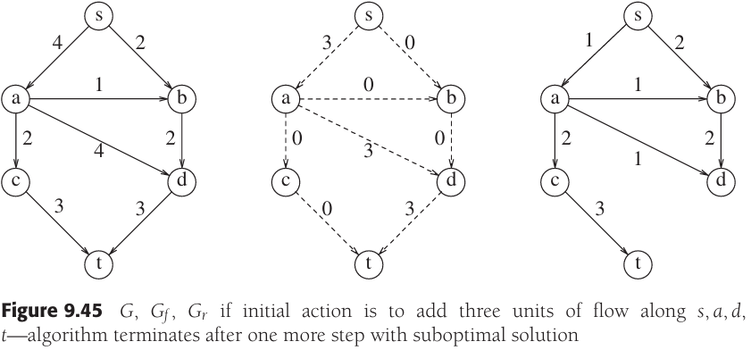


## Minimum Spanning Tree


### Prim's Algorithm

One way to compute a minimum spanning tree is to grow the tree in successive stages. In each stage, one node is picked as the root, and we add an edge, and thus an associated vertex, to the tree.


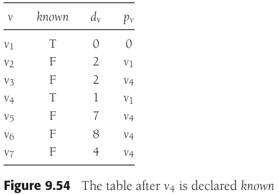


### Kruskal's Algorithm

A second greedy strategy is to continually select the edges in order of smallest weight and accept an edge if it does not cause a cycle.


Formally, Kruskal's algorithm maintains a forest--a collection of trees. Initially, there are $|V|$ single-node trees. Adding an edge merges two trees into one. When the algorithm terminates, there is only one tree, and this is the minimum spanning tree.

Example.Pseudocode for Kruskal's algorithm:

```c++
void Graph::kruskal()
{
    int edgesAccepted = 0;
    DisjSet ds(NUM_VERTICES);
    PriorityQueue<Edge> pq(getEdges());
    Edge e;
    Vertex u, v;
    
    while (edgesAccepted < NUM_VERTICES - 1)
    {
        pq.deleteMin(e);  // Edge e = (u, v)
        SetType uset = ds.find(u);
        SetType vset = ds.find(v);
        if (uset != vset)
        {
            // Accept the edge
            edgesAccepted++;
            ds.unionSets(uset, vset);
        }
    }
}
```

The worst-case running time of this algorithm is $O(|E|log|E|)$, which is dominated by the heap operations. Notice that since $|E|=O(|V|^2)$, this running time is actually $O(|E|log|V|)$. In practice, the algorithm is much faster than this time bound would indicate.


## Applications of Depth-First Search

Example.Template for depth-first search (pseudocode):

```c++
void Graph::dfs(Vertex v)
{
    v.visited = true;
    for each Vertex w adjacent to v
        if (!w.visited)
            dfs(w);
}
```

### Undirected Graphs


We graphically illustrate these steps with a **depth-first spanning tree**. The root of the tree is $A$, the first vertex visited. Each edge $(v, w)$ in the graph is present in the tree. If, when we process $(v, w)$, we find that $w$ is unmarked, or if, when we process $(w, v)$, we find that $v$ is unmarked, we indicate this with a tree edge. If, when we process $(v, w)$, we find that $w$ is already marked, and when processing $(w, v)$, we find that $v$ is already marked, we draw a dashed line, which we will call a **back edge**, to indicate that this "edge" is not really part of the tree.

### Biconnectivity

A connected undirected graph is **biconnected** if there are no vertices whose removal disconnects the rest of the graph.

If a graph is not biconnected, the vertices whose removal would disconnect the graph are known as **articulation points**.

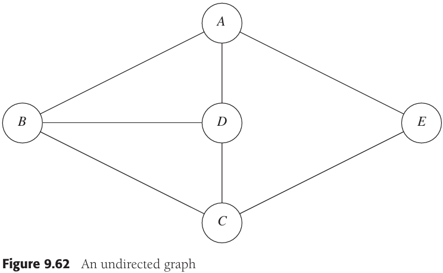


By the definition of $Low$, $Low(v)$ is the minimum of:

1. $Num(v)$
2. the lowest $Num(w)$ among all back edges $(v, w)$
3. the lowest $Low(w)$ among all tree edges $(v, w)$

例，计算割点：

```c++
// 对顶点的Num赋值
void Graph::assignNum(Vertex v)
{
    v.num = counter++;
    v.visited = true;
    for each Vertex w adjacent to v
        if (!w.visited)
        {
            w.parent = v;
            assignNum(w);
        }
}

// 计算Low并检验其是否为割点的伪代码（忽略对根的检验）
void Graph::assignLow(Vertex v)
{
    v.low = v.num;
    for each Vertex w adjacent to v
    {
        if (w.num > v.num)
        {
            assignLow(w);
            if (w.low >= v.num)
                cout << v << " is an articulation point" << endl;
            v.low = min(v.low, w.low);
        }
        else
            if (v.parent != w)
                v.low = min(v.low, w.num);
    }
}
```

### Euler Circuits


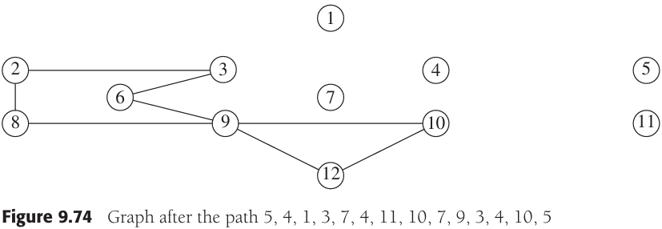

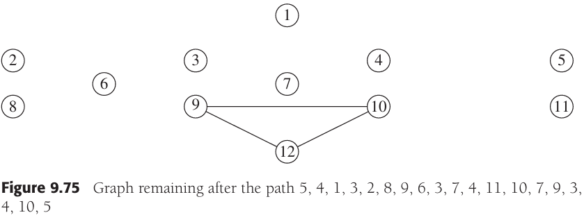

Example. Testing for articulation points in one depth-first search (test for the root is omitted) (pseudocode):

```++
void Graph::findArt(Vertex v)
{
	v.visited = true;
	v.low = v.num = counter++; // Rule 1
	for each Vertex w adjacent to v
	{
		if (!w.visited) // Forward edge
		{
			w.parent = v;
			findArt(w);
			if (w.low >= v.num)
				cout << v << " is an articulation point" << endl;
			v.low = min(v.low, w.low); // Rule 3
		}
		else
			if (v.parent != w) // Back edge
				v.low = min(v.low, w.num); // Rule 2
	}
}
```

### Directed Graphs


### Finding Strong Components


## Introduction ot NP-Completeness

### Easy VS Hard

Just as real numbers are not sufficient to express a solution to $x^2 < 0$, one can prove that computers cannot solve every problem that happens to come along. These "impossible" problems are called **undecidable problems**.

### NP-Complete Problems

An NP-complete problem has the property that any problem in NP can be **polynomially reduced** to it.

**Traveling Salesman Problem** Given a complete graph, $G = (V, E)$, with edge costs, and an integer $k$, is there a simple cycle that visits all vertices and has total cost $\leq K$?


