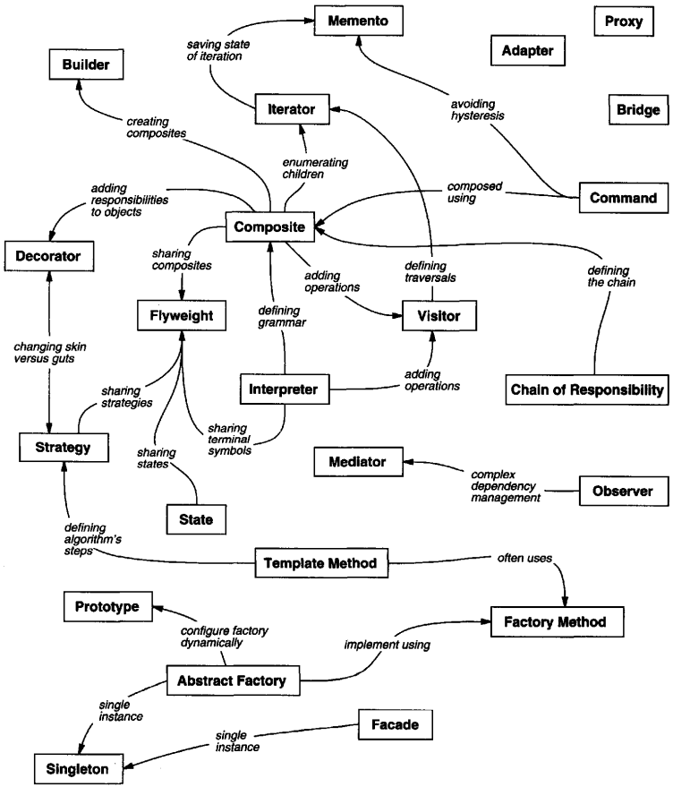

# 1 Introduction

In general, a pattern has four essential elements:

1. The `pattern name` is a handle we can use do describe a design problem.
2. The `problem` describes when to apply the pattern.
3. The `solution` describes the elements that make up the design, their relationships, responsibilities, and collaborations.
4. The `consequences` are the results and trade-offs of applying the pattern.

MVC consists of three kinds of objects. The Model is the application object, the View is its screen presentation, and the Controller defines the way the user interface reacts to user input.

Describing Design Patterns:

- Pattern Name and Classification.
- Intent.
- Also Known As.
- Motivation.
- Applicability.
- Structure.
- Participants.
- Collaborations.
- Consequences.
- Implementation.
- Sample Code.
- Known Uses.
- Related Patterns.

The Catalog of Design Patterns:

- Abstract Factory.

  Provide an interfae for creating families of related or dependent objects without specifying their concrete classes.

- Adapter.

  Convert the interface of a class into another interface clients expect. Adapter lets classes work together that couldn't otherwise because of incompatible interfaces.

- Bridge.

  Decouple an abstraction from its implementation so that the two can vary independently.

- Builder.

  Separate the construction of a complex object from its representation so that the same construction process can create different representations.

- Chain of Responsiblilit.

  Avoid coupling the sender of a request to its receiver by giving more tahn one object a chance to handle the request. Chain the receiving objects and pass the request along the chain until an object handles it.

- Command.

  Encapsulate a request as an object, thereby letting you parameterize clients with different requests, queue or log requests, and support undoable operations.

- Composite.

  Compose objects into tree structures to represent part-whole hierarchies. Composite lets clients treat individual objects and compositions of objects uniformly.

- Decorator.

  Attach additional responsibilities to an object dynamically. Decorators provide a flexible alternative to subclassing for extending functionality.

- Facade.

  Provide a unified interface to a set of interfaces in a subsystem. Facade defines a higher-level interface that makes the subsystem easier to use.

- Factory Method.

  Define an interface for creating an object, but let subclasses decide which class to instantiate. Factory Method lets a class defer instantiation to subclasses.

- Flyweight.

  Use sharing to support large numbers of fine-grained objects efficiently.

- Interpreter.

  Given a language, define a represention for its grammar along with an interpreter that uses the representation to interpret sentences in the language.

- Iterator.

  Provide a way to access the elements of an aggregate objec sequentially without exposing its underlying representation.

- Mediator.

  Define an object that encapsulates how a set of objects interact. Mediator promotes loose coupling by keeping objects from referring to each other explicitly, and it lets you vary their interaction independently.

- Memento.

  Without violating encapsulation, capture and externalize an object's internal state so that the object can be restored to this state later.

- Observer.

  Define a one-to-many dependency between objects so that when one object changes state, all its dependents are notified and updated automatically.

- Prototype.

  Specify the kinds of objects to create using a prototypical instance, and create new objects by copying this prototype.

- Proxy.

  Provide a surrogate or place holder for another object to control access to it.

- Singleton.

  Ensure a class only has one instance, and provide a global point of access to it.

- State.

  Allow an object to alter its behavior when its internal state changes. The object will appear to change its class.

- Strategy.

  Define a family of algorithms, encapsulate each one, and make them interchangeable. Strategy lets the algorithm vary independently from clients that use it.

- Template Method.

  Define the skeleton of an algorithm in an operation, deferring some steps to subclasses. Template Method lets subclasses redefine certain steps of an algorith without changing the algorithm's structure.

- Visitor.

  Represent an operation to be performed on the elements of an object structure. Visitor lets you define a new operation without changing the classes of the elements on which it operates.

Design pattern space:

|        | Creational                                            | Structural                                                   | Behavioral                                                   |
| ------ | ----------------------------------------------------- | ------------------------------------------------------------ | ------------------------------------------------------------ |
| Class  | Factory Method                                        | Adapter                                                      | Interpreter Template Method                               |
| Object | Abstract Factory Builder Prototype Singleton | Adapter Bridge Composite Decorator Facade Flyweight Proxy | Chain of Responsibility Command Iterator Mediator Memento Observer State Strategy Visitor |

Design pattern relationships:

Object-oriented programs are made up of objects. An `object` packages both data and the procedures that operate on that data. The procedures are typically called `methods` or `operations`. An object performs an operation when it receives a `request` (or `message`) from a `client`.

Specifying Object Interfaces:

- A `type` is a name used to denote a particular interface.
- We say that a type is a `subtype` of another if its interface contains the interface of its `supertype`.
- The run-time association of a request to an object and one of tis operations is known as `dynamic binding`.
- This substitutability is known as `polymorphism`, and it's a key concept in object-oriented systems.

Specifying Object Implementations:

- An `abstract class` is one whose main purpose is to define a common interface for its subclasses.
- The operations that an abstract class declares but doesn't implement are called `abstract operations`.
- Classes that aren't abstract are called `concrete classes`.
- A `mixin class` is a class that's intended to provide an optional interface or functionality to other classes.

**Class versus Interface Inheritance**:

The difference between an object's class and its type:

- An object's class defines how the object is implemented. The class defines the object's internal state and the implementation of its operations.
- An object's type only refers to its interface--the set of requests to which it can respond.

The difference between class inheritance and interface inheritance (or subtyping):

- Class inheritance defines an object's implementation in terms of another object's implementation. In short, it's a mechanism for code and representation sharing.
- Interface inheritance (or subtyping) describes when an object can be used in place of another.

**Programming to an Interface, not an Implementation**; There are two benefits to manipulating objects solely in terms of the interface defined by abstract classes:

1. Client remains unaware of the specific types of objects they use, as long as the objects adhere to the interface that clients expect.
2. Client remains unaware of the classes that implement these objects. Clients only know about the abstract class(es) defining the interface.

Inheritance versus Composition:

1. The two most common techniques for reusing functionality in object-oriented systems are class inheritance and `object composition`.
2. Class inheritance lets you define the implementation of one class in terms of another's. Reuse by subclassing is often referred to as `white-box reuse`.
3. Object composition requires that the objects being composed have well-defined interfaces. This style of reuse is called `black-box reuse`, because no internal details of objects are visible.

`Delegation` is a way of making composition as powerful for reuse as inheritance.

Another (not strictly object-oriented) technique for reusing functionality is through `parameterized types`, also known as `generics` (Ada, Eiffel) and `templates`(C++). This technique lets you define a type without specifying all the other types it uses.

Aggregation implies that one object owns or is responsible for another object. Generally we speak of an object `having` or being `part` of another object. Aggregation implies that an aggregate object and its owner have identical lifetimes.

Acquaintance implies that an object merely knows of another object. Acquainted objects may request operations of each other, but they aren't responsible for each other. Acquaintance is a weaker relationship than aggregation and suggests much looser coupling between objects.

In C++, aggregation can be implemented by defining member variables that are real instances, but it's more common to define them as pointers or references to instances. Acquaintance is implemented with pointers and references as well.

Here are some common causes of redesign along with the design pattern(s) that address them:

1. `Creating an object by specifying a class explicitly`.

   Design patterns: Abstract Factory, Factory Method, Prototype.

2. `Dependence on specific operations`.

   Design patterns: Chain of Resposibility, Command

3. `Dependence on hardware and software platform`.

   Design patterns: Abstract Factory, Bridge

4. `Dependence on object representations or implementations`.

   Design patterns: Abstract Factory, Bridge, Memento, Proxy

5. `Algorithmic dependencies`.

   Design patterns: Builder, Iterator, Strategy, Template Method, Visitor

6. `Tight coupling`.

   Design patterns: Abstract Factory, Command, Facade, Mediator, Observer, Chain of Responsibility

7. `Extending functionality by subclassing`.

   Design patterns: Bridge, Chain of Responsibility, Composite, Decorator, Observer, Strategy

8. `Inability to alter classes conveniently`.

   Design patterns: Adapter, Decorator, Visitor

Because patterns and frameworks have some similarities, people often wonder how or even if they differ. They are different in three major ways:

1. `Design patterns are more abstract than frameworks`.
2. `Design patterns are smaller architectural elements than frameworks`.
3. `Design patterns are less specialized than frameworks`.

Here are several different approaches to finding the design pattern that's right for your problem:

- `Consider how design patterns solve design problems`.
- `Scan Intent sections`.
- `Study how patterns interrelate`.
- `Study patterns of like purpose`.
- `Examine a cause of redesign`.
- `Consider what should be variable in your design`.

Here's a step-by-step approach to applying a design pattern effectively:

1. `Read the pattern once through for an overview`.
2. `Go back and study the Structure, Participants, and Collaborations sections`.
3. `Look at the Sample Code section to see a concrete example of the pattern in code`.
4. `Choose names for pattern participants that are meaningful in the application context`.
5. `Define the classes`.
6. `Define application-specific names for operations in the pattern`.
7. `Implement the operations to carry out the responsibilities and collaborations in the pattern`.

Design aspects that design patterns let you vary:

| Purpose    | Design Pattern                                               | Aspect(s) That Can Vary                                      |
| :--------- | :----------------------------------------------------------- | :----------------------------------------------------------- |
| Creational | Abstract Factory Builder Factory Method Prototype Singleton | families of product objects how a composite object gets created subclass of object that is instantiated class of object that is instantiated the sole instance of a class |
| Structural | Adapter Bridge Composite Decorator Facade Flyweight Proxy | interface to an object implementation of an object structure and composition of an object responsibilities of an object without subclassing interface to a subsystem storage costs of objects how an object is accessed; its location |
| Behavioral | Chain of Responsibility Command Interpreter Iterator Mediator Memento Observer State Strategy Template Method Visitor | object that can fulfill a request when and how a request is fulfilled grammar and interpretation of a language how an aggregate's elements are accessed, traversed how and which objects interact with each other what private information is stored outside an object, and when number of objects that depend on another object; how the dependent objects stay up to date states of an object an algorithm steps of an algorithm operations that can be applied to object(s) without changing their class(es) |
