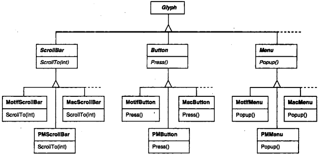

# 第二章 实例研究：设计一个文档编辑器

[TOC]

## 2.1 设计问题

我们将考察Lexi设计中的7个问题：

1. 文档结构
2. 格式化
3. 修饰用户界面
4. 支持多种视感（look-and-feel）标准
5. 支持多种窗口系统
6. 用户操作
7. 拼写检查和连字符


## 2.2 文档结构

内部表示应支持如下几点：

- 保持文档的物理结构。
- 可视化生成和现实文档。
- 根据显示位置来映射文档内部表示的元素。

### 2.2.1 递归组合

`递归组合（Recursive Composition）`


*递归组合的对象结构*

### 2.2.2 图元


*部分Glyph类层次*

基本Glyph接口：

| Responsibility | Operations                                                   |
| -------------- | ------------------------------------------------------------ |
| Appearance     | - `Virtual Void Draw(Window*)`<br>- `Virtual Void Bounds(Rect&)` |
| hit detection  | - `Virtual bool Intersects(Const Point&)`                    |
| Structure      | - `Virtual Void Insert(Glyph*, int)`<br>- `Virtual Void Remove(Glyph*)`<br>- `Virtual Glyph* Child(int)`<br>- `Virtual Glyph* Parent()` |

### 2.2.3 组合模式

递归组合不仅可用来表示文档，我们还可以用它表示任何潜在复杂的，层次式的结构。


## 2.3 格式化

### 2.3.1 封装格式化算法

### 2.3.2 Compositor和Composition

| 责任         | 操作                                |
| ------------ | ----------------------------------- |
| 格式化的内容 | `void SetComposition(Composition*)` |
| 何时格式化   | `virtual void Compose()`            |


*Composition和Compositor类间的关系*


*对象结构反映Compositor制导的分行*

### 2.3.3 策略模式

再对象中封装算法是Strategy模式的目的，Strategy模式应用的关键点在于为Strategy和它的环境设计足够通用的接口，以支持一系列的算法。


## 2.4 修饰用户界面

### 2.4.1 透明围栏

`透明围栏（Transparent Enclosure）`的概念：

1. 单组件组合；
2. 兼容的接口。

### 2.4.2 MonoGlyph


*MonoGlyph类关系*


*嵌入对象结构*

### 2.4.3 Decorator模式

Decorator模式描述了以透明围栏来支持修饰的类和对象的关系。


## 2.5 支持多种视感标准

### 2.5.1 对象创建的抽象

我们假定用两个窗口组件图元集合来实现多个视感标准：

1. 第一个集合是抽象Glyph子类构成的，对每一种窗口组件图元都有一个抽象Glyph子类。
2. 另一个集合是抽象子类对应的实现不同视感标准的具体的子类的集合。

### 2.5.2 工厂类和产品类


*GUIFactory类层次*



*抽象产品类和具体子类*

### 2.5.3 Abstract Factory模式

工厂（Factory）和产品（Product）是Abstract Factory模式的主要参与者。该模式描述了怎样在不直接实例化类的情况下创建一系列相关的产品对象。它最适用于产品对象的数目和种类不变，而具体产品系列之间存在不同的情况。


## 2.6 支持多种窗口系统

### 2.6.1 我们是否可以使用Abstract Factory模式

### 2.6.2 封装实现依赖关系

Window类接口：

| 责任     | 操作                                                         |
| -------- | ------------------------------------------------------------ |
| 窗口管理 | `virtual void Redraw()`<br>`virtual void Raise()`<br>`virtual void Lower()`<br>`virtual void Iconify()`<br>`virtual void Deiconify()`<br>... |
| 图形     | `virtual void DrawLine(...)`<br>`virtual void DrawRect(...)`<br>`virtual void DrawPolygon(...)`<br>`virtual void DrawText(...)`<br>... |

### 2.6.3 Window和WindowImp


1. WindowImp的子类

   ```c++
   void Rectangle::Draw(Window* w) {
       w->DrawRect(_x0, _y0, _x1, _y1);
   }
   
   void Window::DrawRect(Coord x0, Coord y0, Coord x1, Coord y1) {
       _imp->DeviceRect(x0, y0, x1, y1);
   }
   
   void XWindowImp::DeviceRect(Coord x0, Coord y0, Coord x1, Coord y1) {
       int x = round(min(x0, x1));
       int y = round(min(y0, y1));
       int w = round(abs(x0 - x1));
       int h = round(abs(y0 - y1));
       XDrawRectangle(_dpy, _winid, _gc, x, y, w, h);
   }
   
   void PMWindowImp::DeviceRect(Coord x0, Coord y0, Coord x1, Coord y1) {
       Coord left = min(x0, x1);
       Coord right = max(x0, x1);
       Coord bottom = min(y0, y1);
       Coord top = max(y0, y1);
       
       PPOINT point[4];
       
       point[0].x = left;  point[0].y = top;
       point[1].x = right; point[1].y = top;
       point[2].x = right; point[2].y = bottom;
       point[3].x = left;  point[3].y = bottom;
       
       if (
           (GpiBeginPath(_hps, 1L) == false) ||
           (GpiSetCurrentPosition(_hps, &point[3]) == false) ||
           (GpiPolyLine(_hps, 4L, point) == GPT_ERROR) ||
           (GpiEndPath(_hps) == false)
          ) 
       {
       	// report error    
       }
       else
       {
           GpiStrokePath(_hps, 1L, 0L);
       }
   }
   ```

2. 调用WindowImp来配置Windows

   ```c++
   class WindowSystemFactory{
   public:
       virtual WindowImp* CreateWindowImp() = 0;
       virtual ColorImp* CreateColorImp() = 0;
       virtual FontImp* CreateFontImp() = 0;
   };
   
   class PMWindowSystemFactory : public WindowSystemFactory {
       virtual WindowImp* CreateWindowImp() { return new PMWindowImp; }
   };
   
   class XWindowSystemFactory : public WindowSystemFactory {
       vitual WindowImp* CreateWindowImp() { return new XWindowImp; }
   };
   
   Window::Window() {
       _imp = windowSystemFactory->CreateWindowImp();
   }
   ```

### 2.6.4 Bridge模式

Bridge模式的目的就是允许分离的类层次一起工作，即使他们是独立演化的。Bridge模式允许我们保持和加强我们对窗口的逻辑抽象，而不触及窗口系统相关的代码。


## 2.7 用户操作

### 2.7.1 封装一个请求

### 2.7.2 Command类及其子类


*部分Command类层次*


*MenuItem-Command关系*

### 2.7.3 撤销和重做

### 2.7.4 命令历史记录

`命令历史记录（Command History）`

### 2.7.5 Command模式

一个命令可以将所有或部分的请求实现委托给其他对象，也可以不进行委托。


## 2.8 拼写检查和断字处理

### 2.8.1 访问分散的信息

### 2.8.2 封装访问和遍历

### 2.8.3 Iterator类及其子类


*Iterator类和它的子类*

### 2.8.4 遍历和遍历过程中的动作

### 2.8.6 封装分析

### 2.8.7 Visitor类及其子类

```c++
class Visitor {
public:
    virtual void VisitCharacter(Character*) {}
    virtual void VisitRow(Row*) {}
    virtual void VisitImage(Image*) {}
};
```

### 2.8.8 Visitor模式

