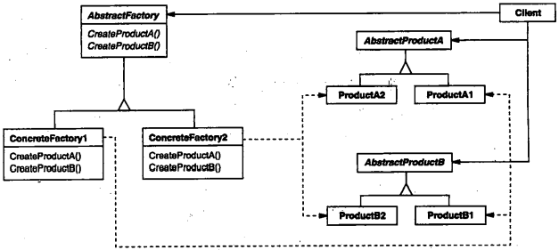
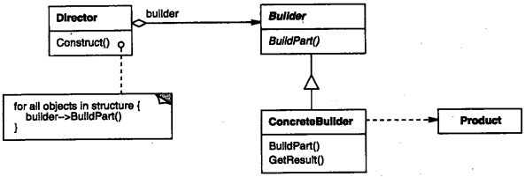
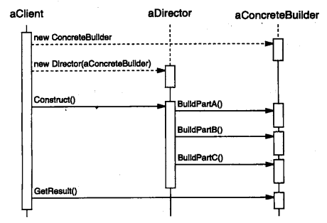
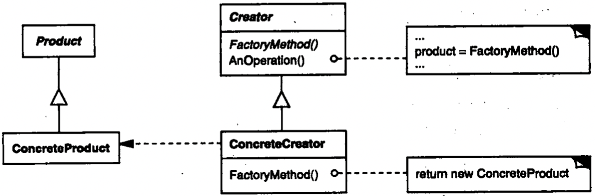
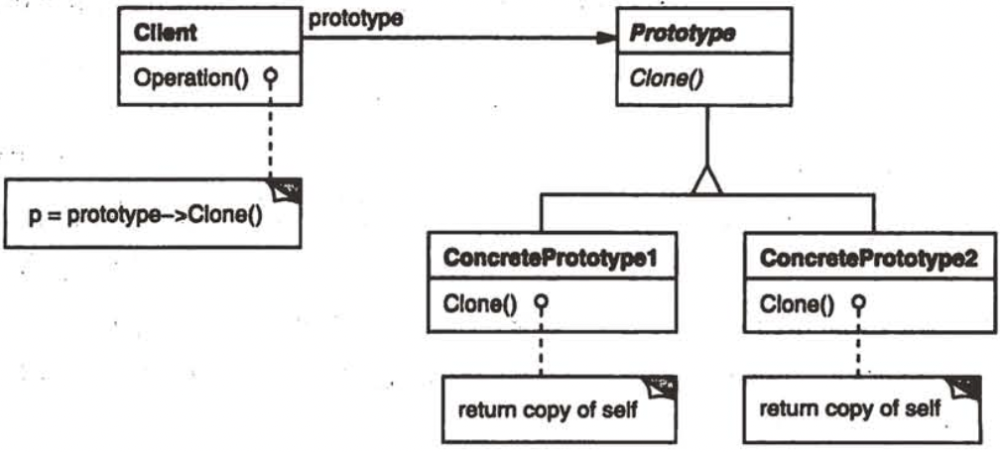
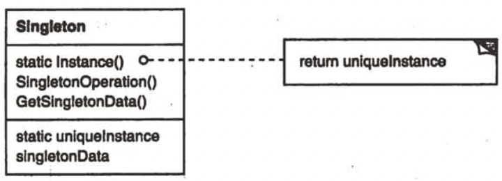

# 第三章 创建型模式

[TOC]


## 3.1 ABSTRACT FACTORY（抽象工厂）-对象创建型模式

1. 意图

   提供一个创建一系列相关或相互依赖对象的接口，而无需指定他们具体的类。

2. 别名

   Kit

3. 动机

4. 适用性

   在以下情况下可以使用Abstract Factory模式：

   - 一个系统要独立于它的产品的创建，组合和表示时。
   - 一个系统要由多个产品系列中的一个来配置时。
   - 当你要强调一系列相关的产品对象的设计以便进行联合使用时。
   - 当你提供一个产品类库，而只想显示它们的接口而不是实现时。

5. 结构

   

6. 参与者

   - AbstractFactory(WidgetFactory)
   
     声明一个创建抽象产品对象的操作接口。
   
   - ConcreteFactory(MotifWidgetFactory, PMWidgetFactory)
   
     实现创建具体产品对象的操作。
   
   - AbstractProduct(Windows, ScrollBar)
   
     为一类产品对象声明一个接口。
   
   - ConcreteProduct(MotifWindow, MotifScrollBar)
   
     定义一个将被相应的具体工厂创建的产品对象。
   
     实现AbstractProduct接口。
   
   - Client
   
     仅使用由AbstractFactory和AbstractProduct类声明的接口。
   
7. 协作
   
   - 通常在运行时刻创建一个ConcreteFactory类的实例。这一具体的工厂创建具有特定实现的产品对象。为创建不同的产品对象，客户应使用不同的具体工厂。
   - AbstractFactory将产品对象的创建延迟到它的ConcreateFactory子类。
   
8. 效果
   
   AbstractFactory模式有以下优缺点：
   
   - 它分离了具体的类
   - 它使得易于交换产品系列
   - 它有利于产品的一致性
   - 难以支持新种类的产品
   
9. 实现
   
   1. 将工厂作为单件。
   2. 创建产品。
   3. 定义可扩展的工厂。
   
10. 代码示例

    ```c++
    class MazeFactory {
    public:
        MazeFactory();
        
        virtual Maze* MakeMaze() const { return new Maze; }
        virtual Wall* MakeWall() const { return new Wall; }
        virtual Room* MakeRoom(int n) const { return Room(n); }
        virtual Door* MakeDoor(Room* r1, Room* r2) const { return new Door(r1, r2); }
    };
    
    Maze* MazeGame::CreateMaze(MazeFactory& factory) {
        Maze* aMaze = factory.MakeMaze();
        Room* r1 = factory.MakeRoom(1);
        Room* r2 = factory.MakeRoom(2);
        Door* aDoor = factory.MakeDoor(r1, r2);
        
        aMaze->AddRoom(r1);
        aMaze->AddRoom(r2);
        
        r1->SetSide(North, factory.MakeWall());
        r1->SetSide(East, aDoor);
        r1->SetSide(South, factory.MakeWall());
        r1->SetSide(West, factory.MakeWall());
        r1->SetSide(North, factory.MakeWall());
        r1->SetSide(East, factory.MakeWall());
        r1->SetSide(South, factory.MakeWall());
        r1->SetSide(West, factory.MakeWall());
    
        return aMaze;
    }
    
    class EnchantedMazeFactory : public MazeFactory {
    public:
        EnchantedMazeFactory();
        
        virtual Room* MakeRoom(int n) const { return new EnchantedRoom(n, CastSpell()); }
        virtual Door* MakeDoor(Room* r1, Room* r2) const { return new DoorNeedingSpell(r1, r2); }
    
    protected:
        Spell* CastSpell() const;
    };
    
    Wall* BombedMazeFactory::MakeWall() const { return new BombedWall; }
    
    Room* BombedMazeFactory::MakeRoom(int n) const { return new RoomWithABomb(n); }
    ```

11. 已知应用

12. 相关模式

    - Factory Method
    - Singleton


## 3.2 BUILDER（生成器） - 对象创建型模式

1. 意图

   将一个复杂对象的构建与它的表示分离，使得同样的构建过程可以创建不同的表示。

2. 动机

3. 适用性

   在以下情况使用Builder模式：

   - 当创建复杂对象的算法应该独立于该对象的组成部分以及他们的装配方式时。
   - 当构造过程必须允许被构造的对象有不同的表示时。

4. 结构

   

5. 参与者

   - Builder(TextConverter)

     为创建一个Product对象的各个部件指定抽象接口。

   - ConcreteBuilder(ASCIIConverter, TeXConverter, TextWidgetConverter)

     实现Builder的接口以构造和装配该产品的各个部件。

     定义并明确它所创建的表示。

     提供一个检索产品的接口。

   - Director(RTFReader)

     构造一个使用Builder接口的对象。

   - Product(ASCIIText, TeXText, TextWidget)

     表示被构造的复杂对象。ConcreteBuilder创建该产品的内部表示并定义它的装配过程。

     包含定义组成部件的类，包括将这些部件装配成最终产品的接口。

6. 协作

   - 客户创建Director对象，并用它所想要的Builder进行配置。
   - 一旦产品部件被生成，导向器就会通知生成器。
   - 生成器处理导向器的请求，并将部件添加到该产品中。
   - 客户从生成器中检索产品。

   

7. 效果

   Builder模式的主要效果：

   - 它使你可以改变一个产品的内部表示。
   - 它将构造代码和表示代码分开。
   - 它使你可对构造过程进行更精细的控制。

8. 实现

   需要考虑的实现问题：

   - 装配和构造接口。
   - 为什么产品没有抽象类。
   - 在Builder中缺省的方法为空。

9. 代码示例

   ```c++
   class MazeBuilder {
   public:
       virtual void BuildMaze() { }
       virtual void BuildRoom(int room) { }
       virtual void BuildDoor(int roomFrom, int roomTo) { }
       
       virtual Maze* GetMaze() { return 0; }
   protected:
       MazeBuilder();
   };
   
   Maze* MazeGame::CreateMaze(MazeBuilder& builder) {
       builder.BuildMaze();
   
       builder.BuildRoom(1);
       builder.BuildRoom(2);
       builder.BuildDoor(1, 2);
       
       return builder.GetMaze();
   }
   
   Maze* MazeGame::CreateComplexMaze(MazeBuilder& builder) {
       builder.BuildRoom(1);
       builder.BuildRoom(1001);
       return builder.GetMaze();
   }
   
   class StandardMazeBuilder : public MazeBuilder {
   public:
       StandardMazeBuilder();
       
       virtual void BuildMaze();
       virtual void BuildRoom(int);
       virtual void BuildDoor(int, int);
       virtual Maze* GetMaze();
   private:
       Direction CommonWall(Room*, Room*);
       Maze* _currentMaze;
   };
   
   StandardMazeBuilder::StandardMazeBuilder() {
       _currentMaze = 0;
   }
   
   void StandardMazeBuilder::BuildMaze() {
       _currentMaze = new Maze;
   }
   
   Maze* StandardMazeBuilder::GetMaze() {
       return _currentMaze;
   }
   
   void StandardMazeBuilder::BuildRoom(int n) {
       if (!_currentMaze->RoomNo(n)) {
           Room* room = new Room(n);
           _currentMaze->AddRoom(room);
           
           room->SetSide(North, new Wall);
           room->SetSide(South, new Wall);
           room->SetSide(East, new Wall);
           room->SetSide(West, new Wall);
       }
   }
   
   void StandardMazeBuilder::BuildDoor(int n1, int n2) {
       Room* r1 = _currentMaze->RoomNo(n1);
       Room* r2 = _currentMaze->RoomNo(n2);
       Door* d = new Door(r1, r2);
       
       r1->SetSide(CommonWall(r1, r2), d);
       r2->SetSide(CommonWall(r2, r1), d);
   }
   
   class CountingMazeBuilder : public MazeBuilder {
   public:
       CountingMazeBuilder();
       
       virtual void BuildMaze();
       virtual void BuildRoom(int);
       virtual void BuildDoor(int, int);
       virtual void AddWall(int, Direction);
       
       void GetCounts(int&, int&) const;
   private:
       int _doors;
       int _rooms;
   };
   
   CountingMazeBuilder::CountingMazeBuilder() {
       _rooms = _doors = 0;
   }
   
   void CountingMazeBuilder::BuildRoom(int) {
       _doors++;
   }
   
   void CountingMazeBuilder::GetCounts(int& rooms, int& doors) {
       rooms = _rooms;
       doors = _doors;
   }
   ```
   
10. 已知应用

11. 相关模式

    - Abstract Factory
    - Composite


## 3.3 FACTORY METHOD（工厂方法） - 对象创建型模式

1. 意图

   定义一个用于创建对象的接口，让子类决定实例化哪个类。Factory Method使一个类的实例化延迟到其子类。
   
1. 别名

   虚构造器（Virtual Constructor）
   
1. 动机

1. 适用性

   在下列情况下可以使用Factory Method模式：
   
   - 当一个类不知道它所必须创建的对象的类的时候。
   - 当一个类希望由它的子类来指定它所创建的对象的时候。
   - 当类将创建对象的职责委托给多个帮助子类中的某一个，并且你希望将哪个帮助子类是代理者这一信息局部化的时候。
   
1. 结构

   
   
1. 参与者

   - Product(Document)
   
     定义工厂方法所创建的对象的接口。
   
   - ConcreteProduct(MyDocument)
   
     实现Product接口。
   
   - Creator(Application)
   
     声明工厂方法，该方法返回一个Product类型的对象。Creator也可以定义一个工厂方法的缺省实现，它返回一个缺省的ConcreteProduct对象。
   
     可以调用工厂方法以创建一个Product对象。
   
   - ConcreteCreator(MyApplication)
   
     重定义工厂方法以返回一个ConcreteProduct实例。
   
1. 协作

   Creator依赖于它的子类来定义工厂方法，所以它返回一个适当的ConcreteProduct实例。
   
1. 效果

   - 为子类提供hook。
   - 连接平行的类层次。
   
1. 实现

   当应用Factor Methon模式时要考虑下面一些问题：
   
   1. 主要有两种不同的情况。
   2. 参数化工厂方法。
   3. 特定语言的变化和问题。
   4. 使用模板以避免创建子类。
   5. 命名约定。
   
10. 代码示例

   ```c++
   class MazeGame {
   public:
     Maze* CreateMaze();
     
     virtual Maze* MakeMaze() const { return new Maze; }
     virtual Room* MakeRoom(int n) const { return new Room(n); }
     virtual Wall* MakeWall() const { return new Wall; }
     virtual Door* MakeDoor(Room* r1, Room* r2) const { return new Door(r1, r2); }
   };
   
   Maze* MazeGame::CreateMaze() {
     Maze* aMaze = MakeMaze();
     
     Room* r1 = MakeRoom(1);
     Room* r2 = MakeRoom(2);
     
     Door* theDoor = MakeDoor(r1, r2);
     
     aMaze->AddRoom(r1);
     aMaze->AddRoom(r2);
     
     r1->SetSide(North, MakeWall());
     r1->SetSide(East, theDoor);
     r1->SetSide(South, MakeWall());
     r1->SetSide(West, MakeWall());
     
     r1->SetSide(North, MakeWall());
     r1->SetSide(East, MakeWall());
     r1->SetSide(South, MakeWall());
     r1->SetSide(West, theDoor);
     return aMaze;
   }
   
   class BombedMazeGame : public MazeGame {
   public:
     BombedMazeGame();
     
     virtual Wall* MakeWall() const { return new BombedWall; }
     
     virtual Room* MakeRoom(int n) const { return new RoomWithABomb(n); }
   };
   
   class EnchantedMazeGame : public MazeGame {
   public:
     EnchantedMazeGame();
     
     virtual Room* MakeRoom(int n) const { return new EnchantedRoom(n, CastSpell()); }
     
     virtual Door* MakeDoor(Room* r1, Room* r2) const { return new DoorNeedingSpell(r1, r2); }
   protected:
     Spell* CastSpell() const;
   }
   ```

11. 已知应用

12. 相关模式

    Abstract Factory

    Template Methods

    Prototypes


## 3.4 PROTOTYPE（原型） - 对象创建型模式

1. 意图

   用原型实例指定创建对象的种类，并且通过拷贝这些远行创建新的对象。

2. 动机

3. 适用性

   当一个系统应该独立于它的产品创建，构成和表示时，要使用Prototype模式；以及：

   - 当要实例化的类是在运行时刻指定时，例如，通过动态装载。
   - 为了避免创建一个与产品类层次平行的工厂类层次时。
   - 当一个类的实例只能有几个不同状态组合中的一种时。建立相应数目的原型并克隆它们可能比每次用合适的状态手工实例化该类更方便一些。

4. 结构

   

5. 参与者

   - Prototype（Graphic）

     声明一个克隆自身的接口。

   - ConcretePrototype（Staff，WhileNote，HalfNote）

     实现一个克隆自身的操作。

   - Client（GraphicTool）

     让一个原型克隆自身从而创建一个新的对象。

6. 协作

   客户请求一个原型克隆自身。

7. 效果

   Prototype模式的优点：

   - 运行时刻增加和删除产品。
   - 改变值以指定新对象。
   - 改变结构以指定新对象。
   - 减少子类的构造。
   - 用类动态配置应用。

8. 实现

   当实现原型时，要考虑下面问题：

   1. 使用一个原型管理器。
   2. 实现克隆操作。
   3. 初始化克隆对象。

9. 代码示例

   ```c++
   class MazePrototypeFactory : public MazeFactory {
   public:
     MazePrototypeFactory(Maze*, Wall*, Room*, Door*);
     
     virtual Maze* MakeMaze() const;
     virtual Room* MakeRoom(int) const;
     virtual Wall* MakeWall() const;
     virtual Door* MakeDoor(Room*, Room*) const;
     
   private:
     Maze* _prototypeMaze;
     Room* _prototypeRoom;
     Wall* _prototypeWall;
     Door* _prototypeDoor;
   };
   
   MazePrototypeFactory::MazePrototypeFactory(
     Maze* m, Wall* w, Room* r, Door* d) {
     _prototypeMaze = m;
     _prototypeWall = w;
     _prototypeRoom = r;
     _prototypeDoor = d;
   }
   
   Wall* MazePrototypeFactory::MakeWall() const {
     return _prototypeWall->Clone();
   }
   
   Door* MazePrototypeFactory::MakeDoor(Room* r1, Room* r2) const {
     Door* door = _prototypeDoor->Clone();
     door->Initialize(r1, r2);
     return door;
   }
   
   MazeGame game;
   MazePrototypeFactory simpleMazeFactory(new Maze, new Wall, new Room, new Door);
   Maze* maze = game.CreateMaze(simpleMazeFactory);
   
   MazePrototypeFactory bombedMazeFactory(
     new Maze, new BombedWall, new RoomWithABomb, new Door);
   
   class Door : public MapSite {
   public:
     Door();
     Door(const Door&);
     
     virtual void Initialize(Room*, Room*);
     virtual Door* Clone() const;
     virtual void Enter();
     Room* OtherSideFrom(Room*);
   private:
     Room* _room1;
     Room* _room2;
   };
   
   Door::Door(const Door& other) {
     _room1 = other._room1;
     _room2 = other._room2;
   }
   
   void Door::Initialize(Room* r1, Room* r2) {
     _room1 = r1;
     _room2 = r2;
   }
   
   Door* Door::Clone() const {
     return new Door(*this);
   }
   
   class BombedWall : public Wall {
   public:
     BombedWall();
     BombedWall(const BombedWall&);
     
     virtual Wall* Clone() const;
     bool HasBomb();
   private:
     bool _bomb;
   };
   
   BombeWall::BombedWall(const BombedWall& other) : Wall(other) {
     _bomb = other._bomb;
   }
   
   Wall* BombedWall::Clone() const {
     return new BombedWall(*this);
   }
   ```

10. 已知应用

11. 相关模式

    Abstract Factory

    Composite

    Decorator


## 3.5 SINGLETON（单件） - 对象创建型模式

1. 意图

   保证一个类仅有一个实例，并提供一个访问它的全局访问点。

2. 动机

3. 适用性

   在下面的情况下可以使用Singleton模式：

   - 当类只能有一个实例而且客户可以从一个众所周知的访问点访问它时。
   - 当这个唯一实例应该是通过子类化可扩展的，并且客户应该无需更改代码就能使用一个扩展的实例时。

4. 结构

   

5. 参与者

   - Singleton

     定一个Instance操作，允许客户访问它的唯一实例。Instance是一个类操作。

     可能负责创建它自己的唯一实例。

6. 协作

   - 客户只能通过Singleton的Instance操作访问一个Singleton的实例。

7. 效果

   Singleton模式有许多优点：

   1. 对唯一实例的受控访问。
   2. 缩小名空间。
   3. 允许对操作和表示的精化。
   4. 允许可变数目的实例。
   5. 比类操作更灵活。

8. 实现

   TODO