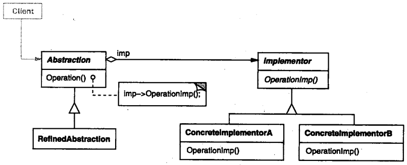
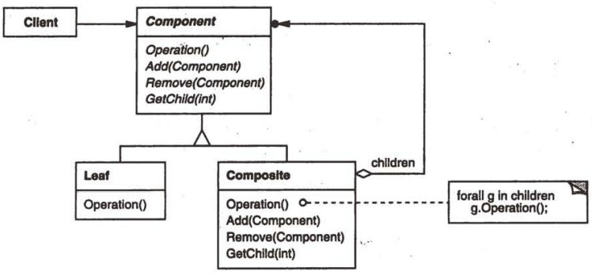
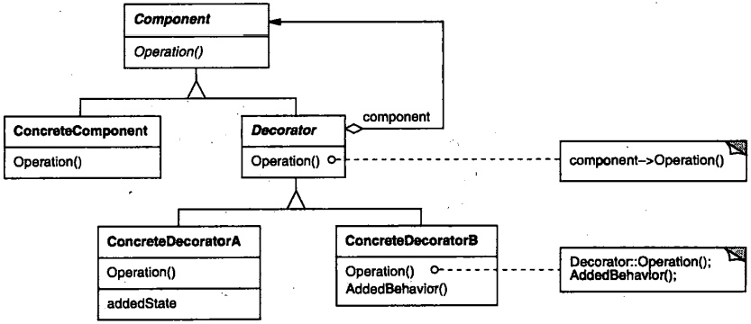
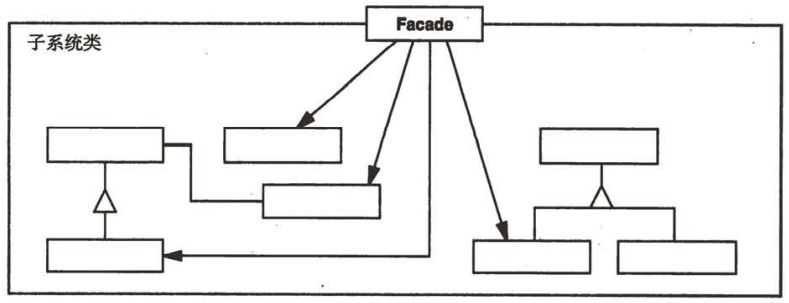
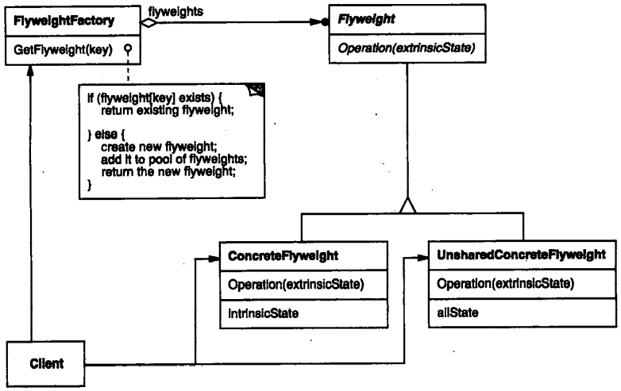
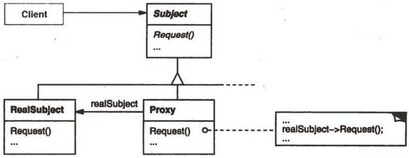

# 4 Structural Patterns

[TOC]


## ADAPTER

1. Intent

   Convert the interface of a class into another interface clients expect. Adapter let classes work together that couldn't otherwise because of incompatible interfaces.

2. Also Known As

   Wrapper

3. Motivation

4. Applicability

   Use the Adapter pattern when:

   - you want to use an existing class, and its interface does not match the one you need.
   - you want to create a reusable class that cooperates with unrelated or unforeseen classes, that is, classes that don't necessarily have compatible interfaces.
   - (object adapter only) you need to use several existing subclasses, but it's impractical to adapt their interface by subclassing  every one. An object adapter can adapt the interface of its parent class.

5. Struct

   A class adapter uses multiple inheritance to adapt one interface to another.

   

   An object adapter relies on object composition:

   

6. Participants

   - `Target` defines the domain-specific interface that Client uses.
   - `Client` collaborates with objects conforming to the Target interface.
   - `Adaptee` defines an existing interface that needs adapting.
   - `Adapter` adapts the interface of Adaptee to the Target interface.

7. Collaborations

   - Clients call operations on an Adapter instance. In turn, the adapter calls Adaptee operations that carry out the request.

8. Consequences

   Class and object adapters have different trade-offs. A class adapter:

   - adapts Adaptee to Target by committing to a concrete Adaptee class. As a consequence, a class adapter won't work when we want to adapt a class and all its subclasses.
   - lets Adapter override some of Adaptee's behavior, since Adapter is a subclass of Adaptee.
   - introduces only one object, and no additional pointer indirection is needed to get to the adaptee.

   An object adapter:

   - lets a single Adapter work with many Adaptees -- that is, the Adaptee itself and all of its subclasses (if any). The Adapter can also add functionality to all Adaptees at once.
   - makes it harder to override Adaptee behavior. It will require subclassing Adaptee and making Adapter refer to the subclass rather than the Adaptee itself.

   Here are other issues to consider when using the Adapter pattern:

   1. How much adapting does Adapter do?
   2. Pluggable adapters.
   3. Using two-way adapters to provide transparency.

9. Implementation

   Although the implementation of Adapter is usually straightforward, here are some issues to keep in mind:

   1. Implementing class adapters in C++.
   2. Pluggable adapters.

10. Sample Code

    ```c++
    class Shape {
    public:
        Shape();
        virtual void BoundingBox(Point& bottomLeft, Point& topRight) const;
        virtual Manipulator* CreateManipulator() const;
    };
    
    class TextView {
    public:
        TextView();
        void GetOrigin(Coord& x, Coord& y) const;
        void GetExtent(Coord& width, Coord& height) const;
        virtual bool IsEmpty() const;
    };
    
    class TextShape : public Shape {
    public:
        TextShape(TextView*);
        
        virtual void BoundingBox(Point& bottomLeft, Point& topRight) const;
        virtual bool IsEmpty() const;
        virtual Manipulator* CreateManipulator() const;
    private:
        TextView* _text;
    };
    
    TextShape::TextShape(TextView* t) {
        _text = t;
    }
    
    void TextShape::BoundingBox(Point& bottomLeft, Point& topRight) const {
        Coord bottom, left, width, height;
        
        GetOrigin(bottom, left);
        GetExtent(width, height);
        
        bottomLeft = Point(bottom, left);
        topRight = Point(bottom + height, left + width);
    }
    
    bool TextShape::IsEmpty() const {
        return TextView::IsEmpty();
    }
    
    Manipulator* TextShape::CreateManipulator() const {
        return new TextManipulator(this);
    }
    ```

11. Known Uses

12. Related Patterns

    Bridge

    Decorator

    Proxy

---


## BRIDGE

1. Intent

   Decouple an abstraction from its implementation so that the two can vary independently.

2. Also Known As

   Handle/Body

3. Motivation

4. Applicability

   - you want to avoid a permanent binding between an abstraction and its implementation.
   - both the abstractions and their implementations should be extensible by subclassing.
   - changes in the implementation of an abstraction should have no impact on clients; that is, their code should not have to be recompiled.
   - (C++) you want to hide the implementation of an abstraction completely from clients. In C++ the representation of a class is visible in the class interface.
   - you have a proliferation of classes as shown earlier in the first Motivation diagram. Such a class hierarchy indicates the need for splitting an object into two parts.
   - youwant toshare animplementationamongmultiple objects(perhaps using reference counting), and this fact should be hidden from the client.

5. Structure

   

6. Participants

   - Abstraction

     defines the abstraction's interface.

     maintains a reference to an object of type Implementor.

   - Refined Abstraction

     Extends the interface defined by Abstraction.

   - Implementor

     defines the interface for implementation classes. This interface doesn't have to correspond exactly to Abstraction's interface; in fact the two interfaces can be quite different. Typically the Implementor interface provides only primitive operations, and Abstraction defines higher-level operations based on these primitives.

   - ConcreteImplementor

     implements the Implementor interface and defines its concrete implementation.

7. Collaborations

   Abstraction forwards client requests to its Implementor object.

8. Consequences

   The Bridge pattern has the following consequences:

   1. Decoupling interface and implementation.
   2. Improved extensibility.
   3. Hiding implementation details from clients.

9. Implementation

   Consider the following implementation issues when applying the Bridge pattern:

   1. Only one Implementor.
   2. Creating the right Implementor object.
   3. Sharing implementors.
   4. Using multiple inheritance.

10. Sample Code

    ```c++
    class Window {
    public:
        Window(View* contents);
        
        // requests handled by window
        virtual void DrawContents();
        
        virtual void Open();
        virtual void Close();
        virtual void Iconify();
        virtual void Deiconify();
        
        // requests forwarded to implementation
        virtual void SetOrigin(const Point& at);
        virtual void SetExtent(const Point& extent);
        virtual void Raise();
        virtual void Lower();
        
        virtual void DrawLine(const Point&, const Point&);
        virtual void DrawRect(const Point&, const Point&);
        virtual void DrawPolygon(const Point[], int n);
        virtual void DrawText(const char*, const Point&);
        
    protected:
        WindowImp* GetWindowImp();
        View* GetView();
        
    private:
        WindowImp* _imp;
        View* _contents; // the window's contents
    };
    void Window::DrawRect(const Point& p1, const Point& p2) {
        WindowImp* imp = GetWindowImp();
        imp->DeviceRect(p1.X(), p1.Y(), p2.X(), p2.Y());
    }
    
    class WindowImp {
    public:
        virtual void ImpTop() = 0;
        virtual void ImpBottom() = 0;
        virtual void ImpSetExtent(const Point&) = 0;
        virtual void ImpSetOrigin(const Point&) = 0;
        
        virtual void DeviceRect(Coord, Coord, Coord, Coord) = 0;
        virtual void DeviceText(const char*, Coord, Coord) = 0;
        virtual void DeviceBitmap(const char*, Coord, Coord) = 0;
        // lots more functions for drawing on windows...
        
    protected:
        WindowImp();
    };
    
    class ApplicationWindow : public Window {
    public:
        // ...
        virtual void DrawContents();
    };
    void ApplicationWindow::DrawContents() {
        GetView()->DrawOn(this);
    }
    
    class IconWindow : public Window {
    public:
        // ...
        virtual void DrawContents();
        
    private:
        const char* _bitmapName;
    };
    void IconWindow::DrawContents() {
        WindowImp* imp = GetWindowImp();
        if (imp != 0) {
            imp->DeviceBitmap(_bitmapName, 0.0, 0.0);
        }
    }
    
    class XWindowImp : public WindowImp {
    public:
        XWindowImp();
        
        virtual void DeviceRect(Coord, Coord, Coord, Coord);
        // remainder of public interface...
        
    private:
        // lots of X window system-specific state, including:
        Display* _day;
        Drawable _winid;
        GC _gc;
    };
    void XWindowImp::DeviceRect(Coord x0, Coord y0, Coord x1, Coord y1) {
        int x = round(min(x0, x1));
        int y = round(min(y0, y1));
        int w = round(abs(x0 - x1));
        int h = round(abs(y0 - y1));
        XDrawRectangle(_dpy, _windid, _gc, x, y, w, h);
    }
    
    class PMWindowImp : public WindowImp {
    public:
        PMWindowImp();
        virtual void DeviceRect(Coord, Coord, Coord, Coord);
        
        // remainder of public interface...
    private:
        // lots of PM window system-specific state, including:
        HPS _hps;
    };
    void PMWindowImp::DeviceRect(Coord x0, Coord y0, Coord x1, Coord y1) {
        Coord left = min(x0, x1);
        Coord right = max(x0, x1);
        Coord bottom = min(y0, y1);
        Coord top = max(y0, y1);
        
        PPOINTL point[4];
        
        point[0].x = left; point[0].y = top;
        point[1].x = right; point[1].y = top;
        point[2].x = right; point[2].y = bottom;
        point[3].x = left; point[3].y = bottom;
        
        if (
            (GpiBeginPath(_hps, 1L) == false) || 
            (GpiSetCurrentPosition(_hps, &point[3]) == false) ||
            (GpiPolyLine(_hps, 4L, point) == GPI_ERROR) ||
            (GpiEndPath(_hps) == false)
        ) { 
            // report error 
        } else {
            GpiStrokePath(_hps, 1L, 0L);
        }
    }
    
    WindowImp* Window::GetWindowImp() {
        if (_imp == 0) {
            _imp = WindowSystemFactory::Instance()->MakeWindowImp();
        }
        return _imp;
    }
    ```

11. Known Uses

12. Related Patterns

    Abstract Factory.

    Adapter.

---


## COMPOSITE

1. Intent

   Compose objects into tree structures to represent part-whole hierarchies. Composite lets clients treat individual objects and compositions of objects uniformly.

2. Motivation

3. Applicability

   Use the Composite pattern when:

   - you want to represent part-whole hierarchies of objects.
   - you want clients to be able to ignore the difference between compositions of objects and individual objects. Client will treat all objects in the composite structure uniformly.

4. Structure

   

5. Participants

   - Component

     declares the interface for objects in the composition.

     implements default behavior for the interface common to all classes, as appropriate.

     declares an interface for accessing and managing its child components.

     (optional) defines an interface for accessing a component's parent in the recursive structure, and implements it if that's appropriate.

   - Leaf

     represents leaf objects in the composition. A leaf has no children.

     defines behavior for primitive objects in the composition.

   - Composite

     define behavior for components having children.

     stores child components.

     implements child-related operations in the Component interface.

   - Client

     manipulates objects in the composition through the Component interface.

6. Collaborations

   Clients use the Component class interface to interact with objects in the composite structure. If the recipient is a leaf, then the request is handled directly. If the recipient is a Composite, then it usually forwards requests to its child components, possibly performing additional operations before and/or after forwarding.

7. Consequences

   The Composite pattern:

   - defines class hierarchies consisting of primitive objects and composite objects.
   - make the client simple.
   - makes it easier to add new kinds of components.
   - can make your design overly general.

8. Implementation

9. Sample Code

   ```c++
   class Equipment {
   public:
       virtual ~Equipment();
       
       const char* Name() { return _name; }
       
       virtual Watt Power();
       virtual Currency NetPrice();
       virtual Currency DiscountPrice();
       
       virtual void Add(Equipment*);
       virtual void Remove(Equipment*);
       virtual Iterator<Equipment*>* CreateIterator();
       
   protected:
       Equipment(const char*);
       
   private:
       const char* _name;
   };
   
   class FloppyDisk : public Equipment {
   public:
       FloppyDisk(const char*);
       virtual ~FloppyDisk();
       
       virtual Watt Power();
       virtual Currency NetPrice();
       virtual Currency DiscountPrice();
   };
   
   class CompositeEquipment : public Equipment {
   public:
       virtual ~CompositeEquipment();
       
       virtual Watt Power();
       virtual Currency NetPrice();
       virtual Currency DiscountPrice();
       
       virtual void Add(Equipment*);
       virtual void Remove(Equipment*);
       virtual Iterator<Equipment*>* CreateIterator();
       
   protected:
       CompositeEquipment(const char*);
       
   private:
       List<Equipment*> _equipment;
   };
   Currency CompositeEquipment::NetPrice() {
       Iterator<Equipment*>* i = CreateIterator();
       Currency total = 0;
       
       for (i->First(); !i->IsDone(); i->Next()) {
           total += i->CurrentItem()->NetPrice();
       }
       delete i;
       return total;
   }
   
   class Chassis : public CompositeEquipment {
   public:
       Chassis(const char*);
       virtual ~Chassis();
       virtual Watt Power();
       virtual Currency NetPrice();
       virtual Currency DiscountPrice();
   };
   
   Cabinet* cabinet = new Cabinet("PC Cabinet");
   Chassis* chassis = new Chassis("PC Chassis");
   
   cabinet->Add(chassis);
   
   Bus* bus = new Bus("MCA Bus");
   buf->Add(new Card("16Mbs Token Ring"));
   
   chassis->Add(bus);
   chassis->Add(new FloppyDisk("3.5in Floppy"));
   
   cout << "The net price is " << chassis->NetPrice() << endl;
   ```

10. Known Uses

11. Related Patterns

    Decorator

    Flyweight

    Iterator

    Visitor

---


## DECORATOR

1. Intent

   Attach additional responsibilities to an object dynamically. Decorators provide a flexible alternative to subclassing for extending functionality.

2. Also Known As

   Wrapper

3. Motivation

4. Applicability

   Use Decorator:

   - to add responsibilities to individual objects dynamically and transparently, that is, without affecting other objects.
   - for responsibilities that can be withdrawn.
   - when extension by subclassing is impractical. Sometimes a large number of independent extensions are possible and would produce an explosion of subclasses to support every combination. Or a class definition may be hidden or otherwise unavailable for subclassing.

5. Structure

   

6. Participants

   - Component

     defines the interface for objects that can have responsibilities added to them dynamically.

   - Concrete Component

     defines an object to which additional responsibilities can be attached.

   - Decorator

     maintains a reference to a Component object and defines an interface that conforms to Component's interface.

   - Concrete Decorator

     adds responsibilities to the component.

7. Collaborations

   Decorator forwards requests to its Component object. It may optionally perform additional operations before and after forwarding the request.

8. Consequences

   The Decorator pattern has at least two key benefits and two liabilities:

   1. More flexibility than static inheritance.
   2. Avoids feature-laden classes high up in the hierarchy.
   3. A decorator and its component aren't identical.
   4. Lots of little objects.

9. Implementation

10. Sample Code

    ```c++
    class VisualComponent {
    public:
        VisualComponent();
        
        virtual void Draw();
        virtual void Resize();
        // ...
    };
    
    class Decorator : public VisualComponent {
    public:
        Decorator(VisualComponent*);
        
        virtual void Draw();
        virtual void Resize();
        // ...
        
    private:
        VisualComponent* _component;
    };
    
    void Decorator::Draw() {
        _component->Draw();
    }
    void Decorator::Resize() {
        _component->Resize();
    }
    
    class BorderDecorator : public Decorator {
    public:
        BorderDecorator(VisualComponent*, int borderWidth);
        
        virtual void Draw();
        
    private:
        void DrawBorder(int);
        
    private:
        int _width;
    };
    void BorderDecorator::Draw() {
        Decorator::Draw();
        DrawBorder(_width);
    }
    
    void Window::SetContents(VisualComponent* contents) {
        // ...
    }
    
    Window* window = new Window;
    TextView* textView = new TextView;
    window->SetContents(textView);
    window->SetContents(new BorderDecorator(new ScrollDecorator(textView), 1));
    ```

11. Known Uses

12. Related Patterns

    Adapter: A decorator is different from an adapter in that a decorator only changes an object's responsibilities, not its interface; an adapter will give an object a completely new interface.

    Composite: A decorator can be viewed as a degenerate composite with only one component. However, a decorator adds additional responsibilities -- it isn't intended for object aggregation.

    Strategy: A decorator lets you change the skin of an object; a strategy lets you change the guts. These are two alternative ways of changing an object.

---


## FACADE

1. Intent

   Provide a unified interface to a set of interfaces in subsystem. Facade defines a higher-level interface that makes the subsystem easier to use.

2. Motivation

3. Applicability

   Use the Facade pattern when:

   - you want to provide a simple interface to acomplex subsystem.
   - there are many dependenciew between clients and the implementation classes of an abstraction.
   - you want to layer your subsystems.

4. Structure

   

5. Paritcipants

   - Facade

     known which subsystem classes are responsible for a request.

     delegates client requests to appropriate subsystem objects.

   - subsystem classes

     implement subsystem functionality.

     handle work assigned by the Facade object.

     have no knowledge of the facade; that is, they keep no references to it.

6. Collaborations

   - Clients communicate with the subsystem by sending requests to Facade, which forwards them to the appropriate subsystem object(s). Although the subsystem objects perform the actual work, the facade may have to do work of its own to translate its interface to subsystem interfaces.
   - Clients that use the facade don't have to access its subsystem objects directly.

7. Consequences

   The Facade pattern offers the following benefits:

   1. It shields clients from subsystem components, thereby reducing the number of objects that clients deal with and making the subsystem easier to use.
   2. It promotes weak coupling between the subsystem and its clients.
   3. It doesn't prevent applications from using subsystem classes if they need to.

8. Implementation

9. Sample Code

   ```c++
   class Scanner {
   public:
       Scanner(istream&);
       virtual ~Scanner();
       
       virtual Token& Scan();
       
   private:
       istream& _inputStream;
   };
   
   class Parser {
   public:
       Parser();
       virtual ~Parser();
       
       virtual void Parse(Scanner&, ProgramNodeBuilder&);
   };
   
   class ProgramNodeBuilder {
   public:
       ProgramNodeBuilder();
       
       virtual ProgramNode* NewVariable(const char* variableName) const;
       virtual ProgramNode* NewAssignment(ProgramNode* variable, ProgramNode* expression) const;
       virtual ProgramNode* NewReturnStatement(ProgramNode* value) const;
       virtual ProgramNode* NewCondition(
           ProgramNode* condition, 
           ProgramNode* truePart, 
           ProgramNode* falsePart) const;
       // ...
       ProgramNode* GetRootNode();
   
   private:
       ProgramNode* _node;
   };
   
   class ProgramNode {
   public:
       // program node manipulation
       virtual void GetSourcePosition(int& line, int& index);
       // ...
       
       // child manipulation
       virtual void Add(ProgramNode*);
       virtual void Remove(ProgramNode*);
       // ...
       
       virtual void Traverse(CodeGenerator&);
       
   protected:
       ProgramNode();
   };
   
   class CodeGenerator {
   public:
       virtual void Visit(StatementNode*);
       virtual void Visit(ExpressionNode*);
       // ...
   
   protected:
       CodeGenerator(BytecodeStream&);
       
   protected:
       BytecodeStream& _output;
   };
   
   void ExpressionNode::Traverse(CodeGenerator& cg) {
       cg.Visit(this);
       
       ListIterator<ProgramNode*> i(_children);
       
       for (i.First(); !i.IsDone(); i.Next()) {
           i.CurrentItem()->Traverse(cg);
       }
   }
   
   class Compiler {
   public:
       Compiler();
       
       virtual void Compile(istream&, BytecodeStream&);
   };
   
   void Compiler::Compile(istream& input, BytecodeStream& output) {
       Scanner scanner(input);
       ProgramNodeBuilder buidler;
       Parse parser;
       parser.Parse(scanner, builder);
       RISCCodeGenerator generator(output);
       ProgramNode* parseTree = builder.GetRootNode();
       parseTree->Traverse(generator);
   }
   ```

10. Known Uses

11. Related Patterns

    `Abstract Factory` can be used with Facade to provide an interface for creating subsystem objects in a subsystem-independent way. Abstract Factory can also be used as an alternative to Facade to hide platform-specific classes.

    `Mediator` is similar to Facade in that it abstracts functionality of existing classes.

---


## FLYWEIGHT

1. Intent

   Use sharing to support large numbers of fine-grained objects efficiently.

2. Motivation

   Some applications could benefit from using objects throughout their design, but a naive implementation would be prohibitively expensive.

3. Applicability

   Apply the Flyweight pattern wen all of the following are true:

   - An application use a large number of objects.
   - Storage costs are high because fo the sheer quantity of objects.
   - Most object state can be made extrinsic.
   - Many groups of objects may be replaced by relatively few shared objects once extrinsic state is removed.
   - The application doesn't depend on object identity. Since flyweight objects may be shared, identity tests will return true for conceptually distinct objects.

4. Structure

   

5. Participants

   - Flyweight

     declares an interface through which flyweights can receive and act on extrinsic state.

   - Concrete Flyweight

     implements the Flyweight interface and adds storage for intrinsic state, if any. A ConcreteFlyweight object must be sharable. Any state it stores must be intrinsic; that is, it must be independent of the ConcreteFlyweight object's context.

   - Unshared Concrete Flyweight

     not all Flyweight subclasses need to be shared. The Flyweight interface `enables` sharing; it doesn't enforce it. It's common for UnsharedConcreteFlyweight objects to have ConcreteFlyweight objects as children at some level in the flyweight object structure (as the Row and Column classes have).

   - Flyweight Factory

     creates and manages flyweight objects.

     ensures that flyweights are shared properly. When a client requests a flyweight, the FlyweightFactory object supplies an existing instance or creates one, if not exists.

   - Client

     maintains a reference to flyweight(s).

     computes or stores the extrinsic state of flyweight(s).

6. Collaborations

   - State that a flyweight needs tofunction must be characterized aseither intrinsic or extrinsic. Intrinsic state is stored in the ConcreteFlyweight object; extrinsic state is stored or computed by Client objects. Clients pass this state to the flyweight when they invoke its operations.
   - State that a flyweight needs tofunction must be characterized aseither intrinsic or extrinsic. Intrinsic state is stored in the ConcreteFlyweight object; extrinsic state is stored or computed by Client objects. Clients pass this state to the flyweight when they invoke its operations

7. Consequences

   Storage savings are a function of several factors:

   - the reduction in the total number of instances that comes from sharing.
   - the amount of intrinsic state per object.
   - whether extrinsic state is computed or stored.

8. Implementation

9. Sample Code

   ```c++
   class Glyph {
   public:
       virtual ~Glyph();
       virtual void Draw(Window*, GlyphContext&);
       virtual void SetFont(Font*, GlyphContext&);
       virtual Font* GetFont(GlyphContext&);
       virtual void First(GlyphContext&);
       virtual void Next(GlyphContext&);
       virtual bool IsDone(GlyphContext&);
       virtual Glyph* Current(GlyphContext&);
       virtual void Insert(Glyph*, GlyphContext&);
       virtual void Remove(GlyphContext&);
       
   protected:
       Glyph();
   };
   
   class Character : public Glyph {
   public:
       Character(char);
       virtual void Draw(Window*, GlyphContext&);
       
   private:
       char _charcode;
   };
   
   class GlyphContext {
   public:
       GlyphContext();
       virtual ~GlyphContext();
       virtual void Next(int step = 1);
       virtual void Insert(int quantity = 1);
       virtual Font* GetFont();
       virtual void SetFont(Font*, int span = 1);
       
   private:
       int _index;
       BTree* _fonts;
   };
   
   const int NCHARCODES = 128;
   
   class GlyphFactory {
   public:
       GlyphFactory();
       virtual ~GlyphFactory();
       virtual Character* CreateCharacter(char);
       virtual Row* CreateRow();
       virtual Column* CreateColumn();
       // ...
       
   private:
       Character* _character[NCHARCODES];
   };
   
   GlyphFactory::GlyphFactory(){
       for (int i = 0; i < NCHARCODES; ++i) {
           _character[i] = 0;
       }
   }
   
   Chararcter* GlyphFactory::CreateCharacter(char c) {
       if (!_chararcter[c]) {
           _character[c] = new Character(c);
       }
       return _character[c];
   }
   
   Row* GlyphFactory::CreateRow() {
       return new Row;
   }
   
   Column* GlyFactory::CreateColumn() {
       return new Column;
   }
   ```

10. Known Uses

11. Related Patterns

    The Flyweight pattern is often combined with the Composite pattern to implement a logically hierarchical structure in terms of a directed-acyclic graph with shared leaf nodes. It's often best to implement State and Strategy objects as flyweights.

---


## PROXY

1. Intent

   Provide a surrogate or placeholder for another object to control access to it.

2. Also Known As

   Surrogate

3. Motivation

4. Applicability

   - A remote proxy provides a local representative for an object in a different address space.
   - A virtual proxy creates expensive objects on demand.
   - A protection proxy controls access to the original object.
   - Asmart reference is a replacement for a bare pointerthat performs additional actions when an object is accessed. 

5. Structure

   

6. Participants

   - Proxy

     maintains a reference that letsthe proxy access the real subject. Proxymay refer to a Subject if the RealSubject and Subjectinterfaces are the same.

     provides an interface identical to Subject's so that a proxy can by substituted for the real subject.

     controls access to the real subject and may be responsible for creating and deleting it.

     other responsibilities depend on the kind ofproxy:

     - remote proxies are responsible for encoding a request and its arguments and for sending the encoded request to the real subject in a different address space.
     - remote proxies are responsible for encoding a request and its arguments and for sending the encoded request to the real subject in a different address space.
     - protection proxies check that the caller has the access permissions required to perform a request.

   - Subject

     defines the common interface for RealSubject and Proxy so that a Proxy can be used anywhere a RealSubject is expected.

   - RealSubject

     defines the real object that the proxy represents.

7. Collaborations

   Proxy forwards requests to RealSubject when appropriate, depending on the kind of proxy.

8. Consequences

   The Proxy pattern introduces a level of indirection when accessing an object. The additional indirection has many uses, depending on the kind of proxy: 

   1. A remote proxy can hide the fact that an object resides in a different address space. 
   2. A virtual proxy can perform optimizations such as creating an object on demand.
   3. Bothprotection proxies and smart references allow additional housekeeping tasks when an object is accessed.

9. Implementation

10. Sample Code

    ```c++
    class Graphic {
    public:
        virtual ~Graphic();
        virtual void Draw(const Point& at) = 0;
        virtual void HandleMouse(Event& event) = 0;
        virtual const Point& GetExtent() = 0;
        virtual void Load(istream& from) = 0;
        virtual void Save(ostream& to) = 0;
        
    protected:
        Graphic();
    };
    
    class Image : public Graphic {
    public:
        Image(const char* file); // loads image from a file
        virtual ~Image();
        virtual void Draw(const Point& at);
        virtual void HandleMouse(Event& event);
        virtual const Point& GetExtent();
        virtual void Load(istream& from);
        virtual void Save(ostream& to);
        
    private:
        // ...
    };
    
    class ImageProxy : public Graphic {
    public:
        ImageProxy(const char* imageFile);
        virtual ~ImageProxy();
        virtual void Draw(const Point& at);
        virtual void HandleMouse(Event& event);
        virtual const Point& GetExtent();
        virtual void Load(istream& from);
        virtual void Save(ostream& to);
        
    protected:
        Image* GetImage();
        
    private:
        Image* _image;
        Point _extent;
        char* _fileName;
    };
    ImageProxy::ImageProxy(const char* fileName) {
        _fileName = strdup(fileName);
        _extent = Point::Zero; // don't know extent yet
        _image = 0;
    }
    Image* ImageProxy::GetImage() {
        if (_image == 0) {
            _image = new Image(_fileName);
        }
        return _image;
    }
    const Point& ImageProxy::GetExtent() {
        if (_extent == Point::Zero) {
            _extent = GetImage()->GetExtent();
        }
        return _extent;
    }
    void ImageProxy::Draw(const Point& at) {
        GetImage()->Draw(at);
    }
    void ImageProxy::HandleMouse(Event& event) {
        GetImage()->HandleMouse(event);
    }
    void ImageProxy::Save(ostream& to) {
        to << _extent << _fileName;
    }
    void ImageProxy::Load(istream& from) {
        from >> _extent >> _fileName;
    }
    
    class TextDocument {
    public:
        TextDocument();
        
        void Insert(Graphic*);
        // ...
    };
    
    TextDocument* text = new TextDocument;
    // ...
    text->Insert(new ImageProxy("anImageFileName"));
    ```

11. Known Uses

12. Related Patterns

    Adapter: An adapter provides a different interface to the object it adapts. In contrast, a proxy provides the same interface as its subject.However, a proxy used for access protection might refuse to perform an operation that the subject will perform, so its interface may be effectively a subset of the subject's.

    Decorator: Although decorators can have similar implementations as proxies, decorators have a different purpose. A decorator adds one or more responsibilities to an object, whereas a proxy controls access to an object.

---


## Discussion of Structural Patterns

### Adapter versus Bridge

Adapter focuses on resolving incompatibilities between two existing interfaces. It doesn't focus on how those interfaces are implemented, nor does it consider how they might evolve independently. It's a way of making two independently designed classes work together without reimplementing one or the other.

Bridge, on the other hand, bridges an abstraction and its (potentially numerous) implementations. It provides a stable interface to clients even as it lets you vary the classes that implement it. It also accommodates new implementations as the system evolves.

### Composite versus Decoratorversus Proxy

Decorator is designed to let you add responsibilities to objectswithout subclassing. It avoids the explosion ofsubclasses that can arise from trying to cover every combination of responsibilities statically.

Composite has a different intent. It focuses on structuring classes so that many related objects can be treated uniformly, and multiple objects can be treated as one. Its focus is not on embellishment but on representation.

Like Decorator, the Proxy pattern composes an object and provides an identical interface to clients. Unlike Decorator,the Proxy pattern is not concerned with attaching or detaching properties dynamically, and it's not designed for recursive composition. Its intent is to provide a stand-in for a subject when it's inconvenient or undesirable to access the subject directly because.
