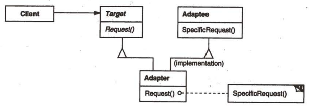
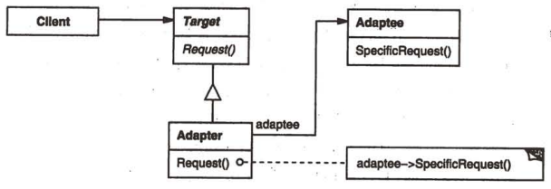

# 第四章 结构型模式

[TOC]

## 4.1 ADAPTER（适配器） - 类对象结构型模式

1. 意图

   将一个类的接口转换成客户希望的另外一个接口。Adapter模式使得原本由于接口不兼容而不能一起工作的那些类可以一起工作。

2. 别名

   包装器Wrapper。

3. 动机

4. 适用性

   以下情况使用Adapter模式：

   - 你想使用一个已经存在的类，而它的接口不符合你的需求。
   - 你想创建一个可以复用的类，该类可以与其他不相关的类或不可预见的类（即那些接口可能不一定兼容的类）协同工作。
   - （仅适用于对象Adapter）你想使用一些已经存在的子类，但是不可能对每一个都进行子类化以匹配它们的接口。对象适配器可以适配它的父类接口。

5. 结构

   

   *类适配器使用多重继承对一个接口与另一个接口进行匹配*

   

   *对象匹配器依赖于对象的组合*

6. 参与者

   - `Target(Shape)` 定义Client使用的与特定领域相关的接口。
   - `Client(DrawingEditor)` 与符合Target接口的对象协同。
   - `Adaptee(TextView)` 定义一个已经存在的接口，这个接口需要适配。
   - `Adapter(TextShape)` 对Adaptee的接口与Target接口进行适配。

7. 协作

   - Client在Adapter实例上调用一些操作。接着适配器调用Adaptee的操作实现这个请求。

8. 效果

   对类适配器的权衡：

   - 用一个具体的Adapter类对Adaptee和Target进行匹配。结果是当我们想要匹配一个类以及所有它的子类时，类Adapter将不能胜任工作。
   - 使得Adapter可以重定义Adaptee的部分行为，因为Adapter是Adaptee的一个子类。
   - 仅仅引入了一个对象，并不需要额外的指针以间接得到adaptee。

   对对象适配器的权衡：

   - 允许一个Adapter与多个Adaptee，即Adaptee本身以及它的所有子类（如果有子类的话）同时工作。Adapter也可以一次给所有的Adaptee添加功能。
   - 使得重定义Adaptee的行为比较困难。这就需要生成Adaptee的子类并使得Adapter引用这个子类而不是引用Adaptee本身。
   
   使用Adapter模式时需要考虑的其他一些因素：
   
   1. Adapter的匹配程度。
   2. 可插入的Adapter。
   3. 使用双向适配器提供透明操作。
   
9. 实现

   使用Adapter模式需要注意以下问题：

   1. 使用C++实现适配器类。
   2. 可插入的适配器。

10. 代码示例

   ```c++
   class Shape {
   public:
       Shape();
       virtual void BoundingBox(Point& bottomLeft, Point& topRight) const;
       virtual Manipulator* CreateManipulator() const;
   };
   
   class TextView {
   public:
       TextView();
       void GetOrigin(Coord& x, Coord& y) const;
       void GetExtent(Coord& width, Coord& height) const;
       virtual bool IsEmpty() const;
   };
   
   class TextShape : public Shape {
   public:
       TextShape(TextView*);
       
       virtual void BoundingBox(Point& bottomLeft, Point& topRight) const;
       virtual bool IsEmpty() const;
       virtual Manipulator* CreateManipulator() const;
   private:
       TextView* _text;
   };
   
   TextShape::TextShape(TextView* t) {
       _text = t;
   }
   
   void TextShape::BoundingBox(Point& bottomLeft, Point& topRight) const {
       Coord bottom, left, width, height;
       
       GetOrigin(bottom, left);
       GetExtent(width, height);
       
       bottomLeft = Point(bottom, left);
       topRight = Point(bottom + height, left + width);
   }
   
   bool TextShape::IsEmpty() const {
       return TextView::IsEmpty();
   }
   
   Manipulator* TextShape::CreateManipulator() const {
       return new TextManipulator(this);
   }
   ```

11. 已知应用

12. 相关模式

    Bridge

    Decorator

    Proxy


## 4.2 BRIDGE（桥接） - 对象结构型模式

1. 意图

   将抽象部分与它的实现部分分离，使它们都可以独立地变化。

2. 别名

   Handle/Body

3. 动机

   TODO