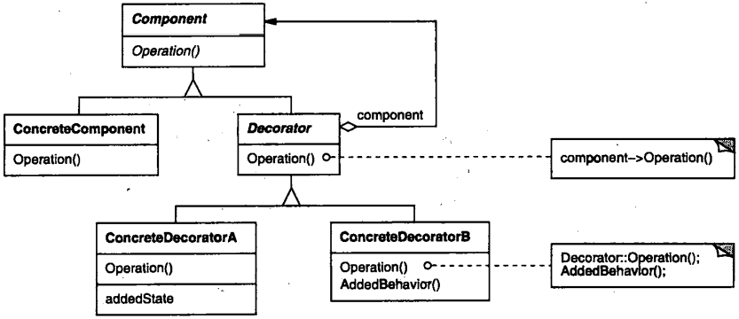

# 第四章 结构型模式

[TOC]

## 4.1 ADAPTER（适配器） - 类对象结构型模式

1. 意图

   将一个类的接口转换成客户希望的另外一个接口。Adapter模式使得原本由于接口不兼容而不能一起工作的那些类可以一起工作。

2. 别名

   包装器Wrapper。

3. 动机

4. 适用性

   以下情况使用Adapter模式：

   - 你想使用一个已经存在的类，而它的接口不符合你的需求。
   - 你想创建一个可以复用的类，该类可以与其他不相关的类或不可预见的类（即那些接口可能不一定兼容的类）协同工作。
   - （仅适用于对象Adapter）你想使用一些已经存在的子类，但是不可能对每一个都进行子类化以匹配它们的接口。对象适配器可以适配它的父类接口。

5. 结构

   

   *类适配器使用多重继承对一个接口与另一个接口进行匹配*

   

   *对象匹配器依赖于对象的组合*

6. 参与者

   - `Target(Shape)` 定义Client使用的与特定领域相关的接口。
   - `Client(DrawingEditor)` 与符合Target接口的对象协同。
   - `Adaptee(TextView)` 定义一个已经存在的接口，这个接口需要适配。
   - `Adapter(TextShape)` 对Adaptee的接口与Target接口进行适配。

7. 协作

   - Client在Adapter实例上调用一些操作。接着适配器调用Adaptee的操作实现这个请求。

8. 效果

   对类适配器的权衡：

   - 用一个具体的Adapter类对Adaptee和Target进行匹配。结果是当我们想要匹配一个类以及所有它的子类时，类Adapter将不能胜任工作。
   - 使得Adapter可以重定义Adaptee的部分行为，因为Adapter是Adaptee的一个子类。
   - 仅仅引入了一个对象，并不需要额外的指针以间接得到adaptee。

   对对象适配器的权衡：

   - 允许一个Adapter与多个Adaptee，即Adaptee本身以及它的所有子类（如果有子类的话）同时工作。Adapter也可以一次给所有的Adaptee添加功能。
   - 使得重定义Adaptee的行为比较困难。这就需要生成Adaptee的子类并使得Adapter引用这个子类而不是引用Adaptee本身。
   
   使用Adapter模式时需要考虑的其他一些因素：
   
   1. Adapter的匹配程度。
   2. 可插入的Adapter。
   3. 使用双向适配器提供透明操作。
   
9. 实现

   使用Adapter模式需要注意以下问题：

   1. 使用C++实现适配器类。
   2. 可插入的适配器。

10. 代码示例

   ```c++
   class Shape {
   public:
       Shape();
       virtual void BoundingBox(Point& bottomLeft, Point& topRight) const;
       virtual Manipulator* CreateManipulator() const;
   };
   
   class TextView {
   public:
       TextView();
       void GetOrigin(Coord& x, Coord& y) const;
       void GetExtent(Coord& width, Coord& height) const;
       virtual bool IsEmpty() const;
   };
   
   class TextShape : public Shape {
   public:
       TextShape(TextView*);
       
       virtual void BoundingBox(Point& bottomLeft, Point& topRight) const;
       virtual bool IsEmpty() const;
       virtual Manipulator* CreateManipulator() const;
   private:
       TextView* _text;
   };
   
   TextShape::TextShape(TextView* t) {
       _text = t;
   }
   
   void TextShape::BoundingBox(Point& bottomLeft, Point& topRight) const {
       Coord bottom, left, width, height;
       
       GetOrigin(bottom, left);
       GetExtent(width, height);
       
       bottomLeft = Point(bottom, left);
       topRight = Point(bottom + height, left + width);
   }
   
   bool TextShape::IsEmpty() const {
       return TextView::IsEmpty();
   }
   
   Manipulator* TextShape::CreateManipulator() const {
       return new TextManipulator(this);
   }
   ```

11. 已知应用

12. 相关模式

    Bridge

    Decorator

    Proxy


## 4.2 BRIDGE（桥接） - 对象结构型模式

1. 意图

   将抽象部分与它的实现部分分离，使它们都可以独立地变化。

2. 别名

   Handle/Body

3. 动机

4. 适用性

   - 不希望在抽象和它的实现部分之间有一个固定的绑定关系。
   - 类的抽象以及它的实现都应该可以通过生成子类的方法加以扩充。
   - 需要对一个抽象的实现部分的修改应对客户不产生影响，即客户的代码不必重新编译。
   - 需要对客户完全隐藏抽象的实现部分。
   - 有许多类要生成，类层次结构为“嵌套的普化”（nested generalizations）。
   - 需要在多个对象间共享实现（可能使用引用计数），但同时要求客户并不知道这一点。
   
5. 结构

   

6. 参与者

   - Abstraction

     定义抽象类的接口；

     维护一个指向Implementor类型对象的指针。

   - RefinedAbstraction

     扩充由Abstraction定义的接口。

   - Implementor

     定义实现类的接口，该接口不一定要与Abstraction的接口完全一致；事实上这两个接口可以完成不同。一般来讲，Implementor接口仅提供基本操作，而Abstraction则定义了基于这些基本操作的较高层次的操作。

   - ConcreteImplementor

     实现Implementor接口并定义它的具体实现。

7. 协作

   - Abstraction将client的请求转发给它的Implementor对象。

8. 效果

   优点：

   - 分离接口及其实现部分；
   - 提高可扩充性；
   - 实现细节对客户透明。

9. 实现

   使用Bridge模式需要注意以下问题：

   1. 仅有一个Implementor；
   2. 创建正确的Implementor对象；
   3. 共享Implementor对象；
   4. 采用多重继承机制。

10. 代码示例

   ```c++
   class Window {
   public:
       Window(View* contents);
       
       // requests handled by window
       virtual void DrawContents();
       
       virtual void Open();
       virtual void Close();
       virtual void Iconify();
       virtual void Deiconify();
       
       // requests forwarded to implementation
       virtual void SetOrigin(const Point& at);
       virtual void SetExtent(const Point& extent);
       virtual void Raise();
       virtual void Lower();
       
       virtual void DrawLine(const Point&, const Point&);
       virtual void DrawRect(const Point&, const Point&);
       virtual void DrawPolygon(const Point[], int n);
       virtual void DrawText(const char*, const Point&);
       
   protected:
       WindowImp* GetWindowImp();
       View* GetView();
       
   private:
       WindowImp* _imp;
       View* _contents; // the window's contents
   };
   void Window::DrawRect(const Point& p1, const Point& p2) {
       WindowImp* imp = GetWindowImp();
       imp->DeviceRect(p1.X(), p1.Y(), p2.X(), p2.Y());
   }
   
   class WindowImp {
   public:
       virtual void ImpTop() = 0;
       virtual void ImpBottom() = 0;
       virtual void ImpSetExtent(const Point&) = 0;
       virtual void ImpSetOrigin(const Point&) = 0;
       
       virtual void DeviceRect(Coord, Coord, Coord, Coord) = 0;
       virtual void DeviceText(const char*, Coord, Coord) = 0;
       virtual void DeviceBitmap(const char*, Coord, Coord) = 0;
       // lots more functions for drawing on windows...
       
   protected:
       WindowImp();
   };
   
   class ApplicationWindow : public Window {
   public:
       // ...
       virtual void DrawContents();
   };
   void ApplicationWindow::DrawContents() {
       GetView()->DrawOn(this);
   }
   
   class IconWindow : public Window {
   public:
       // ...
       virtual void DrawContents();
       
   private:
       const char* _bitmapName;
   };
   void IconWindow::DrawContents() {
       WindowImp* imp = GetWindowImp();
       if (imp != 0) {
           imp->DeviceBitmap(_bitmapName, 0.0, 0.0);
       }
   }
   
   class XWindowImp : public WindowImp {
   public:
       XWindowImp();
       
       virtual void DeviceRect(Coord, Coord, Coord, Coord);
       // remainder of public interface...
       
   private:
       // lots of X window system-specific state, including:
       Display* _day;
       Drawable _winid;
       GC _gc;
   };
   void XWindowImp::DeviceRect(Coord x0, Coord y0, Coord x1, Coord y1) {
       int x = round(min(x0, x1));
       int y = round(min(y0, y1));
       int w = round(abs(x0 - x1));
       int h = round(abs(y0 - y1));
       XDrawRectangle(_dpy, _windid, _gc, x, y, w, h);
   }
   
   class PMWindowImp : public WindowImp {
   public:
       PMWindowImp();
       virtual void DeviceRect(Coord, Coord, Coord, Coord);
       
       // remainder of public interface...
   private:
       // lots of PM window system-specific state, including:
       HPS _hps;
   };
   void PMWindowImp::DeviceRect(Coord x0, Coord y0, Coord x1, Coord y1) {
       Coord left = min(x0, x1);
       Coord right = max(x0, x1);
       Coord bottom = min(y0, y1);
       Coord top = max(y0, y1);
       
       PPOINTL point[4];
       
       point[0].x = left; point[0].y = top;
       point[1].x = right; point[1].y = top;
       point[2].x = right; point[2].y = bottom;
       point[3].x = left; point[3].y = bottom;
       
       if (
           (GpiBeginPath(_hps, 1L) == false) || 
           (GpiSetCurrentPosition(_hps, &point[3]) == false) ||
           (GpiPolyLine(_hps, 4L, point) == GPI_ERROR) ||
           (GpiEndPath(_hps) == false)
       ) { 
           // report error 
       } else {
           GpiStrokePath(_hps, 1L, 0L);
       }
   }
   
   WindowImp* Window::GetWindowImp() {
       if (_imp == 0) {
           _imp = WindowSystemFactory::Instance()->MakeWindowImp();
       }
       return _imp;
   }
   ```

11. 已知应用

12. 相关模式

    Abstract Factory模式。

    Adapter模式。


## 4.3 COMPOSITE(组合) - 对象结构型模式

1. 意图

   将对象组合成树型结构以表示“部分-整体”的层次结构。Composite使得用户对单个对象和组合对象的使用具有一致性。

2. 动机

3. 适用性

   - 希望表示对象的部分 - 整体层次结构；
   - 希望用户忽略组合对象与单个对象的不同，用户将统一地使用组合结构中的所有对象。

4. 结构

   

5. 参与者

   - Component
     1. 为组合中的对象声明接口；
     2. 在适当的情况下，实现所有类共有接口地缺省行为；
     3. 声明一个接口用于访问和管理Component地子组件；
     4. （可选）在递归结构中顶定义一个接口，用于访问一个父部件，并在合适的情况下实现它。
   - Leaf
     1. 在组合中表示叶节点对象，叶节点没有子节点；
     2. 在组合中定义图元对象的行为。
   - Composite
     1. 定义有子部件的那些部件的行为；
     2. 存储子部件；
     3. 在Component接口中实现与子部件有关的操作。
   - Client
     1. 通过Component接口操纵组合部件的对象。

6. 协作

   用户使用Component类接口与组合结构中的对象进行交互。如果接收者是一个叶节点，则直接处理请求。如果接收者是Composite，它通常将请求发送给它的子部件，在转发请求之前与/或之后可能执行一些辅助操作。

7. 效果

   - 定义了包含基本对象和组合对象的类层次结构；
   - 简化客户代码；
   - 使得更容易增加新类型的组件；
   - 使你的设计变得更加一般化。

8. 实现

9. 代码示例

   ```c++
   class Equipment {
   public:
       virtual ~Equipment();
       
       const char* Name() { return _name; }
       
       virtual Watt Power();
       virtual Currency NetPrice();
       virtual Currency DiscountPrice();
       
       virtual void Add(Equipment*);
       virtual void Remove(Equipment*);
       virtual Iterator<Equipment*>* CreateIterator();
       
   protected:
       Equipment(const char*);
       
   private:
       const char* _name;
   };
   
   class FloppyDisk : public Equipment {
   public:
       FloppyDisk(const char*);
       virtual ~FloppyDisk();
       
       virtual Watt Power();
       virtual Currency NetPrice();
       virtual Currency DiscountPrice();
   };
   
   class CompositeEquipment : public Equipment {
   public:
       virtual ~CompositeEquipment();
       
       virtual Watt Power();
       virtual Currency NetPrice();
       virtual Currency DiscountPrice();
       
       virtual void Add(Equipment*);
       virtual void Remove(Equipment*);
       virtual Iterator<Equipment*>* CreateIterator();
       
   protected:
       CompositeEquipment(const char*);
       
   private:
       List<Equipment*> _equipment;
   };
   Currency CompositeEquipment::NetPrice() {
       Iterator<Equipment*>* i = CreateIterator();
       Currency total = 0;
       
       for (i->First(); !i->IsDone(); i->Next()) {
           total += i->CurrentItem()->NetPrice();
       }
       delete i;
       return total;
   }
   
   class Chassis : public CompositeEquipment {
   public:
       Chassis(const char*);
       virtual ~Chassis();
       virtual Watt Power();
       virtual Currency NetPrice();
       virtual Currency DiscountPrice();
   };
   
   Cabinet* cabinet = new Cabinet("PC Cabinet");
   Chassis* chassis = new Chassis("PC Chassis");
   
   cabinet->Add(chassis);
   
   Bus* bus = new Bus("MCA Bus");
   buf->Add(new Card("16Mbs Token Ring"));
   
   chassis->Add(bus);
   chassis->Add(new FloppyDisk("3.5in Floppy"));
   
   cout << "The net price is " << chassis->NetPrice() << endl;
   ```

10. 已知应用

11. 相关模式

    Decorator模式

    Flyweight模式

    Iterator模式

    Visitor模式


## 4.4 DECORATOR(装饰) - 对象结构型模式

1. 意图

   动态地给一个对象添加一个额外的职责。就增加功能来说，Decorator模式相比生成子类更为灵活。

2. 别名

   包装器Wrapper

3. 动机

4. 适用性

   - 在不影响其它对象的情况下，以动态，透明地方式给单个对象添加职责。
   - 处理那些可以撤销的职责。
   - 当不能采用生成子类地方法进行扩充时；一种情况是，可能有大量独立的扩展，为支持每一种组合将产生大量的子类，使得子类数目呈爆炸性增长。另一种情况可能是因为类定义被隐藏，或类定义不能用于生成子类。

5. 结构

   

6. 参与者

   - Component
     1. 定义一个对象接口，可以给这些对象动态地添加职责。
   - ConcreteComponent
     1. 定义一个对象，可以给这个对象添加一些职责。
   - Decorator
     1. 维持一个指向Component对象的指针，并定义一个与Component接口一致地接口。
   - ConcreteDecorator
     1. 向组件添加职责。

7. 协作

   - Decorator将请求转发给它地Component对象，并有可能在转发请求前后执行一些附加的动作。

8. 效果

   优点：

   - 比静态继承更灵活；
   - 避免在层次结构高层地类有太多的特征。

   缺点：

   - Decorator与它的Component不一样；
   - 有许多小对象。
   
9. 实现

10. 代码示例

   ```c++
   class VisualComponent {
   public:
       VisualComponent();
       
       virtual void Draw();
       virtual void Resize();
       // ...
   };
   
   class Decorator : public VisualComponent {
   public:
       Decorator(VisualComponent*);
       
       virtual void Draw();
       virtual void Resize();
       // ...
       
   private:
       VisualComponent* _component;
   };
   
   void Decorator::Draw() {
       _component->Draw();
   }
   void Decorator::Resize() {
       _component->Resize();
   }
   
   class BorderDecorator : public Decorator {
   public:
       BorderDecorator(VisualComponent*, int borderWidth);
       
       virtual void Draw();
       
   private:
       void DrawBorder(int);
       
   private:
       int _width;
   };
   void BorderDecorator::Draw() {
       Decorator::Draw();
       DrawBorder(_width);
   }
   
   void Window::SetContents(VisualComponent* contents) {
       // ...
   }
   
   Window* window = new Window;
   TextView* textView = new TextView;
   window->SetContents(textView);
   window->SetContents(new BorderDecorator(new ScrollDecorator(textView), 1));
   ```

11. 已知应用

12. 相关模式

    Adapter模式：Decorator模式不同于Adapter模式，因为装饰仅改变对象的职责而不改变它的接口；而适配器将给对象一个全新的接口。

    Composite模式：可以将装饰视为一个退化的，仅有一个组件的组合。然而，装饰仅给对象添加一些额外的职责 - - 它的目的不在于对象聚集。

    Strategy模式：用一个装饰你可以改变对象的外表；而Strategy模式使得你可以改变对象的内核。这是改变对象的两种途径。


## 4.5 FACADE(外观) - 对象结构型模式

1. 意图

   为子系统中的一组接口提供一个一致的界面，Facade模式定义了一个高层接口，这个接口使得这一子系统更加容易使用。

2. 动机

3. 适用性

   - 当你要为一个复杂子系统提供一个简单接口时；
   - 客户程序与抽象类的实现部分之间存在着很大的依赖性；
   - 当你需要构建一个层次结构的子系统时，使用facade模式定义子系统中每层的入口点。

4. 结构

   

5. 参与者

   - Facade
     1. 知道哪些子系统类负责处理请求；
     2. 将客户的请求代理给适当的子系统对象。
   - Subsystem classes
     1. 实现子系统的功能；
     2. 处理由Facade对象指派的任务；
     3. 没有facade的任何相关信息；即没有指向facade的指针。

6. 协作

   - 客户程序通过发送请求给Facade的方式与子系统通讯，Facade将这些消息转发给适当的子系统对象。尽管是子系统中的有关对象在做实际工作，但Facade模式本身也必须将它的接口转换成子系统的接口。
   - 使用Facade的客户程序不需要直接访问子系统对象。

7. 效果

   优点：

   - 它对客户屏蔽子系统组件，因而减少了客户处理的对象的数目并使得子系统使用起来更加方便；
   - 实现了子系统与客户之间的松耦合关系；
   - 可以在系统易用性和通用性之间加以选择。

8. 实现

9. 代码示例

   ```c++
   class Scanner {
   public:
       Scanner(istream&);
       virtual ~Scanner();
       
       virtual Token& Scan();
       
   private:
       istream& _inputStream;
   };
   
   class Parser {
   public:
       Parser();
       virtual ~Parser();
       
       virtual void Parse(Scanner&, ProgramNodeBuilder&);
   };
   
   class ProgramNodeBuilder {
   public:
       ProgramNodeBuilder();
       
       virtual ProgramNode* NewVariable(const char* variableName) const;
       virtual ProgramNode* NewAssignment(ProgramNode* variable, ProgramNode* expression) const;
       virtual ProgramNode* NewReturnStatement(ProgramNode* value) const;
       virtual ProgramNode* NewCondition(
           ProgramNode* condition, 
           ProgramNode* truePart, 
           ProgramNode* falsePart) const;
       // ...
       ProgramNode* GetRootNode();
   
   private:
       ProgramNode* _node;
   };
   
   class ProgramNode {
   public:
       // program node manipulation
       virtual void GetSourcePosition(int& line, int& index);
       // ...
       
       // child manipulation
       virtual void Add(ProgramNode*);
       virtual void Remove(ProgramNode*);
       // ...
       
       virtual void Traverse(CodeGenerator&);
       
   protected:
       ProgramNode();
   };
   
   class CodeGenerator {
   public:
       virtual void Visit(StatementNode*);
       virtual void Visit(ExpressionNode*);
       // ...
   
   protected:
       CodeGenerator(BytecodeStream&);
       
   protected:
       BytecodeStream& _output;
   };
   
   void ExpressionNode::Traverse(CodeGenerator& cg) {
       cg.Visit(this);
       
       ListIterator<ProgramNode*> i(_children);
       
       for (i.First(); !i.IsDone(); i.Next()) {
           i.CurrentItem()->Traverse(cg);
       }
   }
   
   class Compiler {
   public:
       Compiler();
       
       virtual void Compile(istream&, BytecodeStream&);
   };
   
   void Compiler::Compile(istream& input, BytecodeStream& output) {
       Scanner scanner(input);
       ProgramNodeBuilder buidler;
       Parse parser;
       parser.Parse(scanner, builder);
       RISCCodeGenerator generator(output);
       ProgramNode* parseTree = builder.GetRootNode();
       parseTree->Traverse(generator);
   }
   ```

10. 已知应用

11. 相关模式

    Abstract Factory模式：可以与Facade模式一起使用以提供一个接口，这一接口可用来以一种子系统独立的方式创建子系统对象。

    Mediator模式：与Facade模式相似，它抽象了一些已有的类的功能。


## 4.6 FLYWEIGHT(享元) - 对象结构型模式

1. 意图

   运用共享技术有效地支持大量细粒度的对象。

2. 动机

   有些应用程序得益于在其整个设计过程中采用对象技术，但简单化的实现代价极大。

3. 适用性

   - 一个应用程序使用了大量的对象；
   - 完全由于使用大量的对象，造成很大的存储开销；
   - 对象的大多数状态都可变为外部状态；
   - 如果删除对象的外部状态，那么可以用相对较少的共享对象取代很多组对象；
   - 应用程序不依赖于对象标识，由于Flyweight对象可以被共享，对于概念上明显有别的对象，标识测试将返回真值。

4. 结构

   

5. 参与者

   - Flyweight
     1. 描述一个接口，通过这个接口flyweight可以接收并作用于外部状态。
   - ConcreteFlyweight
     1. 实现Flyweight接口，并为内部状态（如果有的话）增加存储空间。ConcreteFlyweight对象必须是可共享的。它所存储的状态必须是内部的；即，它必须独立于ConcreteFlyweight对象的场景。
   - UnsharedConcreteFlyweight
     1. 并非所有的Flyweight子类都需要被共享。Flyweight接口使共享成为可能，但它并不强制共享。在Flyweight对象结构的某些层次，UnsharedConcreteFlyweight对象通常将ConcreteFlyweight对象作为子节点。
   - FlyweightFactory
     1. 创建并管理flyweight对象；
     2. 确保合理地共享flyweight；当用户请求一个flyweight时，FlyweightFactory对象提供一个已创建的实例或创建一个（如果不存在的话）。
   - Client
     1. 维持一个对flyweight的引用；
     2. 计算或存储一个（多个）flyweight的外部状态。

6. 协作

   - flyweight执行时所需的状态必定是内部的或外部的。内部状态存储与ConcreteFlyweight对象之中；而外部对象则由Client对象存储或计算。当用户调用flyweight对象的操作时，将该状态传递给它；
   - 用户不应直接对ConcreteFlyweight类进行实例化，而只能从FlyweightFactory对象得到ConcreteFlyweight对象，这可以保证对它们适当地进行共享。

7. 效果

   共享的flyweight越多，空间节省也就越大，存储节约由以下因素决定：

   - 因为共享，实例总数减少的数目；
   - 对象内部状态的平均数目；
   - 外部状态是计算的还是存储的。

8. 实现

9. 代码示例

   ```c++
   class Glyph {
   public:
       virtual ~Glyph();
       virtual void Draw(Window*, GlyphContext&);
       virtual void SetFont(Font*, GlyphContext&);
       virtual Font* GetFont(GlyphContext&);
       virtual void First(GlyphContext&);
       virtual void Next(GlyphContext&);
       virtual bool IsDone(GlyphContext&);
       virtual Glyph* Current(GlyphContext&);
       virtual void Insert(Glyph*, GlyphContext&);
       virtual void Remove(GlyphContext&);
       
   protected:
       Glyph();
   };
   
   class Character : public Glyph {
   public:
       Character(char);
       virtual void Draw(Window*, GlyphContext&);
       
   private:
       char _charcode;
   };
   
   class GlyphContext {
   public:
       GlyphContext();
       virtual ~GlyphContext();
       virtual void Next(int step = 1);
       virtual void Insert(int quantity = 1);
       virtual Font* GetFont();
       virtual void SetFont(Font*, int span = 1);
       
   private:
       int _index;
       BTree* _fonts;
   };
   
   const int NCHARCODES = 128;
   
   class GlyphFactory {
   public:
       GlyphFactory();
       virtual ~GlyphFactory();
       virtual Character* CreateCharacter(char);
       virtual Row* CreateRow();
       virtual Column* CreateColumn();
       // ...
       
   private:
       Character* _character[NCHARCODES];
   };
   
   GlyphFactory::GlyphFactory(){
       for (int i = 0; i < NCHARCODES; ++i) {
           _character[i] = 0;
       }
   }
   
   Chararcter* GlyphFactory::CreateCharacter(char c) {
       if (!_chararcter[c]) {
           _character[c] = new Character(c);
       }
       return _character[c];
   }
   
   Row* GlyphFactory::CreateRow() {
       return new Row;
   }
   
   Column* GlyFactory::CreateColumn() {
       return new Column;
   }
   ```

10. 已知应用

11. 相关模式

    Flyweight模式通常和Composite模式结合起来，用共享叶结点的有向无环图实现一个逻辑上的层次结构。


## 4.7 PROXY(代理) - 对象结构型模式

1. 意图

   为其它对象提供一种代理以控制对这个对象的访问。

2. 别名

   Surrogate。

3. 动机

4. 适用性

   - 远程代理（Remote Proxy）为一个对象在不同的地址空间提供局部代表。
   - 虚代理（Virtual Proxy）根据需要创建开销很大的对象。
   - 保护代理（Protection Proxy）控制对原始对象的访问。
   - 智能指引（Smart Reference）取代了简单的指针，它在访问对象时执行一些附加操作；它的典型用途包括：
     1. 对指向实际对象的引用计数，这样当该对象没有引用时，可以自动释放它（也称为ieSmart Pointers）。
     2. 当第一次引用一个持久对象时，将它转投入内存。
     3. 在访问一个实际对象前，检查是否已经锁定了它，以确保其他对象不能改变它。

5. 结构

   

6. 参与者

   - Proxy
     1. 保存一个引用使得代理可以访问实体。若RealSubject和Subject的接口相同，Proxy会引用Subject；
     2. 提供一个与Subject的接口，这样代理就可以用来替代实体；
     3. 控制对实体的存取，并可能负责创建和删除它；
     4. 其它功能依赖于代理的类型：
        - Remote Proxy负责对请求及其参数进行编码，并向不同地址空间中的实体发送已编码的请求；
        - Virtual Proxy可以缓存实体的附加信息，以便延迟对它的访问；
        - Protection Proxy检查调用者是否具有实现一个请求所必需的访问权限。
   - Subject
     1. 定义RealSubject和Proxy的共用接口，这样就在任何使用RealSubject的地方都可以使用Proxy。
   - RealSubject
     1. 定义Proxy所代表的实体。

7. 协作

   - 代理根据其种类，在适当的时候向RealSubject转发请求；

8. 效果

   Proxy模式在访问对象时引入了一定程度的间接性。根据代理的类型，附加的间接性有多种用途：

   1. Remote Proxy可以隐藏一个对象存在于不同地址空间的事实；
   2. Virtual Proxy可以进行最优化；
   3. Protection Proxies和Smart Reference都允许在访问一个对象时有一些附加的内务处理（Housekeeping task）。

9. 实现

10. 代码示例

    ```c++
    class Graphic {
    public:
        virtual ~Graphic();
        virtual void Draw(const Point& at) = 0;
        virtual void HandleMouse(Event& event) = 0;
        virtual const Point& GetExtent() = 0;
        virtual void Load(istream& from) = 0;
        virtual void Save(ostream& to) = 0;
        
    protected:
        Graphic();
    };
    
    class Image : public Graphic {
    public:
        Image(const char* file); // loads image from a file
        virtual ~Image();
        virtual void Draw(const Point& at);
        virtual void HandleMouse(Event& event);
        virtual const Point& GetExtent();
        virtual void Load(istream& from);
        virtual void Save(ostream& to);
        
    private:
        // ...
    };
    
    class ImageProxy : public Graphic {
    public:
        ImageProxy(const char* imageFile);
        virtual ~ImageProxy();
        virtual void Draw(const Point& at);
        virtual void HandleMouse(Event& event);
        virtual const Point& GetExtent();
        virtual void Load(istream& from);
        virtual void Save(ostream& to);
        
    protected:
        Image* GetImage();
        
    private:
        Image* _image;
        Point _extent;
        char* _fileName;
    };
    ImageProxy::ImageProxy(const char* fileName) {
        _fileName = strdup(fileName);
        _extent = Point::Zero; // don't know extent yet
        _image = 0;
    }
    Image* ImageProxy::GetImage() {
        if (_image == 0) {
            _image = new Image(_fileName);
        }
        return _image;
    }
    const Point& ImageProxy::GetExtent() {
        if (_extent == Point::Zero) {
            _extent = GetImage()->GetExtent();
        }
        return _extent;
    }
    void ImageProxy::Draw(const Point& at) {
        GetImage()->Draw(at);
    }
    void ImageProxy::HandleMouse(Event& event) {
        GetImage()->HandleMouse(event);
    }
    void ImageProxy::Save(ostream& to) {
        to << _extent << _fileName;
    }
    void ImageProxy::Load(istream& from) {
        from >> _extent >> _fileName;
    }
    
    class TextDocument {
    public:
        TextDocument();
        
        void Insert(Graphic*);
        // ...
    };
    
    TextDocument* text = new TextDocument;
    // ...
    text->Insert(new ImageProxy("anImageFileName"));
    ```

11. 已知应用

12. 相关模式

    Adapter模式：适配器Adapter为它所适配的对象提供了一个不同的接口。相反，代理提供了与它的实体相同的接口。然而，用于访问保护的代理可能会拒绝执行实体会执行的操作，因此，它的接口实际上可能只是实体接口的一个子集。

    Decorator模式：尽管decorator的实现部分与代理相似，但decorator的目的不一样。Decorator为对象添加一个或多个功能，而代理则控制对对象的访问。


## 4.8 结构型模式的讨论

### 4.8.1 Adapter与Bridge

Adapter模式主要是为了解决两个已有接口之间不匹配的问题，它不考虑这些接口是怎样实现的，也不考虑他们各自可能会如何演化。这种方式不需要对两个独立设计的类中的任一个进行重新设计，就能够使他们协同工作。

Bridge模式则对抽象接口与它的（可能是多个）实现部分进行桥接。虽然这一模式允许你修改实现它的类，它仍然为用户提供了一个稳定的接口。

Adapter在类已经设计后后实施，Bridge模式在设计之前实施。

### 4.8.2 Composite, Decorator与Proxy

Decorator旨在使你能够不需要生成子类即可给对象添加职责。这就避免了静态实现所有功能组合，从而导致子类急剧增加。

Composite旨在构造类，使多个相关的对象能够以统一的方式处理，而多重对象可以被当作一个对象来处理。它重点不在于修改，而在于表示。

Proxy模式构成一个对象并为用户提供一致的接口，Proxy模式不能动态地添加或分离性质，它也不是为递归组合而设计的。它的目的是当直接访问一个实体不方便或不符合需要时，为这个实体提供一个替代者。
