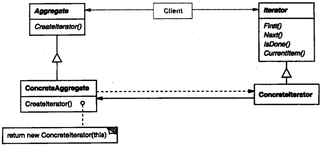

# 第五章 行为模式

[TOC]


## 5.1 CHAIN OF RESPONSIBILITY(职责链) - 对象行为型模式

1. 意图

   使多个对象都有机会处理请求，从而避免请求的发送者和接收者之间的耦合关系。将这些对象连成一条链，并沿着这条链传递该请求，直到有一个对象处理它为止。

2. 动机

3. 适用性

   - 有多个的对象可以处理一个请求，哪个对象处理该请求运行时刻自动确定；
   - 想要在不明确指定接收者的情况下，向多个对象中的一个提交一个请求；
   - 可处理一个请求的对象集合应被动态指定。

4. 结构

   

5. 参与者

   - Handler
     1. 顶一个处理请求的接口；
     2. （可选）实现后继链。
   - ConcreteHandler
     1. 处理它所负责的请求；
     2. 可访问它的后继者；
     3. 如果可处理该请求，就处理之；否则将该请求转发给它的后继者。
   - Client
     1. 向链上的具体处理者（ConcreteHandler）对象提交请求。

6. 协作

   - 当客户提交一个请求时，请求沿链传递直至有一个ConcreteHandler对象负责处理它。

7. 效果

   优点：

   - 降低耦合度；
   - 增强了给对象指派职责（Responsibility）的灵活性。

   缺点：

   - 不保证被接受。

8. 实现

9. 代码示例

   ```c++
   typedef int Topic;
   const Topic NO_HELP_TOPIC = -1;
   
   class HelpHandler {
   public:
       HelpHandler(HelpHandler* = 0, Topic = NO_HELP_TOPIC);
       virtual bool HashHelp();
       virtual void SetHandler(HelpHandler*, Topic);
       virtual void HandleHelp();
       
   private:
       HelpHandler* _successor;
       Topic _topic;
   };
   
   HelpHandler::HelpHandler(HelpHandler* h, Topic t) : _successor(h), _topic(t) {}
   
   bool HelpHandler::HasHelp() {
       return _topic != NO_HELP_TOPIC;
   }
   void HelpHandler::HandleHelp() {
       if (_successor != 0) {
           _successor->HandleHelp();
       }
   }
   
   class Widget : public HelpHandler {
   protected:
       Widget(Widget* parent, Topic t = NO_HELP_TOPIC);
       
   private:
       Widget* _parent;
   };
   
   Widget::Widget(Widget* w, Topic t) : HelpHandler(w, t) {
       _parent = w;
   }
   
   class Button : public Widget {
   public:
       Button(Widget* d, Topic t = NO_HELP_TOPIC);
       
       virtual void HandleHelp();
       // Widget operations that Button overrides...
   };
   Button::Button(Widget* h, Topic t) : Widget(h, t) {}
   void Button::HandleHelp() {
       if (HasHelp()) {
           // offer help on the button
       } else {
           HelpHandler::HandleHelp();
       }
   }
   
   class Dialog : public Widget {
   public:
       Dialog(HelpHandler* h, Topic t = NO_HELP_TOPIC);
       virtual void HandleHelp();
       
       // Widget operations that Dialog overrides...
       // ...
   };
   
   Dialog::Dialog(HelpHandler* h, Topic t) : Widget(0) {
       SetHandler(h, t);
   }
   
   void Dialog::HandleHelp() {
       if (HasHelp()) {
           // offer help on the button
       } else {
           HelpHandler::HandleHelp();
       }
   }
   
   class Dialog : public Widget {
   public:
       Dialog(HelpHandler* h, Topic t = NO_HELP_TOPIC);
       virtual void HandleHelp();
       
       // Widget operations that Dialog overrides...
       // ...
   };
   
   Dialog::Dialog(HelpHandler* h, Topic t) : Widget(0) {
       SetHandler(h, t);
   }
   
   void Dialog::HandleHelp() {
       if (HasHelp()) {
           // offer help on the dialog
       } else {
           HelpHandler::HandleHelp();
       }
   }
   
   class Application : public HelpHandler {
   public:
       Application(Topic t) : HelpHandler(0, t) {}
       
       virtual void HandleHelp();
       // application-specific operations...
   };
   
   void Application::HandleHelp() {
       // show a list of help topics
   }
   
   const Topic PRINT_TOPIC = 1;
   const Topic PAPER_ORIENTATION_TOPIC = 2;
   const Topic APPLICATION_TOPIC = 3;
   
   Application* application = new Application(APPLICATION_TOPIC);
   Dialog* dialog = new Dialog(application, PRINT_TOPIC);
   Button* button = new Button(dialog, PAPER_ORIENTATION_TOPIC);
   button->HandleHelp();
   ```

10. 已知应用

11. 相关模式

    职责链常与Composite一起使用。这种情况下，一个构件的父构件可作为它的后继。


## 5.2 COMMAND(命令) - 对象行为型模式

1. 意图

   将一个请求封装为一个，从而使你可用不同的请求对客户进行参数化；对请求排队或记录请求日志，以及支持可撤销的操作。

2. 别名

   动作(Action)，事务(Transaction)

3. 动机

4. 适用性

   - 抽象出待执行的动作以参数化某对象；
   - 在不同的时刻指定，排列和执行请求；
   - 支持取消操作；
   - 支持修改日志；
   - 用构建在原语操作上的高层操作构造一个系统。

5. 结构

   

6. 参与者

   - Command
     1. 声明执行操作的接口。
   - ConcreteCommand
     1. 将一个接收者对象绑定于一个动作；
     2. 调用接收者相应的操作，以实现Execute。
   - Client
     1. 创建一个具体命令对象并设定它的接收者。
   - Invoker
     1. 要求该命令执行这个请求。
   - Receiver
     1. 知道如何实施与执行一个请求相关的操作。任何类都可能作为一个接收者。

7. 协作

   - Client创建一个ConcreteCommand对象并指定它的Receiver对象；
   - 某Invoker对象存储该ConcreteCommand对象；
   - 该Invoker通过调用Command对象的Execute操作来提交一个请求。若该命令是可撤销的，ConcreteCommand就在执行Excute操作之前存储当前状态以用于取消该命令；
   - ConcreteCommand对象对调用它的Receiver的一些操作以执行该请求。

8. 效果

   - Command模式将调用操作的对象与知道如何实现该操作的对象解耦；
   - Command是头等的对象；它们可像其它的对象一样被操纵和扩展；
   - 你可将多个命令装配成一个复合命令；
   - 增加新的Command很容易，因为这无需改变已有的类。

9. 实现

10. 代码示例

    ```c++
    class Comkmand {
    public:
        virtual ~Command();
        virtual void Execute() = 0;
        
    protected:
        Command();
    };
    
    class OpenCommand : public Command {
    public:
        OpenCommand(Application*);
        virtual void Execute();
        
    protected:
        virtual const char* AskUser();
        
    private:
        Application* _application;
        char* _response;
    }
    
    OpenCommand::OpenCommand(Application* a) {
        _application = a;
    }
    void OpenCommand::Execute() {
        const char* name = AskUser();
        
        if (name != 0) {
            Document* document = new Document(name);
            _application->Add(document);
            document->Open();
        }
    }
    
    class PasteCommand : public Command {
    public:
        PasteComkmand(Document*);
        virtual void Execute();
        
    private:
        Document* _document;
    };
    PasteCommand::PasteCommand(Document* doc) {
        _document = doc;
    }
    void PasteCommand::Execute() {
        _document->Paste();
    }
    
    template <class Receiver>
    class SimpleCommand : public Command {
    public:
        typedef void (Receiver::* Action)();
        SimpleCommand(Receiver* r, Action a) : _receiver(r), _action(a) {}
        virtual void Execute();
        
    private:
        Action _action;
        Receiver* _receiver;
    };
    template <class Receiver>
    void SimpleCommand<Receiver>::Execute() {
        (_receiver->*_action)();
    }
    
    class MacroCommand : public Command {
    public:
        MacroCommand();
        virtual ~MacroCommand();
        virtual void Add(Command*);
        virtual void Remove(Command*);
        virtual void Execute();
        
    private:
        List<Command*>* _cmds;
    };
    void MacroCommand::Execute() {
        ListIterator<Command*> i(_cmds);
        
        for (i.First(); !i.IsDone(); i.Next()) {
            Command* c = i.CurrentItem();
            c->Execute();
        }
    }
    void MacroCommand::Add(Command* c) {
        _cmds->Append(c);
    }
    void MacroCommand::Remove(Command* c) {
        _cmds->Remove(c);
    }
    
    MyClass* receiver = new MyClass;
    // ...
    Command* pCommand = new SimpleCommand<MyClass>(receiver, &MyClass::Action);
    // ...
    aCommand->Execute();
    ```

11. 已知应用

12. 相关模式

    Composite模式：可被用来实现宏命令。

    Memento模式：可被用来保持某个状态，命令用这一状态来取消它的效果。


## 5.3 INTERPRETER(解释器) - 类行为型模式

1. 意图

   给定一个语言，定义它的文法的一种表示，并定义一个解释器，这个解释器使用该表示来解释语言中的句子。

2. 动机

   如果一个特定类型的问题发生的频率足够高，那么可能就值得将该问题的各个实例表述为一个简单语言中的句子。这样就可以构建一个解释器，该解释器通过解释这些句子来解决该问题。

3. 适用性

   - 该文法简单对于复杂的文法，文法的类层次变得庞大而无法管理。此时语法分析程序生成器这样的工具是更好的选择。它们无需构建抽象语法树即可解释表达式，这样可以节省空间而且还可能节省时间；
   - 效率不是一个关机键问题最高效的解释器通常不是通过直接解释语法分析树实现的，而是首先将它们转换成另一种形式。

4. 结构

   

5. 参与者

   - AbstractExpression（抽象表达式）
     1. 声明一个抽象的解释操作，这个接口为抽象语法树中所有的节点所共享。
   - TerminalExpression（终结符表达式）
     1. 实现与文法中的终结符相关联的解释操作；
     2. 一个句子中的每个终结符需要该类的一个实例。
   - NoterminalExpression（非终结符表达式）
     1. 对文法中的每一条规则$R ::= R_1 R_2 ... R_n$都需要一个NonterminalExpression类；
     2. 为从$R_1$到$R_n$的每个符号都维护一个AbstractExpression类型的实例变量；
     3. 为文法中的非终结符实现解释（Interpret）操作。解释（Interpret）一般要递归地调用表示$R_1$到$R_n$的那些对象的解释操作.
   - Context（上下文）
     1. 包含解释器之外的一些全局信息。
   - Client（客户）
     1. 构建（或被给定）表示该文法定义的语言中一个特定的句子的抽象语法树。该抽象语法树由NonterminalExpression和TerminalExpression的实例装配而成；
     2. 调用解释操作。

6. 协作

   - Client构建（或被给定）一个句子，它是NonterminalExpression和TerminalExpression的实例的一个抽象语法树，然后初始化上下文并调用解释操作；
   - 每一非终结符表达式节点定义相应子表达式的解释操作。而各终结符表达式的解释操作构成了递归的基础；
   - 每一节点的解释操作用上下文存储和访问解释器的状态。

7. 效果

   优点：

   - 易于改变和扩展文法；
   - 易于实现文法。

   缺点：

   - 复杂的文法难以维护；
   - 增加了新的解释表达式的方式。

8. 实现

9. 代码示例

   ```c++
   class BooleanExp {
   public:
       BooleanExp();
       virtual ~BooleanExp();
       virtual bool Evaluate(Context&) = 0;
       virtual BooleanExp* Replace(const char*, BooleanExp&) = 0;
       virtual BooleanExp* Copy() const = 0;
   };
   
   class Context {
   public:
       bool Lookup(const char*) const;
       void Assign(VariableExp*, bool);
   };
   
   class VariableExp : public BooleanExp {
   public:
       VariableExp(const char*);
       virtual ~VariableExp();
       virtual bool Evaluate(Context&);
       virtual BooleanExp* Replace(const char*, BooleanExp&);
       virtual BooleanExp* Copy() const;
       
   private:
       char* _name;
   };
   VariableExp::VariableExp(const char* name) {
       _name = strdup(name);
   }
   bool VariableExp::Evaluate(Context& aContext) {
       return aContext.Lookup(_name);
   }
   BooleanExp* VariableExp::Copy() const {
       return new VariableExp(_name);
   }
   BooleanExp* VariableExp::Replace(const char* name, BooleanExp& exp) {
       if (strcmp(name, _name) == 0) {
           return exp.Copy();
       } else {
           return new VariableExp(_name);
       }
   }
   
   class AndExp : public BooleanExp {
   public:
       AndExp(BooleanExp*, BooleanExp*);
       virtual ~AndExp();
       virtual bool Evaluate(Context&);
       virtual BooleanExp* Replace(const char*, BooleanExp&);
       virtual BooleanExp* Copy() const;
       
   private:
       BooleanExp* _operand1;
       BooleanExp* _operand2;
   };
   AndExp::AndExp(BooleanExp* op1, BooleanExp* op2) {
       _operand1 = op1;
       _operand2 = op2;
   }
   bool AndExp::Evaluate(Context& aContext) {
       return _operand1->Evaluate(aContext) &&
                _operand2->Evaluate(aContext);
   }
   BooleanExp* AndExp::Copy() const {
       return new AndExp(_operand1->Copy(), _operand2->Copy());
   }
   BooleanExp* AndExp::Replace(const char* name, BooleanExp& exp) {
       return new AndExp(_operand1->Replace(name, exp), 
                         _operand2->Replace(name, exp));
   }
   
   BooleanExp* expression;
   Context context;
   
   VariableExp* x = new VariableExp("X");
   VariableExp* y = new VariableExp("Y");
   
   expression = new OrExp(
   	new AndExp(new Constant(true), x),
       new AndExp(y, new NotExp(x))
   );
   
   context.Assign(x, false);
   context.Assign(y, true);
   
   bool result = expression->Evaluate(context);
   
   VariableExp* z = new VariableExp("Z");
   NotExp not_z(z);
   
   BooleanExp* replacement = expression->Replace("Y", not_z);
   
   context.Assign(z, true);
   
   result = replacement->Evaluate(context);
   ```

10. 已知应用

11. 相关模式

    Composite模式：抽象语法树是一个复合模式的实例。

    Flyweight模式：说明了如何在抽象语法树中共享终结符。

    Iterator模式：解释器可用一个迭代器遍历该结构。

    Visitor模式：可用来在一个类中维护抽象语法树中的各节点的行为。


## 5.4 ITERATOR(迭代器) - 对象行为型模式

1. 意图

   提供一种方法顺序访问呢一个聚合对象中各个元素，而又不需暴露该对象的内部表示。

2. 别名

   游标（Cursor）

3. 动机

   将对列表的访问和遍历从列表对象中分离出来并放入一个迭代器（iterator）对象中。

4. 适用性

   - 访问一个聚合对象的内容而无需暴露它的内部表示
   - 支持对聚合对象的多种遍历；
   - 为遍历不同的聚合结构提供一个统一的接口（即，支持多态迭代）。

5. 结构

   

6. 参与者

   - Iterator（迭代器）
     1. 迭代器定义访问和遍历元素的接口。
   - ConcreteIterato（具体迭代器）
     1. 具体迭代器实现迭代器接口；
     2. 对该聚合遍历时跟踪当前位置；
     3. 聚合定义创建相应迭代器对象的接口。
   - ConcreteAggregate（具体聚合）
     1. 具体聚合实现创建相应迭代器的接口，该操作返回ConcreteIterator的一个适当的实例。

7. 协作

   - ConcreteIterator跟踪聚合中的当前对象，并能够计算出待遍历的后继对象。

8. 效果

   - 它支持以不同的方式遍历一个聚合；
   - 迭代器简化了聚合的接口；
   - 在同一个聚合上可以有多个遍历。

9. 实现

10. 代码示例

    ```c++
    template <class Item>
    class List {
    public:
        List(long size = DEFAULT_LIST_CAPACITY);
        long Count() const;
        Item& Get(long index) const;
        // ...
    };
    
    template <class Item>
    class Iterator {
    public:
        virtual void First() = 0;
        virtual void Next() = 0;
        virtual bool IsDone() const = 0;
        virtual Item CurrentItem() const = 0;
        
    protected:
        Iterator();
    };
    
    template<class Item>
    class ListIterator : public Iterator<Item> {
    public:
        ListIterator(const List<Item>* aList);
        virtual void First();
        virtual void Next();
        virtual bool IsDone() const;
        virtual Item CurrentItem() const;
        
    private:
        const List<Item>* _list;
        long _current;
    };
    
    template<class Item>
    ListIterator<Item>::ListIterator(const List<Item>* aList) : 
        _list(aList), _current(0) {}
    
    template<class Item>
    void ListIterator<Item>::First() {
        _current = 0;
    }
    
    template <class Item>
    void ListIterator<Item>::Next() {
        _current++;
    }
    
    template <class Item>
    bool ListIterator<Item>::IsDone() const {
        return _current >= _list->Count();
    }
    
    template <class Item>
    Item ListIterator<Item>::CurrentItem() const {
        if (IsDone()) {
            throw IteratorOutOfBounds;
        }
        return _list->Get(_current);
    }
    
    void PrintEmployee(Iterator<Employee*>& i) {
        for (i.First(); !i.IsDone(); i.Next()) {
            i.CurrentItem()->Print();
        }
    }
    
    List<Employee*>* employees;
    // ...
    ListIterator<Employee*> forward(employees);
    ReverseListIterator<Employee*> backward(employees);
    PrintEmployees(forward);
    PrintEmployees(backward);
    
    SkipList<Employee*>* employees;
    // ...
    
    SkipListIterator<Employee*> iterator(employees);
    PrintEmployees(iterator);
    
    template<class Item>
    class AbstractList {
    public:
        virtual Iterator<Item>* CreateIterator() const = 0;
        // ...
    };
    
    template <class Item>
    Iterator<Item>* List<Item>::CreateIterator() const {
        return new ListIterator<Item>(this);
    }
    
    // we know only that we have an AbstractList
    AbstractList<Employee*>* employees;
    // ...
    
    Iterator<Employee*>* iterator = employees->CreateIterator();
    PrintEmployees(*iterator);
    delete iterator;
    
    template<class Item>
    class IteratorPtr {
    public:
        IteratorPtr(Iterator<Item>* i) : _i(i) {}
        ~IteratorPtr() { delte _i; }
        
        Iterator<Item>* operator->() { return _i; }
        Iterator<Item>& operator*() { return *_i; }
        
    private:
        // disallow copy and assignment to avoid
        // multiple deletions of _i:
        
        IteratorPtr(const IteratorPtr&);
        IteratorPtr& operator=(const IteratorPtr&);
        
    private:
        Iterator<Item>* _i;
    };
    
    AbstractList<Employee*>* employees;
    // ...
    
    IteratorPtr<Employee*> iterator(employees->CreateIterator());
    PrintEmployees(*iterator);
    
    template <class Item>
    class ListTraverser {
    public:
        ListTraverser(List<Item>* aList);
        bool Traverse();
        
    protected:
        virtual bool ProcessItem(const Item&) = 0;
        
    private:
        ListIterator<Item> _iterator;
    };
    
    template <class Item>
    ListTraverser<Item>::ListTraverser(List<Item>* aList) : 
        _iterator(aList) {}
    
    template <class Item>
    bool ListTraverser<Item>::Traverse() {
        bool result = false;
        
        for (_iterator.First(); !_iterator.IsDone(); _iterator.Next()) {
            result = ProcessItem(_iterator.CurrentItem());
            
            if (result == false) {
                break;
            }
        }
        return result;
    }
    
    class PrintNEmployees : public ListTraverser<Employee*> {
    public:
        PrintNEmployees(List<Employee*>* aList, int n) :
            ListTraverser<Employee*>(aList), _total(n), _count(0) {}
        
    protected:
        bool ProcessItem(Employee* const&);
        
    private:
        int _total;
        int _count;
    };
    
    bool PrintNEmployees::ProcessItem(Employee* const& e) {
        _count++;
        e->Print();
        return _count < _total;
    }
    
    List<Employee*>* employees;
    // ...
    
    PrintNEmployees pa(employees, 10);
    pa.Traverse();
    
    ListIterator<Employee*> i(employees);
    int count = 0;
    for (i.First(); !i.IsDone(); i.Next()) {
        count++;
        i.CurrentItem()->Print();
        if (count >= 10) {
            break;
        }
    }
    
    template <class Item>
    class FilteringListTraverser {
    public:
        FilteringListTraverser(List<Item>* aList);
        bool Traverse();
        
    protected:
        virtual bool ProcessItem(const Item&) = 0;
        virtual bool TestItem(const Item&) = 0;
        
    private:
        ListIterator<Item> _iterator;
    };
    
    template <class Item>
    void FilteringListTraverser<Item>::Traverse() {
        bool result = false;
        for (_iterator.First(); !_iterator.IsDone(); _iterator.Next()) {
            if (TestItem(_iterator.CurrentItem())) {
                result = ProcessItem(_iterator.CurrentItem());
                if (result == false) {
                    break;
                }
            }
        }
        return result;
    }
    ```

11. 已知应用

12. 相关模式

    Composite：迭代器常被应用到象复合这样的递归结构上。

    Factory Methond：多态迭代器靠Factory Method来例化适当的迭代器子类。

    Memento：常与迭代器模式一起使用。迭代器可使用一个memento来捕获一个迭代的状态。状态器在其内部存储memento。


TODO


## 5.8 STATE（状态） - 对象行为型模式

1.  意图

   允许一个对象在其内部状态改变时改变它的行为。对象看起来似乎修改了它的类。

2. 别名

   状态对象（Objects for States）

3. 动机

4. 适用性

   下面两种情况可使用State模式：

   - 一个对象的行为取决于它的状态，并且它必须在运行时刻根据状态改变它的行为；
   - 一个操作中含有庞大的多分支的条件语句，且这些分支依赖于该对象的状态；这个状态通常用一个或多个枚举常量表示。

5. 结构

   
   
6. 参与者

   - `Context` 环境
   - `State` 状态
   - `ConcreteState subclasses` 具体状态子类

7. 协作

   - Context 将与状态相关的请求委托给当前的ConcreteState对象处理。
   - Context可将自身作为一个参数传递给处理该请求的状态对象；这使得状态对象在必要时可访问Context。
   - Context是客户使用的主要接口。客户可用状态对象来配置一个Context，一旦一个Context配置完毕，它的客户不再需要直接与状态对象打交道。
   - Context或ConcreteState子类都可以决定哪个状态是另外哪一个的后继者，以及是在何种条件下进行状态转换。
   
8. 效果

   State模式有以下效果：

   1. 它将与特定状态相关的行为局部化，并且将不同状态的行为分割开来。

      State模式将所有与一个特定的状态的状态相关的行为都放入一个对象中，决定状态转移的逻辑**不在**单块的if或switch语句中，而是分布在State子类之间。将每个状态转换和动作封装到一个类中，就把着眼点从执行状态提高到整个对象的状态，这将使代码结构化并使其意图更加清晰。

   2. 它使得状态转换显式化。

   3. State对象可被共享。

9. 实现

   实现State模式要考虑以下方面：

   1. 谁定义状态转换。

   2. 基于表的另一种方法；

      使用表将输入映射到状态转换，对于每一个状态，一张表将每一个可能的输入映射到一个后继状态。

   3. 创建和销毁State对象。

   4. 使用动态继承。

10. 代码示例

   ```cpp
   class TCPOctetStream;
   class TCPState;
   
   class TCPConnection {
   public:
       TCPConnection();
       
       void ActiveOpen();
       void PassiveOpen();
       void Close();
       void Send();
       void Acknowledge();
       void Synchronize();
       
       void ProcessOctet(TCPOctetStream*);
   private:
       friend class TCPState;
       void ChangeState(TCPState*);
   private:
       TCPState* _state;
   };
   
   TCPConnection::TCPConnection() {
       _state = TCPClosed::Instance();
   }
   void TCPConnection::ChangeState(TCPState* s) {
       _state = s;
   }
   void TCPConnection::ActiveOpen() {
       _state->ActiveOpen(this);
   }
   void TCPConnection::PassiveOpen() {
       _state->PassiveOPen(this);
   }
   void TCPConnection::Close() {
       _state->Close(this);
   }
   void TCPConnection::Acknowledge() {
       _state->ActiveOpen(this);
   }
   void TCPConnection::Synchronize() {
       _state->Synchronize(this);
   }
   
   class TCPState {
   public:
       virtual void Transmit(TCPConnection*, TCPOctetStream*);
       virtual void ActiveOpen(TCPConnection*);
       virtual void PassiveOpen(TCPConnection*);
       virtual void Close(TCPConnection*);
       virtual void Synchronize(TCPConnection*);
       virtual void Acknowledge(TCPConnection*);
       virtual void Send(TCPConnection*);
   protected:
       void ChangeState(TCPConnection*, TCPState*);
   };
   
   class TCPEstablished : public TCPState {
   public:
       static TCPState* Instance();
       virtual void Transmit(TCPConnection*, TCPOctetStream*);
       virtual void Close(TCPConnection*);
   };
   
   class TCPListen : public TCPState {
   public:
       static TCPState* Instance();
       virtual void Send(TCPConnection*);
       // ...
   };
   
   class TCPClosed : public TCPState {
   public:
       static TCPState* Instance();
       
       virtual void ActiveOpen(TCPConnection*);
       virtual void PassiveOpen(TCPConnection*);
       // ...
   };
   
   void TCPClosed::ActiveOpen(TCPConnection* t) {
       ChangeState(t, TCPEstablished::Instance());
   }
   
   void TCPClosed::PassiveOpen(TCPConnection* t) {
       ChangeState(t, TCPListten::Instance());
   }
   
   void TCPEstablished::Close(TCPConnection* t) {
       ChangeState(t, TCPListen::Instance());
   }
   
   void TCPEstablished::Transmit(TCPConnection* t, TCPOctetStream* o) {
       t->ProcessOctet(o);
   }
   
   void TCPListen::Send(TCPConnection* t) {
       ChangeState(t, TCPEstablished::Instance());
   }
   ```

11. 已知应用

12. 相关模式

    Singleton。