# 第五章 行为模式

[TOC]


## 5.1 CHAIN OF RESPONSIBILITY(职责链) - 对象行为型模式

1. 意图

   使多个对象都有机会处理请求，从而避免请求的发送者和接收者之间的耦合关系。将这些对象连成一条链，并沿着这条链传递该请求，直到有一个对象处理它为止。

2. 动机

3. 适用性

   - 有多个的对象可以处理一个请求，哪个对象处理该请求运行时刻自动确定；
   - 想要在不明确指定接收者的情况下，向多个对象中的一个提交一个请求；
   - 可处理一个请求的对象集合应被动态指定。

4. 结构

   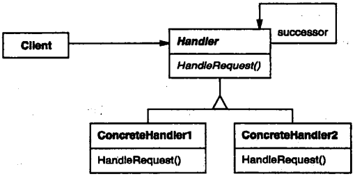

5. 参与者

   - Handler
     1. 顶一个处理请求的接口；
     2. （可选）实现后继链。
   - ConcreteHandler
     1. 处理它所负责的请求；
     2. 可访问它的后继者；
     3. 如果可处理该请求，就处理之；否则将该请求转发给它的后继者。
   - Client
     1. 向链上的具体处理者（ConcreteHandler）对象提交请求。

6. 协作

   - 当客户提交一个请求时，请求沿链传递直至有一个ConcreteHandler对象负责处理它。

7. 效果

   优点：

   - 降低耦合度；
   - 增强了给对象指派职责（Responsibility）的灵活性。

   缺点：

   - 不保证被接受。

8. 实现

9. 代码示例

   ```c++
   typedef int Topic;
   const Topic NO_HELP_TOPIC = -1;
   
   class HelpHandler {
   public:
       HelpHandler(HelpHandler* = 0, Topic = NO_HELP_TOPIC);
       virtual bool HashHelp();
       virtual void SetHandler(HelpHandler*, Topic);
       virtual void HandleHelp();
       
   private:
       HelpHandler* _successor;
       Topic _topic;
   };
   
   HelpHandler::HelpHandler(HelpHandler* h, Topic t) : _successor(h), _topic(t) {}
   
   bool HelpHandler::HasHelp() {
       return _topic != NO_HELP_TOPIC;
   }
   void HelpHandler::HandleHelp() {
       if (_successor != 0) {
           _successor->HandleHelp();
       }
   }
   
   class Widget : public HelpHandler {
   protected:
       Widget(Widget* parent, Topic t = NO_HELP_TOPIC);
       
   private:
       Widget* _parent;
   };
   
   Widget::Widget(Widget* w, Topic t) : HelpHandler(w, t) {
       _parent = w;
   }
   
   class Button : public Widget {
   public:
       Button(Widget* d, Topic t = NO_HELP_TOPIC);
       
       virtual void HandleHelp();
       // Widget operations that Button overrides...
   };
   Button::Button(Widget* h, Topic t) : Widget(h, t) {}
   void Button::HandleHelp() {
       if (HasHelp()) {
           // offer help on the button
       } else {
           HelpHandler::HandleHelp();
       }
   }
   
   class Dialog : public Widget {
   public:
       Dialog(HelpHandler* h, Topic t = NO_HELP_TOPIC);
       virtual void HandleHelp();
       
       // Widget operations that Dialog overrides...
       // ...
   };
   
   Dialog::Dialog(HelpHandler* h, Topic t) : Widget(0) {
       SetHandler(h, t);
   }
   
   void Dialog::HandleHelp() {
       if (HasHelp()) {
           // offer help on the button
       } else {
           HelpHandler::HandleHelp();
       }
   }
   
   class Dialog : public Widget {
   public:
       Dialog(HelpHandler* h, Topic t = NO_HELP_TOPIC);
       virtual void HandleHelp();
       
       // Widget operations that Dialog overrides...
       // ...
   };
   
   Dialog::Dialog(HelpHandler* h, Topic t) : Widget(0) {
       SetHandler(h, t);
   }
   
   void Dialog::HandleHelp() {
       if (HasHelp()) {
           // offer help on the dialog
       } else {
           HelpHandler::HandleHelp();
       }
   }
   
   class Application : public HelpHandler {
   public:
       Application(Topic t) : HelpHandler(0, t) {}
       
       virtual void HandleHelp();
       // application-specific operations...
   };
   
   void Application::HandleHelp() {
       // show a list of help topics
   }
   
   const Topic PRINT_TOPIC = 1;
   const Topic PAPER_ORIENTATION_TOPIC = 2;
   const Topic APPLICATION_TOPIC = 3;
   
   Application* application = new Application(APPLICATION_TOPIC);
   Dialog* dialog = new Dialog(application, PRINT_TOPIC);
   Button* button = new Button(dialog, PAPER_ORIENTATION_TOPIC);
   button->HandleHelp();
   ```

10. 已知应用

11. 相关模式

    职责链常与Composite一起使用。这种情况下，一个构件的父构件可作为它的后继。


## 5.2 COMMAND(命令) - 对象行为型模式

1. 意图

   将一个请求封装为一个，从而使你可用不同的请求对客户进行参数化；对请求排队或记录请求日志，以及支持可撤销的操作。

2. 别名

   动作(Action)，事务(Transaction)

3. 动机

4. 适用性

   - 抽象出待执行的动作以参数化某对象；
   - 在不同的时刻指定，排列和执行请求；
   - 支持取消操作；
   - 支持修改日志；
   - 用构建在原语操作上的高层操作构造一个系统。

5. 结构

   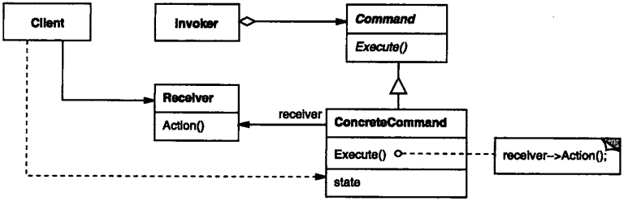

6. 参与者

   - Command
     1. 声明执行操作的接口。
   - ConcreteCommand
     1. 将一个接收者对象绑定于一个动作；
     2. 调用接收者相应的操作，以实现Execute。
   - Client
     1. 创建一个具体命令对象并设定它的接收者。
   - Invoker
     1. 要求该命令执行这个请求。
   - Receiver
     1. 知道如何实施与执行一个请求相关的操作。任何类都可能作为一个接收者。

7. 协作

   - Client创建一个ConcreteCommand对象并指定它的Receiver对象；
   - 某Invoker对象存储该ConcreteCommand对象；
   - 该Invoker通过调用Command对象的Execute操作来提交一个请求。若该命令是可撤销的，ConcreteCommand就在执行Excute操作之前存储当前状态以用于取消该命令；
   - ConcreteCommand对象对调用它的Receiver的一些操作以执行该请求。

8. 效果

   - Command模式将调用操作的对象与知道如何实现该操作的对象解耦；
   - Command是头等的对象；它们可像其它的对象一样被操纵和扩展；
   - 你可将多个命令装配成一个复合命令；
   - 增加新的Command很容易，因为这无需改变已有的类。

9. 实现

10. 代码示例

    ```c++
    class Comkmand {
    public:
        virtual ~Command();
        virtual void Execute() = 0;
        
    protected:
        Command();
    };
    
    class OpenCommand : public Command {
    public:
        OpenCommand(Application*);
        virtual void Execute();
        
    protected:
        virtual const char* AskUser();
        
    private:
        Application* _application;
        char* _response;
    }
    
    OpenCommand::OpenCommand(Application* a) {
        _application = a;
    }
    void OpenCommand::Execute() {
        const char* name = AskUser();
        
        if (name != 0) {
            Document* document = new Document(name);
            _application->Add(document);
            document->Open();
        }
    }
    
    class PasteCommand : public Command {
    public:
        PasteComkmand(Document*);
        virtual void Execute();
        
    private:
        Document* _document;
    };
    PasteCommand::PasteCommand(Document* doc) {
        _document = doc;
    }
    void PasteCommand::Execute() {
        _document->Paste();
    }
    
    template <class Receiver>
    class SimpleCommand : public Command {
    public:
        typedef void (Receiver::* Action)();
        SimpleCommand(Receiver* r, Action a) : _receiver(r), _action(a) {}
        virtual void Execute();
        
    private:
        Action _action;
        Receiver* _receiver;
    };
    template <class Receiver>
    void SimpleCommand<Receiver>::Execute() {
        (_receiver->*_action)();
    }
    
    class MacroCommand : public Command {
    public:
        MacroCommand();
        virtual ~MacroCommand();
        virtual void Add(Command*);
        virtual void Remove(Command*);
        virtual void Execute();
        
    private:
        List<Command*>* _cmds;
    };
    void MacroCommand::Execute() {
        ListIterator<Command*> i(_cmds);
        
        for (i.First(); !i.IsDone(); i.Next()) {
            Command* c = i.CurrentItem();
            c->Execute();
        }
    }
    void MacroCommand::Add(Command* c) {
        _cmds->Append(c);
    }
    void MacroCommand::Remove(Command* c) {
        _cmds->Remove(c);
    }
    
    MyClass* receiver = new MyClass;
    // ...
    Command* pCommand = new SimpleCommand<MyClass>(receiver, &MyClass::Action);
    // ...
    aCommand->Execute();
    ```

11. 已知应用

12. 相关模式

    Composite模式：可被用来实现宏命令。

    Memento模式：可被用来保持某个状态，命令用这一状态来取消它的效果。


## 5.3 INTERPRETER(解释器) - 类行为型模式

1. 意图

   给定一个语言，定义它的文法的一种表示，并定义一个解释器，这个解释器使用该表示来解释语言中的句子。

2. 动机

   如果一个特定类型的问题发生的频率足够高，那么可能就值得将该问题的各个实例表述为一个简单语言中的句子。这样就可以构建一个解释器，该解释器通过解释这些句子来解决该问题。

3. 适用性

   - 该文法简单对于复杂的文法，文法的类层次变得庞大而无法管理。此时语法分析程序生成器这样的工具是更好的选择。它们无需构建抽象语法树即可解释表达式，这样可以节省空间而且还可能节省时间；
   - 效率不是一个关机键问题最高效的解释器通常不是通过直接解释语法分析树实现的，而是首先将它们转换成另一种形式。

4. 结构

   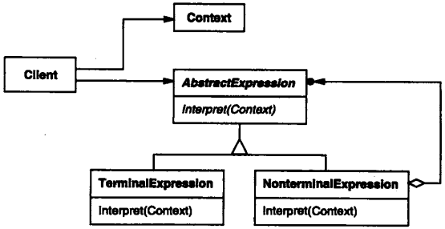

5. 参与者

   - AbstractExpression（抽象表达式）
     1. 声明一个抽象的解释操作，这个接口为抽象语法树中所有的节点所共享。
   - TerminalExpression（终结符表达式）
     1. 实现与文法中的终结符相关联的解释操作；
     2. 一个句子中的每个终结符需要该类的一个实例。
   - NoterminalExpression（非终结符表达式）
     1. 对文法中的每一条规则$R ::= R_1 R_2 ... R_n$都需要一个NonterminalExpression类；
     2. 为从$R_1$到$R_n$的每个符号都维护一个AbstractExpression类型的实例变量；
     3. 为文法中的非终结符实现解释（Interpret）操作。解释（Interpret）一般要递归地调用表示$R_1$到$R_n$的那些对象的解释操作.
   - Context（上下文）
     1. 包含解释器之外的一些全局信息。
   - Client（客户）
     1. 构建（或被给定）表示该文法定义的语言中一个特定的句子的抽象语法树。该抽象语法树由NonterminalExpression和TerminalExpression的实例装配而成；
     2. 调用解释操作。

6. 协作

   - Client构建（或被给定）一个句子，它是NonterminalExpression和TerminalExpression的实例的一个抽象语法树，然后初始化上下文并调用解释操作；
   - 每一非终结符表达式节点定义相应子表达式的解释操作。而各终结符表达式的解释操作构成了递归的基础；
   - 每一节点的解释操作用上下文存储和访问解释器的状态。

7. 效果

   优点：

   - 易于改变和扩展文法；
   - 易于实现文法。

   缺点：

   - 复杂的文法难以维护；
   - 增加了新的解释表达式的方式。

8. 实现

9. 代码示例

   ```c++
   class BooleanExp {
   public:
       BooleanExp();
       virtual ~BooleanExp();
       virtual bool Evaluate(Context&) = 0;
       virtual BooleanExp* Replace(const char*, BooleanExp&) = 0;
       virtual BooleanExp* Copy() const = 0;
   };
   
   class Context {
   public:
       bool Lookup(const char*) const;
       void Assign(VariableExp*, bool);
   };
   
   class VariableExp : public BooleanExp {
   public:
       VariableExp(const char*);
       virtual ~VariableExp();
       virtual bool Evaluate(Context&);
       virtual BooleanExp* Replace(const char*, BooleanExp&);
       virtual BooleanExp* Copy() const;
       
   private:
       char* _name;
   };
   VariableExp::VariableExp(const char* name) {
       _name = strdup(name);
   }
   bool VariableExp::Evaluate(Context& aContext) {
       return aContext.Lookup(_name);
   }
   BooleanExp* VariableExp::Copy() const {
       return new VariableExp(_name);
   }
   BooleanExp* VariableExp::Replace(const char* name, BooleanExp& exp) {
       if (strcmp(name, _name) == 0) {
           return exp.Copy();
       } else {
           return new VariableExp(_name);
       }
   }
   
   class AndExp : public BooleanExp {
   public:
       AndExp(BooleanExp*, BooleanExp*);
       virtual ~AndExp();
       virtual bool Evaluate(Context&);
       virtual BooleanExp* Replace(const char*, BooleanExp&);
       virtual BooleanExp* Copy() const;
       
   private:
       BooleanExp* _operand1;
       BooleanExp* _operand2;
   };
   AndExp::AndExp(BooleanExp* op1, BooleanExp* op2) {
       _operand1 = op1;
       _operand2 = op2;
   }
   bool AndExp::Evaluate(Context& aContext) {
       return _operand1->Evaluate(aContext) &&
                _operand2->Evaluate(aContext);
   }
   BooleanExp* AndExp::Copy() const {
       return new AndExp(_operand1->Copy(), _operand2->Copy());
   }
   BooleanExp* AndExp::Replace(const char* name, BooleanExp& exp) {
       return new AndExp(_operand1->Replace(name, exp), 
                         _operand2->Replace(name, exp));
   }
   
   BooleanExp* expression;
   Context context;
   
   VariableExp* x = new VariableExp("X");
   VariableExp* y = new VariableExp("Y");
   
   expression = new OrExp(
   	new AndExp(new Constant(true), x),
       new AndExp(y, new NotExp(x))
   );
   
   context.Assign(x, false);
   context.Assign(y, true);
   
   bool result = expression->Evaluate(context);
   
   VariableExp* z = new VariableExp("Z");
   NotExp not_z(z);
   
   BooleanExp* replacement = expression->Replace("Y", not_z);
   
   context.Assign(z, true);
   
   result = replacement->Evaluate(context);
   ```

10. 已知应用

11. 相关模式

    Composite模式：抽象语法树是一个复合模式的实例。

    Flyweight模式：说明了如何在抽象语法树中共享终结符。

    Iterator模式：解释器可用一个迭代器遍历该结构。

    Visitor模式：可用来在一个类中维护抽象语法树中的各节点的行为。


## 5.4 ITERATOR(迭代器) - 对象行为型模式

1. 意图

   提供一种方法顺序访问呢一个聚合对象中各个元素，而又不需暴露该对象的内部表示。

2. 别名

   游标（Cursor）

3. 动机

   将对列表的访问和遍历从列表对象中分离出来并放入一个迭代器（iterator）对象中。

4. 适用性

   - 访问一个聚合对象的内容而无需暴露它的内部表示
   - 支持对聚合对象的多种遍历；
   - 为遍历不同的聚合结构提供一个统一的接口（即，支持多态迭代）。

5. 结构

   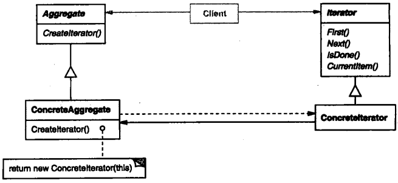

6. 参与者

   - Iterator（迭代器）
     1. 迭代器定义访问和遍历元素的接口。
   - ConcreteIterato（具体迭代器）
     1. 具体迭代器实现迭代器接口；
     2. 对该聚合遍历时跟踪当前位置；
     3. 聚合定义创建相应迭代器对象的接口。
   - ConcreteAggregate（具体聚合）
     1. 具体聚合实现创建相应迭代器的接口，该操作返回ConcreteIterator的一个适当的实例。

7. 协作

   - ConcreteIterator跟踪聚合中的当前对象，并能够计算出待遍历的后继对象。

8. 效果

   - 它支持以不同的方式遍历一个聚合；
   - 迭代器简化了聚合的接口；
   - 在同一个聚合上可以有多个遍历。

9. 实现

10. 代码示例

    ```c++
    template <class Item>
    class List {
    public:
        List(long size = DEFAULT_LIST_CAPACITY);
        long Count() const;
        Item& Get(long index) const;
        // ...
    };
    
    template <class Item>
    class Iterator {
    public:
        virtual void First() = 0;
        virtual void Next() = 0;
        virtual bool IsDone() const = 0;
        virtual Item CurrentItem() const = 0;
        
    protected:
        Iterator();
    };
    
    template<class Item>
    class ListIterator : public Iterator<Item> {
    public:
        ListIterator(const List<Item>* aList);
        virtual void First();
        virtual void Next();
        virtual bool IsDone() const;
        virtual Item CurrentItem() const;
        
    private:
        const List<Item>* _list;
        long _current;
    };
    
    template<class Item>
    ListIterator<Item>::ListIterator(const List<Item>* aList) : 
        _list(aList), _current(0) {}
    
    template<class Item>
    void ListIterator<Item>::First() {
        _current = 0;
    }
    
    template <class Item>
    void ListIterator<Item>::Next() {
        _current++;
    }
    
    template <class Item>
    bool ListIterator<Item>::IsDone() const {
        return _current >= _list->Count();
    }
    
    template <class Item>
    Item ListIterator<Item>::CurrentItem() const {
        if (IsDone()) {
            throw IteratorOutOfBounds;
        }
        return _list->Get(_current);
    }
    
    void PrintEmployee(Iterator<Employee*>& i) {
        for (i.First(); !i.IsDone(); i.Next()) {
            i.CurrentItem()->Print();
        }
    }
    
    List<Employee*>* employees;
    // ...
    ListIterator<Employee*> forward(employees);
    ReverseListIterator<Employee*> backward(employees);
    PrintEmployees(forward);
    PrintEmployees(backward);
    
    SkipList<Employee*>* employees;
    // ...
    
    SkipListIterator<Employee*> iterator(employees);
    PrintEmployees(iterator);
    
    template<class Item>
    class AbstractList {
    public:
        virtual Iterator<Item>* CreateIterator() const = 0;
        // ...
    };
    
    template <class Item>
    Iterator<Item>* List<Item>::CreateIterator() const {
        return new ListIterator<Item>(this);
    }
    
    // we know only that we have an AbstractList
    AbstractList<Employee*>* employees;
    // ...
    
    Iterator<Employee*>* iterator = employees->CreateIterator();
    PrintEmployees(*iterator);
    delete iterator;
    
    template<class Item>
    class IteratorPtr {
    public:
        IteratorPtr(Iterator<Item>* i) : _i(i) {}
        ~IteratorPtr() { delte _i; }
        
        Iterator<Item>* operator->() { return _i; }
        Iterator<Item>& operator*() { return *_i; }
        
    private:
        // disallow copy and assignment to avoid
        // multiple deletions of _i:
        
        IteratorPtr(const IteratorPtr&);
        IteratorPtr& operator=(const IteratorPtr&);
        
    private:
        Iterator<Item>* _i;
    };
    
    AbstractList<Employee*>* employees;
    // ...
    
    IteratorPtr<Employee*> iterator(employees->CreateIterator());
    PrintEmployees(*iterator);
    
    template <class Item>
    class ListTraverser {
    public:
        ListTraverser(List<Item>* aList);
        bool Traverse();
        
    protected:
        virtual bool ProcessItem(const Item&) = 0;
        
    private:
        ListIterator<Item> _iterator;
    };
    
    template <class Item>
    ListTraverser<Item>::ListTraverser(List<Item>* aList) : 
        _iterator(aList) {}
    
    template <class Item>
    bool ListTraverser<Item>::Traverse() {
        bool result = false;
        
        for (_iterator.First(); !_iterator.IsDone(); _iterator.Next()) {
            result = ProcessItem(_iterator.CurrentItem());
            
            if (result == false) {
                break;
            }
        }
        return result;
    }
    
    class PrintNEmployees : public ListTraverser<Employee*> {
    public:
        PrintNEmployees(List<Employee*>* aList, int n) :
            ListTraverser<Employee*>(aList), _total(n), _count(0) {}
        
    protected:
        bool ProcessItem(Employee* const&);
        
    private:
        int _total;
        int _count;
    };
    
    bool PrintNEmployees::ProcessItem(Employee* const& e) {
        _count++;
        e->Print();
        return _count < _total;
    }
    
    List<Employee*>* employees;
    // ...
    
    PrintNEmployees pa(employees, 10);
    pa.Traverse();
    
    ListIterator<Employee*> i(employees);
    int count = 0;
    for (i.First(); !i.IsDone(); i.Next()) {
        count++;
        i.CurrentItem()->Print();
        if (count >= 10) {
            break;
        }
    }
    
    template <class Item>
    class FilteringListTraverser {
    public:
        FilteringListTraverser(List<Item>* aList);
        bool Traverse();
        
    protected:
        virtual bool ProcessItem(const Item&) = 0;
        virtual bool TestItem(const Item&) = 0;
        
    private:
        ListIterator<Item> _iterator;
    };
    
    template <class Item>
    void FilteringListTraverser<Item>::Traverse() {
        bool result = false;
        for (_iterator.First(); !_iterator.IsDone(); _iterator.Next()) {
            if (TestItem(_iterator.CurrentItem())) {
                result = ProcessItem(_iterator.CurrentItem());
                if (result == false) {
                    break;
                }
            }
        }
        return result;
    }
    ```

11. 已知应用

12. 相关模式

    Composite：迭代器常被应用到象复合这样的递归结构上。

    Factory Methond：多态迭代器靠Factory Method来例化适当的迭代器子类。

    Memento：常与迭代器模式一起使用。迭代器可使用一个memento来捕获一个迭代的状态。状态器在其内部存储memento。


## 5.5 MEDIATOR(中介者) - 对象行为型模式

1. 意图

   用一个中介对象来封装一系列的对象交互。中介者使各对象不需要显式地相互引用，从而使其耦合松散，而且可以独立地改变他们之间地交互。

2. 动机

   将一个系统分割成许多对象通常可以增强可复用性，但是对象间相互连接地激增又会降低其可复用性。大量的相互连接使得一个对象似乎不太可能在没有其他对象的支持下工作 -- 系统表现为一个不可分割的整体。而且，对系统的行为进行任何较大的改动都十分困难，因为行为被分布在许多对象中。结果是，你可能不得不定义很多子类以定制系统的行为。

3. 适用性

   - 一组对象以定义良好但是复杂的方式进行通信。产生的相互依赖关系结构混乱且难以理解。
   - 一个对象引用其他很多对象并且直接与这些对象通信，导致难以复用该对象。
   - 想定制一个分布在多个类中的行为，而又不想生成太多的子类。

4. 结构

   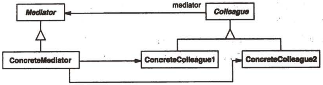

5. 参与者

   - Mediator（中介者）
     1. 中介者定义一个接口用于与各同事（Colleague）对象通信。
   - ConcreteMediator（具体中介者）
     1. 具体中介者通过协调各同时对象实现协作行为；
     2. 了解并维护它的各个同事。
   - Colleague class（同事类）
     1. 每一个同事类都知道它的中介者对象；
     2. 每一个同事对象都需在与其它的同事通信的时候，与它的中介者通信.

6. 协作

   - 同事向一个中介者对象发送和接受请求。中介者在各同事间适当地转发请求以实现协作行为。

7. 效果

   优点：

   - 减少了子类生成；
   - 它将各Colleague解耦；
   - 它简化了对象协议；
   - 它对对象如何协作进行了抽象。

   缺点：

   - 它使控制集中化。

8. 实现

9. 代码示例

   ```c++
   class DialogDirector {
   public:
       virtual ~DialogDirector();
       virtual void ShowDialog();
       virtual void WidgetChanged(Widget*) = 0;
       
   protected:
       DialogDirector();
       virtual void CreateWidgets() = 0;
   };
   
   class Widget {
   public:
       Widget(DialogDirector*);
       virtual void Changed();
       virtual void HandleMouse(MouseEvent& event);
       // ...
       
   private:
       DialogDirector* _director;
   };
   
   void Widget::Changed() {
       _director->WidgetChanged(this);
   }
   
   class ListBox : public Widget {
   public:
       ListBox(DialogDirector*);
       virtual const char* GetSelection();
       virtual void SetL:ist(List<char*>* listItems);
       virtual void HandleMouse(MouseEvent& event);
       // ...
   };
   
   class EntryField : public Widget {
   public:
       EntryField(DialogDirector*);
       virtual void SetText(const char* text);
       virtual const char* GetText();
       virtual void HandleMouse(MouseEvent& event);
       // ...
   };
   
   class Button : public Widget {
   public:
       Button(DialogDirector*);
       virtual void SetText(const char* text);
       virtual void HandleMouse(MouseEvent& event);
       // ...
   };
   void Button::HandleMouse(MouseEvent& event) {
       // ...
       Changed();
   }
   
   class FontDialogDirector : public DialogDirector {
   public:
       FontDialogDirector();
       virtual ~FontDialogDirector();
       virtual void WidgetChanged(Widget*);
       
   protected:
       virtual void CreateWidgets();
       
   private:
       Button* _ok;
       Button* _cancel;
       ListBox* _fontList;
       EntryField* _fontName;
   };
   void FontDialogDirector::CreateWidgets() {
       _ok = new Button(this);
       _cancel = new Button(this);
       _fontList = new ListBox(this);
       _fontName = new EntryField(this);
       // fill the listBox with the available font names
       // assemble the widgets in the dialog
   }
   void FontDialogDirector::WidgetChanged(Widget* theChangedWidget) {
       if (theChangedWidget == _fontList) {
           _fontName->SetText(_fontList->GetSelection());
       } else if (theChangedWidget == _ok) {
           // apply font change and dismiss dialog
           // ...
       } else if (theChangedWidget == _cancel) {
           // dismiss dialog
       }
   }
   ```

10. 已知应用

11. 相关模式

    Facade模式：与中介者地不同之处在于它是对一个对象子系统进行抽象，从而提供了一个更为方便的接口。它地协议是单向的，即Facade对象对这个子系统类提出请求，但反之则不行。相反，Mediator提供了各Colleague对象不支持或不能支持地协作行为，而且协议是多向地。

    Colleague可使用Observer模式与Mediator通信。


## 5.6 MEMENTO(备忘录) -- 对象行为型模式

1. 意图

   在不破坏封装性地前提下，捕获一个对象地内部状态，并在该对象之外保存这个状态。这样以后就可将该对象恢复到原先保存的状态。

2. 别名

   Token

3. 动机

   一个备忘录（memento）是一个对象，它存储另一个对象在某个瞬间地内部状态，而后者称为备忘录的原发器（originator）。当需要设置原发器的检查点时，取消操作机制会向原发器请求一个备忘录。原发器用描述当前状态的信息初始化该备忘录。只有原发器可以向备忘录中存取信息，备忘录对其他的对象”不可见“。

4. 适用性

   - 必须保存一个对象在某一个时刻的（部分）状态，这样以后需要时它才能恢复到先前的状态；
   - 如果一个用接口来让其它对象直接得到这些状态，将会暴露对象的实现细节并破坏对象的封装性。

5. 结构

   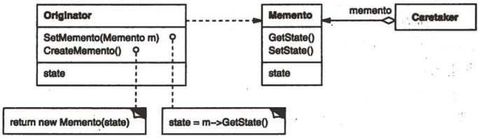

6. 参与者

   - Memento（备忘录）
     1. 备忘录存储原发器对象的内部状态。原发器根据需要决定备忘录存储原发器的哪些内部状态；
     2. 防止原发器以外的其它对象访问备忘录。备忘录实际上有两个接口，管理者（caretaker）只能看到备忘录的窄接口 -- 它只能将备忘录传递给其他对象。相反，原发器能够看到一个宽接口，允许它访问返回到先前状态所需的所有数据。理想的情况是只允许生成本备忘录的那个原发器访问本备忘录的内部状态。
   - Originator（原发器）
     1. 原发器创建一个备忘录，用以记录当前时刻它的内部状态；
     2. 使用备忘录恢复内部状态。
   - Caretaker（负责人）
     1. 负责保存好备忘录；
     2. 不能对备忘录的内容进行操作或检查。

7. 协作

   - 管理器向原发器请求一个备忘录，保留一段时间后，将其送回给原发器，如图所示：

     

   - 备忘录是被动的。只有创建备忘录的原发器会对它的状态进行赋值和检索。

8. 效果

   1. 保护封装边界；
   2. 简化了原发器；
   3. 使用备忘录可能代价很高；
   4. 定义窄接口和宽接口；
   5. 维护备忘录的潜在代价。

9. 实现

10. 代码示例

    ```c++
    class State;
    
    class Originator {
    public:
        Memento* CreateMemento();
        void SetMemento(const Memento*);
        // ...
    private:
        State* _state; // internal data structures
        // ...
    };
    
    class Memento {
    public:
        // narrow public interface
        virtual ~Memento();
    private:
        // private members accessible only to Originator
        friend class Originator;
        Memento();
        void SetState(State*);
        State* GetState();
        // ...
    private:
        State* _state;
        // ...
    };
    
    class Graphic;
    // base class for graphical objects in the graphical editor
    
    class MoveCommand {
    public:
        MoveCommand(Graphic* target, const Point& delta);
        void Execute();
        void Unexecute();
    private:
        ConstraintSolverMemento* _state;
        Point _delta;
        Graphic* _target;
    };
    void MoveCommand::Unexecute() {
        ConstraintSolver* solver = ConstraintSolver::Instance();
        _target->Move(-_delta);
        solver->SetMemento(_state); // restore solver state
        solver->Solve();
    }
    
    class ConstraintSolver {
    public:
        static ConstraintSolver* Instance();
        
        void Solve();
        void AddConstraint(Graphic* startConnection, Graphic* endConnection);
        void RemoveConstraint(Graphic* startConnection, Graphic* endConnection);
        ConstraintSolverMemento* CreateMemeto();
        void SetMemento(ConstraintSolverMemento*);
    private:
        // nontrivial state and operations for enforcing
        // connectivity semantics
    };
    
    class ConstraintSolverMemento {
    public:
        virtual ~ConstraintSolverMemento();
    private:
        friend class ConstraintSolver;
        ConstraintSolverMemento();
        
        // private constraint solver state
    };
    ```

11. 已知应用

12. 相关模式

    Command模式：命令可使用备忘录来为可撤销的操作维护状态；

    Iterator模式：如前所述备忘录可用于迭代。


## 5.7 OBSERVER(观察者) -- 对象行为型模式

1. 意图

   定义对象间的一种一对多的依赖关系，当一个对象的状态发生改变时，所有依赖于它的对象都得到通知并自动更新。

2. 别名

   依赖（Dependents），发布-订阅（Publish-Subscribe）。

3. 动机

   Observer模式中的关键对象是目标（subject）和观察者（oberver）。一个目标可以有任意数目的依赖它的观察者。一旦目标的状态发生改变，所有的观察者都得到通知。作为对这个通知的响应，每个观察者都将查询目标以使其状态与目标的状态同步。

   这种交互也称为`发布-订阅（publish-subscribe）`。目标是通知的发布者。它发出通知时并不需知道谁是它的观察者。可以有任意数目的观察者订阅并接收通知。

4. 适用性

   - 当一个抽象模型有两个方面，其中一个方面依赖于另一个方面。将这二者封装在独立的对象中以使它们可以各自独立的改变和复用；
   - 当对一个对象的改变需要同时改变其它对象，而不知道具体有多少对象有待改变；
   - 当一个对象必须通知其它对象，而它又不能假定其它对象是谁。换言之，你不希望这些对象是紧密耦合的。

5. 结构

   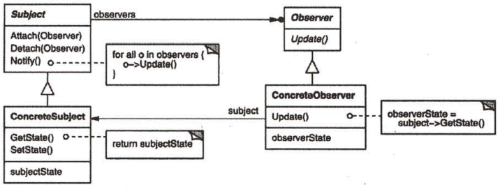

6. 参与者

   - Subject（目标）
     1. 目标知道它的观察者，可以有任意多个观察者观察同一个目标；
     2. 提供注册和删除观察者对象的接口。
   - Observer（观察者）
     1. 为那些在目标发生改变时需获得通知的对象定义一个更新接口。
   - ConcreteSubject（具体目标）
     1. 将有关状态存入各ConcreteObserver对象；
     2. 当它的状态发生改变时，向它的各个观察者发出通知。
   - ConcreteObserver（具体观察者）
     1. 维护一个指向ConcreteSubject对象的引用；
     2. 存储有关状态，这些状态应与目标的状态保持一致；
     3. 实现Observer的更新接口以使自身状态与目标的状态保持一致。

7. 协作

   - 当ConcreteSubject发生任何可能导致其观察者与其本身状态不一致的改变时，它将通知它的各个观察者；
   - 在得到一个具体目标的改变通知后，ConcreteObserver对象可向目标对象查询信息。ConcreteObserver使用这些信息以使它的状态与目标对象的状态一致。

   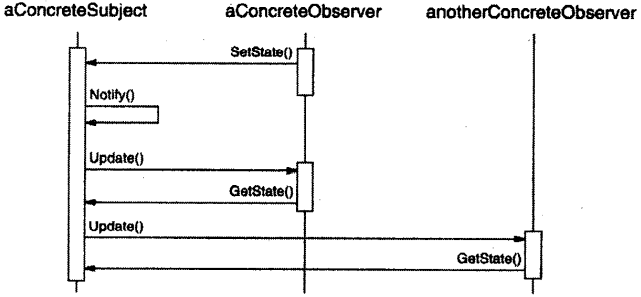

8. 效果

   优点：

   - 目标和观察者间的抽象耦合；
   - 支持广播通信。

   缺点：

   - 意外的更新。

9. 实现

10. 代码示例

    ```c++
    class Subject;
    
    class Observer {
    public:
        virtual ~Observer();
        virtual void Update(Subject* theChangedSubject) = 0;
    protected:
        Observer();
    };
    
    class Subject {
    public:
        virtual ~Subject();
        
        virtual void Attach(Observer*);
        virtual void Detach(Observer*);
        virtual void Notify();
    protected:
        Subject();
    private:
        List<Observer*> *_observers;
    };
    void Subject::Attach(Observer* o) {
        _observers->Append(0);
    }
    void Subject::Detach(Observer* o) {
        _observers->Remove(0);
    }
    void Subject::Notify() {
        ListIterator<Observer*> i(_observers);
        for (i.First(); !i.IsDone(); i.Next()) {
            i.CurrentItem()->Update(this);
        }
    }
    
    class ClockTimer : public Subject {
    public:
        ClockTimer();
        
        virtual int GetHour();
        virtual int GetMinute();
        virtual int GetSecond();
        
        void Tick();
    };
    void ClockTimer::Tick() {
        // update internal time-keeping state
        // ...
        Notify();
    }
    
    class DigitalClock : public Widget, public Observer {
    public:
        DigitalClock(ClockTimer*);
        virtual ~DigitalClock();
        virtual void Update(Subject*);
        // overrides Observer operation
        
        virtual void Draw();
        // overrides Widget operation;
        // defines how to draw the digital clock
    private:
        ClockTimer* _subject;
    };
    DigitalClock::DigitalClock(ClockTimer* s) {
        _subject = s;
        _subject->Attach(this);
    }
    DigitalClock::~DigitalClock() {
        _subject->Detach(this);
    }
    void DigitalClock::Update(Subject* theChangedSubject) {
        if (theChangedSubject == _subject) {
            Draw();
        }
    }
    void DigitalClock::Draw() {
        // get the new values from the subject
        
        int hour = _subject->GetHour();
        int minute = _subject->GetMinute();
        // etc.
        
        // draw the digital clock
    }
    
    class AnalogClock : public Widget, public Observer {
    public:
        AnalogClock(ClockTimer*);
        virtual void Update(Subject*);
        virtual void Draw();
        // ...
    };
    
    ClockTimer* timer = new ClockTimer;
    AnalogClock* analogClock = new AnalogClock(timer);
    DigitalClock* digitalClock = new DigitalClock(timer);
    ```

11. 已知应用

12. 相关模式

    Mediator：通过封装复杂的更新语义，ChangeManager充当目标和观察者之间的中介者；

    Singleton：ChangeManager可使用Singleton模式来保证它是唯一的并且是可全局访问。


## 5.8 STATE(状态) -- 对象行为型模式

1.  意图

   允许一个对象在其内部状态改变时改变它的行为。对象看起来似乎修改了它的类。

2. 别名

   状态对象（Objects for States）

3. 动机

4. 适用性

   下面两种情况可使用State模式：

   - 一个对象的行为取决于它的状态，并且它必须在运行时刻根据状态改变它的行为；
   - 一个操作中含有庞大的多分支的条件语句，且这些分支依赖于该对象的状态；这个状态通常用一个或多个枚举常量表示。

5. 结构

   
   
6. 参与者

   - `Context` 环境
   - `State` 状态
   - `ConcreteState subclasses` 具体状态子类

7. 协作

   - Context 将与状态相关的请求委托给当前的ConcreteState对象处理。
   - Context可将自身作为一个参数传递给处理该请求的状态对象；这使得状态对象在必要时可访问Context。
   - Context是客户使用的主要接口。客户可用状态对象来配置一个Context，一旦一个Context配置完毕，它的客户不再需要直接与状态对象打交道。
   - Context或ConcreteState子类都可以决定哪个状态是另外哪一个的后继者，以及是在何种条件下进行状态转换。
   
8. 效果

   State模式有以下效果：

   1. 它将与特定状态相关的行为局部化，并且将不同状态的行为分割开来。

      State模式将所有与一个特定的状态的状态相关的行为都放入一个对象中，决定状态转移的逻辑**不在**单块的if或switch语句中，而是分布在State子类之间。将每个状态转换和动作封装到一个类中，就把着眼点从执行状态提高到整个对象的状态，这将使代码结构化并使其意图更加清晰。

   2. 它使得状态转换显式化。

   3. State对象可被共享。

9. 实现

   实现State模式要考虑以下方面：

   1. 谁定义状态转换。

   2. 基于表的另一种方法；

      使用表将输入映射到状态转换，对于每一个状态，一张表将每一个可能的输入映射到一个后继状态。

   3. 创建和销毁State对象。

   4. 使用动态继承。

10. 代码示例

   ```cpp
   class TCPOctetStream;
   class TCPState;
   
   class TCPConnection {
   public:
       TCPConnection();
       
       void ActiveOpen();
       void PassiveOpen();
       void Close();
       void Send();
       void Acknowledge();
       void Synchronize();
       
       void ProcessOctet(TCPOctetStream*);
   private:
       friend class TCPState;
       void ChangeState(TCPState*);
   private:
       TCPState* _state;
   };
   
   TCPConnection::TCPConnection() {
       _state = TCPClosed::Instance();
   }
   void TCPConnection::ChangeState(TCPState* s) {
       _state = s;
   }
   void TCPConnection::ActiveOpen() {
       _state->ActiveOpen(this);
   }
   void TCPConnection::PassiveOpen() {
       _state->PassiveOPen(this);
   }
   void TCPConnection::Close() {
       _state->Close(this);
   }
   void TCPConnection::Acknowledge() {
       _state->ActiveOpen(this);
   }
   void TCPConnection::Synchronize() {
       _state->Synchronize(this);
   }
   
   class TCPState {
   public:
       virtual void Transmit(TCPConnection*, TCPOctetStream*);
       virtual void ActiveOpen(TCPConnection*);
       virtual void PassiveOpen(TCPConnection*);
       virtual void Close(TCPConnection*);
       virtual void Synchronize(TCPConnection*);
       virtual void Acknowledge(TCPConnection*);
       virtual void Send(TCPConnection*);
   protected:
       void ChangeState(TCPConnection*, TCPState*);
   };
   
   class TCPEstablished : public TCPState {
   public:
       static TCPState* Instance();
       virtual void Transmit(TCPConnection*, TCPOctetStream*);
       virtual void Close(TCPConnection*);
   };
   
   class TCPListen : public TCPState {
   public:
       static TCPState* Instance();
       virtual void Send(TCPConnection*);
       // ...
   };
   
   class TCPClosed : public TCPState {
   public:
       static TCPState* Instance();
       
       virtual void ActiveOpen(TCPConnection*);
       virtual void PassiveOpen(TCPConnection*);
       // ...
   };
   
   void TCPClosed::ActiveOpen(TCPConnection* t) {
       ChangeState(t, TCPEstablished::Instance());
   }
   
   void TCPClosed::PassiveOpen(TCPConnection* t) {
       ChangeState(t, TCPListten::Instance());
   }
   
   void TCPEstablished::Close(TCPConnection* t) {
       ChangeState(t, TCPListen::Instance());
   }
   
   void TCPEstablished::Transmit(TCPConnection* t, TCPOctetStream* o) {
       t->ProcessOctet(o);
   }
   
   void TCPListen::Send(TCPConnection* t) {
       ChangeState(t, TCPEstablished::Instance());
   }
   ```

11. 已知应用

12. 相关模式

    Singleton。


## 5.9 STRATEGY(策略) -- 对象行为型模式

1. 意图

   定义一系列的算法，把它们一个个封装起来，并且使它们可相互替换。本模式使得算法可独立于使用它的客户而变化。

2. 别名

   政策（Policy）

3. 动机

   - 需要换行功能的客户程序如果直接包含换行算法代码的话将会变得复杂，这使得客户程序庞大并且难以维护，尤其当其需要支持多种换行算法时问题会更加严重；
   - 不同的时候需要不同的算法，我们不想支持我们并不使用的换行算法；
   - 当换行功能是客户程序的一个难以分割的成分时，增加新的换行算法或改变现有算法将十分困难。

4. 适用性

   - 许多相关的类仅仅是行为有异。”策略“提供了一种用多个行为中的一个行为来配置一个类的方法；
   - 需要使用一个算法的不同变体；
   - 算法使用客户不应该知道的数据。可使用策略模式以避免暴露复杂的，与算法相关的数据结构；
   - 一个类定义了多种行为，并且这些行为在这个类的操作中以多个条件语句的形式出现。将相关的条件分支移入它们各自的Strategy类中以代替这些条件语句。

5. 结构

   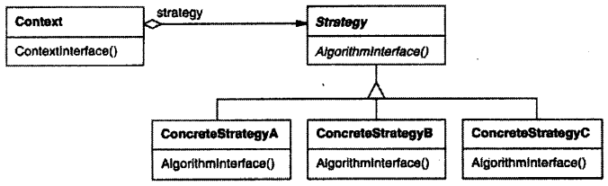

6. 参与者

   - Strategy（策略）
     1. 定义所有支持的算法的公共接口。Context使用这个接口来调用某ConcreteStrategy定义的算法。
   - ConcreteStrategy（具体策略）
     1. 以Strategy接口实现某具体算法。
   - Context（上下文）
     1. 用一个ConcreteStrategy对象来配置；
     2. 维护一个对Strategy对象的引用；
     3. 可定义一个接口来让Stategy访问它的数据。

7. 协作

   - Strategy和Context相互作用以实现选定的算法。当算法被调用时，Context可以将该算法所需要的所有数据都传递给该Stategy。或者，Context可以将自身作为一个参数传递给该Stategy。或者，Context可以将自身作为一个参数传递给Strategy操作。这就让Strategy在需要时可以回调Context。
   - Context将它的客户的请求转发给它的Strategy。客户通常创建并传递一个ConcreteStrategy对象给该Context；这样，客户仅与Context交互。通常有一系列的ConcreteStrategy类可供客户从中选择。

8. 效果

   优点：

   - 相关算法系列；
   - 一个替代继承的方法；
   - 消除了一些条件语句；
   - 实现的选择；
   - 客户必须了解不同的Strategy。

   缺点：

   - Strategy和Context之间的通信开销；
   - 增加了对象的数目。

9. 实现

10. 代码示例

    ```c++
    class Composition {
    public:
        Composition(Compositor*);
        void Repair();
    private:
        Compositor* _compositor;
        Component* _components;
        int _componentCount;
        int _lineWidth;
        int* _lineBreaks;
        int _lineCount;
    };
    
    class Compositor {
    public:
        virtual int Compose(Coord natural[], Coord stretch[], Coord shrink[], 
                            int componentCount, int lineWidth, int breaks[]) = 0;
    protected:
        Compositor();
    };
    void Composition::Repair() {
        Coord* natural;
        Coord* stretchability;
        Coord* shrinkability;
        int componentCount;
        int* breaks;
        
        // prepare the arrays with the desired component sizes
        // ...
        
        // determine where the breaks are:
        int breakCount;
        breakCount = _compositor->Compose(
        	natural, stretchability, shrinkability,
            componentCount, _lineWidth, breaks);
        
        // lay out components according to breaks
        // ...
    }
    
    class SimpleCompositor : public Compositor {
    public:
        SimpleCompositor();
        virtual int Compose(Coord natural[], Coord stretch[], Coord shrink[],
                            int componentCount, int lineWidth, int breaks[]);
        // ...
    };
    
    class TeXCompositor : public Compositor {
    public:
        TeXCompositor();
        virtual int COmpose(Coord natural[], Coord stretch[], Coord shrink[], 
                            int componentCount, int lineWidth, int breaks[]);
        // ...
    };
    
    class ArrayCompositor : public Compositor {
    public:
        ArrayCompositor(int interval);
        virtual int Compose(Coord natural[], Coord stretch[], Coord shrink[],
                            int componentCount, int lineWidth, int breaks[]);
        // ...
    };
    
    Composition* quick = new Composition(new SimpleCompositor);
    Composition* slick = new Composition(new TeXCompositor);
    Composition* iconic = new Composition(new ArrayCompositor(100));
    ```

11. 已知应用

12. 相关模式

    Flyweight：Strategy对象经常是很好的轻量级对象。


## 5.10 TEMPLATE METHOD(模板方法) -- 类行为型模式

1. 意图

   定义一个操作中的算法的骨架，而将一些步骤延迟到子类中。TemplateMethod使得子类可以不改变一个算法的结构即可重定义该算法的某些特定步骤。

2. 动机

   通过使用抽象操作定义了一个算法中的一些步骤，模板方法确定了它们的先后顺序，但它允许Application和Document子类改变这些具体步骤以满足它们各自的需求。

3. 适用性

   - 一次性实现一个算法的不变的部分，并将可变的行为留给子类来实现；
   - 各子类中公共的行为应被提取出来并集中到一个公共父类中以避免代码重复；
   - 控制子类扩展。

4. 结构

5. 参与者

   - AbstractClass（抽象类）
     1. 定义抽象的原语操作（primitive operation），具体的子类将重定义它们以实现一个算法的各步骤；
     2. 实现一个模板方法，定义一个算法的骨架。改模板方法不仅调用原语操作，也调用定义在AbstractClass或其他对象中的操作。
   - ConcreteClass（具体类）
     1. 实现原语操作以完成算法中与特定子类相关的步骤。

6. 协作

   - ConcreteClass靠AbstractClass来实现算法中不变的步骤。

7. 效果

   - 模板方法是一种代码服用的基本技术。
   - 模板方法导致一种反向的控制结构。

8. 实现

9. 代码示例

   ```c++
   void View::Display() {
       SetFocus();
       DoDisplay();
       ResetFocus();
   }
   
   void View::DoDisplay(){}
   
   void MyView::DoDisplay() {
       // render the view's contents
   }
   ```

10. 已知应用

11. 相关模式

    Factory Method模式：常被模板方法调用。

    Strategy模式：模板方法使用继承来改变算法的一部分。Strategy使用委托来改变整个算法。


## 5.11 VISITOR(访问者) -- 对象行为型模式

1. 意图

   表示一个作用于某对象结构中的各元素的操作。它使你可以在不改变各元素的类的前提下定义作用域这些元素的新操作。

2. 动机

3. 适用性

   - 一个对象结构包含很多类对象，它们有不同的接口，而你想对这些对象实施一些依赖于其具体类的操作；
   - 需要对一个对象结构中的对象进行很多不同的并且不相关的操作，而你想避免让这些操作”污染“这些对象的类。Visitor使得你可以将相关的操作集中起来定义在一个类中。当该对象结构被很多应用共享时，用Visitor模式让每个应用仅包含需要用到的操作。
   - 定义对象结构的类很少改变，但经常需要在此结构上定义新的操作。改变对象结构类需要重定义对所有访问者的接口，这可能需要很大的代价。如果对象结构类经常改变，那么可能还是在这些类中定义这些操作较好。

4. 结构

   

5. 参与者

   - Visitor（访问者）
     1. 为该对象结构中ConcreteElement的每一个类声明一个Visit操作。该操作的名字和特征标识了发送Visit请求给该访问者的那个类。这使得访问者可以确定正被访问元素的具体的类。这样访问者就可以通过该元素的特定接口直接访问它。
   - ConcreteVisitor（具体访问者）
     1. 实现每个由Visitor声明的操作。每个操作实现本算法的一部分，而该算法片段乃是对应于结构中对象的类。ConcreteVisitor为该算法提供了上下文并存储它的局部状态。这一状态常常在遍历该结构的过程中累积结果。
   - Element（元素）
     1. 定义一个Accept操作，它以一个访问者为参数。
   - ConcreteElement（具体元素）
     1. 实现Accept操作，该操作以一个访问者为参数。
   - ObjectStructure（对象结构）
     1. 能枚举它的元素；
     2. 可以提供一个高层的接口以允许该访问者访问它的元素；
     3. 可以是一个复合或是一个集合。

6. 协作

   - 一个使用Visitor模式的客户必须创建一个ConcreteVisitor对象，然后遍历该对象结构，并用该访问者访问每一个元素；
   - 当一个元素被访问时，它调用对应于它的类的Visitor操作。如果必要，该元素将自身作为这个操作的一个参数以便该访问者访问它的状态。

   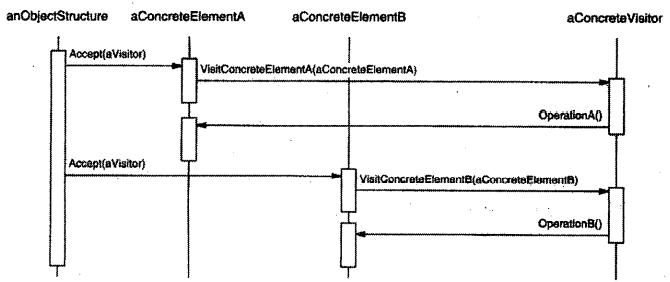

7. 效果

   - 访问者模式使得易于增加新的操作；
   - 访问者集中相关的操作而分离无关的操作；
   - 增加新的ConcreteElement类很困难；
   - 通过类层次进行访问；
   - 累积状态；
   - 破坏封装。

8. 实现

9. 代码示例

   ```c++
   class Equipment {
   public:
       virtual ~Equipment();
       const char* Name() { return _name; }
       virtual Watt Power();
       virtual Currency NetPrice();
       virtual Currency DiscountPrice();
       virtual void Accept(EquipmentVisitor&);
   protected:
       Equipment(const char*);
   private:
       const char* _name;
   };
   
   class EquipmentVisitor {
   public:
       virtual ~EquipmentVisitor();
       virtual void VisitFloppyDisk(FloppyDisk*);
       virtual void VisitCard(Card*);
       virtual void VisitChassis(Chassis*);
       virtual void VIsitBus(Bus*);
       
       // and so on for other concrete subclasses of Equipment
   protected:
       EquipmentVisitor();
   };
   
   class PricingVisitor : public EquipmentVisitor {
   public:
       PricingVisitor();
       Currency& GetTotalPrice();
       virtual void VisitFloppyDisk(FloppyDisk*);
       virtual void VisitCard(Card*);
       virtual void VisitChassis(Chassis*);
       virtual void VisitBus(Bus*);
       // ...
   private:
       Currency _total;
   };
   void PricingVisitor::VisitFloppyDisk(FloppyDisk* e) {
       _total += e->NetPrice();
   }
   void PricingVisitor::VisitChassis(Chassis* e) {
       _total += e->DiscountPrice();
   }
   
   class InventoryVisitor : public EquipmentVisitor {
   public:
       InventoryVisitor();
       Inventory& GetInventory();
       virtual void VisitFloppyDisk(FloppyDisk*);
       virtual void VisitCard(Card*);
       virtual void VisitChassis(Chassis*);
       virtual void VisitBus(Bus*);
       // ...
   private:
       Inventory _inventory;
   };
   
   void InventoryVisitor::VisitFloppyDisk(FloppyDisk* e) {
       _inventory.Accumulate(e);
   }
   
   void InventoryVisitor::VisitChassis(Chassis* e) {
       _inventory.Accumulate(e);
   }
   
   Equipment* component;
   InventoryVisitor visitor;
   component->Accept(visitor);
   cout << "Inventory " << component->Name() << visitor.GetInventory();
   ```

10. 已知应用

11. 相关模式

    Composite：访问者可以用于对一个由Composite模式定义的对象结构进行操作；

    Interpreter：访问者可以用于解释。


## 5.12 行为模式的讨论

### 5.12.1 封装变化

封装变化是很多行为模式的主题。当一个程序的某个方面的特征经常发生改变时，这些模式就定义一个封装这个方面的对象。这样当该程序的其它部分依赖于这个方面时，他们都可以与此对象写作。这些模式通常定义一个抽象类来描述这些封装变化的对象，并且通常该模式依据这个对象来命名。

### 5.12.2 对象作为参数

一些模式引入总是被用作参数的对象。

其他模式定义一些可作为令牌到处传递的对象，这些对象将在稍后被调用。

### 5.12.3 通信应该被封装还是被分布

Mediator和Observer是相互竞争的模式。它们之间的差别是，Observer通过引入Observer和Subject对象来分布通信，而Mediator对象则封装了其它对象间的通信。

### 5.12.4 对发送者和接收者解耦

命令模式使用一个Command对象来定义一个发送者和一个接收者之间的绑定关系，从而支持解耦，如图所示：

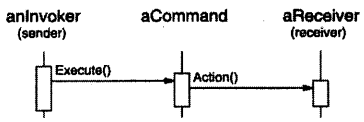

观察者模式通过定义一个接口来通知目标中发生的改变，从而将发送者（目标）与接收者（观察者）解耦，如图所示：

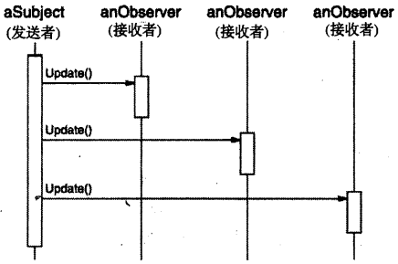

中介者模式让对象通过一个Mediator对象间接的互相引用，从而对它们解耦，如图所示：

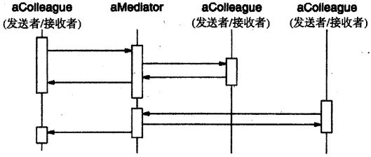

职责链模式通过沿一个潜在接收者链传递请求而将发送者与接收者解耦，如图所示：

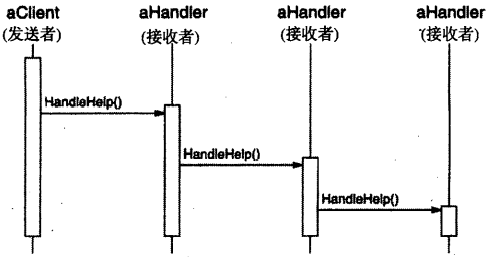

### 5.12.5 总结

各个行为模式之间是相互补充和相互加强的关系。

设计良好的面向对象式系统通常有多个模式镶嵌在其中，但其设计者却未必使用这些术语进行思考。然而，在模式级别而不是在类或对象级别上的进行系统组装可以使我们更方便地获取同等的协同性。