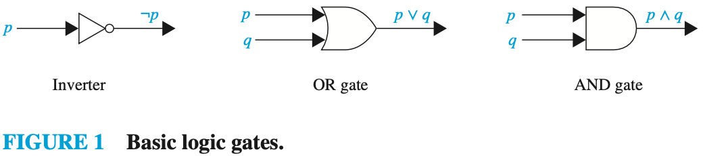
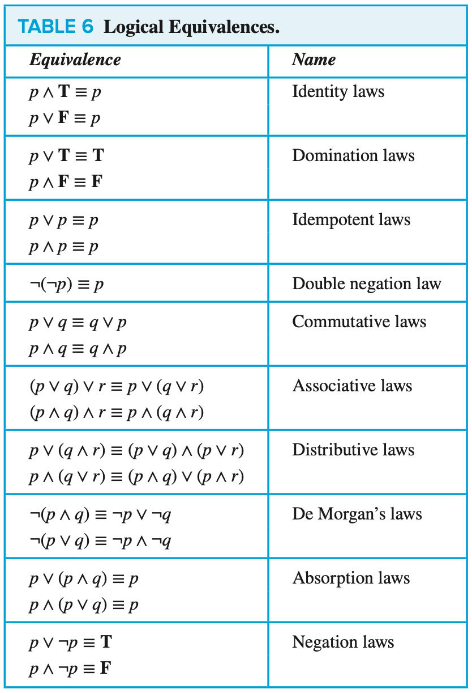
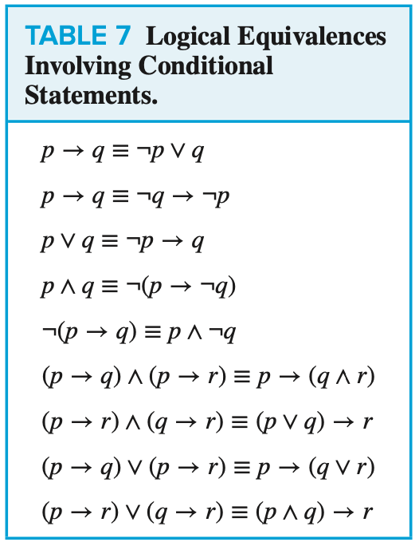
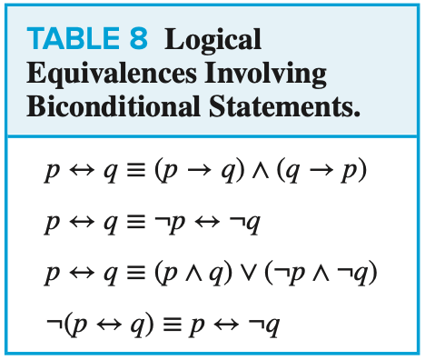
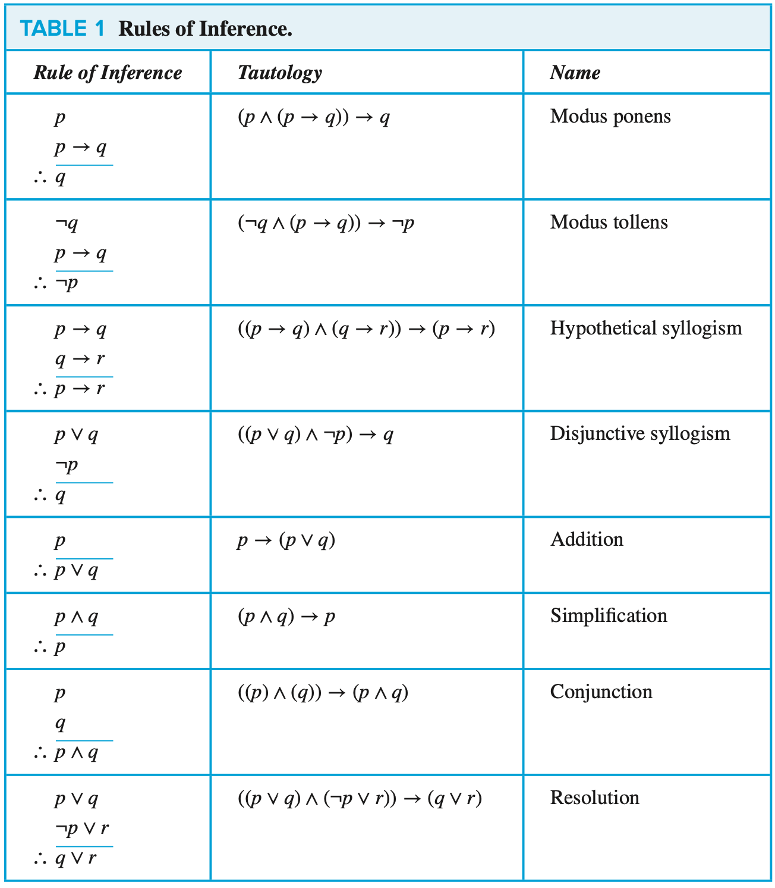
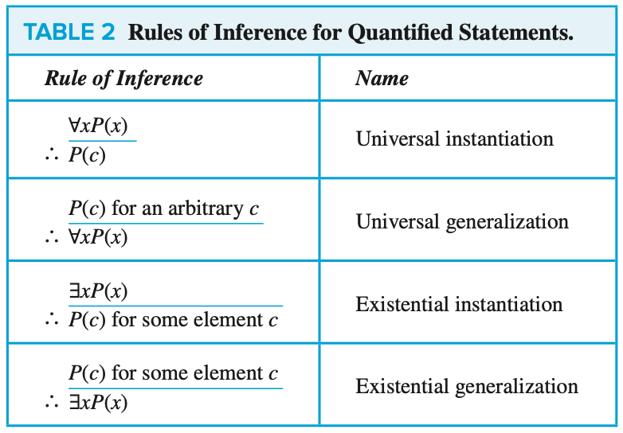

# CHAPTER 1 The Foundations: Logic and Proofs

[TOC]

## Propositional Logic

A `proposition` is a declarative sentence (that is, a sentence that declares a fact) that is either true or false, but not both.

**Definition** Let $p$ be a proposition. The negation of $p$, denoted by $\neg{p}$ (also denoted by $\over{p}$), is the statement "It is not the case that $p$".

> The proposition $\neg p$ is read "not $p$". The truth value of the negation of $p$, $\neg p$, is the opposite of the truth value of $p$.

**Definition** Let $p$ and $q$ be propositions. The `conjunction` of $p$ and $q$, denoted by $p \and q$, is the proposition "p and q". The conjunction $p \and q$ is true when both $p$ and $q$​ are true and is false otherwise.

**Definition** Let $p$ and $q$ be propositions. The `disjunction` of $p$ and $q$, denoted by $p \or q$, is the proposition "p or q". The disjunction $p \or q$ is false when both $p$ and $q$ are false and is true otherwise.

**Definition** Let $p$ and $q$ be propositions. The `exclusive` or of $p$ and $q$, denoted by $p \oplus q$ (or $p$ XOR $q$), is the proposition that is true when exactly one of $p$ and $q$ is true and is false otherwise.

**Definition** Let $p$ and $q$ be propositions. The `conditional statement` $p \rightarrow q$ is the proposition "if p, then q". The conditional statement $p \rightarrow q$ is false when $p$ is true and $q$ is false, and true otherwise. In the conditional statement $p \rightarrow q$, $p$ is called the hypothesis (or `antecedent` or `premise`) and $q$​ is called the `conclusion` (or `consequence`).

The proposition $q \rightarrow p$ is called the **converse** of $p \rightarrow q$. The **contrapositive** of $p \rightarrow q$ is the proposition $\neg q \rightarrow \neg p$. The proposition $\neg p \rightarrow \neg q$ is called the **inverse** of $p \rightarrow q$. We will see that of these three conditional statements formed from $p \rightarrow q$, only the contrapositive always has the same truth value as $p \rightarrow q$​.

**Definition** Let $p$ and $q$ be propositions. The `biconditional statement` $p \leftrightarrow q$ is the proposition "$p$ if and only if $q$". The biconditional statement $p \leftrightarrow q$ is true when $p$ and $q$ have the same truth values, and is false otherwise. Biconditional statements are also called `bi-implications`.

TABLE. Precedence of Logical Operators:

| Operator                           | Precedence |
| ---------------------------------- | ---------- |
| $\neg$                             | 1          |
| $\and$ $\or$                    | 2 3     |
| $\rightarrow$ $\leftrightarrow$ | 4 5     |

A **bit** is a symbol with two possible values, namely, 0(zero) and 1(one).

**Definition** A `bit string` is a sequence of zero more bits. The length of this string is the number of bits in the string.

## Applications of Propositional Logic

System specifications should be **consistent**, that is, they should not contain conflicting requirements that could be used to derive a contradiction. When specifications are not consistent, there would be no way to develop a system that satisfies all specifications.

Puzzles that can be solved using logical reasoning are known as **logic puzzles**.

A **logic circuit** (or **digital circuit**) receives input signals $p_1, p_2, ..., p_n$, each a bit [either 0 (off) or 1 (on)], and produces output signals $s_1, s_2, ..., s_n$, each a bit.

## Propositional Equivalences

**Definition**: A compound proposition that is always true, no matter what the truth values of the propositional variables that occur in it, is called a `tautology`. A compound proposition that is always false is called a `contradiction`. A compound proposition that is neither a tautology nor a contradiction is called a `contingency`.

**Definition**: The compound propositions $p$ and $q$ are called `logically equivalent` if $p \leftrightarrow q$ is a tautology. The notation $p \equiv q$ denotes that $p$ and $q$ are logically equivalent.

| De Morgan's Laws                               |
| ---------------------------------------------- |
| $\neg(p \wedge q) \equiv \neg{p} \vee \neg{q}$ |
| $\neg(p \vee q) \equiv \neg{p} \wedge \neg{q}$ |

$p_2 \vee p_2 \vee ... \vee p_n$ and $p_1 \wedge p_2 ... \wedge p_n$ are well defined whenever $p_1, p_2, ..., p_n$ are propositions.

De Morgan's laws extend to $\neg(p_1 \vee p_2 \vee ... \vee p_n) \equiv (\neg p_1 \wedge \neg p_2 \wedge ... \wedge \neg p_n)$ and $\neg(p_1 \wedge p_2 \wedge ... \wedge p_n) \equiv (\neg p_1 \vee \neg p_2 \vee ... \vee \neg p_n)$. We will sometimes use the notation $\bigvee_{j=1}^{n}p_j$ for $p_1 \vee p_2 \vee ... \vee p_n$ and $\bigwedge_{j=1}^{n}p_j$ for $p_1 \wedge p_2 \wedge ... \wedge p_n$. Using this notation, the extended version of De Morgan's laws can be written concisely as $\neg(\bigvee_{j=1}^{n}p_j) \equiv \bigwedge_{j=1}^{n}\neg p_j$ and $\neg(\bigwedge_{j=1}^{n}\neg p_j) \equiv \bigvee_{j=1}^{n} \neg p_j$.

A compound proposition is **satisfiable** if there is an assignment of truth values to its variables that make it true (that is, when it is a tautology or a contingency). When no such assignments exists, that is, when the compound proposition is false for all assignments of truth values to its variables, the compound proposition is **unsatisfiable**. 

When we find a particular assignment of truth values that makes a compound proposition true, we have shown that it is satisfiable; such an assignment is called a **solution** of this particular satisfiability problem.

## Predicates and Quantifiers

In general, a statement involving the $n$ variables $x_1, x_2, ..., x_n$ can be denoted by $P(x_1, x_2, ..., x_n)$. A statement of the form $P(x_1, x_2, ..., x_n)$ is the value of the **propositional function** $P$ at the $n-tuple(x_1, x_2,..., x_n)$ and $P$ is also called an **n-place predicate** or an **n-ary predicate**.

The statements that describe valid input are known as **preconditions** and the conditions that the output should satify when the program has run are known as **postconditions**.

**Definition**: The `universal quantification` of $P(x)$ is the statement "P(x) for all values of x in the domain." The notation $\forall x P(x)$ denotes the universal quantification of $P(x)$. Here $\forall$ is called the **universal quantifier**. We read $\forall x P(x)$ as "for all $xP(x)$" or "for every $xP(x)$". An element for which $P(x)$ is false is called a **counterexample** to $\forall x P(x)$.

**Definition**: The `existential quantification` of P(x) is the proposition "There exists an element x in the domain such taht P(x)." We use the notation $\exists x P(x)$ for the existential quantification of $P(x)$. Here $\exists$ is called the `existential quantifier`.

When the elements of the domain are $x_1, x_2, ..., x_n$, where $n$ is a positive integer, the universal quantification $\forall x P(x)$ is the same as the conjunction: $P(x_1) \wedge P(x_2) \wedge ... \wedge P(x_n)$, because this conjunction is true if and only if $P(x_1), P(x_2), ..., P(x_n)$ are true.

When a quantifier is ued on the variable $x$, we say that this occurrence of the variable is **bound**. An occurrence of a variable that is not bound by a quantifier or set equal to a particular value is said to be **free**.

**Definition**: Statements involving predicates and quantifiers are `logically equivalent` if and only if they have the same truth value no matter which predicates are substituted into these statements and which domain of discourse is used for the variables in these propositional functions. We use the notation $S \equiv T$ to indicate that two statements $S$ and $T$ involving predicates and quantifiers are logically equivalent.

De Morgan's Laws for Quantifiers:

| Negation              | Equivalent Statement  | When Is Negation True?                     | When False?                               |
| --------------------- | --------------------- | ------------------------------------------ | ----------------------------------------- |
| $\neg \exists x P(x)$ | $\forall x \neg P(x)$ | For every $x, P(x)$ is false.              | There is an $x$ for which $P(x)$ is true. |
| $\neg \forall x P(x)$ | $\exists x \neg P(x)$ | There is an $x$ for which $P(x)$ is false. | $P(x)$ is true for every $x$.             |

Quantifications of Two Variables:

| Statement                                                    | When True?                                                 | When False?                                                 |
| ------------------------------------------------------------ | ---------------------------------------------------------- | ----------------------------------------------------------- |
| $\forall x \forall y P(x,y)$ $\forall y \forall x P(x, y)$ | $P(x, y)$ is true for every pair $x,y$.                    | There is a pair $x,y$ for which $P(x, y)$ is false.         |
| $\forall x \exists y P(x,y)$                                 | For every $x$ there is a $y$ for which $P(x, y)$ is true.  | There is an $x$ such that $P(x, y)$ is false for every $y$. |
| $\exists x \forall y P(x, y)$                                | There is an $x$ for which $P(x, y)$ is true for every $y$. | For every $x$ there is a $y$ for which $P(x, y)$ is false.  |
| $\exists x \exists y P(x, y)$ $\exists y \exists x P(x, y)$ | There is a pair $x, y$ for which $P(x, y)$ is true.        | $P(x, y)$ is false for every pair $x, y$.                   |

## Rules of Inference

By an **argument**, we mean a sequence of statements that end with a conclusion. By **valid**, we mean that the conclusion, or final statement of the argument, must follow from the truth of the preceding statements, or **premises**, of the argument.

**Definition**: An `argument` in propositional logic is a sequence of propositions. All but the final proposition in the argument are called `premises,` and the final proposition is called the `conclusion`. An argument is `valid` if the truth of all its premises implies that the conclusion is true. An `argument form` in propositional logic is a sequence of compound propositions involving propositional variables. An argument form is `valid` if no matter which particular propositions are substituted for the propositional variables in its premises, the conclusion is true if the premises are all true.

The tautology $(p \wedge (p \rightarrow q)) \rightarrow q$ is the basis of the rule of inference called **modus ponens**, or the **law of detachment**. This tautology leads to the following valid argument form: 
$$
p \\
p \rightarrow q \\
\therefore q
$$

**resolution** rule of inference is based on the tautology: $((p \vee q) \wedge (\neg p \vee r)) \rightarrow (q \vee r)$. The final disjunction in the resolution rule, $q \vee r$, is called the **resolvent**. When we let $q = r$ in this tautology, we obtain $(p \vee q) \wedge (\neg p \vee q) \rightarrow q$. Furthermore, when we let $r = F$, we obtain $(p \vee q) \wedge (\neg p) \rightarrow q$ (because $q \vee F \equiv q$), which is the tautology on which the rule of disjunctive syllogism is based.

**Universal instantiation** is the rule of inference used to conclude that $P(c)$ is true, where $c$ is a particular member of the domain, given the premise $\forall x P(x)$.

**Universal generalization** is the rule of inference that states that $\forall x P(x)$ is true, given the premise that $P(c)$ is true for all elements $c$ in the domain.

**Existential instantiation** is the rule that allows us to conclude that there is an element $c$ in the domain for which $P(c)$ is true if we know that $\exists x P(x)$ is true.

**Existential generalization** is the rule of inference that is used to conclude that $\exists x P(x)$ is true when a particular element $c$ with $P(c)$ true is known.

We describe universal modus ponens as follows:
$$
\forall x (P(x) \rightarrow Q(x)) \\
P(a), \text{where a is a particular element in the domain} \\
\therefore Q(a)
$$

## Introduction to Proofs

Formally, a **theorem** is a statement that can be shown to be true.

A less important theorem that is helpful in the proof of other results is called a **lemma** (plural `lemmas` or `lemmata`).

A **corollary** is a theorem that can be established directly from a theorem that has been proved.

A **conjecture** is a statement that is being proposed to be a true statement.

A **direct proof** of a conditional statement $p \rightarrow q$ is constructed when the first step is the assumption that $p$ is true; subsequent steps are constructed using rules of inference, with the final step showing that $q$ must also be true. A direct proof shows that a conditional statement $p \rightarrow q$ is true by showing that if $p$ is true, then $q$ must also be true, so that the combination $p$ true and $q$ false never occurs.

**Definition**: The integer $n$ is `even` if there exists an integer $k$ such that $n = 2k$, and $n$ is `odd` if there exists an integer $k$ such that $n = 2k + 1$. (Note that every integer is either even or odd, and no integer is both even and odd.) Two integers have the `same parity` when both are even or both are odd; they have `opposite parity` when one is even and the other is odd.

Proofs of theorems of this type that are not direct proofs, that is, that do not start with the premises and end with the conclusion, are called **indirect proofs**.

Proofs by contraposition make use of the fact that the conditional statement $p \rightarrow q$ is equivalent to its contrapositive, $\neg q \rightarrow \neg p$.

**VACUOUS AND TRIVIAL PROOFS** We can quickly prove that a conditional statement $p \rightarrow q$ is true when we know that $p$ is false, because $p \rightarrow q$ must be true when $p$ is false. Consequently, if we can show that $p$ is false, then we have a proof, called a **vacuous proof**, of the conditional statement $p \rightarrow q$.

**Definition**: The real number $r$ is `rational` if there exist integers $p$ and $q$ with $q \neq 0$ such that $r = p / q$. A real number that is not rational is called `irrational`.

Because the statement $r \wedge \neg r$ is a contradiction whenever $r$ is a proposition, we can prove that $p$ is true if we can show that $\neg p \rightarrow (r \wedge \neg r)$ is true for some proposition $r$. Proofs of this type are called **proofs by contradiction**.

**PROOFS OF EQUIVALENCE** To prove a theorem that is a biconditional statement, that is, a statement of the form $p \leftrightarrow q$, we show that $p \rightarrow q$ and $q \rightarrow p$ are both true. The validity of this approach is based on the tautology $(p \leftrightarrow q) \leftrightarrow (p \rightarrow q) \wedge (q \rightarrow p)$.

To prove a conditional statement of the form $(p_1 \vee p_2 \vee ... \vee p_n) \rightarrow q$ the tautology $[(p_1 \vee p_2 \vee ... \vee p_n) \rightarrow q] \leftrightarrow [(p_1 \rightarrow q) \wedge (p_2 \rightarrow q) \wedge ... \wedge (p_n \rightarrow q)]$ can be used as a rule of inference. This shows that the original conditional statement with a hypothesis made up of a disjunction of the propositions $p_1, p_2, ..., p_n$ can be proved by providing each of the $n$ conditional statements $p_i \rightarrow q, i = 1, 2, ..., n$, individually. Such an argument is called a **proof by cases**.

**EXHAUSTIVE PROOF** Some theorems can be proved by examining a relatively small number of examples. Such proofs are called **exhaustive proofs**, or **proofs by exhaustion** because these proofs proceed by exhausting all possibilities.

The two parts of a **uniqueness proof** are:

- Existence: We show that an element $x$ with the desired property exists.
- Uniqueness: We show that if $x$ and $y$ both have the desired property, then $x = y$.

**THEOREM**: FERMAT'S LAST THEOREM The equation $x^n + y^n = z^n$ has no solutions in integers x, y, and z with $xyz \neq 0$ whenever $n$ is an integer with $n > 2$.

