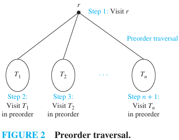
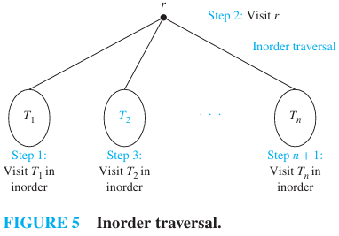

# CHAPTER 11 Trees

[TOC]

## Introduction to Trees

**Definition** A `tree` is a connected undirected graph with no simple circuits.

**THEOREM** An undirected graph is a tree if and only if there is a unique simple path between any two of its vertices.

**Definition** A `rooted tree` is a tree in which one vertex has been designated as the root and every edge is directed away from the root.

**Definition** A rooted tree is called an `m-ary tree` if every internal vertex has no more than `m` children. The tree is called a `full m-ary tree` if every internal vertex has exactly `m` children. An `m`-ary tree with `m = 2` is called a `binary tree`.

**THEOREM** A tree with $n$ vertices has $n - 1$ edges.

**THEOREM** A full $m$-ary tree with $i$ internal vertices contains $n = mi + 1$ vertices.

**THEOREM**: A full $m$-ary tree with:

- $n$ vertices has $i = (n - 1)/m$ internal vertices and $l = [(m - 1)n + 1]/m$ leaves.
- $i$ internal vertices has $n = mi + 1$ vertices and $l = (m - 1)i + 1$ leaves.
- $l$ leaves has $n = (ml - 1)/(m - 1)$ vertices and $i = (l - 1)/(m - 1)$ internal vertices.

**THEOREM** There are at most $m^k$ leaves in an $m$-ary tree of height $h$.

## Applications of Trees

**THEOREM** A sorting algorithm based on binary comparisons requires at least $\lceil \log_2 n! \rceil$ comparisons.

**COROLLARY** The number of comparisons used by a sorting algorithm to sort $n$ elements based on binary comparisons is $\Omega(n \log n)$.

**THEOREM** The average number of comparisons used by a sorting algorithm to sort $n$ elements based on binary comparisons is $\Omega(n \log n)$.

**Definition** The `value of a vertex in a game tree` is defined recursively as:

- the value of a leaf is the payoff to the first player player when the game terminates in the position represented by this leaf.
- the value of an internal vertex at an even level is the maximum of the values of its children, and the value of an internal vertex at an odd level is the minimum of the values of its children.

**THEOREM** The value of a vertex of a game tree tells us the payoff to the first player if both players follow the minmax strategy and play starts from the position represented by this vertex.

## Tree Traversal

**Definition** Let $T$ be an ordered rooted tree with root $r$. If $T$ consists only of $r$, then $r$ is the `preorder traversal` of $T$. Otherwise, suppose that $T_1, T_2, ..., T_n$ are the subtrees at $r$ from left to right in $T$. The `preorder traversal` begins by visiting $r$. It continues by traversing $T_1$ in preorder, then $T_2$ in preorder, and so on, until $T_n$ is traversed in preorder.

**Definition** Let $T$ be an ordered rooted tree with root $r$. If $T$ consists only of $r$, then $r$ is the `inorder traversal` of $T$. Otherwise, suppose that $T_1, T_2, ..., T_n$ are the subtrees at $r$ from left to right. The `inorder traversal` begins by traversing $T_1$ in inorder, then visiting $r$. It continues by traversing $T_2$ in inorder, then $T_3$ in inorder, ..., and finally $T_n$ in inorder.

**Definition** Let $T$ be an ordered rooted tree with root $r$. If $T$ consists only of $r$, then $r$ is the `postorder traversal` of $T$. Otherwise, suppose that $T_1, T_2, ..., T_n$ are the subtrees at $r$ from left to right. The `postorder traversal` begins by traversing $T_1$ in postorder, then $T_2$ in postorder, ..., then $T_n$ in postorder, and ends by visiting $r$.

## Spanning Trees

**Definition** Let $G$ be a simple graph. A `spanning tree` of $G$ is a subgraph of $G$ that is a tree containing every vertex of $G$.

**THEOREM** A simple graph is connected if and only if it has a spanning tree.

## Minimum Spanning Trees

**Definition** A `minimum spanning tree` in a connected weighted graph is a spanning tree that has the smallest possible sum of weights of its edges.

## Key Terms and Results

### TERMS

- **Ancestor of a vertex $v$ in a rooted tree**: any vertex on the path from the root to $v$​​.
- **Balanced tree**: a tree in which every leaf is at level $h$ or $h - 1$, where $h$ is the height of the tree.
- **Binary search tree**: a binary tree in which the vertices are labeled with items so that a label of a vertex is greater than the labels of all vertices in the left subtree of this vertex and is less than the labels of all vertices in the right subtree of this vertex.
- **Binary tree**: an $m$-ary tree with $m = 2$(each child may be designated as a left or a right child of its parent).
- **Child of a vertex $v$ in a rooted tree**: any vertex with $v$​​ as its parent.
- **Decision tree**: a rooted tree where each vertex represents a possible outcome of a decision and the leaves represent the possible solutions of a problem.
- **Descendant of a vertex $v$ in a rooted tree**: any vertex that has $v$ as an ancestor.
- **Forest**: an undirected graph with no simple circuits.
- **Full $m$-ary tree**: a tree with the property that every internal vertex has exactly $m$​ children.
- **Game tree**: a rooted tree where vertices represent the possible positions of a game as it progresses and edges represent legal moves between these positions.
- **Height of a tree**: the largest level of the vertices of a tree.
- **Infix notation**: the form of an expression (including a full set of parentheses) obtained from an inorder traversal of the binary tree representing this expression.
- **Inorder traversal**: a listing of the vertices of an ordered rooted tree defined recursively--the first subtree is listed, followed by the root, followed by the other subtrees in the order they occur from left to right.
- **Internal vertex**: a vertex that has children.
- **Leaf**: a vertex with no children.
- **Level of a vertex**: the legth of the path from the root to this vertex.
- **$m$-ary tree**: a tree with the property that every internal vertex has no more than $m$​​ children.
- **Minmax strategy**: the strategy where the first player and second player move to positions represented by a child with maximum and minimum value, respectively.
- **Minimum spanning tree**: a spanning tree with smallest possible sum of weights of its edges.
- **Ordered tree**: a tree in which the children of each internal vertex are linearly ordered.
- **Parent of $v$ in a rooted tree**: the vertex $u$ such that $(u, v)$​​​ is a edge of the rooted tree.
- **Postorder traversal**: a listing of the vertices of an ordered rooted tree defined recursively--the subtrees are listed in the order they occur from left to right, followed by the root.
- **Prefix code**: a code that has the property that the code of a character is never a prefix of the code of another character.
- **Prefix (or Polish) notation**: the form of an expression obtained from a preorder traversal of the tree representing this expression.
- **Postfix (or reverse Polish) notation**: the form of an expression obtained from a postorder traversal of the tree representing this expression.
- **Preorder traversal**: a listing of the vertices of an ordered rooted tree defined recursively--the root is listed, followed by the first subtree, followed by the other in the order they occur from left to right.
- **Rooted tree**: a directed graph with a specified vertex, called the root, such that there is a unique path to every other vertex from this root.
- **Sibling of a vertex $v$ in a rooted tree**: a vertex with the same parent as $v$​.
- **Spanning tree**: a tree containing all vertices of a graph.
- **Subtree**: a subgraph of a tree that is also a tree.
- **Tree**: a connected undirected graph with no simple circuits.
- **Tree traversal**: a listing of the vertices of a tree.
- **Value of a vertex in a game tree**: for a leaf, the payoff to the first player when the game terminates in the position represented by this leaf; for an internal vertex, the maximum or minimum of the values of its children, for an internal vertex at an even or odd level, respectively.