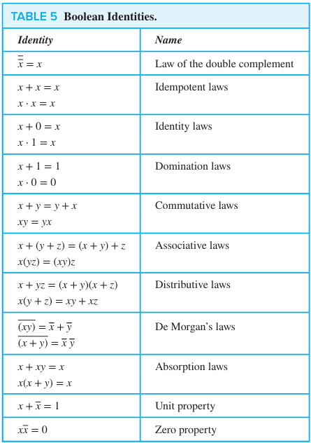
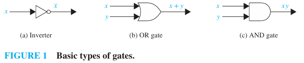

# CHAPTER 12 Boolean Algebra

[TOC]

## Boolean Functions

Let $B = \{0, 1\}$. Then $B^n = \{(x_1, x_2, ..., x_n) | x_i \in B\ for\ 1 \leq i \leq n \}$ is the set of all possible $n$-tuples of 0s and 1s. The variable $x$ is called a **Boolean variable** if it assumes values only from $B$, that is, if its only possible values are 0 and 1. A function from $B^n$ to $B$ is called a **Boolean function of degree n**.

Boolean functions $F$ and $G$ of $n$ variables are equal if and only if $F(b_1, b_2, ..., b_n) = G(b_1, b_2, ..., b_n)$ whenever $b_1, b_2, ..., b_n$ belong to $B$. Two different Boolean expressions that represent the same function are called **equivalent**. For instance, the Boolean expressions $xy$, $xy + 0$, and $xy \cdot 1$ are equivalent. The **complement** of the Boolean function $F$ is the function $\over{F}$, where $\overline{F}(x_1, ..., x_n) = \overline{F(s_1, ..., x_n)}$. Let $F$ and $G$ be Boolean functions of degree $n$. The **Boolean sum** $F + G$ and the **Boolean product** $FG$ are defined by:
$$
(F + G)(x_1, ..., x_n) = F(x_1, ..., x_n) + G(x_1, ..., x_n), \\
(FG)(x_1, ..., x_n) = F(x_1, ..., x_n)G(x_1, ..., x_n).
$$

**Definition** A `Boolean algebra` is a set $B$ with two binary operations $\vee$ and $\wedge$, elements 0 and 1, and a unary operation $\over$ such that these properties hold for all $x$, $y$ and $z$ in $B$:

## Representing Boolean Functions

**Definition** A `literal` is a Boolean variable or its complement. A `minterm` of the Boolean variables $x_1, x_2, ..., x_n$ is a Boolean product $y_1 y_2 ... y_n$, where $y_i = x_i$ or $y_i = \overline{x_i}$. Hence, a minterm is a product of $n$ literals, with one literal for each variable.

## Logic Gates

## Key Terms and Results

### TERMS

- **AND gate**: a device that accepts the values of two or more Boolean variables as input and produces their Boolean product as output.
- **Boolean algebra**: a set $B$ with two binary operations $\vee$ and $\wedge$, elements 0 and 1, and a complementation operator $\overline{}$ that satisfies the identity, complement, associative, commutative, and distributive laws.
- **Boolean expressions**: the expressions obtained recursively by specifying that 0, 1, $x_1$, ..., $x_n$ are Boolean expressions and $\overline{E_1}$, $E_1 + E_2$, and $(E_1 E_2)$ are Boolean expressions if $E_1$ and $E_2$​ are.
- **Boolean function of degree $n$**: a function from $B^n$ to $B$ where $B = \{0, 1\}$.
- **Boolean variable**: a variable that assumes only the values 0 and 1.
- **Don't care condition**: a combination of input values for a circuit that is not possible or never occurs.
- **Dual of a boolean expression**: the expression obtained by interchanging $+$ signs and $\cdot$ signs and interchanging $0s$ and $1s$.
- **Essential prime implicant of a Boolean function**: a prime implicant of the Boolean function that must be included in a minimization of this function.
- **Full adder**: a circuit that adds two bits and a carry, producing a sum bit and a carry bit.
- **Functionally complete**: a set of Boolean operators is called functionally complete if every Boolean function can be represented using these operators.
- **Half adder**: a circuit that adds two bits, producing a sum bit and a carry bit.
- **Implicant of a Boolean function**: a product of literals with the property that if this product has the value 1, then the value of this Boolean function is 1.
- **Inverter**: a device that accepts the value of a Boolean variable as input and produces the complement of the input.
- **K-map for $n$ variables**: a rectangle divided into $2^n$ cells where each cell represents a minterm in the variables.
- **Literal of the Boolean variable $x$**: either $x$ or $\overline{x}$.
- **Minimization of a Boolean function**: representing a Boolean function as the sum of the fewest products of literals such that these products contain the fewest literals possible among all sums of products that represent this Boolean function.
- **Minterm of $x_1, x_2, ..., x_n$**: a Boolean product $y_1 y_2 \cdots y_n$, where each $y_i$ is either $x_i$ or $\overline{x_i}$.
- **OR gate**: a device that accepts the values of two or more Boolean variables as input and produces their Boolean sum as output.
- **Prime implicant of a Boolean function**: a product of literals that is an implicant of the Boolean function and no product obtained by deleting a literal is also an implicant of this function.
- **Sum-of-products expansion** (or disjunctive normal form): the representation of a Boolean function as a disjunction of minterms.
- **$\overline{x}$(complement of $x$)**: an expression with the value 1 when $x$ has the value 0 and the value 0 when $x$ has the value 1.
- **$x \cdot y$ (or $xy$) (Boolean product or conjunction of $x$ and $y$)**: an expression with the value 1 when both $x$ and $y$ have the value 1 and the value 0 otherwise.
- **$x + y$(Boolean sum or disjunction of $x$ and $y$)**: an expression with the value 1 when either $x$ or $y$, or both, has the value 1, and 0 otherwise.
- **$x | y (\text{or x NAND y})$**: the expression that has the value 0 when both $x$ and $y$ have the value 1 and the value 1 otherwise.
- **$x \downarrow y (\text{or x NOR y})$**: the expression that has the value 0 when either $x$ or $y$ or both have the value 1 and the value 0 otherwise.

### RESULTS

The identities for Boolean algebra.

An identity between Boolean functions represented by Boolean expressions remains valid when the duals of both sides of the identity are taken.

Every Boolean function can  be represented by a sum-of-products expansion.

Each of the sets $\{+, \overline{}\}$ and $\{\cdot, \overline{}\}$ is functionally complete.

Each of the sets $\{\downarrow\}$ and $\{|\}$ is functionally complete.

The use of $K$-maps to minimize Boolean expressions.

The Quine-McCluskey method for minimizing Boolean expressions.
