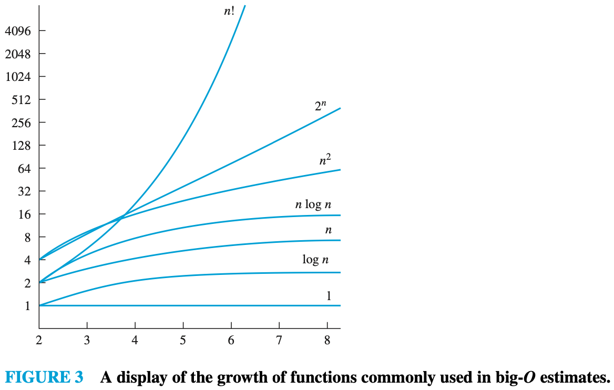

# CHAPTER 3 Algorithms

[TOC]

## Algorithms

**Definition**: An `algorithm` is a finite sequence of precise instructions for performing a computation or for solving a problem.

**PROPERTIES OF ALGORITHMS**

- `Input`. An algorithm has input values from a specified set.
- `Output`. From each set of input values an algorithm produces output values from a specified set. The output values are the solution to the problem.
- `Definiteness`. The steps of an algorithm must be defined precisely.
- `Correctness`. An algorithm should produce the correct output values for each set of input values.
- `Finiteness`. An algorithm should produce the desired output after a finite (but perhaps large) number of steps for any input in the set.
- `Effectiveness`. It must be possible to perform each step of an algorithm exactly and in a finite amount of time.
- `Generality`. The procedure should be applicable for all problems of the desired form, not just for a particular set of input values.

**THE LINEAR SEARCH**. The linear search algorithm begins by comparing $x$ and $a_1$. When $x = a_1$, the solution is the location of $a_1$, namely, $1$. When $x \neq a_1$, compare $x$ with $a_2$. If $x = a_2$, the solution is the location of $a_2$, namely, $2$. When $x \neq a_2$, compare $x$ with $a_3$. Continue this process, comparing $x$ successively with each term of the list until a match is found, where the solution is the location of that term, unless no match occurs.

**THE BINARY SEARCH**. The binary search algorithm proceeds by comparing the element to be located to the middle term of the list. The list is then split into two smaller sublists of the same size, or where one of these smaller lists has one fewer term than the other. The search continues by restricting the search to the appropriate sublist based on the comparison of the element to be located and the middle term.

**Sorting** is putting elements into a list.

**THE BUBBLE SORT**. The bubble sort puts a list into increasing order by successively comparing adjacent elements, interchanging them if they are in the wrong order.

**THE INSERTION SORT**. In the $j$th step of the insertion sort, the $j$th element of the list is inserted into the correct position in the list of the previously sorted $j - 1$ elements. To insert the $j$the element in the list, a linear search technique is used; the $j$th element is successively compared with the already sorted $j - 1$ elements at the start of the list until the first element that is not less than this element is found or until it has been compared with all $j - 1$ elements; the $j$th element is inserted in the correct position so that the first $j$ elements are sorted. The algorithm continues until the last element is placed in the correct position relative to the already sorted list of the first $n - 1$ elements.

Finding where a pattern occurs in a text string is called **string matching**.

Algorithms that make what seems to be the "best" choice at each step are called **greedy algorithms**.

**Halting problem**. It asks whether there is a procedure that does this: It takes as input a computer program and input to the program and determines whether the program will eventually stop when run with this input.

## The Growth of Functions

**Definition**: Let $f$ and $g$ be functions from the set of integers or the set of real numbers to the set of real numbers. We say that $f(x)$ is $O(g(x))$ if there are constants $C$ and $k$ such that $|f(x)| \leq C|g(x)|$ whenever $x > k$. [This is read as "$f(x)$ is big-oh of $g(x)$."]

**THEOREM**: Let $f(x) = a_n x^n + a_{n-1}x^{n-1} + \cdots + a_1 x + a_0$, where $a_0, a_1, ..., a_{n - 1}, a_n$ are real numbers. Then $f(x)$ is $O(x^n)$.

**THEOREM**: Suppose that $f_1(x)$ is $O(g_1(x))$ and that $f_2(x)$ is $O(g_2(x))$. Then $(f_1 + f_2)(x)$ is $O(g(x))$, where $g(x) = max(|g_1(x)|, |g_2(x)|)$ for all $x$.

**COROLLARY**: Suppose that $f_1(x)$ and $f_2(x)$ are both $O(g(x))$. Then $(f_1 + f_2)(x)$ is $O(g(x))$.

**THEOREM** Suppose that $f_1(x)$ is $O(g_1(x))$ and $f_2(x)$ is $O(g_2(x))$. Then $(f_1 f_2)(x)$ is $O(g_1(x) g_2(x))$.

**Definition** Let $f$ and $g$ be functions from the set of integers or the set of real numbers to the set of real numbers. We say that $f(x)$ is $\Omega(g(x))$ if there are constants $C$ and $k$ with $C$ positive such that $|f(x)| \geq C|g(x)|$ whenever $x > k$. [This is read as "$f(x)$ is big-Omega of $g(x)$."]

**Definition** Let $f$ and $g$ be functions from the set of integers or the set of real numbers to the set of real numbers. We say that $f(x)$ is $\Theta(g(x))$ if $f(x)$ is $O(g(x))$ and $f(x)$ is $\Omega(g(x))$. When $f(x)$ is $\Omega(g(x))$, we say that $f$ is big-Theta of $g(x)$, that $f(x)$ is of `order` $g(x)$, and that $f(x)$ and $g(x)$ are of the `same order`.

**THEOREM** Let $f(x) = a_n x^n + a_{n-1}x^{n-1} + ... + a_1 x + a_0$, where $a_0, a_1, ..., a_n$ are real numbers with $a_n \neq 0$. Then $f(x)$ is of order $x^n$.

**WORST-CASE COMPLEXITY** By the worst-case performance of an algorithm, we mean the largest number of operations needed to solve the given problem using this algorithm on input of specified size.

**AVERAGE-CASE COMPLEXITY** The average number of operations used to solve the problem over all possible inputs of a given size is found in this type of analysis.

| Commonly Used Terminology for the Complexity of Algorithms |                         |
| ---------------------------------------------------------- | ----------------------- |
| Complexity                                                 | Terminology             |
| $\Theta(1)$                                                | Constant complexity     |
| $\Theta(log\ n)$                                           | Logarithmic complexity  |
| $\Theta(n)$                                                | Linear complexity       |
| $\Theta(n\ log\ n)$                                        | Linearithmic complexity |
| $\Theta(n^b)$                                              | Polynomial complexity   |
| $\Theta(b^n),\text{ where b > 1}$                          | Exponential complexity  |
| $\Theta(n!)$                                               | Factorial complexity    |

**TRACTABILITY** A problem that is solvable using an algorithm with polynomial (or better) worst-cast complexity is called **tractable**, because the expectation is that the algorithm will produce the solution to the problem for reasonably sized input in a relatively short time.

## TERMS

- **Algorithm**: a finite sequence of precise instructions for performing a computation or solving a problem.
- **Searching algorithm**: the problem of locating an element in a list.
- **Linear search algorithm**: a procedure for searching a list element by element.
- **Binary search algorithm**: a procedure for searching an ordered list by successively splitting the list in half.
- **Sorting**: the reordering of the elements of a list into prescribed order.
- **String searching**: given a string, determining all the occurrences where this string occurs within a longer string.
- **$f(x)$ is $O(g(x))$**: the fact that $|f(x)| \leq C|g(x)|$ for all $x > k$ for some constants $C$ and $k$.
- **Witness to the relationship $f(x)$ is $O(g(x))$**: a pair $C$ and $k$ such that $|f(x)| \leq C|g(x)|$ whenever $x > k$.
- **$f(x)$ is $\Omega(g(x))$**: the fact that $|f(x)| \geq c|g(x)|$ for all $x > k$ for some positive constants $C$ and $k$.
- **$f(x)$ is $\Theta(g(x))$**: the fact that $f(x)$ is both $O(g(x))$ and $\Omega(g(x))$.
- **Time complexity**: the amount of time required for an algorithm to solve a problem.
- **Space complexity**: the amount of space in computer memory required for an algorithm to solve a problem.
- **Worst-case time complexity**: the greatest amount of time required for an algorithm to solve a problem of a given size.
- **Average-case time complexity**: the average amount of time required for an algorithm to solve a problem of a given size.
- **Algorithmic paradigm**: a general approach for constructing algorithms based on a particular concept.
- **Brute force**: the algorithmic paradigm based on constructing algorithms for solving problems in a naive manner from the statement of the problem and definitions.
- **Greedy algorithm**: an algorithm that makes the best choice at each step according to some specified condition.
- **Tractable problem**: a problem for which no worst-case polynomial-time algorithm that solves it.
- **Intractable problem**: a problem for which no worst-case polynomial-time algorithm exists for solving it.
- **Solvable problem**: a problem that can be solved by an algorithm.
- **Unsolvable problem**: a problem that cannot be solved by an algorithm.
