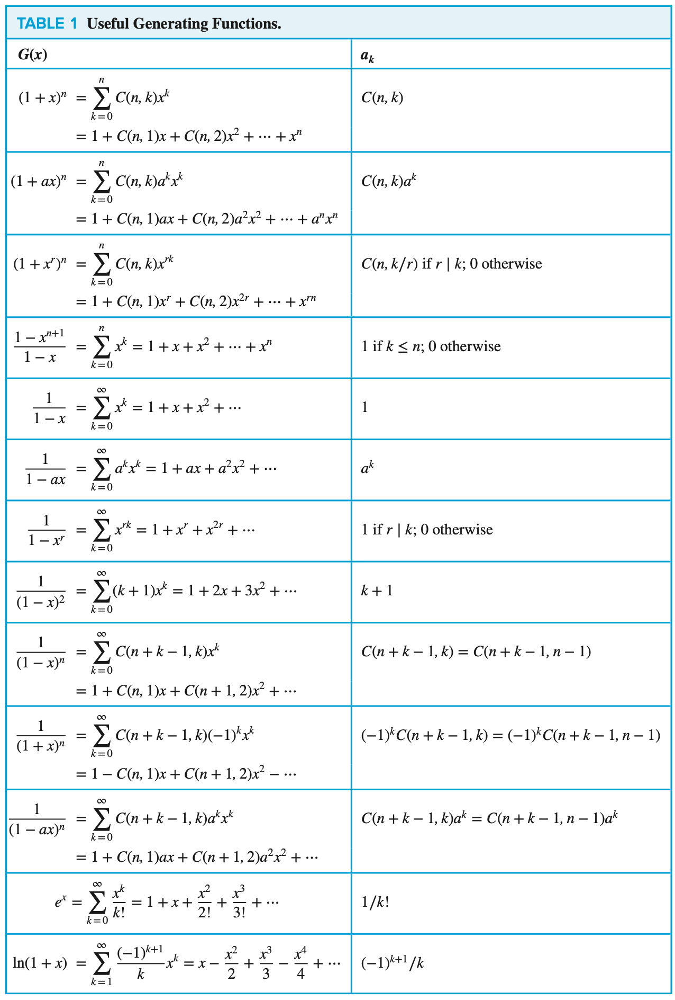

# CHAPTER 8 Advanced Counting Techniques

[TOC]

## Solving Linear Recurrence Relations

**Definition:** A `linear homogeneous recurrence relation of degree k with constant coefficients` is a recurrence relation of the form $a_n = c_1 a_{n - 1} + c_2 a_{n - 2} + \cdots + c_k a_{n - k}$, where $c_1, c_2, \cdots, c_k$ are real numbers, and $c_k \neq 0$.

**THEOREM**: Let $c_1$ and $c_2$ be real numbers. Suppose that $r^2 - c_1r - c_2 = 0$ has two distinct roots $r_1$ and $r_2$. Then the sequence $\{a_n\}$ is a solution of the recurrence relation $a_n = c_1 a_{n - 1} + c_2 a_{n - 2}$ if and only if $a_n = \alpha_{1} r_{1}^n + \alpha_{2}r_{2}^{n}$ for $n = 0, 1, 2, ...,$ where $\alpha_1$ and $\alpha_2$ are constants.

**THEOREM:** Let $c_1, c_2, ..., c_k$ be real numbers. Suppose that the characteristic equation $r^k - c_1 r^{k - 1} - \cdots c_k = 0$ has $k$ distinct roots $r_1, r_2, \cdots, r_k$. THen a sequence $\{a_n\}$ is a solution of the recurrence relation $a_n = c_1 a_{n - 1} + c_2 a_{n - 2} + \cdots + c_k a_{n - k}$ if and only if $a_n = \alpha_1 r_{1}^{n} + \alpha_2 r_{2}^{n} + \cdots + \alpha_{k}r_{k}^{n}$ for $n = 0, 1, 2, ..., $ where $\alpha_1, \alpha_2, ..., \alpha_{k}$ are constants.

**THEOREM:** Let $c_1, c_2, ..., c_k$ be real numbers. Suppose that the characteristic equation:

> $r^k - c_1 r^{k - 1} - \cdots - c_k = 0$ 

has $t$ distinct roots $r_1, r_2, ..., r_t$ with multiplicities $m_1, m_2, ..., m_t$, respectively, so that $m_i \geq 1$ for $i = 1, 2, ..., t$ and $m_1 + m_2 + ... + m_t = k$. Then a sequence $\{a_n\}$ is a solution of the recurrence relation:

> $a_n = c_1 a_{n - 1} + c_2 a_{n - 2} + ... + c_k a_{n - k}$ 

if and only if:

$$
a_n = (\alpha_{1,0} + \alpha_{1,1}n + \cdots + \alpha_{1,m_1 - 1}n^{m_1 - 1})r_{1}^{n} \\
+ (\alpha_{2,0} + \alpha_{2,1}n + \cdots + a_{2,m_2 - 1}n^{m_2 - 1})r_{2}^{n} \\
+ \cdots + (\alpha_{t,0} + \alpha_{t,1}n + \cdots + \alpha_{t, m-t - 1}n^{m_t - 1})r_{t}^{n}
$$

for $n = 0, 1, 2, ...$, where $a_{i,j}$ are constants for $1 \leq i \leq t$ and $0 \leq j \leq m_i - 1$.

**THEOREM** If $\{a_{n}^{(p)}\}$ is a particular solution of the nonhomogeneous linear recurrence relation with constant coefficients

> $a_n = c_1 a_{n - 1} + c_2 a_{n - 2} + \cdots + c_k a_{n - k} + F(n)$

, then every solution is of the form $\{a_n^{(p)} + a_{n}^{(h)}\}$, where $\{a_{n}^{(h)}\}$ is a solution of the associated homogeneous recurrence relation:

> $a_n = c_1 a_{n - 1} + c_2 a_{n - 2} + \cdots + c_k a_{n - k}$

**THEOREM** Suppose that $\{a_n\}$ satisfies the linear nonhomogeneous recurrence relation:

> $a_n = c_1 a_{n - 1} + c_2 a_{n - 2} + \cdots + c_k a_{n - k} + F(n)$

, where $c_1, c_2, ..., c_k$ are real numbers, and 

> $F(n) = (b_t n^t + b_{t - 1}n^{t - 1} + \cdots + b_1n + b_0)s^n$

, where $b_0, b_1, ..., b_t$ and $s$ are real numbers. When $s$ is not a rootof the characteristic equation of the associated linear homogeneous recurrence relation, there is a particular solution of the form:

> $(p_t n^t + p_{t - 1}n^{t - 1} + \cdots + p_1 n + p_0)s^n$

, When $s$ is a root of this characteristic equation and its multiplicity is $m$, there is a particular solution of the form

> $n^m(p_t n^t + p_{t - 1}n^{t - 1} + \cdots + p_1 n + p_0)s^n$

## Divide-and-Conquer Algorithms and Recurrence Relations

**THEOREM** Let $f$ be an increasing function that satisfies the recurrence relation

> $f(n) = af(n/b) + c$

, whenever $n$ is divisible by $b$, where $a \geq 1$, $b$ is an integer greater than 1, and $c$ is a positive real number. Then
$$
f(n) \text{ is } 
\begin{cases}
O(n^{log_b a}) \text{ if } a > 1, \\
O(log\ n) \text{ if } a = 1
\end{cases}
$$
, Furthermore, when $n = b^k$ and $a \neq 1$, where $k$ is a positive integer, 

> $f(n) = C_1 n^{log_b a} + C_2$

, where $C_1 = f(1) + c/(a - 1)$ and $C_2 = -c/(a - 1)$.

**THEOREM** MASTER THEOREM Let $f$ be an increasing function that satisfies the recurrence relation $f(n) = af(n/b) + cn^d$ whenever $n = b^k$, where $k$ is a positive integer, $a \geq 1$, $b$ is an integer greater than 1, and $c$ and $d$ are real numbers with $c$ positive and $d$ nonnegative. Then
$$
f(n) \text{ is }
\begin{cases}
O(n^d) &if\ a < b^d\\
O(n^d logn) &if\ a = b^d, \\
O(n^{log_b a}) &if\ a > b^d.
\end{cases}
\qquad (1)
$$
**Definition** The `generating function for the sequence` $a_0, a_1, ..., a_k, ...$ of real numbers is the infinite series $G(x) = a_0 + a_1 x + \cdots + a_k x^k + \cdots = \sum_{k=0}^{\infin}a_k x^k$.

**THEOREM** Let $f(x) = \sum_{k = 0}^{\infin}a_k x^k \text{ and } g(x) = \sum_{k = 0}^{\infin}b_k x^k$. Then $f(x) + g(x) = \sum_{k = 0}^{\infin}(a_k + b_k)x^k$ and $f(x)g(x) = \sum_{k = 0}^{\infin}(\sum_{j = 0}^{k}a_j b_{k - j})x^k$.

**Definition** Let $u$ be a real number and $k$ a nonnegative integer. Then the `extended binomial coefficient` ${u \choose k}$ is defined by:
$$
{u \choose k} =
\begin{cases}
u(u-1) \cdots (u - k + 1)/k! &if\ k > 0,\\
1 &if\ k = 0.
\end{cases}
$$
**THEOREM** THE EXTENDED BINOMIAL THEOREM: Let $x$ be a real number with $|x| < 1$ and let $u$ be a real number. Then:
$$
(1 + x)^u = \sum_{k = 0}^{\infin} {u \choose k}x^k.
$$

## Inclusion-Exlusion

**THEOREM** THE PRINCIPLE OF INCLUSION-EXCLUSION: Let $A_1, A_2, \cdots, A_n$ be finite sets, Then:
$$
|A_1 \cup A_2 \cup \cdots \cup A_n| = \sum_{1 \leq i \leq n}|A_i| - \sum_{1 \leq i < j \leq n}|A_i \cap A_j| \\
+ \sum_{1 \leq i < j < k \leq n}|A_i \cap A_j \cap A_k| - \cdots + (-1)^{n + 1}|A_1 \cap A_2 \cap \cdots \cap A_n|.
$$

## Application of Inclusion-Exlusion

Let $A_i$ be the subset containing the elements that have property $P_i$. The number of elements with all the properties $P_{i_1}, P_{i_2}, \cdots, P_{i_k}$ will be denoted by $N(P_{i_1} P_{i_2} \cdots P_{i_k})$. Writing these equantities in terms of sets, we have:
$$
|A_{i_1} \cap A_{i_2} \cap \cdots \cap A_{i_k}| = N(P_{i_1} P_{i_2} \cdots P_{i_k}).
$$
,If the number of elements with none of the properties $P_1, P_2, \cdots, P_n$ is denoted by $N(P_1' P_2' \cdots P_n')$ and the number of elements in the set is denoted by $N$, it follows that:
$$
N(P_1' P_2' \cdots P_n') = N - |A_1 \cup A_2 \cup \cdots \cup A_n|.
$$
,From the inclusion-eclusion principle, we see that:
$$
N(P_1' P_2' \cdots P_n') = N - \sum_{1 \leq i \leq n}N(P_i) + \sum_{1 \leq i < j \leq n}N(P_i P_j) - \sum_{1 \leq i < j < kl \leq n}N(P_i P_j P_k) + \cdots + (-1)^n N(P_1 P_2 \cdots P_n).
$$
**THEOREM** Let $m$ and $n$ be positive integers with $m \geq n$. Then, there are: $n^m - C(n, 1)(n - 1)^m + C(n, 2)(n - 2)^m - \cdots + (-1)^{n - 1}C(n, n - 1) \cdot 1^m$ onto functions from a set with $m$ elements to a set with $n$ elements.

**THEOREM** The number of derangements of a set with $n$ elements is $D_n = n![1 - \frac{1}{1!} + \frac{1}{2!} - \frac{1}{3!} + \cdots + (-1)^n \frac{1}{n!}]$.

## Key Terms and Results

### TERMS

- **Recurrence relation**: a formula expressing terms of a sequence, except for some initial terms, as a function of one or more previous terms of the sequence.
- **Initial conditions for a recurrence relation**: the values of the terms of a sequence satisfying the recurrence relation before this relation takes effect.
- **Dynamic programming**: an algorithmic paradigm that finds the solution to an optimization problem by recursively breaking down the problem into overlapping subproblems and combining their solutions with the help of a recurrence relation.
- **Linear homogeneous recurrence relation with constant coefficients**: a recurrence relation that expresses the terms of a sequence, except initial terms, as a linear combination of previous terms.
- **Characteristic roots of a linear homogeneous recurrence relation with constant coefficients**: the roots of the polynomial associated with a linear homogeneous recurrence relation with constant coefficients.
- **Linear nonhomogeneous recurrence relation with constant coefficients**: a recurrence relation that expresses the terms of a sequence, except for initial terms, as linear combination of previous terms plus a function that is not identically zero that depends only on the inex.
- **Divide-and-conquer algorithm**: an algorithm that solves a problem recursively by splitting it into a fixed number of smaller nonoverlapping subproblems of the same type.
- **Generating function of a sequence**: the formal series that has the $n$th term of the sequence as the coefficient of $x^n$.
- **Sieve of Eratosthenes**: a procedure for finding the primes less than a specified positive integer.
- **Derangement**: a permutation of objects such that no object is in its original place.

### RESULTS

**the formula for the number of elements in the union of two finite sets**: $|A \cup B| = |A| + |B| - |A \cap B|$.

**the formula for the number of elements in the union of three finite sets**: $|A \cup B \cup C| = |A| + |B| + |C| - |A \cap B| - |A \cap C| - |B \cap C| + |A \cap B \cap C|$.

**the principle of inclusion-exclusion**: 
$$
\begin{equation}\begin{split}
|A_1 \cup A_2 \cup \cdots \cup A_n| &= \sum_{1 \leq i \leq n}|A_i| - \sum_{1 \leq i < j \leq n}|A_i \cap A_j| \\
&+ \sum_{1 \leq i < j < k \leq n}|A_i \cap A_j \cap A_k| \\
&- \cdots +(-1)^{n + 1}|A_1 \cap A_2 \cap \cdots \cap A_n| \\
\end{split}\end{equation}
$$
**the number of onto functions from a set with $m$ elements to a set with $n$ elements:**
$$
n^m - C(n, 1)(n - 1)^m + C(n, 2)(m - 2)^m - \cdots +(-1)^{n - 1}C(n, n - 1) \cdot 1^m
$$
**the number of derangements of $n$ objects:** $D_n = n![1 - \frac{1}{1!} + \frac{1}{2!} - \cdots +(-1)^n\frac{1}{n!}]$

