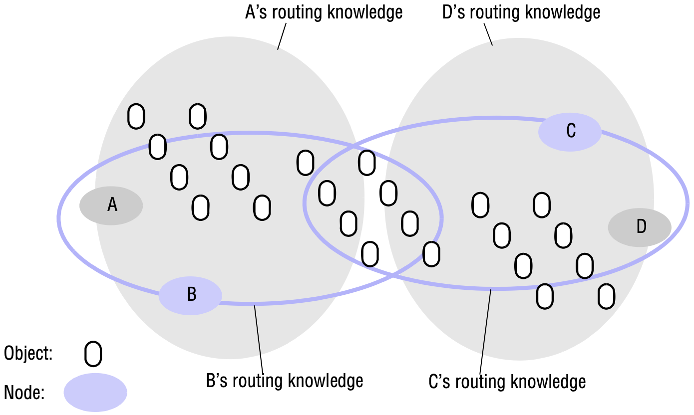

# 10 PEER-TO-PEER SYSTEMS

[TOC]

## Introduction

Peer-to-peer systems share these characteristics:

- Their design ensures that each user contributes resources to the system.
- Although they may differ in the resources that they contribute, all the nodes in a peer-to-peer system have the same functional capabilities and responsibilities.
- Their correct operation does not depend on the existence of any centrally administered systems.
- They can be designed to offer a limited degree of anonymity to the providers and users of resources.
- A key issue for their efficient operation is the choice of an algorithm for the placement of data across many hosts and subsequent access to it in a manner that balances the workload and ensures availability without adding undue overheads.

## Peer-to-peer middleware

Peer-to-peer middleware systems are designed to specifically to meet the need for the automatic placement and subsequent location of the distributed objects managed by peer-to-peer systems and applications.

*Distribution of information in a routing overlay*

## Routing overlays

In peer-to-peer systems a distributed algorithm known as a *routing overlay* takes responsibility for locating nodes and objects.