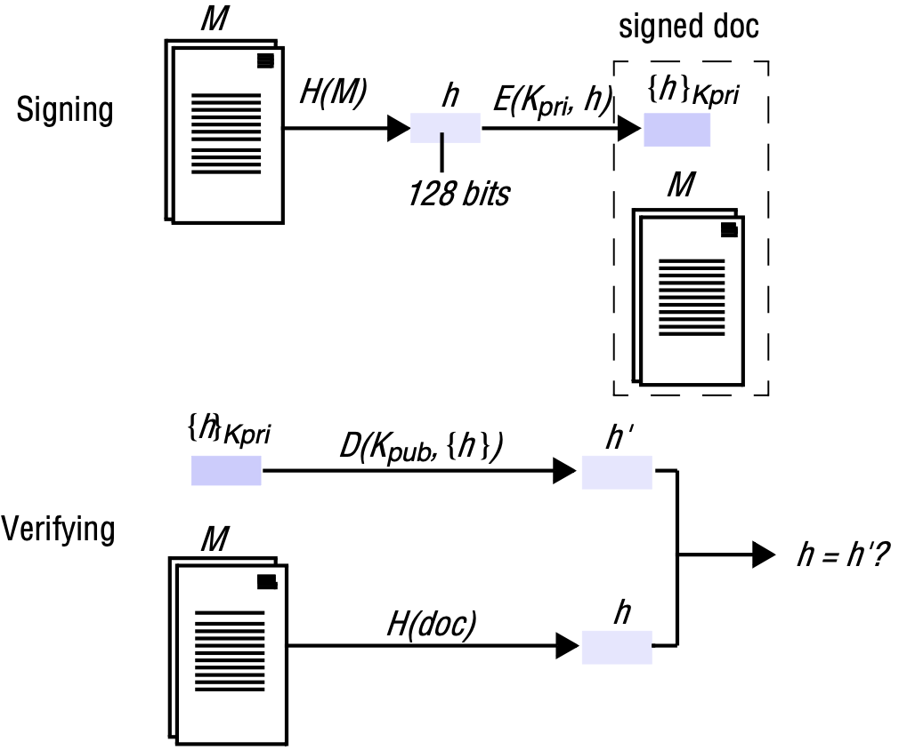
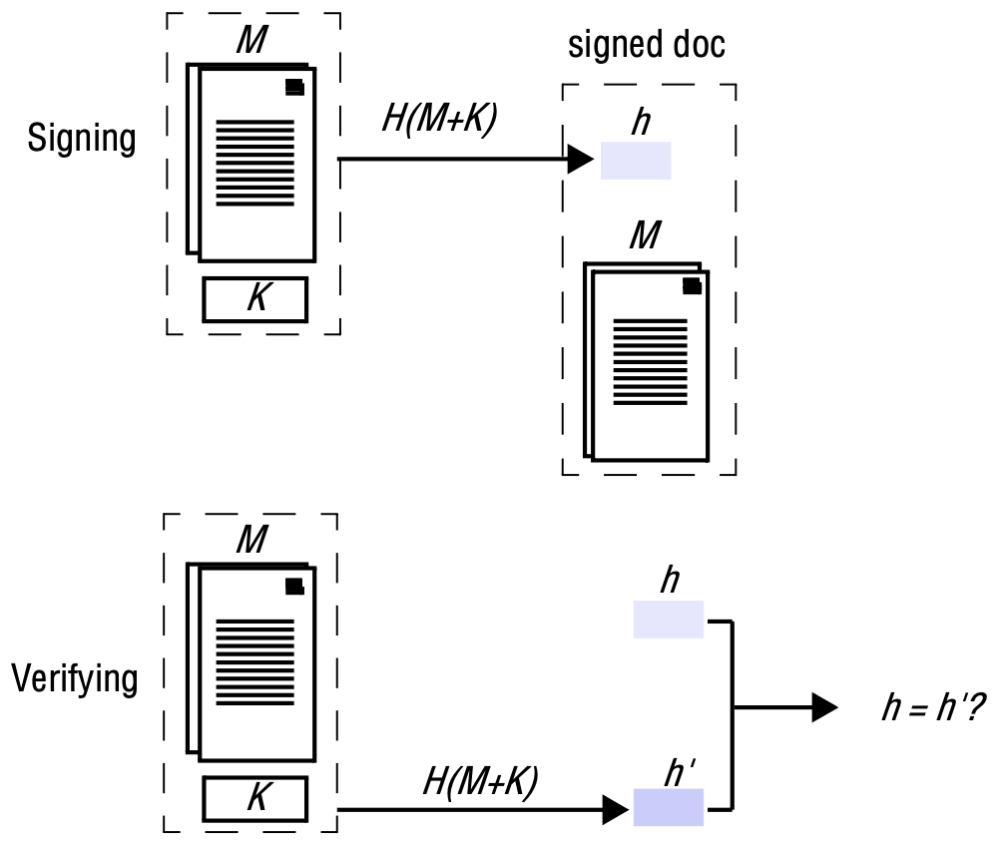
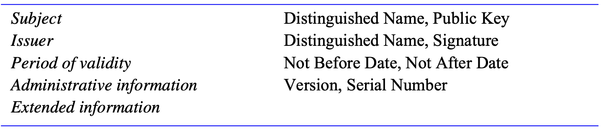

# 11 SECURITY

[TOC]

## Introduction

### Threats and attacks

The main goal of security is to restrict access to information and resources to just those principals who are authorized to have access. Security threats fall into three broad classes:

- *Leakage*: Refers to the acquisition of information by unauthorized recipients.
- *Tampering*: Refers to the unauthorized alteration of information.
- *Vandalism*: Refers to interference with the proper operation of a system without gain to the perpetrator.

Attacks on distributed systems depend upon obtaining access to existing communication channels or establishing new channels that masquerade as authorized connections. (We use the term *channel* to refer to any communication mechanism between processes.) Methods of attack can be further classified according to the way in which a channel is misused:

- *Eavesdropping*: Obtaining copies of messages without authority.
- *Masquerading*: Sending or receiving messages using the identity of another principal without their authority.
- *Message tampering*: Intercepting messages and altering their contents before passing them on to the intended recipient.
- *Replaying*: Storing intercepted messages and sending them at a later date.
- *Denial of service*: Flooding a channel or other resource with messages in order to deny access for others.

### Designing secure systems

The design of secure systems is an exercise in balancing costs against the threats. The range of techniques that can be deployed for protecting processes and securing interprocess communication is strong enough to withstand almost any attack, but their use incurs expense and inconvenience:

- A cost (in terms of computational effort and network usage) is incurred for their use. The costs must be balanced against the threats.
- Inappropriately specified security measures may exclude legitimate users from performing necessary actions.

## Overview of security techniques

Worst-case assumptions and design guidelines:

- Interfaces are exposed.
- Networks are insecure.
- Limit the lifetime and scope of each secret.
- Algorithms and program code are available to attackers.
- Attackers may have access to large resources.
- Minimize the trusted base.

### Cryptography

Encryption is the process of encoding a message in such a way as to hide its contents.

### Uses of cryptography

Cryptography is used to maintain the secrecy and integrity of information whenever it is exposed to potential attacks.

### Certificates

To make certificates useful, two things are needed:

- a standard format and representation for them so that certificate issuers and certificate users can successfully construct and interpret them;
- agreement on the manner in which chains of certificates are constructed, and in particular, the notion of a trusted authority.

### Access control

**Protection domains**. A protection domain is an execution environment shared by a collection of processes: it contains a set of *<resource, rights>* pairs, listing the resources that can be accessed by all processes executing within the domain and specifying the operations permitted on each resource.

**Capabilities**: A set of capabilities is held by each process according to the domain in which it is located. A capability is a binary value that acts as an access key, allowing the holder access to certain operations on a specified resource. For use in distributed systems, where capabilities must be unforgeable, they take a form such as:

| Resource identifier | A unique identifier for the target resource.           |
| ------------------- | ------------------------------------------------------ |
| Operations          | A list of the operations permitted on the resource.    |
| Authentication code | A digital signature making the capability unforgeable. |

When capabilities are used, client requests are of the form *<op, userid, capability>*.

**Access control lists**: A list is stored with each resource, containing an entry of the form *<domain, operations>* for each domain that has access to the resource and giving the operations permitted to the domain.

### Credentials

Credentials are a set of evidence provided by a principal when requesting access to a resource.

### Firewalls

Firewalls produce a local communication environment in which all external communication is intercepted. Messages are forwarded to the intended local recipient only for communications that are explicitly authorized.

## Cryptographic algorithms

Because of its symmetrical use of keys, secret-key cryptography is often referred to as *symmetric cryptography*, whereas public-key cryptography is referred to as *asymmetric*, because the keys used for encryption and decryption are different.

## Digital signatures

**Digital signing**. An electronic document or message $M$ can be signed by a principal $A$ by encrypting a copy of $M$ with a key $K_A$ and attaching it to a plaintext copy of $M$ and $A$'s identifier. The signed document then consists of: $M$, $A$, $[M]_{K_A}$. The signature can be verified by a principal that subsequently receives the document to check that it was originated by $A$ and that its contents, $M$, have not subsequently been altered.

**Digest functions**. Digest functions are also called *secure hash functions* and denoted $H(M)$. They must be carefully designed to ensure that $H(M)$ is different from $H(M')$ for all likely pairs of messages $M$ and $M'$. If there are any pairs of different messages $M$ and $M'$ such that $H(M) = H(M')$, then a duplicitous principal could send a signed copy of $M$, but when confronted with it claim that $M'$ was originally sent and that it must have been altered in transit.

### Digital signatures with public keys

*Digital signatures with public keys*

### Digital signatures with secret keys - MACs

*Low-cost signatures with a shared secret key*

### Secure digest functions

A secure digest function $h = H(M)$ should have the following properties:

1. Given $M$, it is easy to compute $h$.
2. Given $h$, it is hard to compute $M$.
3. Given $M$, it is hard to find another message $M'$, such that $H(M) = H(M')$.

### Certificate standards and certificate authorities

*X509 Certificate format*

Two-step verification procedure for any X.509 certificate:

1. Obtain the public-key certificate fo the issuer (a certification authority) from a reliable source.
2. Validate the signature.