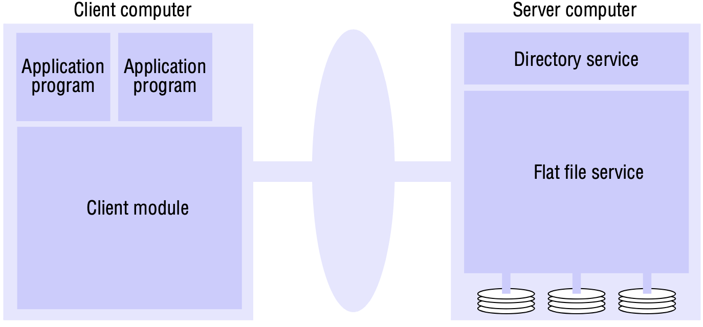
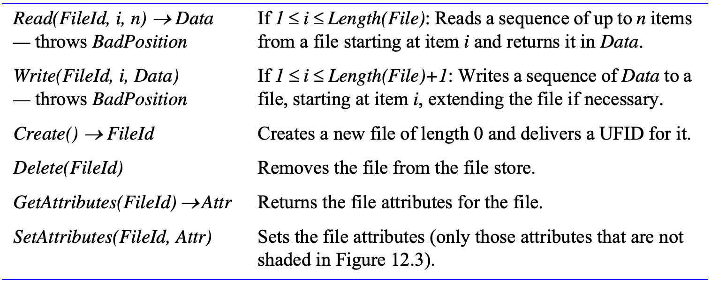
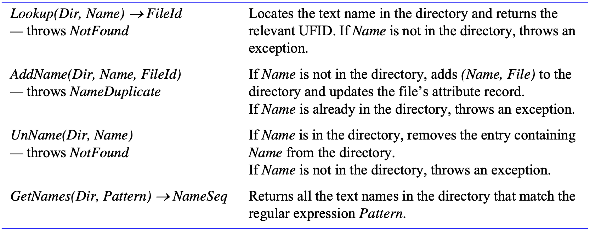

# 12 DISTRIBUTED FILE SYSTEMS

[TOC]

## Introduction

### Characteristics of file systems

File systems are responsible for the organization, storage, retrieval, naming, sharing and protection of files. They provide a programming interface that characterizes the file abstraction, freeing programmers from concern with the details of storage allocation and layout. Files contain both *data* and *attributes*.

The term *metadata* is often used to refer to all of the extra information stored by a file system that is needed for the management of files. It includes file attributes, directories and all the other persistent information used by the file system.

### Distributed file system requirements

**Transparency**:

- Access transparency
- Location transparency
- Mobility transparency
- Performance transparency
- Scaling transparency

**Concurrent file updates**. Changes to a file by one client should not interfere with the operation of other clients simultaneously accessing or changing the same file.

**File replication**. In a file service that supports replication, a file may be represented by several copies of its contents at different locations.

**Hardware and operating system heterogeneity**. The service interfaces should be defined so that client and server software can be implemented for different operating systems and computers. This requirement is an important aspect of openness.

**Fault tolerance**. The central role of the file service in distributed systems makes it essential that the service continue to operate in the face of client and server failures.

**Consistency**.

**Security**. Virtually all file systems provide access-control mechanisms based on the use of access control lists.

**Efficiency**. A distributed file service should offer facilities that are of at least the same power and generality as those found in conventional file systems and should achieve a comparable level of performance.

## File service architecture

*File service architecture*

The division of responsibilities between the modules can be defined as follows:

- **Flat file service**. 

  The flat file service is concerned with implementing operations on the contents of files.

- **Directory service**. 

  The directory service provides a mapping between *text names* for files and their *Unique file identifiers*(UFIDs).

- **Client module**. 

  A client module runs in each client computer, integrating and extending the operations of the flat file service and the directory service under a single application programming interface that is available to user-level programs in client computers.

- **Flat file service interface**.

  

  *Flat file service operations*

- **Access control**

  In distributed implementations, access rights checks have to be performed at the server because the server RPC interface is an otherwise unprotected point of access to files. A user identity has to be passed with requests, and the server is vulnerable to forged identities. Furthermore, if the results of an access rights check were retained at the server and used for future accesses, the server would no longer be stateless. Two alternative approaches to the latter problem can be adopted:
  
  - An access check is made whenever a file name is converted to a UFID, and the results are encoded in the form of a capability, which is returned to the client for submission with subsequent requests.
  - A user identity is submitted with every client request, and access checks are performed by the server for every file operation.
  
- **Directory service interface**

  

  *DIrectory service operations*

- **Hierarchic file system**. 

  A hierarchic file system such as the one that UNIX provides consists of a number of directories arranged in a tree structure. Each directory holds the names of the files and other directories that are accessible from it. Any file or directory can be referenced using a *pathname* - a multi-part name that represents a path through the tree.

- **File groups**

  A *file group* is a collection of files located on a given server. A server may hold several file groups, and groups can be moved between servers, but a file cannot change the group to which it belongs.