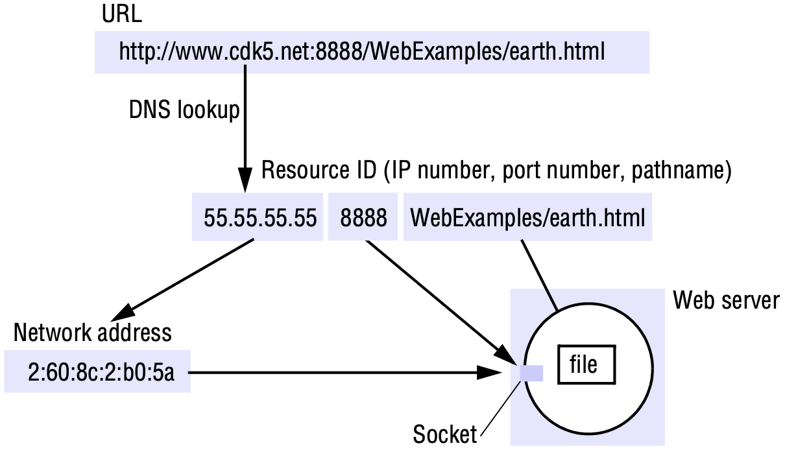
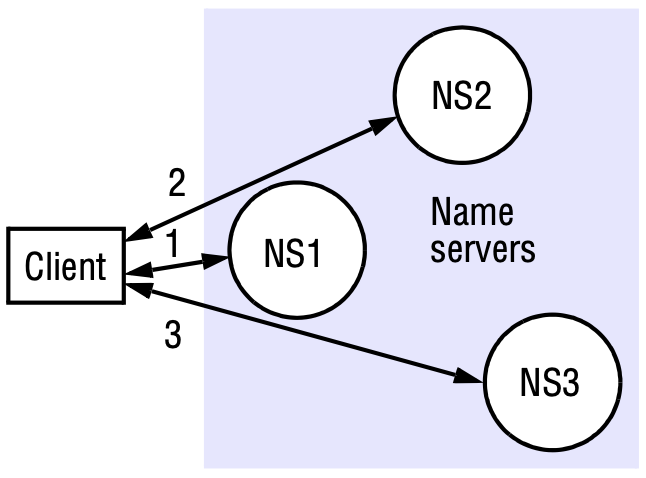
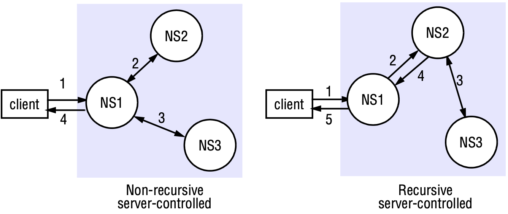

# NAME SERVICES

[TOC]

## Introduction

### Names, addresses and other attributes

*Composed naming domains used to access a resource from a URL*

## Name services and the Domain Name System

A *name service* stores information about a collection of textual names, in the form of bindings between the names and the attributes of the entities they denote, such as users, computers, services and objects.

Name management is separated from other services largely because of the openness of distributed systems, which brings the following motivations:

- *Unification*: It is often convenient for resources managed by different services to use the same naming scheme.
- *Integration*: It is not always possible to predict the scope of sharing in a distributed system.

### Name spaces

A *name space* is the collection of all valid names recognized by a particular service. The service will attempt to look up a valid name, even though that name may prove not to correspond to any object - i.e., to be *unbound*.

An *alias* is a name defined to denote the same information as another name, similar to a symbolic link between file path names. Aliases allow more convenient names to be substituted for relatively complicated ones, and allow alternative names to be used by different people for the same entity.

A *naming domain* is a name space for which there exists a single overall administrative authority responsible for assigning names within it. This authority is in overall control of which names may be bound within the domain, but it is free to delegate this task. 

### Name resolution

*Iterative navigation*

*Non-recursive and recursive server-controlled navigation*

### The Domain Name System

The Domain Name System is a name service design whose main naming database is used across the Internet.

