# 14 TIME AND GLOBAL STATES

[TOC]

## Clocks, events and process states

Computer clocks, like any others, tend not to be in perfect agreement. The instantaneous difference between the readings of any two clocks is called their *skew*. Also, the crystal-based clocks used in computers are, like any other clocks, subject to *clock drift*, which means that they count time at different rates, and so diverge.

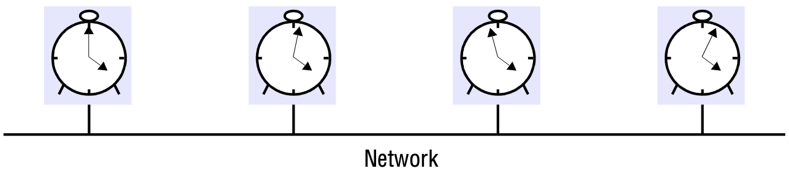

*Skew between computer clocks in a distributed system*

*Coordinated Universal Time* - abbreviated as UTC (from the French equivalent) is an international standard for timekeeping.

## Synchronizing physical clocks

*External synchronization*: For a synchronization bound $D > 0$, and for a source $S$ of UTC time, $|S(t) - C_i(t)| < D$, for $i = 1, 2, ... N$ and for all real times $t$ in $I$. Another way of saying this is that the clocks $C_i$ are *accurate* to within the bound $D$.

*Internal synchronization*: For a synchronization bound $D > 0$, $|C_i(t) - C_j(t)| < D$ for $i,just = 1, 2, ... N$, and for all real times $t$ in $I$. Another way of saying this is that the clocks $C_i$ *agree* within the bound $D$.

Various notions of *correctness* for clocks have been suggested. It is common to define a hardware clock $H$ to be correct if its drift rate falls within a known bound $\rho > 0$. This means that the error in measuring the interval between real times $t$ and $t'(t' > t)$ is bounded:
$$
(1 - \rho)(t' - t) \le H(t') - H(t) \le (1 + \rho)(t' - t)
$$
This condition forbids jumps in the value of hardware clocks (during normal operation). Sometimes we also require our software clocks to obey the condition but a weaker condition of *monotonicity* may suffice. Monotonicity is the condition that a clock $C$ only ever advances:
$$
t' > t \Rightarrow C(t') > C(t)
$$
A clock that does not keep to whatever correctness conditions apply is defined to be *faulty*. A clock's *crash failure* is said to occur when the clock stops ticking altogether; any other clock failure is an *arbitrary failure*.

### Synchronization in a synchronous system

In a synchronous system, by definition, there is also an upper bound *max* on the time taken to transmit any message. Let the uncertainty in the message transmission time be $u$, so that $u = (max - min)$. If the receiver sets its clock to be $t + min$, then the clock skew may be as much as $u$, since the message may in fact have taken time $max$ to arrive. Similarly, if it sets its clock to $t + max$, the skew may again be as large as $u$. If however, it sets its clock to the halfway point, $t + (max + min) / 2$, then the skew is at most $u/2$. In general, for a synchronous system, the optimum bound that can be achieved on clock skew when synchronizing $N$ clocks is $u(1 - 1/N)$.

### Cristian's method for synchronizing clocks

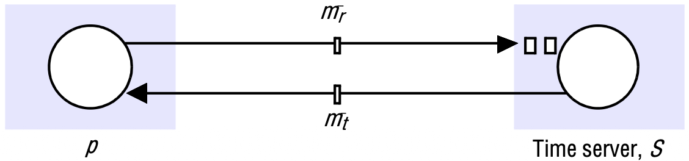

*Clock synchronization using a time server*

A process $p$ requests the time in a message $m_r$, and receives the time value $t$ in a message $m_t$ ($t$ Is inserted in $m_t$ at the last possible point before transmission from $S$'s computer). Process $p$ records the total round-trip time $T_{round}$ taken to send the request $m_r$ and receive the reply $m_t$. It can measure this time with reaonable accuracy if its rate of clock drift is small.

A simple estimate of the time to which $p$ should set its clock is $t + T_{round} / 2$, which assumes that the elapsed time is split equally before and after $S$ placed $t$ in $m_t$. This is normally a reasonably accurate assumption, unless the two messages are transmitted over different networks. If the value of the minimum transmission time $min$ is known or can be conservatively estimated, then we can determine the accuracy of this result as follows.

The earliest point at which $S$ could have placed the time in $m_t$ was $min$ after $p$ dispatched $m_r$. The latest point at which it could have done this was $min$ before $m_t$ arrived at $p$. The time by $S$'s clock when the reply message arrives is therefore in the range $[t + min, t + T_{round} - min]$. The width of this range is $T_{round} - 2min$, so the accuracy is $\pm(T_{round}/2 - min)$.

### The Berkely algorithm

In it, a coordinator computer is chosen to act as the *master*. Unlike in Cristian's protocol, this computer periodically polls the other computers whose clocks are to be synchronized, called *slaves*. The slaves send back their clock values to it. The master estimates their local clock times by observing the round-trip times (similarly to Cristian's technique), and it averages the values obtained (including its own clock's reading). The balance of probabilities is that this average cancels out the individual clocks' tendencies to run fast or slow. The accuracy of the protocol depends upon a nominal maximum round-trip time between the master and the slaves. The master eliminates any occasional readings associated with larger times than this maximum.

### The Network Time Protocol

The Network Time Protocol (NTP) defines an architecture for a time service and a protocol to distribute time information over the Internet.

NTP's chief design aims and features are as follows:

- To provide a service enabling clients across the Internet to be synchronized accurately to UTC.
- To provide a reliable service that can survive lengthy losses of connectivity.
- To enable clients to resynchronize sufficiently frequently to offset the rates of drift found in most computers.
- To provide protection against interference with the time service, whether malicious or accidental.

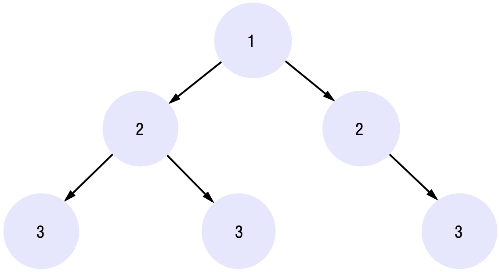

*An example synchronization subnet in an NTP implementation*

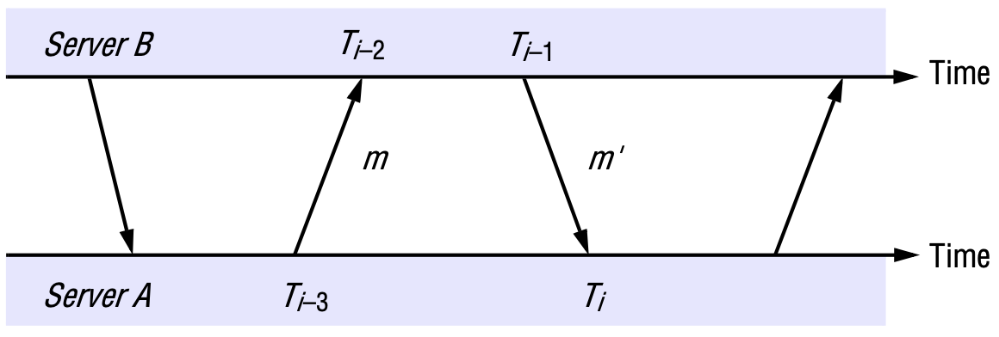

*Messages exchanged between a pair of NTP peers*

For each pair of messges sent between two servers the NTP calculates an *offset* $o_i$, which is an estimate of the actual offset between the two clocks, and a *delay* $d_i$, which is the total transmission time for the two messages. If the true offset of the clock at $B$ relative to that at $A$ is $o$, and if the actual transmission times for $m$ and $m'$ are $t$ and $t'$, respectively, then we have:
$$
T_{i - 2} = T_{i - 3} + t + o \ and\ T_i = T_{i - 1} + t' - o
$$
This leads to:
$$
d_i = t + t' = T_{i - 2} - T_{i - 3} + T_i - T_{i - 1}
$$
And:
$$
o = o_i + (t' - t) / 2, \text{ where } o_i = (T_{i - 2} - T_{i - 3} + T_{i - 1} - T_{i}) / 2
$$
Using the fact that $t, t' \ge 0$, it can be shown that $o_i - d_i / 2 \le o \le o_i + d_i / 2$. Thus $o_i$ is an estimate of the offset, and $d_i$ is a measure of the accuracy of this estimate.

## Logical time and logical clocks

We can define the happened-before relation, denoted by $\rightarrow$, as follows:

HB1: If $\exist$ process $p_i : e \rightarrow ie'$, then $e \rightarrow e'$.

HB2: For any message $m$, $send(m) \rightarrow receive(m)$, where $send(m)$ is the event of sending the message, and $receive(m)$ is the event of receiving it.

HB3: If $e$, $e'$ and $e''$ are events such that $e \rightarrow e'$ and $e' \rightarrow e''$, then $e \rightarrow e''$. Thus, if $e$ and $e'$ are events, and if $e \rightarrow e'$, then we can find a series of events $e_1, e_2, ..., e_n$ occurring at one or more processes such that $e = e_1$ and $e' = e_n$, and for $i = 1, 2, ..., N - 1$ either HB1 or HB2 applies between $e_i$ and $e_{i + 1}$. That is, either they occur in succession at the same process, or there is a message $m$ such that $e_i = send(m)$ and $e_{i + 1} = receive(m)$. The sequence of events $e_1, e_2, ..., e_n$ need not be unique.

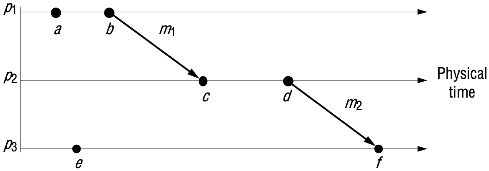

*Events occurring at three processes*

**Logical clocks**. Lamport invented a simple mechanism by which the happened before ordering can be captured numerically, called a *logical clock*. A Lamport logical clock is a monotonically increasing software counter, whose value need bear no particular relationship to any physical clock. Each process $p_i$ keeps its own logical clock, $L_i$, which it uses to apply so-called *Lamport timestamps* to events. We denote the timestamp of event $e$ at $p_i$ by $L_i(e)$, and by $L(e)$ we denote the timestamp of event $e$ at whatever process it occured at.

To capture the happened-before relation $\rightarrow$, processes update their logical clocks and transmit the values of their logical clocks in messages as follows:

- LC1: $L_i$ is incremented before each event is issued at process $p_i$: $L_i := L_i + 1$.
- LC2:
  - When a process $p_i$ sends a message $m$, it piggybacks on $m$ the value $t = L_i$.
  - On receiving $(m, t)$, a process $p_j$ computes $L_j := max(L_j, t)$ and then applies LC1 before timestamping the event $receive(m)$.

Although we increment clocks by 1, we could have chosen any positive value. It can easily be shown, by induction on the length of any sequence of events relating two events $e$ and $e'$, that $e \rightarrow e' \Rightarrow L(e) < L(e')$.

Note that the converse is not true. If $L(e) < L(e')$, then we cannot infer that $e \rightarrow e'$.

*Lamport timestamps for the events shown in above figure*

**Vector clocks**. Mattern and Fidge developed vector clocks to overcome the shortcoming of Lamport's clocks: the fact that from $L(e) < L(e')$ we cannot conclude that $e \rightarrow e'$. A vector clock for a system of $N$ processes is an array of $N$ integers. Each process keeps its own vector clock, $V_i$, which it uses to timestamp local events. Like Lamport timestamps, processes piggy back vector timestamps on the messages they send to one another, and there are simple rules for updating the clocks:

- VC1: Initially, $V_i[j] = 0$, for $i,just = 1, 2, ..., N$.
- VC2: Just before $p_i$ timestamps an event, it sets $V_i[i] := V_i[i] + 1$.
- VC3: $p_i$ includes the value $t = V_i$ in every message it sends.
- VC4: When $p_i$ receives a timestamp $t$ in a message, it sets $V_i[j] := max(V_i[j], t[j])$, for $j = 1, 2, ..., N$. Taking the component wise maximum of two vector timestamps in this way is known as a *merge* operation.

For a vector clock $V_i$, $V_i[i]$ is the number of events that $p_i$ has timestamped, and $V_i[j](j \neq i)$ is the number of events that have occurred at $p_j$ that have potentially affected $p_i$. (Process $p_j$ may have timestamped more events by this point, but no information has flowed to $p_i$ about them in messages as yet).

We may compare vector timestamps as follows:
$$
V = V' \text{ iff } V[j] = V'[j] \text{ for } j = 1, 2, ..., N \\
V \leq V' \text{ iff } V[j] \leq V'[j] \text{ for } j = 1, 2, ..., N \\
V < V' \text{ iff } V \leq V' \cup V \neq V'
$$

Let $V(e)$ be the vector timestamp applied by the process at which $e$ occurs. It is straightforward to show, by induction on the length of any sequence of events relating two events $e$ and $e'$, that $e \rightarrow e' \Rightarrow V(e) < V(e')$.

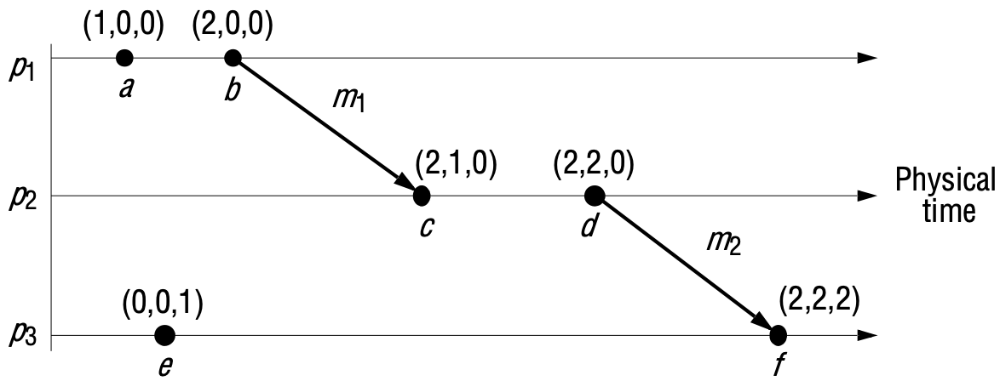

*Vector timestamps for the events shown in Figure 14.5*

## Global states

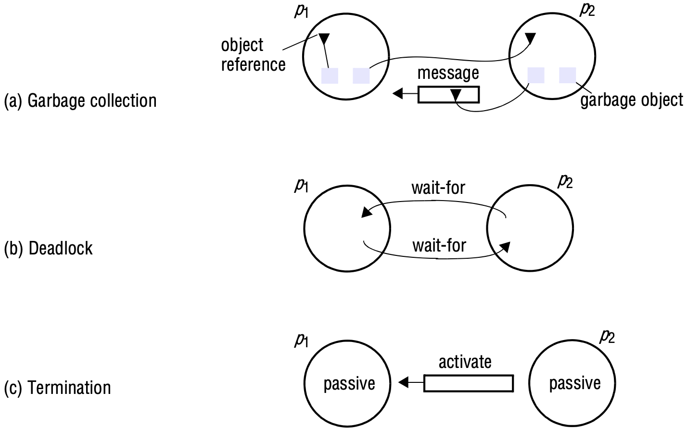

*Detecting global properties*

*Distributed garbage collection*: An object is considered to be garbage if there are no longer any references to it anywhere in the distributed system. The memory taken up by that object can be reclaimed once it is known to be garbage. To check that an object is garbage, we must verify that there are no references to it anywhere in the system.

*Distributed deadlock detection*: A distributed deadlock occurs when each of a collection of processes waits for another process to send it a message, and where there is a cycle in the graph of this 'waits-for' relationship.

*Distributed termination detection*: Consider a distributed algorithm executed by two processes $p_1$ and $p_2$, each of which may request values from the other. When we tested $p_1$ for passivity, a message was on its way from $p_2$, which became passive immediately after sending it. On receipt of the message, $p_1$ became active again - after we had found it to be passive. The algorithm had not terminated.

*Distributed debugging*: Distributed systems are complex to debug, and care needs to be taken in establishing what occurred during the execution.

### Global states and consistent cuts

A cut $C$ is consistent if, for each event it contains, it also contains all the events that happened-before that event:

$$
\text{For all events } e \in C, f \rightarrow e \Rightarrow f \in C
$$

A *consistent global state* is one that corresponds to a consistent cut. We may characterize the execution of a distributed system as a series of transitions between global states of the system:

$$
S_0 \rightarrow S_1 \rightarrow S_2 \rightarrow ...
$$

A *run* is a total ordering of all the events in a global history that is consistent with each local history's ordering, $/emptyset_{i} (i = 1, 2, ..., N)$. A *linearization* or *consistent run* is an ordering of the events in a global history that is consistent with this happened-before relation $\rightarrow$ on $H$. Note that a linearization is also a run.

Not all runs pass through consistent global states, but all linearizations pass only through consistent global states. We say that a state $S'$ is *reachable* from a state $S$ if there is a linearization that passes through $S$ and then $S'$.

Sometimes we may alter the ordering of concurrent events within a linearization, and derive a run that still passes through only consistent global states.

### The 'snapshot' algorithm of Chandy and Lamport

Chandy and Lamport describe a 'snapshot' algorithm for determining global states of distributed systems, which we now present. The goal of the algorithm is to record a set of process and channel states (a 'snapshot') for a set of processes $p_i (i = 1, 2, ..., N)$ such that, even though the combination of recorded states may never have occurred at the same time, the recorded global state is consistent.

The algorithm assumes that:

- Neither channels nor processes fail - communication is reliable so that every message sent is eventually received intact, exactly once.
- Chaqnnels are unidirectional and provide FIFO - ordered message delivery.
- The graph of processes and channels is trongly connected (there is a path between any two processes).
- Any process may initiate a global snapshot at any time.
- The processes may continue their execution and send and receive normal messages while the snapshot takes place.

For each process $p_i$, let the *incoming channels* be those at $p_i$ over which other processes send it messages; similarly, the *outgoing channels* of $p_i$ are those on which it sends messages to other processes. The essential idea of the algorithm is as follows. Each process records its state and also, for each incoming channel, a set of messages sent to it. The process records, for each channel, any messages that arrived after it recorded its state and before the sender recorded its own state. This arrangement allows us to record the states of processes at different times but to account for the differentials between process states in terms of messages transmitted but not yet received. If process $p_i$ has sent a message $m$ to process $p_j$, but $p_j$ has not received it, then we account for $m$ as belonging to the state of the channel between them.

The algorithm proceeds through use of special *marker* messages, which are distinct from any other messages the processes send and which the processes may send and receive while they proceed with their normal execution. The marker has a dual role: as a prompt for the receiver to save its own state, if it has not already done so; and as a means of determining which messages to include in the channel state.

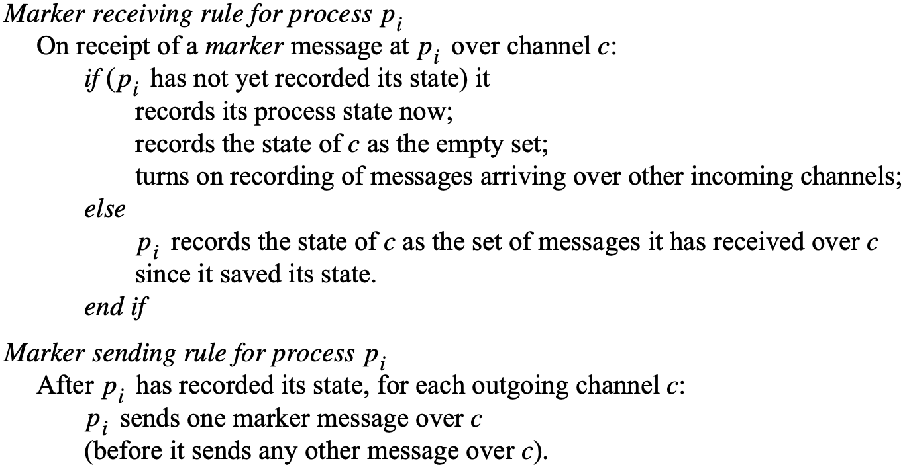

*Chandy and Lamport's 'snapshot' algorithm*

The algorithm is defined through two rules, the *marker receiving rule* and the *amrker sending rule*. The marker sending rule obligates processes to send a marker after they have recorded their state, but before they send any other messages.

The marker receiving rule obligates a process that has not recorded its state to do so. In that case, this is the first marker that it has received. It notes which messages subsequently arrive on the other incoming channels. When a process that has already saved its state receives a marker (on another channel), it records the state of that channel as the set of messages it has received on it since it saved its state.

Any process may begin the algorithm at any time. It acts as though it has received a marker (over a nonexistent channel) and follows the marker receiving rule. Thus it records its state and begins to record messages arriving over all its incoming channels. Several processes may initiate recording concurrently in this way (as long as the markers they use can be distinguished).

## Distributed debugging

Define the notions of *possibly* $\phi$ and *definitely* $\phi$ for a predicate $\phi$ in terms of linearizations of $H$, the history of the system's execution:

- $\text{possibly } \phi$: The statement $\text{possibly } \phi$ means that there is a consistent global state $S$ thrugh which. a linearization of $H$ passes such that $\phi(S)$ is *True*.
- $\text{definitely } \phi$: The statement $\text{definitely } \phi$ means that for all linearizations $L$ of $H$, there is a consistent global state $S$ through which $L$ passes such that $\phi(S)$ is *True*.

### Collecting the state

The observed processes $p_i(i = 1, 2, ..., N)$ send their initial state to the monitor initially, and thereafter from time to time, in *state messages*. The monitor records the state messages from each process $p_i$ in a separate queue $Q_i$, for each $i = 1, 2, ..., N$.

There are two optimizations to reduce the state-message traffic to the monitor:

1. First, the global state predicate may depend only on certain parts of the processes' states.
2. Second, they need only send their state at times when the predicate $\phi$ may become *True* or cease to be *True*. There is no point in sending changes to the state that do not affect the predicate's value.

### Observing consistent global states

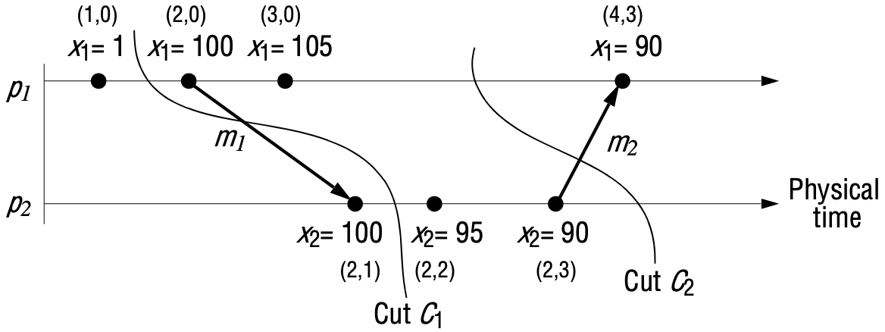

*Vector timestamps and variable values for the execution of Figure 14.9*

Let $S = (s_1, s_2, ..., s_N)$ be a global state drawn from the state messages that the monitor has received. Let $V(s_i)$ be the vector timestamp of the state $s_i$ received from $p_i$. Then it can be shown that $S$ is a consistent global state if and only if:
$$
V(s_i)[i] \ge V(s_j)[i] \text{ for } i,j = 1, 2, ..., N - (Condition\ CGS)
$$
This says that the number of $p_i$'s events known at $p_j$ when it sent $s_j$ is no more than the number of events that had occurred at $p_i$ when it sent $s_i$. In other words, if one process's state depends upon another (according to happened-before ordering), then the global state also encompasses the state upon which it depends.

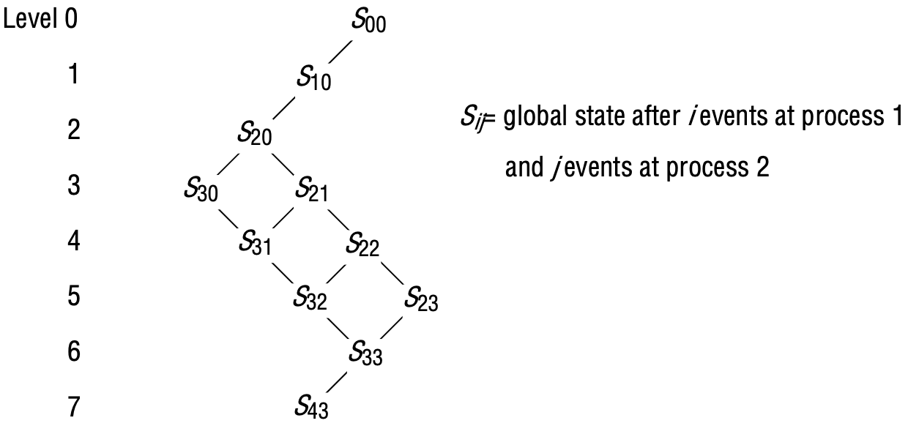

*The lattice of global states for the execution of FIgure 14.14*

### Evaluating possibly phi

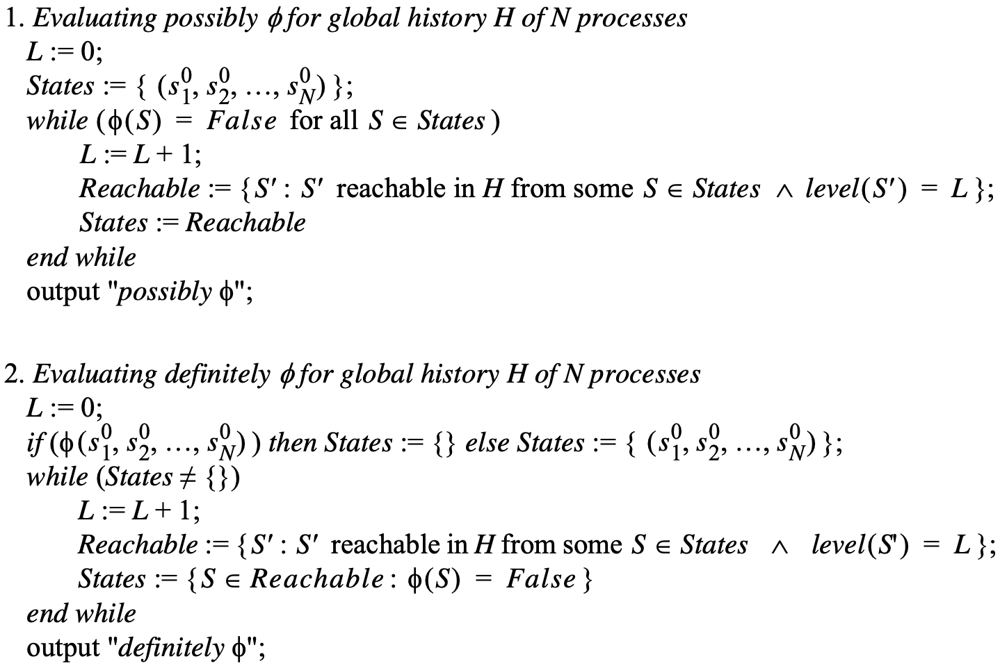

*Algorithms to evaluate possibly $\phi$ and definitely $\phi$*

To evaluate possilby $\phi$, the monitor must traverse the lattice of reachable states, starting from the initial state $(s_1^0, s_2^0, ..., s_N^0)$. The algorithm is shown in Figure 14.16. The algorithm assumes that the execution is infinite. It may easily be adapted for a finite execution.

The monitor may discover the set of consistent states in level $L + 1$ reachable from a given consistent state in level $L$ by the following method. Let $S = (s_1, s_2, ..., s_N)$ be a consistent state. Then a consistent state in the next level reachable from $S$ is of the form $S' = (s_1, s_2, ..., s_i', ..., s_N)$, which differs from $S$ only by containing the next state (after a single event) of some process $p_i$. The monitor can find all such states by traversing the queues of state messages $Q_i(i = 1, 2, ..., N)$. The state $S'$ is reachable from $S$ if and only if:
$$
for\ j = 1, 2, ..., N, j \neq i: V(s_j)[j] \ge V(s_i')[j]
$$
This condition comes from condition CGS above and from the fact that $S$ was already a consistent global state. A given state may in general be reached from several states at the previous level, so the monitor should take care to evaluate the consistency of each state only once.

### Evaluating definitely phi

*Evaluating definitely $\phi$*

The evaluate *definitely* $\phi$, the monitor again traverses the lattice of reachable states a level at a time, starting from the initial state $(s_1^0, s_2^0, ..., s_N^0)$. The algorithm again assumes that the execution is infinite but may easily be adapted for a finite execution. It maintains the set *States*, which contains those states at the current level that may be reached on a linearization from the initial state by traversing only states for which $\phi$ evaluates to *False*. As long as such a linearization exists, we may not assert *definitely* $\phi$: the execution could have taken this linearization, and $\phi$ would be *False* at every stage along it. If we reach a level for which no such linearization exists, we may conclude *definitely* $\phi$.

*Cost*. The algorithms we have just described are combinatorially explosive. Suppose that $k$ is the maximum number of events at a single process. Then the algorithms we have described entail $O(k^N)$ comparisons (the monitor compares the states of each of the $N$ observed processes with one another). 

There is also a space cost to these algorithms of $O(kN)$. However, we observe that the monitor may delete a message containing state $s_i$ from queue $Q_i$ when no other item of state arriving from another process could possibly be involved in a consistent global state containing $s_i$. That is, when:
$$
V(s_j^{last})[i] > V(s_i)[i] \text{ for } j = 1, 2, ..., N, j \neq i
$$
, where $s_j^{last}$ is the last state that the monitor has received from process $p_j$.

### Evaluating possibly $\phi$ and definitely $\phi$ in synchronous systems

We assume that each observed process $p_i(i = 1, 2, ..., N)$ and the monitor, which we shall call $p_0$, keep a physical clock $C_i(i = 0, 1, ..., N)$. These are synchronized to within a known bound $D > 0$; that is, at the same real time:
$$
|C_i(t) - C_j(t)| < D \text{ for } i,just = 0, 1, ..., N
$$
The observed processes send both their vector time and physical time with their state messages to the monitor. The monitor now applies a condition that not only tests for consistency of a global state $S = (s_1, s_2, ..., s_N)$, but also tests whether each pair of states could have happened at the same real time, given the physical clock values. In other words, for $i, j = 1, 2, ..., N$:
$$
V(s_i)[i] \ge V(s_j)[i] \text{ and } s_i \text{ and } s_j \text{ could have occurred at the same real time.}
$$
The first clause is the condition that we used earlier. For the second clause, note that $p_i$ is in the state $s_i$ from the time it first notifies the monitor, $C_i(s_i)$, to some later local time $L_i(s_i)$ - say, when the next state transition occurs at $p_i$. For $s_i$ and $s_j$ to have obtained at the same real time we thus have, allowing for the bound on clock synchronization:
$$
C_i(s_i) - D \le C_j(s_j) \le L_i(s_i) + D \text{ - or vice versa (swapping i and j)}.
$$
The monitor must calculate a value for $L_i(s_i)$, which is measured against $p_i$'s clock. If the monitor has received a state message for $p_i$'s next state $s_i'$, then $L_i(s_i)$ is $C_i(s_i')$. Otherwise, the monitor estimates $L_i(s_i)$ as $C_0 - max + D$, where $C_0$ is the monitor's current local clock value and *max* is the maximum transmission time for a state message.