# 15 COORDINATION AND AGREEMENT

[TOC]

## Distributed mutual exclusion

Distributed processes often need to coordinate their activities. If a collection of processes share a resource or collection of resources, then often mutual exclusion is required to prvent interference and ensure consistency when accessing the resources.

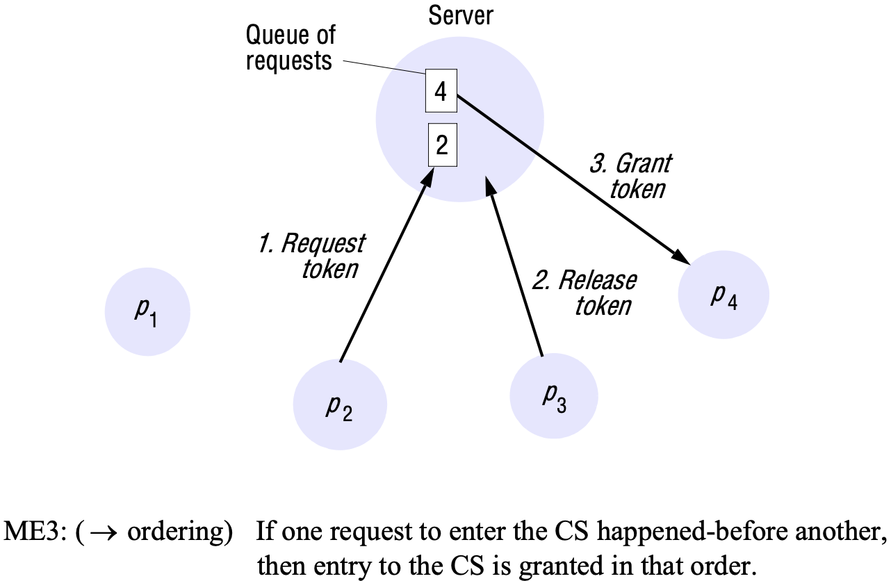

*Server managing a mutual exclusion token for a set of processes*

**The central server algorithm**. The simplest way to achieve mutual exlusion is to employ a server that grants permission to enter the critical section. To enter a critical section, a process sends a request message to the server and awaits a reply from it. Conceptually, the reply constitutes a token signifying permission to enter the critical section. If no other process has the token at the time of the request, then the server replies immediately, granting the token. If the token is currently held by another process, then the server does not reply, but queues the request. When a process exists the critical section, it sends a message to the server, giving it back the token.

If the queue of waiting processes is not empty, then the server chooses the oldest entry in the queue, removes it and replies to the corresponding process. The chosen process then holds the token. In the figure, we show a situation in which $p_2$'s request has been appended to the queue, which already contained $p_4$'s request. $p_3$ exits the critical section, and the server removes $p_4$'s entry and grants permission to enter to $p_4$ by replying to it. Process $p_1$ does not currently require entry to the critical section.

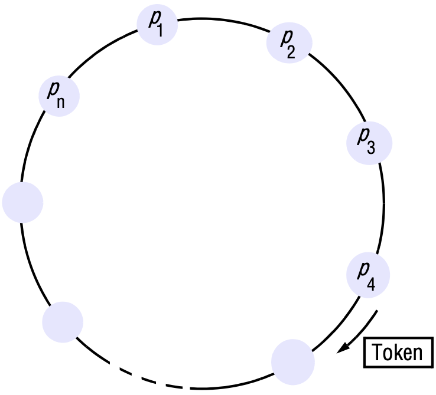

*A ring of processes transferring a mutual exclusion token*

**A ring-based algorithm**. One of the simplest ways to arrange mutual exclusion between the $N$ processes without requiring an additional process is to arrange them in a logical ring. This requires only that each process $p_i$ has a communication channel to the next process in the ring, $p_{(i + 1) \mod N}$. The idea is that exclusion is conferred by obtaining a token in the form of a message passed from process to process in a single direction, clockwise, say - around the ring. The ring topology may be unrelated to the physical interconnections between the underlying computers.

If a process does not require entering the critical section when it receives the token, then it immediately forwards the token to its neighbour. A process that requires the token waits until it receives it, but retains it. To exit the critical section, the process sends the token on to its neighbour.

**An algorithm using multicast and logical clocks**. Ricart and Agrawala developed an algorithm to implement mutual exclusion between $N$ peer processes that are based upon multicast. The basic idea is that processes that require entry to a critical section multicast a request message, and can enter it only when all the other processes have replied to this message. The conditions under which a process replies to a request are designed to ensure that conditions ME1-ME3 are met.

The processes $p_1, p_2, ..., p_N$ bear distinct numeric identifiers. They are assumed to possess communication channels to one another, and each process $p_i$ keeps a Lamport clock. Messages requesting entry are of the form $<T, p_i>$, where $T$ is the sender's timestamp and $p_i$ is the sender's identifier.

Each process records its state of being outside the critical section (RELEASED), wanting entry (WANTED), or being in the critical section (HELD) in a variable state.

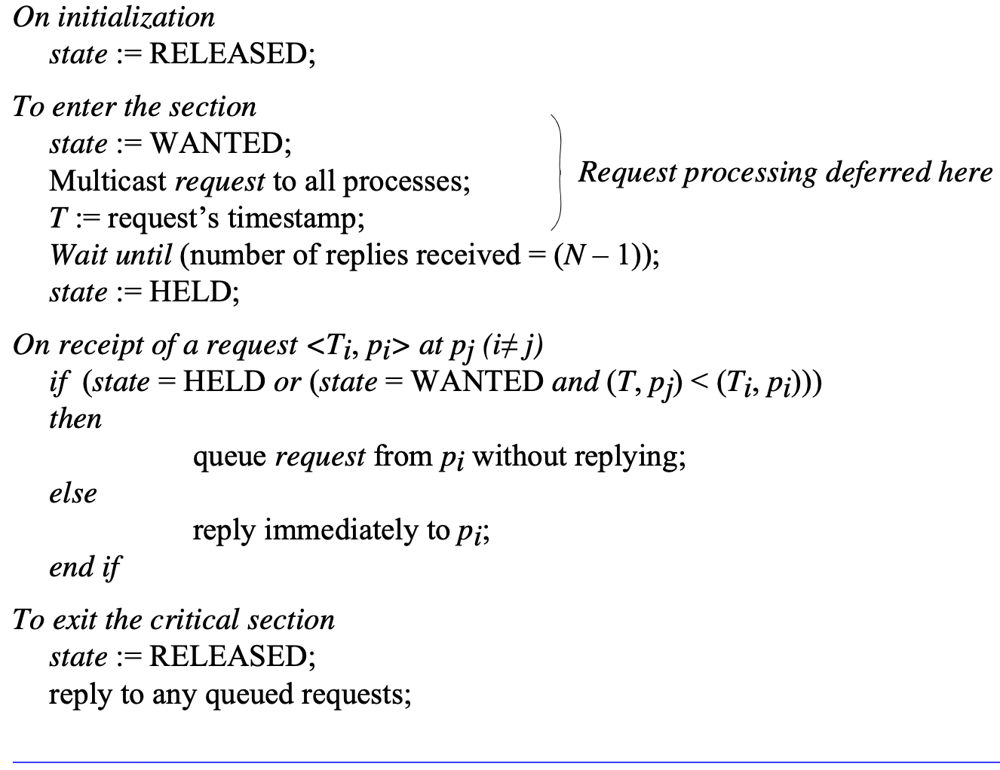

*Ricart and Agrawala's algorithm*

**Maekawa's voting algorithm**. Maekawa observed that in order for a process to enter a critical section, it is not necessary for all of its peers to grant it access. Processes need only obtain permission to enter from *subsets* of their peers, as long as the subsets used by any two processes overlap. We can think of processes as voting for one another to enter the critical section. A 'candidate' process must collect sufficient votes to enter. Processes in the intersection of two sets of voters ensure the safety property ME1, that at most one process can enter the critical section, by casting their votes for only one candidate.

Maekawa associated a *voting set* $V_i$ with each process $p_i (i = 1, 2, ..., N)$, where $V_i \in \{p_1, p_1, ..., p_N\}$. The sets $V_i$ are chosen so that, for all $i,j = 1, 2, ..., N$:

- $p_i \in V_i$
- $V_i \cap V_j \neq \phi$ There is at least one common member of any two voting sets.
- $|V_i| = K$ to be fair, each process has a voting set of the same size.
- Each process $p_j$ is contained in $M$ of the voting sets $V_i$.

Maekawa showed that the optimal solution, which minimizes $K$ and allows the processes to achieve mutual exclusion, has $K ~ \sqrt{N}$ and $M = K$ (so that each process is in as many of the voting sets as there are elements in each one of those sets). It is nontrivial to calculate the optimal sets $R_i$. As an approximation, a simple way of deriving sets $R_i$ such that $|R_i| ~ 2 \sqrt{N}$ is to place the processes in a $\sqrt{N}$ by $\sqrt{N}$ matrix and let $V_i$ be the union of the row and column containing $p_i$.

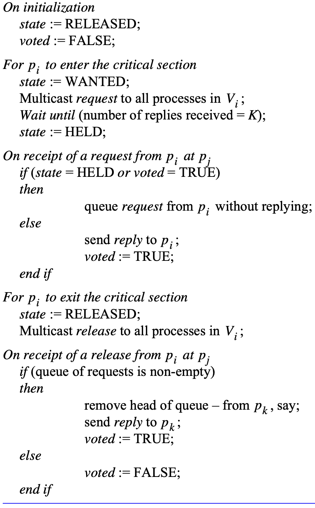

*Maekawa's algorithm*

## Elections

An algorithm for choosing a unique process to play a particular role is called an *election algorithm*.

We say that a process *calls the election* if it takes an action that initiates a particular run of the election algorithm. An individual process does not call more than one election at a time, but in principle the $N$ processes could call $N$ concurrent elections. At any point in time, a process $p_i$ is either a *participant* - meaning that it is engaged in some run of the election algorithm - or a *non-participant* - meaning that it is not currently engaged in any election.

An important requirement is that the choice of the election process to be unique, even if several processes call elections concurrently.

Without loss of generality, we require that the elected process be chosen as the one with the largest identifier. The 'identifier' may be any useful value, as long as the identifiers are unique and totally ordered.

**A ring-based election algorithm**. The algorithm of Chang and Roberts is suitable for a collection of processes arranged in a logical ring. Each process $p_i$ has a communication channel to the next process in the ring, $p_{(i + 1) \mod N}$, and all messages are sent clockwise around the ring. We assume that no failures occur, and that the system is asynchronous. The goal of this algorithm is to elect a single process called the *coordinator*, which is the process with the largest identifier.

Initially, every process is marked as a *non-participant* in an election. Any process can begin an election. It proceeds by marking itself as a *participant*, placing its identifier in an *election* message and sending it to its clockwise neighbour.

When a process receives an *election* message, it compares the identifier in the message with its own. If the arrived identifier is greater, then it forwards the message to its neighbour. If the arrived identifier is smaller and the receiver is not a *participant*, then it substitutes its own identifier in the message and forwards it; but it does not forward the message if it is already a *participant*. On forwarding an *election* message in any case, the process marks itself as a *participant*.

If, however, the received identifier is that of the receiver itself, then this process's identifier must be the greatest, and it becomes the coordinator. The coordinator marks itself as a *non-participant* once more and sends an *elected* message to its neighbour, announcing its election and enclosing its identity.

When a process $p_i$ receives an *elected* message, it marks itself as a *non-participant*, sets its variable $elected_i$ to the identifier in the message and, unless it is the new coordinator, forwards the message to its neighbour.

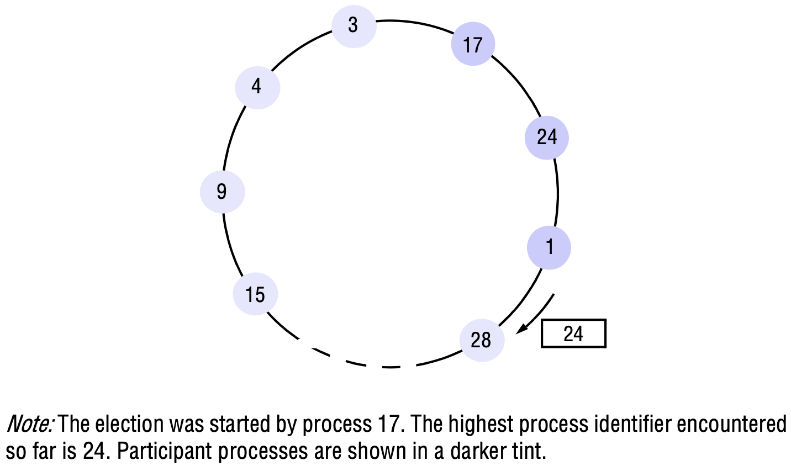

*A ring-based election in progress*

**The bully algorithm**. The bully algorithm allows processes to crash during an election, although it assumes that message delivery between processes is reliable.

There are three types of message in this algorithm: an *election* message is sent to announce an election; an *answer* message is sent in response to an election message and a *coordinator* message is sent to announce the identity of the elected process - the new 'coordinator'. A process begins an election when it notices, through timeouts, that the coordinator has failed. Several processes may discover this concurrently.

Since the system is synchronous, we can construct a reliable failure detector. There is a maximum message transmission delay, $T_{trans}$, and a maximum delay for processing a message $T_{process}$. Therefore, we can calculate a time $T = 2T_{trans} + T_{process}$ that is an upper bound on the time that can elapse between sending a message to another process and receiving a response. If no response arrives within time $T$, then the local failure detector can report that the intended recipient of the request has failed.

The process that knows it has the highest identifier can elect itself as the coordinator simply by sending a *coordinator* message to all processes with lower identifiers. On the other hand, a process with a lower identifier can begin an election by sending an *election* message to those processes that have a higher identifier and awaiting *answer* messages in response. If none arrives within time $T$, the process considers itself the coordinator and sends a *coordinator* message to all processes with lower identifiers announcing this. Otherwise, the process waits a further period $T'$ for a *coordinator* message to arrive from the new coordinator. If none arrives, it begins another election.

If a process $p_i$ receives a *coordinator* message, it sets its variable $elected_{i}$ to the identifier of the coordinator contained within it and treats that process as the coordinator.

If a process receives an *election* message, it sends back an *answer* message and begins another election - unless it has begun one already.

When a process is started to replace a crashed process, it begins an election. If it has the highest process identifier, then it will decide that it is the coordinator and announce this to the other processes. Thus it will become the coordinator, even though the current coordinator is functioning. It is for this reason that the algorithm is called the 'bully' algorithm.

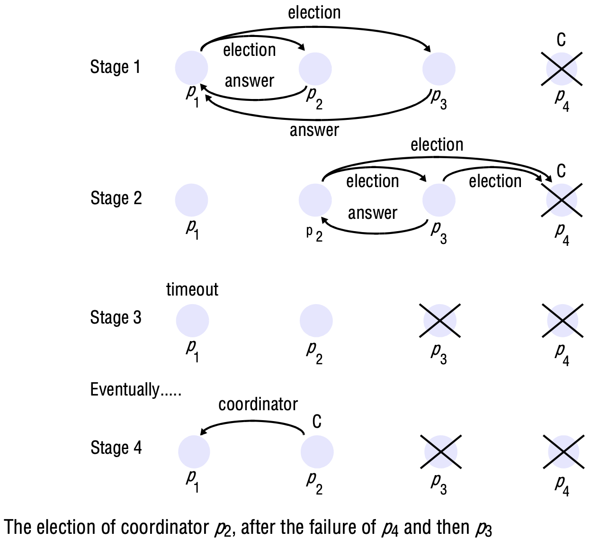

*The bully algorithm*

## Coordination and agreement in group communication

### Basic multicast

It is useful to have at our disposal a basic multicast primitive that guarantees, unlike IP multicast, that a correct process will eventually deliver the message, as long as the multicaster does not crash. We call the primitive $B-multicast$ and its corresponding basic delivery primitive $B-deliver$. We allow processes to belong to several groups, and each message is destined for some particular group.

A straightforward way to implement $B-multicast$ is to use a reliable one-to-one *send* operation, as follows:

- To $B-multicast(g, m)$: for each process $p \in g, send(p, m)$;
- On $receive(m)$ at $p$: $B-deliver(m)$ at $p$.

### Reliable multicast

A reliable multicast is one that satisfies the following properties:

- *Integrity*: A correct process $p$ delivers a messge $m$ at most once. Furthermore, $p \in group(m)$ and $m$ was supplied to a $multicast$ operation by $sender(m)$. (As with one-to-one communication, messages can always be distinguished by a sequence number relative to their sender.)
- *Validity*: If a correct process multicasts message $m$, then it will eventually deliver $m$.
- *Agreement*: If a correct process delivers message $m$, then all other correct processes in $group(m)$ will eventually deliver $m$.

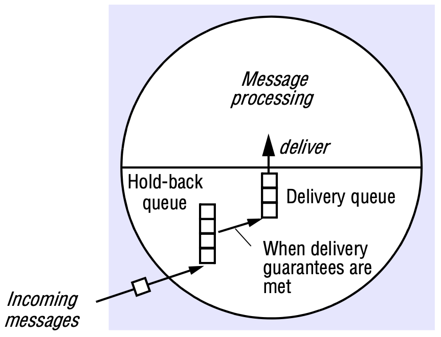

*The hold-back queue for arriving multicast messages*

*Uniform agreement*: If a process, whether it is correct or fails, delivers message $m$, then all the correct processes in $group(m)$ will eventually deliver $m$.

Uniform aggreement allows a process to crash after it has delivered a message, while still ensuring that all correct processes will deliver the message.

### Ordered multicast

*FIFO ordering*: If a correct process issues $multicast(g, m)$ and then $multicast(g, m')$, then every correct process that delivers $m'$ will deliver $m$ before $m'$.

*Causal ordering*: If $multicast(g, m) \rightarrow multicast(g, m')$, where $\rightarrow$ is the happened-before relation induced only by messages sent between the members of $g$, then any correct process that delivers $m'$ will deliver $m$ before $m'$.

*Total ordering*: If a correct process delivers message $m$ before it delivers $m'$, then any other correct process that delivers $m'$ will deliver $m$ before $m'$.

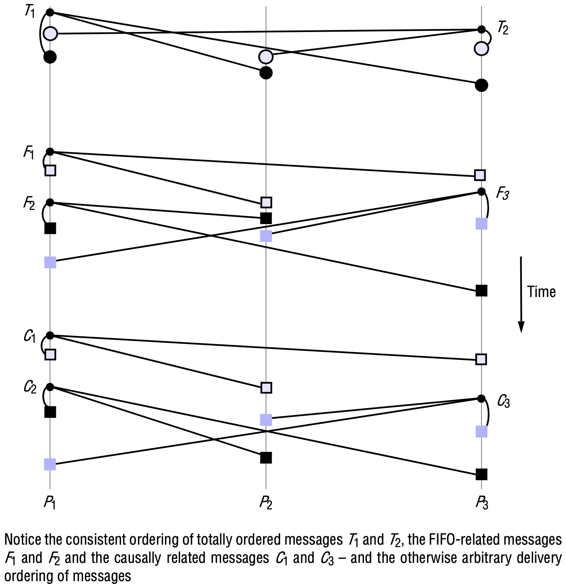

*Total, FIFO and causal ordering of multicast messages*

We can extend the ordering definitions to global orders, in which we have to consider that if message $m$ is multicast to $g$, and if message $m'$ is multicast to $g'$, then both messages are addressed to the members of $g \cap g'$:

*Global FIFO ordering*: If a correct process issues $multicast(g, m)$ and then $multicast(g', m')$, then every correct process in $g \cap g'$ that delivers $m'$ will deliver $m$ before $m'$.

*Pairwise total ordering*: If a correct process delivers message $m$ sent to $g$ before it deliver $m'$ sent to $g'$, then any other correct process in $g \cap g'$ that delivers $m'$ will deliver $m$ before $m'$.

*Global total ordering*: Let '<' be the relation of ordering between delivery events. We require that '<' obeys pairwise total ordering and that it is acyclic - under pairwise total ordering, '<' is not acyclic by default.

## Consensus and related problems

### System model and problem definitions

**Definition of the consensus problem**. To reach consensus, every process $p_i$ begins in the *undecided* state and *proposes* a single value $v_i$, drawn from a set $D(i = 1, 2, ..., N)$. The processes communicate with one another, exchanging values. Each process then sets the value of a *decision variable*, $d_i$. In doing so it enters the *decided* state, in which it may no longer change $d_i(i = 1, 2, ..., N)$.

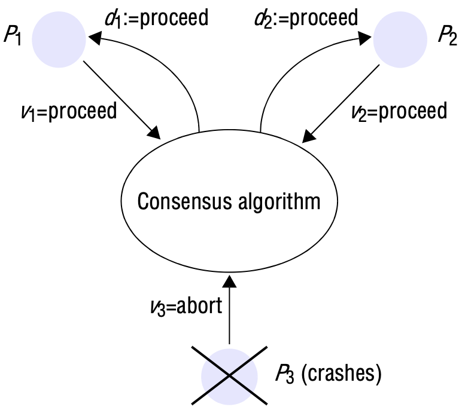

*Consensus for three processes*

The requirements of a **consensus algorithm** are that the following conditions should hold for every execution of it:

- *Termination*: Eventually each correct process sets its decision variable.
- *Agreement*: The decision value of all correct processes is the same: if $p_i$ and $p_j$ are correct and have entered the *decided* state, then $d_i = d_j (i,j = 1, 2, ..., N)$.
- *Integrity*: If the correct processes all proposed the same value, then any correct process in the *decided* state has chosen that value.

**The Byzantine generals problem** differs from consensus in that a distinguished process supplies a value that the others are to agree upon, instead of each of them proposing a value. The requirements are:

- *Termination*: Eventually each correct process sets its decision variable.
- *Agreement*: The decision value of all correct processes is the same: if $p_i$ and $p_j$ are correct and have entered the *decided* state, then $d_i = d_j(i,j = 1, 2, ..., N)$.
- *Integrity*: If the commander is correct, then all correct processes decide on the value that the commander proposed.

**The interactive consistency problem** is another variant of consensus, in which every process proposes a single value. The goal of the algorithm is for the correct processes to agree on a *vector* of values, one for each process. We call the 'decision vector'. The requirements for interactive consistency are:

- *Termination*: Eventually each correct process sets its decision variable.
- *Agreement*: The decision vector of all correct processes is the same.
- *Integrity*: If $p_i$ is correct, then all correct processes decide on $v_i$ as the $i$th component of their vector.

### Consensus in a synchronous system

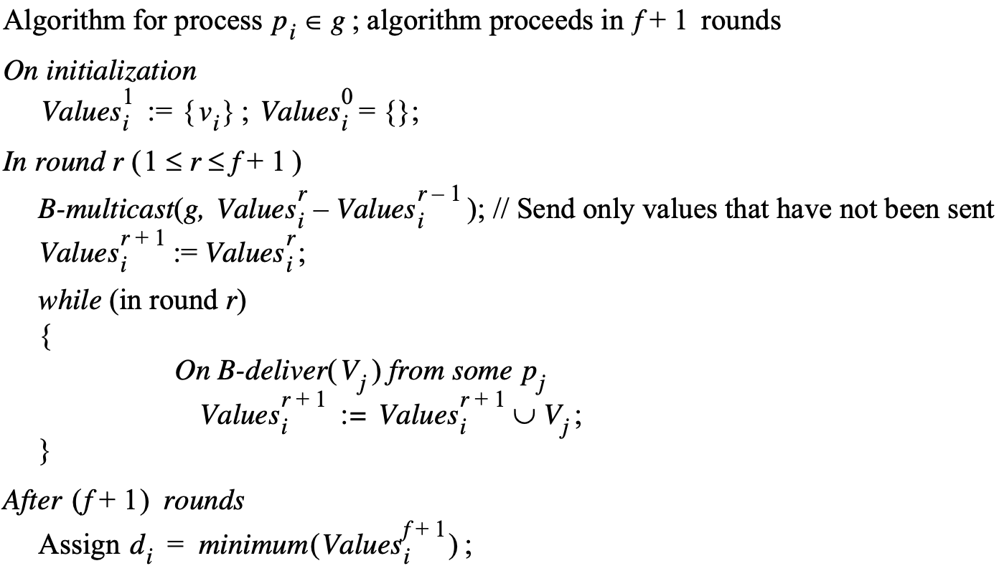

*Consensus in a synchronous system*

The algorithm uses only a basic multicast protocol. It assumes that up to $f$ of the $N$ processes exhibit crash failures. To reach consensus, each correct process collects proposed values from the other processes. The algorithm proceeds in $f + 1$ rounds, in each of which the correct processes $B-multicast$ the values between themselves. At most $f$ processes may crash, by assumption. At worst, all $f$ crashes will occur during the rounds, but the algorithm guarantees that at the end of the rounds all the correct processes that have survived will be in a position to agree.

### The Byzantine generals problems in a synchronous system

*Three Byzantine generals*

**Impossibility with $N \le 3f$**. Pease `et al`. generalized the basic impossibility result for three processes to prove that no solution is possible if $N \le 3f$. In outline, the argument is as follows. Assume that a solution exists with $N \le 3f$. Let each of the three processes $p_1$, $p_2$ and $p_3$ Use the solution to simulate the behaviour of $n_1$, $n_2$ and $n_3$ generals, respectively, where $n_1 + n_2 + n_3 = N$ and $n_1, n_2, n_3 \le N/3$. Assume, furthermore, that one of the three processes is faulty. Those of $p_1$, $p_2$ and $p_3$ that are correct simulate correct generals: they simulate the interactions of their own generals internally and send messages from their generals to those simulated by other processes. The faulty process's simulated generals are faulty: The messages that it sends as part of the simulation to the other two processes may be spurious. Since $N \le 3f$ and $n_1, n_2, n_3 \le N/3$, at most $f$ Simulated generals are faulty.

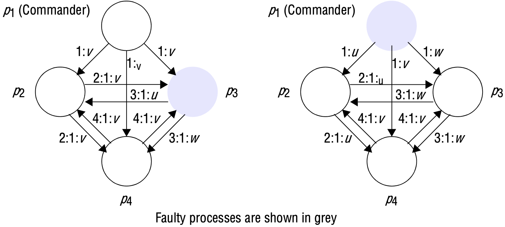

*Four Byzantine generals*

### Impossibility in asynchronous systems

That there is no guaranteed solution in an asynchronous system to the Byzantine generals problem, to interactive consistency or to totally ordered and reliable multicast.

Three techniques for working around the impossibility result:

- Masking faults.
- Consensus using failure detectors.
- Consensus using randomization.

