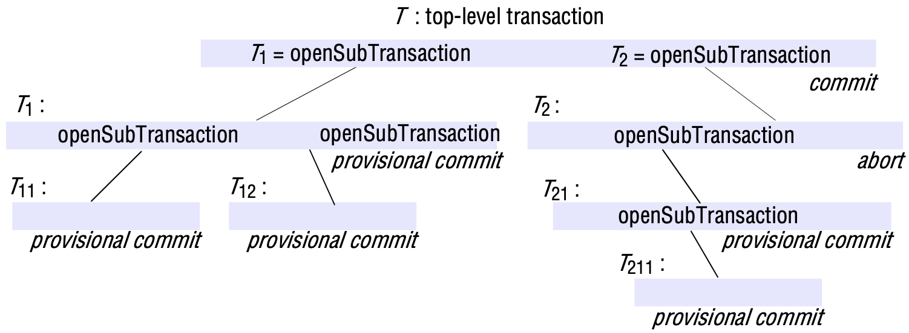
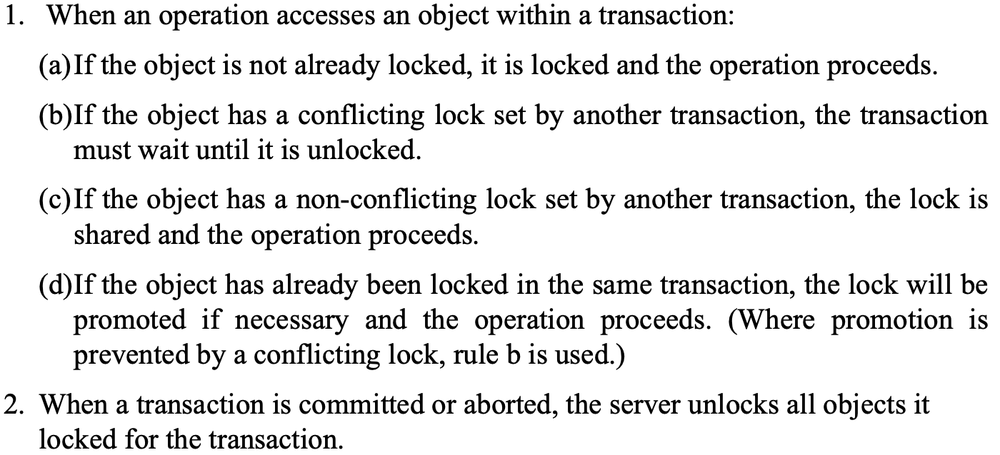
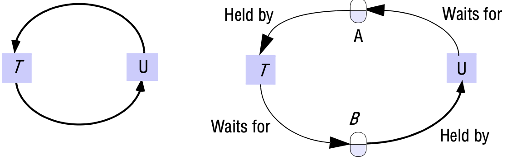
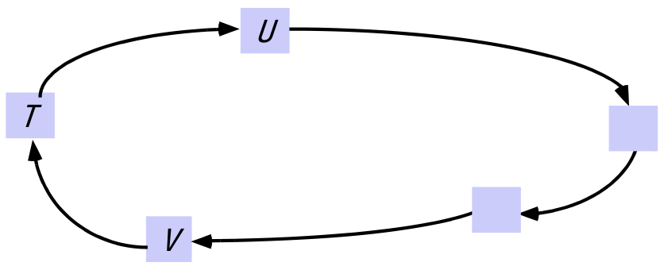
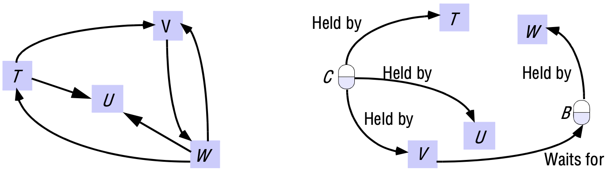
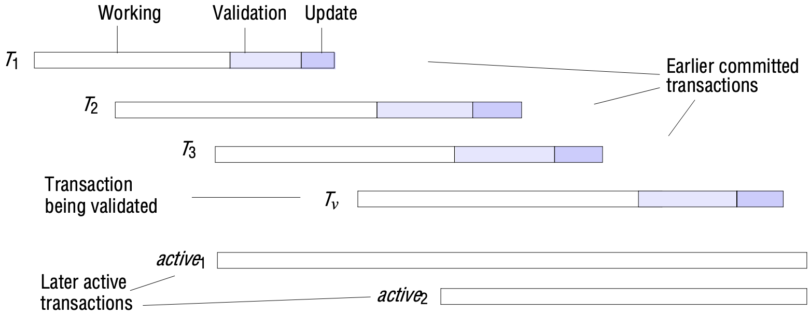
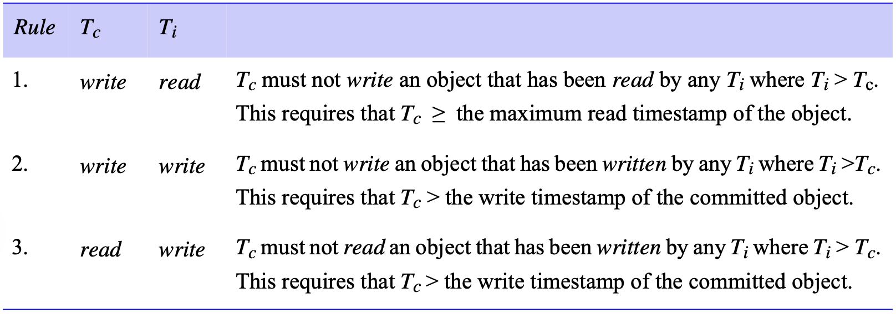
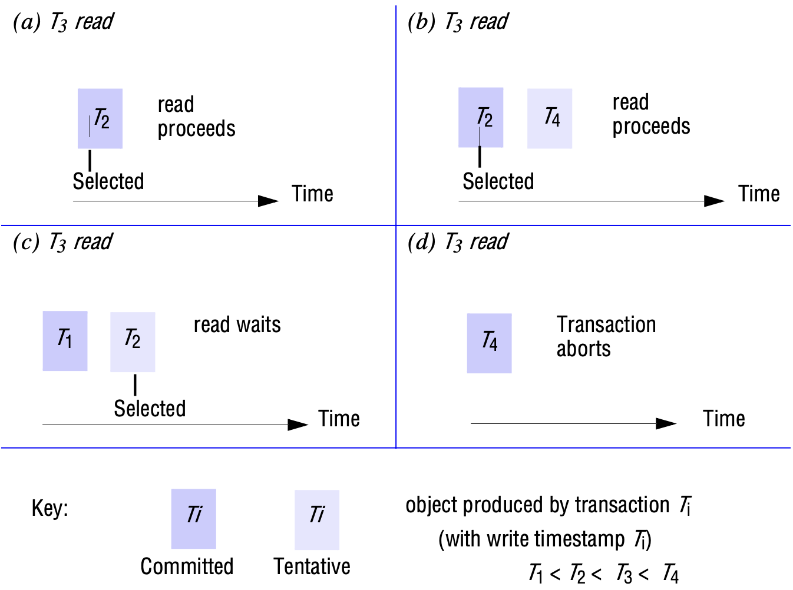

# 16 TRANSACTIONS AND CONCURRENCY CONTROL

[TOC]

## Introduction

The goal of transactions is to ensure that all of the objects managed by a server remain in a consistent state when they are accessed by multiple transactions and in the presence of server crashes.

### Simple synchronization (without transactions)

Atomic operations at the server: If one thread invokes a synchronized method on an object, then that object is effectively locked, and another thread that invokes one of its synchronized methods will be blocked until the lock is released. This form of synchronization forces the execution of threads to be separated in time and ensures that the instance variables of a single object are accessed in a consistent manner.

Enhancing client cooperation by synchronization of server operations: Clients may use a server as a means of sharing some resources. This is achieved by some clients using operations to update the server's objects and other clients using operations to access them. The above scheme for synchronized access to objects provides all that is required in many applications - it prevents threads from interfering with one another. However, some applications require a way for threads to communicate with each other.

### Failure model for transactions

Lampson [1981] proposed a fault model for distributed transactions. In this model, the claim is that the algorithm work correctly in the presence of predictable faults, but no claims are made about their behaviour when a disaster occurs. Although errors may occur, they can be detected and dealt with before any incorrect behaviour results. The model states the following:

- Writes to permanent storage may fail, either by writing nothing or by writing a wrong value.
- Servers may crash occasionally.
- There may be an arbitrary delay before a message arrives. A message may be lost, duplicated or corrupted.

## Transactions

ACID properties:

- Atomicity: a transaction must be all or nothing;
- Consistency: a transaction takes the system from one consistent state to another consistent state;
- Isolation;
- Durability;

### Concurrency control

Serial equivalence: If each of several transactions is known to have the correct effect when it is done on its own, then we can infer that if these transactions are done one at a time in some order the combined effect will also be correct. An interleaving of the operations of transactions in which the combined effect is the same as if the transactions had been performed one at a time in some order is a *serially equivalent* interleaving. When we say that two different transactions have the *same effect* as one another, we mean that the *read* operations return the same values and that the instance variables of the objects have the same at the end.

Serially equivalent orderings require one of the following two conditions:

1. $T$ accesses $i$ before $U$ and $T$ accesses $j$ before $U$.
2. $U$ accesses $i$ before $T$ and $U$ accesses $j$ before $T$.

## Nested transactions

The outermost transaction in a set of nested transactions is called the *top-level* transaction. Transactions other than the top-level transaction are called *subtransactions*.

*Nested transactions*

Nested transactions have the following main advantages:

1. Subtransactions at one level (and their descendants) may run concurrently with other subtransactions at the same level in the hierarchy. This can allow additional concurrency in a transaction. When subtransactions run in different servers, they can work in parallel.
2. Subtransactions can commit or abort independently. In comparison with a single transaction, a set of nested subtransactions is potentially more robust.

The rules for committing of nested transactions are rather subtle:

- A transaction may commit or abort only after its child transactions have completed.
- When a subtransaction completes, it makes an independent decision either to commit provisionally or to abort. Its decision to abort is final.
- When a parent aborts, all of its subtransactions are aborted.
- When a subtransaction aborts, the parent can decide whether to abort or not.
- If the top-level transaction commits, then all of the subtransactions that have provisionally committed can commit too, provided that none of their ancestors have aborted.

## Locks

Serial equivalence requires that all of a transaction's accesses to a particular object be serialized with respect to accesses by other transactions. All pairs of conflicting operations of two transactions should be executed in the same order. To ensure this, a transaction is not allowed to acquire any new locks after it has released a lock. The first phase of each transaction is a 'growing phase', during which new locks are acquired. In the second phase, the locks are released (a 'shrinking phase'). This is called `two-phase locking`.

*Use of locks in strict two-phase locking*

**Locking rules for nested transactions**. The aim of a locking scheme for nested transactions is to serialize access to objects so that:

1. Each set of nested transactions is a single entity that must be prevented from observing the partial effects of any other set of nested transactions.
2. Each transaction within a set of nested transactions must be prevented from observing the partial effects of the other transactions in the set.

The second rule is enforced as follows:

- Parent transactions are not allowed to run concurrently with their child transactions. If a parent transaction has a lock on an object, it *retains* the lock during the time that its child transaction is executing. This means that the child transaction temporarily acquires the lock from its parent for its duration.
- Subtransactions at the same level are allowed to run concurrently, so when they access the same objects, the locking scheme must serialize their access.

The following rules describe lock acquisition and release:

- For a subtransaction to acquire a read lock on an object, no other active transaction can have a write lock on that object, and the only retainers of a write lock are its ancestors.
- For a subtransaction to acquire a write lock on an object, no other active transaction can have a read or write lock on that object, and the only retainers of read and write locks on that object are its ancestors.
- When a subtransaction commits, its locks are inherited by its parent, allowing the parent to retain the locks in the same mode as the child.
- When a subtransaction aborts, its locks are discarded. If the parent already retains the locks, it can continue to do so.

### Deadlocks

*Deadlock* is a state in which each member of a group of transactions is waiting for some other member to release a lock.

A *wait-for graph* can be used to represent the waiting relationships between current transactions. In a wait-for graph, the nodes represent transactions and the edges represent wait-for relationships between transactions.

*The wait-for graph*

*A cycle in a wait-for graph*

*Another wait-for graph*

Some ways to prevent deadlock:

- **Deadlock prevention**. An apparently simple but not very good way to overcome the deadlock problem is to lock all of the objects used by a transaction when it starts. This would need to be done as a single atomic step so as to avoid deadlock at this stage.
- **Upgrade locks**. CORBA's Concurrency Control Service introduces a third type of lock, called *upgrade*, the use of which is intended to avoid deadlocks. Deadlocks are often caused by two conflicting transactions first taking read locks and then attempting to promote them to write locks. A transaction with an upgrade lock on a data item is permitted to read that data item, but this lock conflicts with any upgrade locks set by other transactions on the same data item. This type of lock cannot be set implicitly by the use of a *read* operation, but must be requested by the client.
- **Deadlock detection**. Deadlocks may be detected by finding cycles in the wait-for graph. Having detected a deadlock, a transaction must be selected for abortion to break the cycle.
- **Timeouts**. Lock timeouts are a method for the resolution of deadlocks that is commonly used. Each lock is given a limited period in which it is invulnerable. After this time, a lock becomes vulnerable. Provided that no other transaction is competing for the object that is locked, an object with a vulnerable lock remains locked. However, if any other transaction is waiting to access the object protected by a vulnerable lock, the lock is broken (that is, the object is unlocked) and the waiting transaction resumes. The transaction whose lock has been broken is normally aborted.

### Increasing concurrency in locking schemes

**Two-version locking**. This is an optimistic scheme that allows one transaction to write tentative versions of objects while other transactions read from the committed versions of the same objects. *read* operations only wait if another transaction is currently committing the same object.

**Hierarchical locks**. Gray[1978] proposed the use of a hierarchy of locks with different granularities. At each level, the setting of a parent lock has the same effect as setting all the equivalent child locks. This economizes on the number of locks to be set.

## Optimistic concurrency control

The drawbacks of locking:

- Lock maintenance represents an overhead that is not present in systems that do not support concurrent access to shared data. Even read-only transactions (queries), which cannot possibly affect the integrity of the data, must, in general, use locking in order to guarantee that the data being read is not modified by other transactions at the same time. But locking may be necessary only in the worst case.
- The use of locks can result in a deadlock. Deadlock prevention reduces concurrency severely, and therefore, deadlock situations must be resolved either by the use of timeouts or by deadlock detection. Neither of these is wholly satisfactory for use in interactive programs.
- To avoid cascading aborts, locks cannot be released until the end of the transaction. This may reduce significantly the potential for concurrency.

The alternative approach proposed by Kung and Robinson is 'optimistic'. Each transaction has the following phases:

- Working phase
- Validation phase
- Update phase

*Validation of transactions*

## Timestamp ordering

The basic timestamp ordering rule is based on the operation conflicts and is very simple:

> A transaction's request to write an object is valid only if that object was last read and written by earlier transactions. A transaction's request to read an object is valid only if that object was last written by an earlier transaction.

In timestamp ordering, each request by a transaction for a *read* or *write* operation on an object is checked to see whether it conforms to the operation conflict rules. A request by the current transaction $T_c$ can conflict with previous operations done by other transactions, $T_i$, whose timestamps indicate that they should be later than $T_c$.

*Operation conflicts for timestamp ordering*

**Timestamp ordering write rule**: By combining above rules 1 and 2 we get the following rule for deciding whether to accept a *write* operation requested by a transaction $T_c$ on object $D$:

> if ($T_c \ge$ Maximum read timestamp on $D$ && $T_c$ > write timestamp on the committed version of $D$)
> 
> > perform $write$ operation on tentative version of $D$ with write timestamp $T_c$
>
> else
> 
> > Abort transaction $T_c$

**Timestamp ordering read rule**. By using rule 3 we arrive at the following rule for deciding whether to accept immediately, to wait or to reject a *read* operation requested by a transaction $T_c$ on object $D$:

> if ($T_c$ > write timestamp on committed version of $D$) {
> 
> >let $D_{selected}$ be the version of $D$ with the maximum write timestamp $\partial T_c$
> >
> >if (D_{selected} is committed)
> >
> > > perform $read$ operation on the version $D_{selected}$
> >
> > else
> > 
> > > $wait$ until the transaction that made version $D_{selected}$ commits or aborts then reapply the $read$ rule
> 
> } else
> 
> > Abort transaction $T_c$

Note: 

- If transaction $T_c$ has already written its own version of the object, this will be used.
- A $read$ operation that arrives too early waits for the earlier transaction to complete. If the earlier transaction commits, then $T_c$ will read from its committed version. If it aborts, then $T_c$ will repeat the read rule (and select the previous version). This rule prevents dirty reads.
- A $read$ operation that 'arrives too late' is aborted - it is too late in the sense that a transaction with a later timestamp has already written the object.

*Read operation and timestamps*

