# 17 DISTRIBUTED TRANSACTIONS

[TOC]

## Introduction

We use the term *distributed transaction* to refer to a flat or nested transaction that accesses objects managed by multiple servers.

## Flat and nested distributed transactions

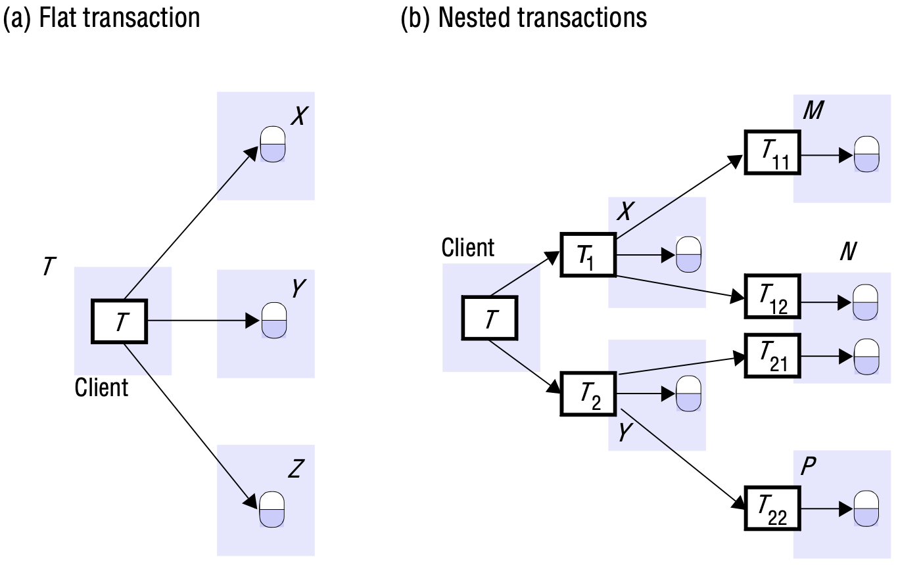

*Distributed transactions*

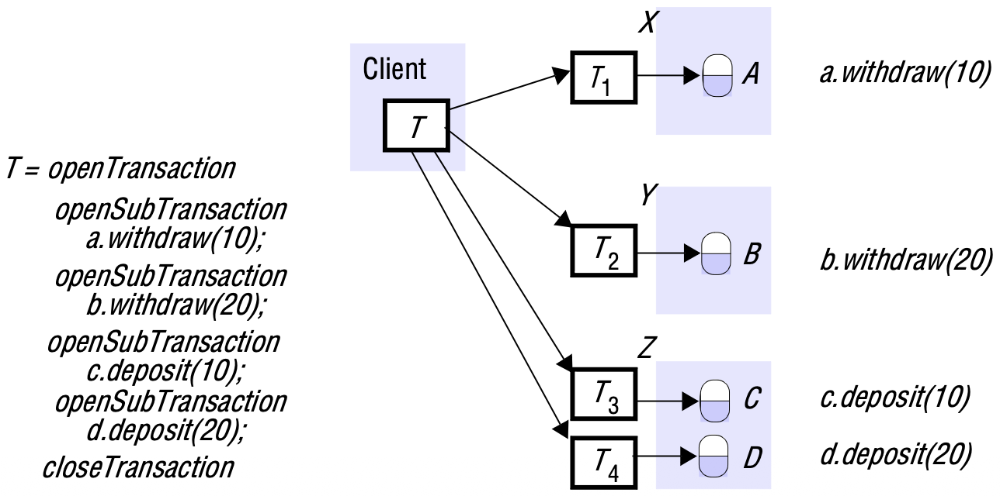

*Nested banking transaction*

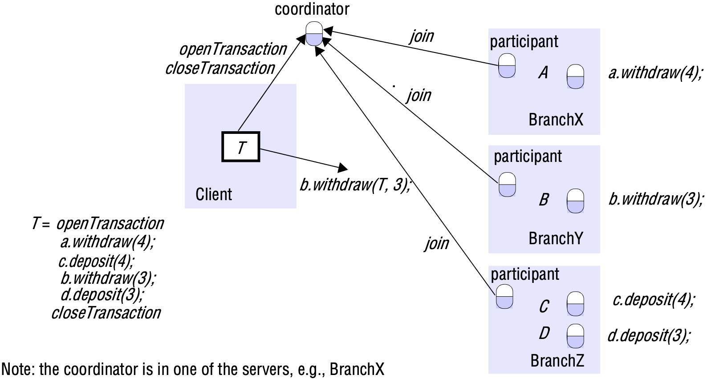

*A distributed banking transaction*

## Atomic commit protocols

### The two-phase commit protocol

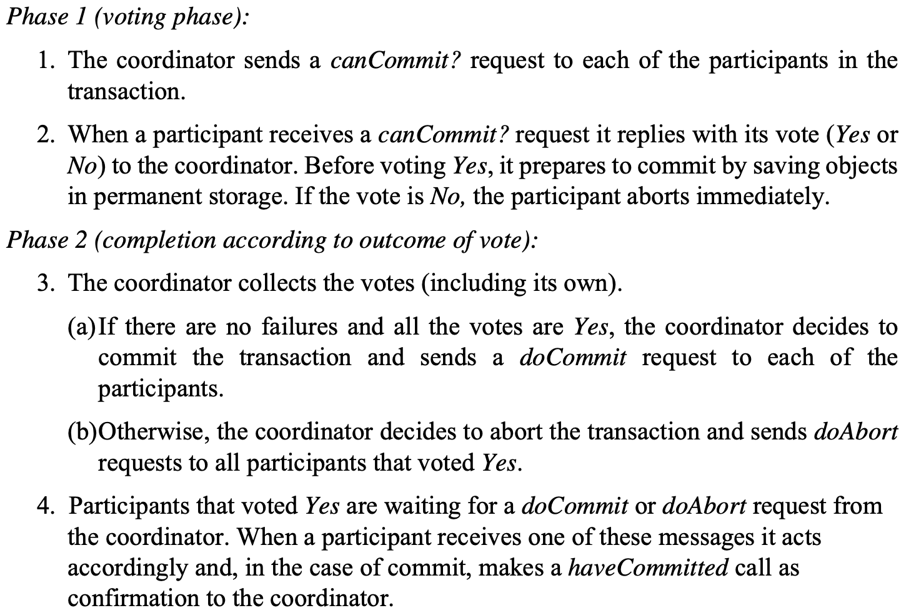

*The two-phase commit protocol*

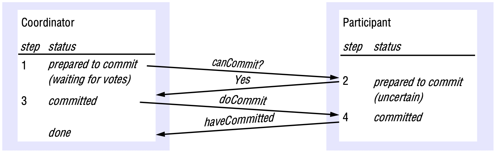

*Communication in two-phase commit protocol*

## Distributed deadlocks

From time to time, each server sends the latest copy of its local wait-for graph to the global deadlock detector, which amalgamates the information in the local graphs in order to construct a global wait-for graph. The global deadlock detector checks for cycles in the global wait-for graph. When it finds a cycle, it makes a decision on how to resolve the deadlock and tells the servers which transaction to abort.

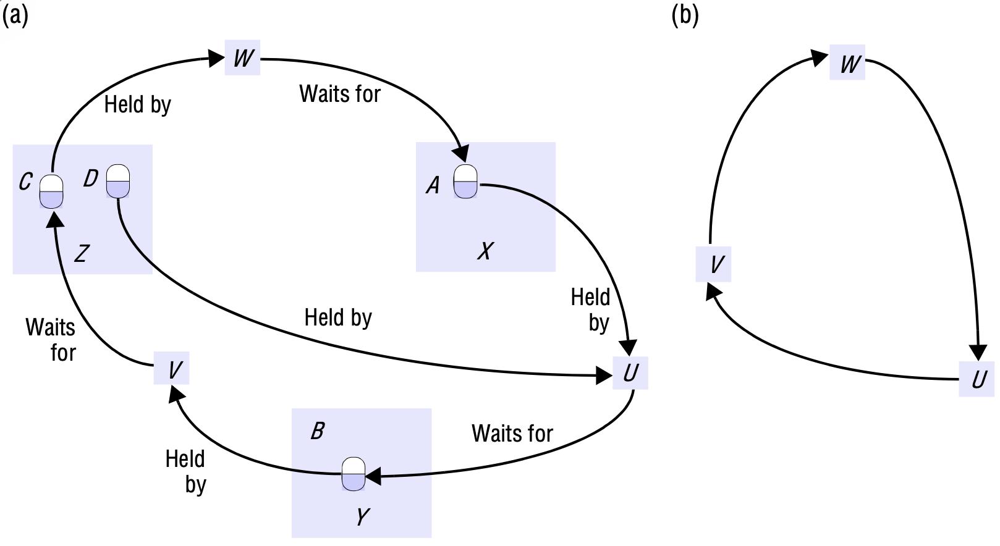

*Distributed deadlock*

A deadlock that is 'detected' but is not really a deadlock is called a *phantom deadlock*.

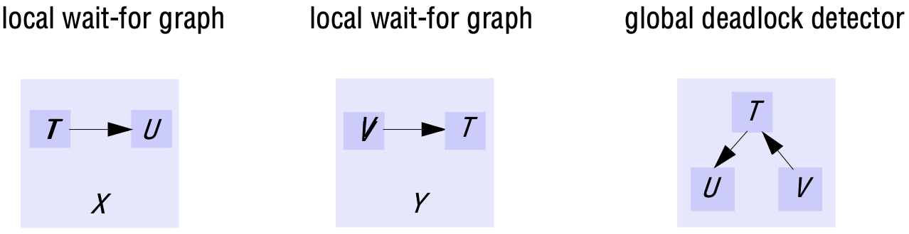

*Local and global wait-for graphs*

A distributed approach to deadlock detection uses a technique called *edge chasing* or *path pushing*. In this approach, the global wait-for graph is not constructed, but each of the servers involved has knowledge about some of its edges. The servers attempt to find cycles by forwarding messages called *probes*, which follow the edges of the graph throughout the distributed system. A probe message consists of transaction wait-for relationships representing a path in the global wait-for graph.

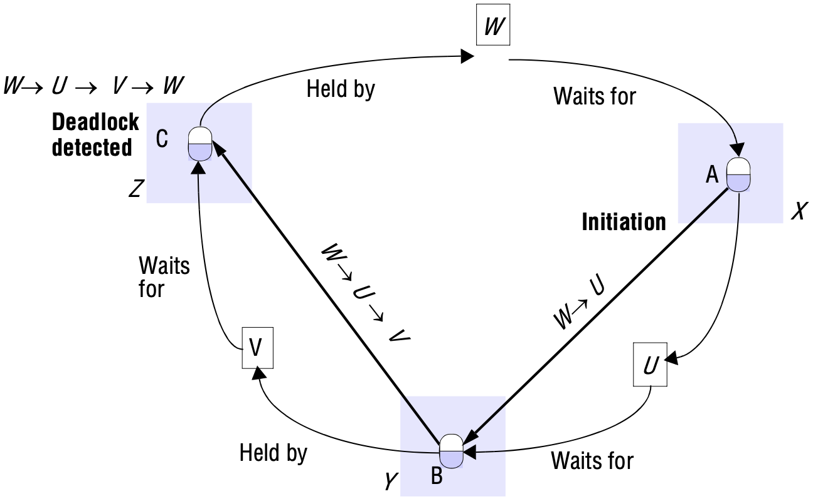

*Probes transmitted to detect deadlock*

Edge-chasing algorithms have three steps:

1. *Initiation*: When a server notes that a transaction $T$ starts waiting for another transaction $U$, where $U$ is waiting to access an object at another server, it initiates detection by sending a probe containing the edge $<T \rightarrow U>$ to the server of the object at which the transaction $U$ is blocked. If $U$ is sharing a lock, probes are sent to all the holders of the lock. Sometimes, further transactions may start sharing the lock later on, in which case probes can be sent to them too.
1. *Detection*: Detection consists of receiving probes and deciding whether a deadlock has occurred and whether to forward the probes.
1. *Resolution*: When a cycle is detected, a transaction in the cycle is aborted to break the deadlock.

A probe that detects a cycle involving $N$ transactions will be forwarded by ($N - 1$) transaction coordinators via ($N - 1$) servers of objects, requiring $2(N - 1)$ messages.

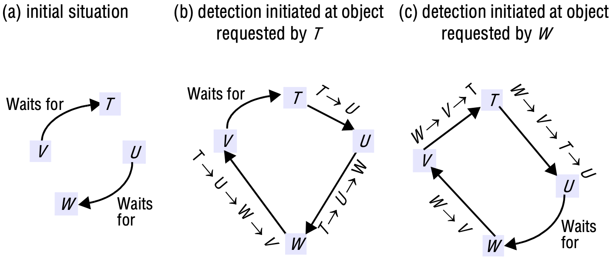

*Two probes initiated*

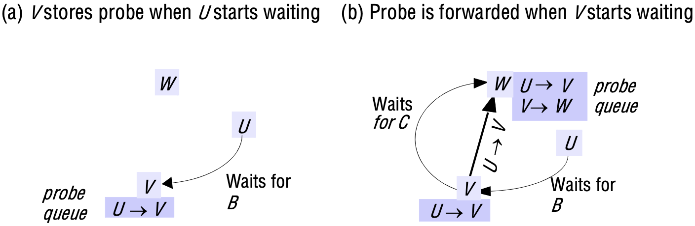

*Probes travel downhill*

## Transaction recovery

The requirements for durability and failure atomicity are not really independent of one another and can be dealt with by a single mechanism - the *recovery manager*. The tasks of a recovery manager are:

- to save objects in permanent storage (in a recovery file) for committed transactions;
- to restore the server's objects after a crash;
- to reorganize the recovery file to improve the performance of recovery;
- to reclaim storage space (in the recovery file).

At each server, an *intentions list* is recorded for all of its currently active transactions - an intentions list of a particular transaction contains a list of the references and the value of all the objects that are altered by that transaction. When a transaction is committed, that transaction's intentions list is used to identify the objects it affected. The committed version of each object is replaced by the tentative version made by that transaction, and the new value is written to the server's recovery file. When a transaction aborts, the server uses the intentions list to delete all the tentative versions of objects made by that transaction.

**Entries in recovery file**. To deal with recovery of a server that can be involved in distributed transactions, further information in addition to the values of the objects is stored in the recovery file. This information concerns the *status* of each transaction - whether it is *committed*, *aborted* or *prepared* to commit. In addition, each object in the recovery file is associated with a particular transaction by saving the intentions list in the recovery file.

### Logging

In the logging technique, the recovery file represents a log containing the history of all the transactions performed by a server. The history consists of values of objects, transaction status entries and transaction intentions lists. The order of the entries in the log reflects the order in which transactions have prepared, committed and aborted at that server.

**Recovery of objects**. When a server is replaced after a crash, it first sets default initial values for its objects and then hands over to its recovery manager. The recovery manager is responsible for restoring the server's objects so that they include all the effects of the committed transactions performed in the correct order and none of the effects of incomplete or aborted transactions.

**Reorganizing the recovery file**. A recovery manager is responsible for reorganizing the recovery file so as to make the process of recovery faster and to reduce its use of space. The name *checkpointing* is used to refer to the process of writing the current committed values of a server's objects to a new recovery file, together with transaction status entries and intentions lists of transactions that have not yet been fully resolved (including information related to the two-phase commit protocol).

### Shadow versions

The *shadow versions* technique is an alternative way to organize a recovery file. It uses a *map* to locate versions of the server's objects in a file called a *version store*. The map associates the identifiers of the server's objects with the positions of their current versions in the version store. The versions written by each transaction are 'shadows' of the previous committed versions. As we shall see, the transaction status entries and intentions lists are stored separately.

### The need for transaction status and intentions list entries in a recovery file

The use of transaction status items and intentions lists in the recovery file is essential for a server that is intended to participate in distributed transactions. This approach can also be useful for servers of nondistributed transactions for various reasons, including the following:

- Some recovery managers are designed to write the objects to the recovery file early, under the assumption that transactions normally commit.
- If transactions use a large number of big objects, the need to write them contiguously to the recovery file may complicate the design of a server. When objects are referenced from intentions lists, they can be found wherever they are.
- In timestamp ordering concurrency control, a server sometimes knows that a transaction will eventually be able to commit and acknowledges the client - at this time, the objects are written to the recovery file to ensure their permanence. However, the transaction may have to wait to commit until earlier transactions have committed. In such situations, the corresponding transaction status entries in the recovery file will be *waiting to commit* and then *committed* to ensure timestamp ordering of committed transactions in the recovery file. On recovery, any waiting-to-commit transactions can be allowed to commit, because the ones they were waiting for will have either just committed or been aborted due to failure of the server.

### Recovery of the two-phase commit protocol

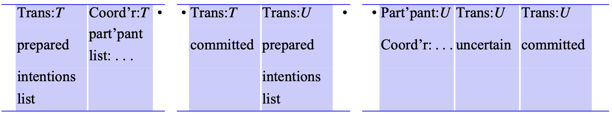

*Log with entries relating to two-phase commit protocol*

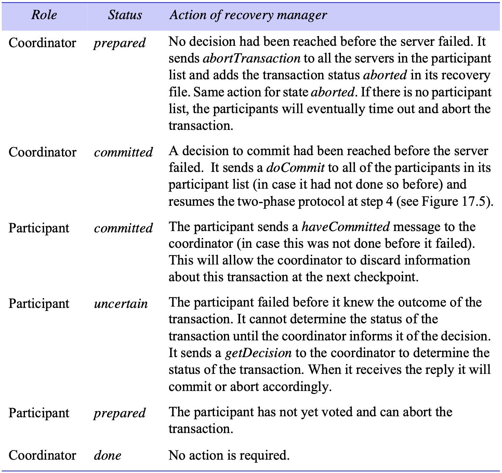

*Recovery of the two-phase commit protocol*

**Reorganization of recovery file**. Care must be taken when performing a checkpoint to ensure that coordinator entries of transactions without status *done* are not removed from the recovery file. These entries must be retained until all the participants have confirmed that they have completed their transactions. Entries with status *done* may be discarded. Participant entries with transaction state *uncertain* must also be retained.

**Recovery of nested transactions**. In the simplest case, each subtransaction of a nested transaction accesses a different set of objects. As each participant prepares to commit during the two-phase commit protocol, it writes its objects and intentions lists to the local recovery file, associating them with the transaction identifier of the top-level transaction. Although nested transactions use a special variant of the two-phase commit protocol, the recovery manager uses the same transaction status values as for flat transactions.
