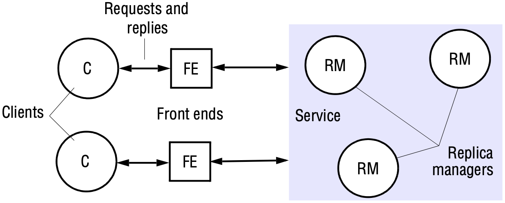
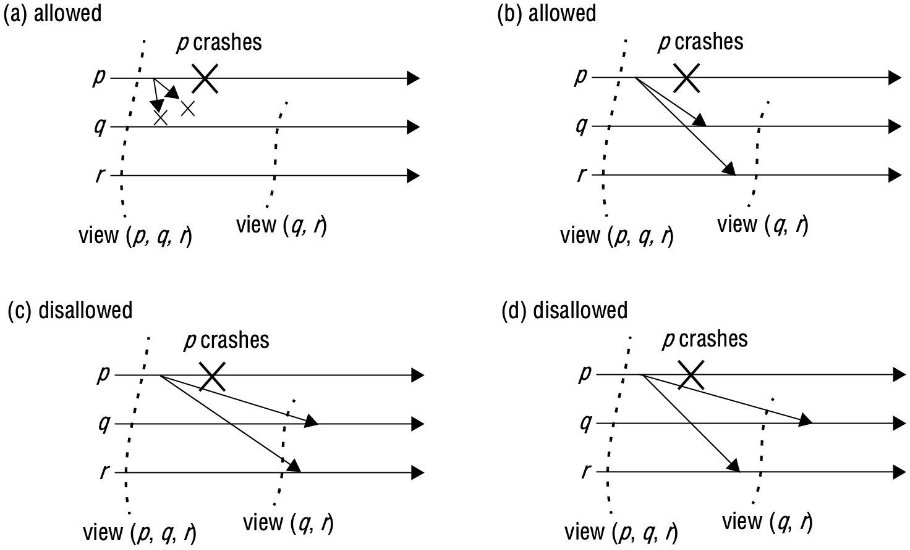
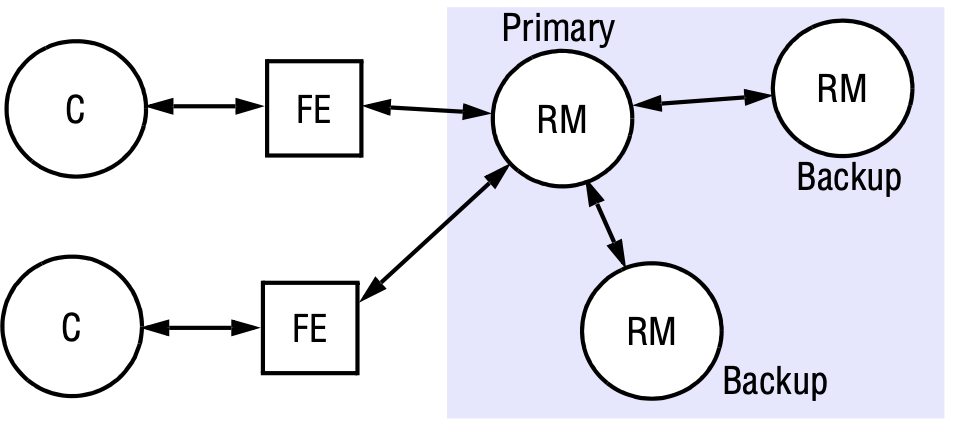
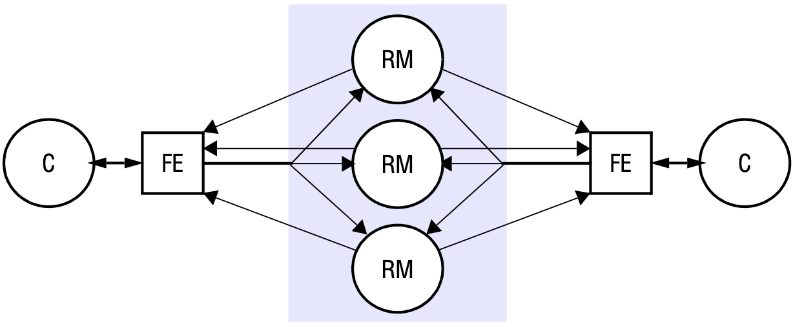
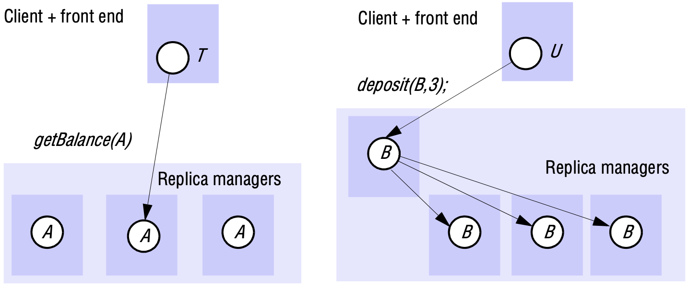
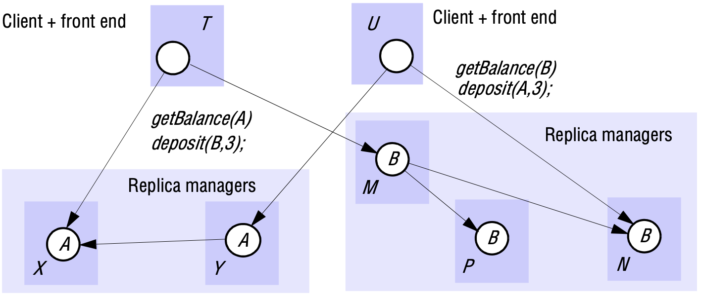
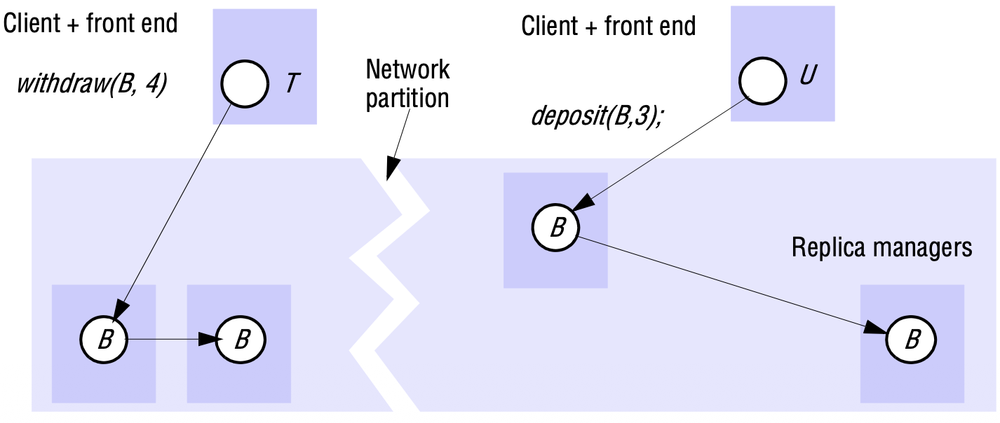

# 18 REPLICATION

[TOC]

## Introduction

Replication is a technique for enhancing services. The motivations for replication include:

- *Performance enhancement*
- *Increased availability*
- *Fault tolerance*

A common requirement when data are replicated is for *replication transparency*. That is, clients should not normally have to be aware that multiple *physical* copies of data exist. As far as clients are concerned, data are organized as individual *logical* objects and they identify only one item in each case when they request an operation to be performed. Furthermore, clients expect operations to return only one set of values. This is despite the fact that operations may be performed upon more than one physical copy in concert.

## System model and the role of group communication

### System model

The model involves replicas held by distinct *replica managers*, which are components that contain the replicas on a given computer and perform operations upon them directly. This general model may be applied in a client-server environment, in which case a replica manager is a server. We shall sometimes simply call them servers instead. Equally, it may be applied to an application and application processes can in that case act as both clients and replica managers.

*A basic architectural model for the management of replicated data*

Often, each replica manager maintains a replica of every object, and we assume this is so unless we state otherwise. However, the replicas of different objects may be maintained by different sets of replica managers.

### The role of group communication

We speak of a member *delivering a view* when a membership change occurs and the application is notified of the new membership, just as we speak of a process *delivering* a multicast message. As with multicast delivery, delivering a view is distinct from receiving a view. Group membership protocols keep proposed views on a hold-back queue until all extant members can agree to their delivery.

We also speak of an event as occurring in a *view* $v(g)$ at process $p$ if, at the time of the event's occurrence, $p$ has delivered $v(g)$ but has not yet delivered the next view, $v'(g)$.

Some basic requirements for view delivery are as follows:

- *Order*: If a process $p$ delivers view $v(g)$ and then view $v'(g)$, then no other process $q \neq p$ delivers $v'(g)$ before $v(g)$.
- *Integrity*: If process $p$ delivers view $v(g)$, then $p \in v(g)$.
- *Non-triviality*: if process $q$ joins a group and is or becomes indefinitely reachable from process $p \neq q$, then eventually $q$ is always in the views that $p$ delivers. Similarly, if the group partitions and remains partitioned, then eventually the views delivered in any one partition will exclude any processes in another partition.

The guarantees provided by view-synchronous group communication are as follows:

- *Agreement*: Correct processes deliver the same sequence of views (starting from the view in which they join the group) and the same set of messages in any given view. That is, if a correct process delivers message $m$ in view $v(g)$, then all other correct processes that deliver $m$ also do so in the view $v(g)$.
- *Integrity*: If a correct process $p$ delivers message $m$, then it will not deliver $m$ again. Furthermore, $p \in group(m)$ and the process that sent $m$ is in the view in which $p$ delivers $m$.
- *Validity (closed groups)*: Correct processes always deliver the messages that they send. If the system fails to deliver a message to any process $q$, then it notifies the surviving processes by delivering a new view with $q$ excluded, immediately after the view in which any of them delivered the message. That is, let $p$ be any correct process that delivers message $m$ in view $v(g)$. If some process $q \in v(g)$ does not deliver $m$ in view $v(g)$, then the next view $v'(g)$ that $p$ delivers has $q \notin v'(g)$.

*View-synchronous group communication*

## Fault-tolerant services

**Linearizability and sequential consistency**. There are various correctness criteria for replicated objects. The most strictly correct systems are *linearizable*, and this property is called *linearizability*.

A replicated shared object service is said to be linearizable if *for any execution* there is some interleaving of the series of operations issued by all the clients that satisfies the following two criteria:

- The interleaved sequence of operations meets the specification of a (single) correct copy of the objects.
- The order of operations in the interleaving is consistent with the real times at which theoperations occurred in the actual execution.

A replicated shared object service is said to be sequentially consistent if *for any execution* there is some interleaving of the series of operations issued by all the clients that satisfies the following two criteria:

- The interleaved sequence of operations meets the specification of a (single) correct copy of the objects.
- The order of operations in the interleaving is consistent with the program order in which each individual client executed them.

### Passive (primary-backup) replication

*The passive (primary-backup) model for fault tolerance*

The sequence of events when a client requests an operation to be performed is as follows:

1. *Request*: The front end issues the request, containing a unique identifier, to the primary replica manager.
2. *Coordination*: The primary takes each request atomically, in the order in which it receives it. It checks the unique identifier, in case it has already executed the request, and if so it simply resends the response.
3. *Execution*: The primary executes the request and stores the response.
4. *Agreement*: If the request is an update, then the primary sends the updated state, the response and the unique identifier to all the backups. The backups send an acknowledgement.
5. *Response*: The primary responds to the front end, which hands the response back to the client.

This system obviously implements linearizability if the primary is correct, since the primary sequences all the operations upon the shared objects. If the primary fails, then the system retains linearizability if a single backup becomes the new primary and if the new system configuration takes over exactly where the last left off. That is if:

- The primary is replaced by a unique backup (if two clients began using two backups, then the system could perform incorrectly).
- The replica managers that survive agree on which operations had been performed at the point when the replacement primary takes over.

### Active replication

*Active replication*

Under active replication, the sequence of events when a client requests an operation to be performed is as follows:

1. *Request*: The front end attaches a unique identifier to the request and multicasts it to the group of replica managers, using a totally ordered, reliable multicast primitive. The front end is assumed to fail by crashing at worst. It does not issue the next request until it has received a response.
2. *Coordination*: The group communication system delivers the request to every correct replica manager in the same (total) order.
3. *Execution*: Every replica manager executes the request. Since they are state machines and since requests are delivered in the same total order, correct replica managers all process the request identically. The response contains the client's unique request identifier.
4. *Agreement*: No agreement phase is needed, because of the multicast delivery semantics.
5. *Response*: Each replica manager sends its response to the front end. The number of replies that the front end collects depends upon the failure assumptions and the multicast algorithm.

## Transactions with replicated data

### Architectures for replicated transactions

*Transactions on replicated data*

### Available copies replication

*Available copies*

**Local validation**. We refer to the additional concurrency control procedure as local validation. The local validation procedure is designed to ensure that any failure or recovery event does not appear to happen during the progress of a transaction.

### Network partitions

Replication schemes need to take into account the possibility of network partitions. A network partition separates a group of replica managers into two or more subgroups in such a way that the members of one subgroup can communicate with one another, but members of different subgroups cannot communicate with one another.

*Network partition*

